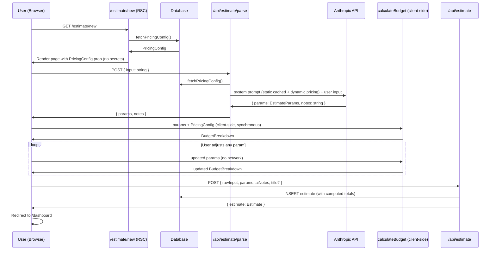
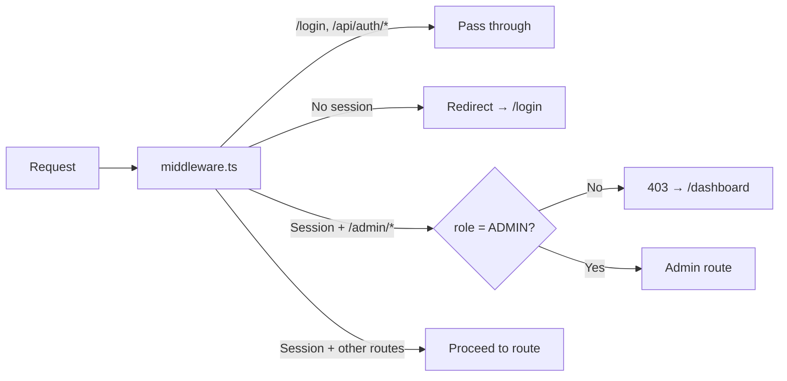
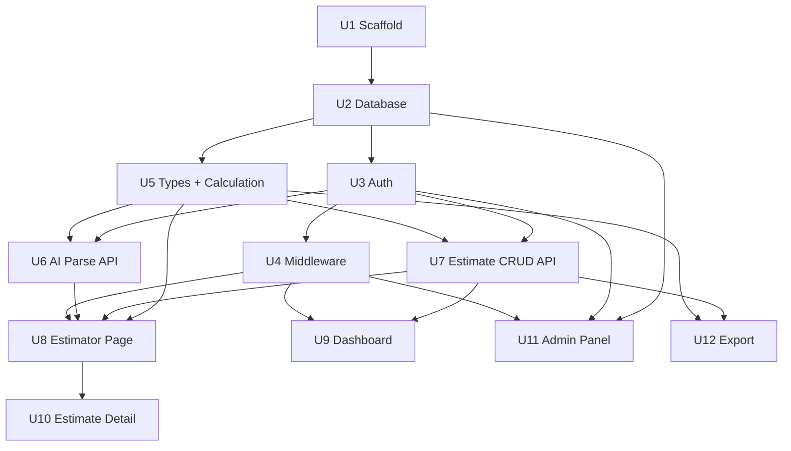

# feat: Build Umroh Budget Estimator — Full-Stack Next.js Application

## Summary

This plan implements a complete greenfield web application for Umroh trip cost estimation, built with Next.js 14 App Router, TypeScript, Drizzle ORM (PostgreSQL), and the Anthropic Claude API. Twelve sequenced implementation units cover project scaffold, database, authentication, AI parsing, budget calculation, all UI pages, admin panel, and export. Budget calculation runs client-side using a shared pure function seeded with server-fetched pricing, enabling real-time reactive updates without network round-trips on every param change. The PRD (`PRD-umroh-budget-estimator (1).md`) is the authoritative source of truth for all behavior.

---

## Problem Frame

Travel agents and individual pilgrims currently estimate Umroh costs manually or via spreadsheets, which is error-prone and time-consuming. This application lets users describe a trip in natural language (Bahasa Indonesia / English) and receive an instant, itemized cost breakdown — with the ability to fine-tune all parameters, save multiple estimates, export as PDF or WhatsApp summary, and, for admins, update the underlying pricing data at any time (see origin: `PRD-umroh-budget-estimator (1).md` §1).

---

## Requirements

- R1. Users can type a natural language Umroh itinerary description and receive parsed `EstimateParams` + a full `BudgetBreakdown`
- R2. All parsed parameters are manually adjustable; budget breakdown updates reactively without a network call
- R3. Estimates can be saved, retrieved, updated, and deleted; each estimate snapshots totals at save time
- R4. Auth supports email/password (bcrypt) and Google OAuth; routes are role-protected (USER / ADMIN)
- R5. Admins can update exchange rates, hotel prices, airline prices, and service fees via an inline-edit panel
- R6. Estimates can be exported as PDF or WhatsApp-formatted plain text
- R7. Dashboard lists saved estimates with search/filter and quick actions (view, duplicate, delete)
- R8. Budget calculation uses current DB pricing at calculation time; saved estimates snapshot totals (§15 rule #7)
- R9. Application is deployable to Vercel with environment variable configuration per §11

---

## Scope Boundaries

- No payment processing or booking/reservation integration (PRD §1.3 explicit non-goal)
- No multi-language UI — Bahasa Indonesia is the primary UI language; English input is supported in the AI parse only
- No real-time collaborative editing or concurrent session handling
- No email notifications or password reset flow (v1)
- Room multiplier data is seeded and not admin-editable in v1
- Admin user management page (`/admin/users`) is read-only display in v1 — no role-change or deletion UI

### Deferred to Follow-Up Work

- Rate-limiting on `POST /api/estimate/parse`: future iteration to prevent Claude API cost abuse
- Estimate version history / change audit log: future iteration
- Admin ability to create/modify/delete users: future iteration beyond read-only display

---

## Context & Research

### Relevant Code and Patterns

- PRD §3.1–3.3: exact Drizzle schema definitions for all tables and enums — implement verbatim
- PRD §7: exact `calculateBudget` pure function shape — implement exactly as documented
- PRD §6.2: Claude system prompt — implement verbatim with server-side pricing injection (§6.3)
- PRD §12: canonical directory/file structure — follow as the output layout
- PRD §14: design token CSS custom properties — implement in `app/globals.css`
- PRD §15: business rules governing calculation — invariants that must not be broken

### Institutional Learnings

- No `docs/solutions/` directory exists — greenfield project with no prior institutional learnings

### External References

- Next.js 14 App Router: route groups `(name)/`, Server Components, Server Actions, `middleware.ts`
- NextAuth.js v5 (Auth.js `@auth/nextjs`): `auth.ts` config at root, `auth()` helper usable in RSC and middleware
- Drizzle ORM: `drizzle-kit generate` + `drizzle-kit migrate`, `pgEnum`, CUID2 primary keys
- Anthropic SDK (`@anthropic-ai/sdk`): prompt caching via `cache_control: { type: "ephemeral" }` on static content blocks
- `@react-pdf/renderer`: pure Node.js PDF generation, serverless-safe on Vercel

---

## Key Technical Decisions

- **NextAuth v5 (Auth.js) over v4**: v5 has first-class App Router support — `auth()` is callable in RSC, Server Actions, and middleware without adapter boilerplate. Config lives in `auth.ts` at repo root; `middleware.ts` imports `auth` from there.
- **`@react-pdf/renderer` for PDF**: `puppeteer` requires Chromium (~50MB) and has Vercel serverless function size/cold-start issues. `@react-pdf/renderer` is pure Node.js and works in the Node runtime on Vercel.
- **Client-side budget calculation**: `calculateBudget` in `lib/budget/calculate.ts` is a pure TS function with no server-only imports. The RSC page fetches `PricingConfig` from DB once on load and passes it to the Client Component. All subsequent recalculations on param changes run locally — no network round-trips per slider interaction.
- **`claude-sonnet-4-6` model**: PRD specifies `claude-sonnet-4-20250514`; the current production Sonnet 4 model is `claude-sonnet-4-6`. Use the current model ID.
- **Prompt caching for AI parse**: Split the system prompt into two content blocks — (1) static extraction rules + defaults with `cache_control: { type: "ephemeral" }` (invariant across all requests), (2) dynamic current pricing block (injected fresh per request). This caches the large static portion and cuts API costs on repeated parses.
- **`useReducer` for estimator state**: The estimator page manages complex multi-field state (raw input, params, aiNotes, breakdown, parse/save status). `useReducer` keeps state transitions explicit and traceable without external state library dependencies.
- **CUID2 for primary keys**: Per PRD schema — `@paralleldrive/cuid2`. Collision-resistant, URL-safe, no auto-increment exposure.
- **`jsonb` for EstimateParams storage**: Params are stored as a JSONB snapshot in the `estimates` table — self-contained even as pricing schema evolves. No normalization needed; read back as `EstimateParams` type.
- **Auto-generated estimate title if not provided**: Format `"Estimasi {hotelTier} {nightsMadinah}+{nightsMakkah} malam {pax} org"` generated server-side at save time. User can override with a custom title via the save dialog.
- **Export recalculates at current rates**: The export route recomputes `BudgetBreakdown` using current DB pricing (not the stored snapshot totals). The PDF footer labels this: "Estimasi menggunakan kurs terkini." Stored `totalIdrPax/totalIdrGrp` reflect the moment of saving.

---

## Open Questions

### Resolved During Planning

- **NextAuth version**: v5 (Auth.js). Better App Router support; avoids v4 `getServerSession` boilerplate.
- **PDF library**: `@react-pdf/renderer`. Serverless-safe, no headless browser.
- **Budget calculation placement**: Client-side, with server-fetched `PricingConfig` passed as prop. Real-time reactive with no round-trips.
- **Claude model ID**: `claude-sonnet-4-6` (current production model, replacing dated snapshot ID from PRD).
- **Duplicate estimate**: Client sends `POST /api/estimate` with existing estimate's params + auto-modified title ("Duplikat — {original title}"). No separate endpoint needed.
- **First admin user**: No admin creation UI in v1. Seed script or direct DB insert with `role: "ADMIN"`.

### Deferred to Implementation

- **Exact RSC/Client Component boundary in the estimator page**: The estimator has significant interactivity. The precise split (which sub-components are Server vs. Client) will emerge during U8 implementation.
- **`@auth/drizzle-adapter` for NextAuth v5**: Confirm package name and API surface during U3 — the Drizzle adapter for v5 may have breaking changes from v4.
- **`@react-pdf/renderer` Vercel bundle compatibility**: Test PDF route on a Vercel preview deploy early in Phase 5. If size limits are hit, fall back to `puppeteer-core` with `@sparticuz/chromium-min`.
- **WhatsApp emoji rendering cross-platform**: Verify emoji (🕋, ✈️, etc.) render correctly in Android and iOS WhatsApp clients after Phase 5.

---

## Output Structure

```
umroh-planner/
├── app/
│   ├── (auth)/
│   │   └── login/
│   │       └── page.tsx
│   ├── (dashboard)/
│   │   ├── layout.tsx
│   │   ├── dashboard/
│   │   │   └── page.tsx
│   │   └── estimate/
│   │       ├── new/
│   │       │   └── page.tsx
│   │       └── [id]/
│   │           └── page.tsx
│   ├── (admin)/
│   │   ├── layout.tsx
│   │   └── admin/
│   │       ├── pricing/
│   │       │   └── page.tsx
│   │       └── users/
│   │           └── page.tsx
│   ├── api/
│   │   ├── auth/
│   │   │   └── [...nextauth]/
│   │   │       └── route.ts
│   │   ├── estimate/
│   │   │   ├── route.ts
│   │   │   ├── parse/
│   │   │   │   └── route.ts
│   │   │   └── [id]/
│   │   │       ├── route.ts
│   │   │       └── export/
│   │   │           └── route.ts
│   │   └── admin/
│   │       └── pricing/
│   │           └── route.ts
│   ├── globals.css
│   └── layout.tsx
├── components/
│   ├── estimator/
│   │   ├── EstimatorClient.tsx
│   │   ├── InputPanel.tsx
│   │   ├── ParamsPanel.tsx
│   │   ├── BudgetBreakdown.tsx
│   │   ├── ServiceCheckboxGrid.tsx
│   │   ├── RadioCardGrid.tsx
│   │   └── Stepper.tsx
│   ├── dashboard/
│   │   ├── EstimateCard.tsx
│   │   └── EstimateList.tsx
│   ├── admin/
│   │   ├── PricingTable.tsx
│   │   └── InlineEditCell.tsx
│   └── ui/
│       └── (shadcn/ui components)
├── lib/
│   ├── db/
│   │   ├── index.ts
│   │   ├── schema.ts
│   │   └── seed.ts
│   ├── ai/
│   │   ├── parse.ts
│   │   └── prompt.ts
│   ├── budget/
│   │   └── calculate.ts
│   ├── export/
│   │   ├── pdf.ts
│   │   └── whatsapp.ts
│   └── auth.ts
├── types/
│   └── index.ts
├── drizzle/
│   └── migrations/
├── drizzle.config.ts
├── auth.ts
├── middleware.ts
├── .env.local
├── package.json
└── next.config.ts
```

---

## High-Level Technical Design

> *This illustrates the intended approach and is directional guidance for review, not implementation specification. The implementing agent should treat it as context, not code to reproduce.*

### Main Estimation Flow



### Auth Guard Architecture



### Unit Dependency Graph



---

## Implementation Units

### Phase 1 — Foundation

- U1. **Project Scaffold and Design System**

**Goal:** Initialize the Next.js 14 project with all required dependencies, configure Tailwind with the Islamic design tokens from PRD §14, install shadcn/ui base components, and set up all project-level config files.

**Requirements:** R9

**Dependencies:** None

**Files:**
- Create: `package.json`
- Create: `next.config.ts`
- Create: `tailwind.config.ts`
- Create: `tsconfig.json`
- Create: `app/globals.css` (design tokens as CSS custom properties + base body styles)
- Create: `app/layout.tsx` (root layout: Google Fonts import for Amiri + DM Sans, html/body with dark bg)
- Create: `drizzle.config.ts`
- Create: `.env.local` (template: all vars from PRD §11 as commented placeholders)
- Create: `components/ui/` (shadcn/ui components: button, card, input, textarea, toast, badge, dialog, separator)

**Approach:**
- `pnpm create next-app` with TypeScript, App Router, Tailwind; then install: `drizzle-orm`, `drizzle-kit`, `pg`, `@types/pg`, `@paralleldrive/cuid2`, `next-auth@beta`, `@auth/drizzle-adapter`, `@anthropic-ai/sdk`, `@react-pdf/renderer`, `bcryptjs`, `@types/bcryptjs`, `tsx` (for seed script)
- shadcn/ui init via `pnpm dlx shadcn@latest init`; then `pnpm dlx shadcn@latest add button card input textarea toast badge dialog separator`
- `app/globals.css`: define all 10 CSS custom properties from PRD §14 on `:root`, plus `body { background: var(--color-bg); color: var(--color-text); font-family: var(--font-body); }`
- `tailwind.config.ts`: extend `colors` and `fontFamily` to reference the CSS custom properties via `var(--color-*)` and `var(--font-*)`
- `drizzle.config.ts`: exactly per PRD §11 pattern — schema `./lib/db/schema.ts`, out `./drizzle/migrations`, dialect `postgresql`
- `tsconfig.json`: strict mode, path alias `@/` → `./`

**Patterns to follow:**
- PRD §14 for all design token values (exact hex and rgba values)
- PRD §11 for environment variable names and drizzle config

**Test expectation:** none — pure scaffold, no behavioral logic.

**Verification:**
- `pnpm dev` starts without TypeScript or module resolution errors
- Root `app/layout.tsx` renders with dark green background (`#0b1c12`) and Amiri/DM Sans fonts loaded
- shadcn/ui `Button` renders without errors in a test page

---

- U2. **Database Schema, Migrations, and Seed**

**Goal:** Define all Drizzle table schemas and enums exactly per PRD §3, generate and apply migrations, and seed initial pricing data from PRD §8.

**Requirements:** R3, R5, R8

**Dependencies:** U1

**Files:**
- Create: `lib/db/schema.ts`
- Create: `lib/db/index.ts`
- Create: `lib/db/seed.ts`
- Create: `drizzle/migrations/` (auto-generated by `drizzle-kit generate`)
- Test: `lib/db/__tests__/schema.test.ts`

**Approach:**
- `lib/db/schema.ts`: implement exactly per PRD §3.1–3.3 — all five enums (`cityEnum`, `hotelTierEnum`, `airlineTierEnum`, `serviceKeyEnum`, `roleEnum`), all six tables (`exchangeRates`, `hotelPrices`, `airlinePrices`, `serviceFees`, `roomMultipliers`, `users`, `estimates`), all inferred types
- `lib/db/index.ts`: Drizzle client singleton using `pg.Pool` exactly per PRD §11 pattern
- `lib/db/seed.ts`: insert all rows from PRD §8; use `db.insert().values([...]).onConflictDoNothing()` for idempotency. Seed order: `exchangeRates` (SAR=4700, USD=17300), `hotelPrices` (8 rows: 4 tiers × 2 cities), `airlinePrices` (4 tiers), `serviceFees` (6 keys), `roomMultipliers` (4 types — QUAD pax=4 mult="1.0", TRIPLE pax=3 mult="1.25", DOUBLE pax=2 mult="1.5", SINGLE pax=1 mult="2.8")
- Run `pnpm drizzle-kit generate` then `pnpm drizzle-kit migrate` to apply schema
- Add `"seed": "tsx lib/db/seed.ts"` to `package.json` scripts

**Patterns to follow:**
- PRD §3.1–3.3 exact schema (enums, column types, defaults, foreign keys)
- PRD §8 seed data values (exact SAR/IDR/USD amounts and labels)

**Test scenarios:**
- Happy path: seed script runs successfully; `SELECT COUNT(*) FROM hotel_prices` = 8
- Happy path: `SELECT COUNT(*) FROM exchange_rates` = 2 (SAR, USD)
- Happy path: `SELECT COUNT(*) FROM room_multipliers` = 4; SINGLE row has `pax_per_room=1` and `multiplier="2.8"`
- Edge case: running seed script twice (idempotent) — `onConflictDoNothing` prevents duplicate errors, counts unchanged
- Integration: Drizzle query `db.select().from(hotelPrices).where(eq(hotelPrices.city, "MAKKAH"))` returns exactly 4 rows (one per tier)
- Integration: Drizzle query with `eq(serviceFees.key, "VISA")` returns row with `currency="USD"` and `amount=165`

**Verification:**
- All tables exist in DB after `drizzle-kit migrate`
- Seed script is idempotent (safe to run on every deploy)
- All row counts match PRD §8

---

- U3. **Authentication — NextAuth v5**

**Goal:** Configure NextAuth v5 with Credentials provider (email/password via bcrypt) and Google OAuth, integrate with the Drizzle users table, embed `id` and `role` into the session JWT, and build the login page.

**Requirements:** R4

**Dependencies:** U2

**Files:**
- Create: `auth.ts` (root-level NextAuth config — the single source of auth logic)
- Create: `app/api/auth/[...nextauth]/route.ts`
- Create: `app/(auth)/login/page.tsx`
- Create: `lib/auth.ts` (server helpers: `getSession()`, `requireAuth()`, `requireAdmin()`)
- Test: `lib/auth.__tests__/auth.test.ts`

**Approach:**
- `auth.ts` at repo root: `NextAuth({ providers: [Credentials({ authorize }), Google({})], adapter: DrizzleAdapter(db, { ... }), session: { strategy: "jwt" }, callbacks: { jwt, session } })`
- `authorize` callback: query `users` table by email; if not found or `password` is null, return null; call `bcryptjs.compare(password, user.password)`; return user object on match
- `jwt` callback: on first sign-in, attach `token.id = user.id` and `token.role = user.role`
- `session` callback: surface `session.user.id` and `session.user.role` from token
- Extend NextAuth `Session` and `JWT` TypeScript types via `types/next-auth.d.ts` to include `id: string` and `role: "USER" | "ADMIN"`
- `app/api/auth/[...nextauth]/route.ts`: simply re-export `{ handlers: { GET, POST } }` from root `auth.ts`
- Login page: shadcn/ui Card with email + password inputs using react-hook-form; "Masuk dengan Google" button using `signIn("google")`; displays `searchParams.error` if present (e.g., `CredentialsSignin`)
- `lib/auth.ts` helpers: `getSession()` wraps NextAuth `auth()`; `requireAuth()` calls `getSession()` and throws 401 redirect if no session; `requireAdmin()` additionally checks `session.user.role === "ADMIN"` and throws 403 if not

**Patterns to follow:**
- NextAuth v5 `auth()` pattern throughout (not v4's `getServerSession`)
- PRD §10 role table (USER, ADMIN)

**Test scenarios:**
- Happy path: POST credentials with valid email + correct bcrypt password → `authorize` returns user object with id and role
- Happy path: POST credentials for admin user → JWT contains `role: "ADMIN"`
- Error path: POST credentials with incorrect password → `authorize` returns null
- Error path: POST credentials for non-existent email → `authorize` returns null
- Error path: POST credentials for OAuth-only user (`password: null`) → `authorize` returns null
- Edge case: Google OAuth creates new user row in `users` table with `role: "USER"` and `password: null`
- Integration: `requireAdmin()` called with a USER-role session → throws/redirects to 403

**Verification:**
- `pnpm dev`: login page renders; credentials login works with a seeded test user
- Session JWT contains `user.id` and `user.role`
- `signOut()` clears session cookie
- Google OAuth flow completes and creates user row

---

- U4. **Route Protection Middleware and Layout Architecture**

**Goal:** Implement `middleware.ts` to protect all non-public routes, redirect unauthenticated users to login, block non-admins from `/admin/*`, and create the route group layouts with navigation shell.

**Requirements:** R4

**Dependencies:** U3

**Files:**
- Create: `middleware.ts`
- Create: `app/(dashboard)/layout.tsx`
- Create: `app/(admin)/layout.tsx`
- Create: `app/page.tsx` (root redirect)
- Create: `components/nav/NavBar.tsx`

**Approach:**
- `middleware.ts`: export `{ auth as middleware }` from root `auth.ts` with `authorized` callback. Logic: if path matches `/login` or `/api/auth/*`, pass through. If no session and path is protected, redirect to `/login?callbackUrl=<path>`. If session and path matches `/admin/*`, check `token.role === "ADMIN"`; if not, redirect to `/dashboard`.
- `export const config = { matcher: ["/((?!_next/static|_next/image|favicon.ico).*)"] }` to apply middleware to all app routes
- `app/page.tsx`: Server Component that reads session; redirects to `/dashboard` if logged in, `/login` if not
- `app/(dashboard)/layout.tsx`: renders `<NavBar>` + `{children}`. NavBar contains: logo/brand mark, link to `/dashboard`, link to `/estimate/new` (CTA button), user email display, logout button (`signOut()` form action)
- `app/(admin)/layout.tsx`: same as dashboard layout + admin indicator badge + link to `/admin/pricing` and `/admin/users` in nav
- `NavBar.tsx`: uses `auth()` to get session server-side; renders appropriate links

**Patterns to follow:**
- NextAuth v5 middleware `authorized` callback pattern
- Next.js App Router route group `(name)` convention

**Test expectation:** none for unit-level tests — middleware behavior is validated via integration scenarios in U3 tests and end-to-end acceptance during U8/U9.

**Verification:**
- `GET /dashboard` while logged out → 302 redirect to `/login`
- `GET /admin/pricing` as USER role → redirected to `/dashboard`
- `GET /admin/pricing` as ADMIN → renders admin layout
- NavBar shows logged-in user's email and logout works

---

### Phase 2 — Core Engine

- U5. **Shared Types and Budget Calculation Engine**

**Goal:** Define all shared TypeScript interfaces and implement the pure `calculateBudget` function and `fetchPricingConfig` DB helper that are shared between server and client.

**Requirements:** R1, R2, R8

**Dependencies:** U2

**Execution note:** Implement `calculateBudget` test-first — it is the most critical business logic, is a pure function with deterministic inputs/outputs, and PRD §7 provides exact expected computation. Write failing tests from PRD §7 examples before implementing.

**Files:**
- Create: `types/index.ts`
- Create: `lib/budget/calculate.ts`
- Test: `lib/budget/__tests__/calculate.test.ts`

**Approach:**
- `types/index.ts`: all TypeScript types from PRD §3.4 — `City`, `HotelTier`, `RoomType`, `AirlineTier`, `ServiceKey`, `EstimateParams`, `BudgetBreakdown`, plus `PricingConfig` (aggregated view used by `calculateBudget`)
- `PricingConfig` shape: `{ rates: Record<"SAR"|"USD", number>, hotels: Record<City, Record<HotelTier, { sarPerNight: number, label: string }>>, airlines: Record<AirlineTier, { idr: number, label: string }>, services: Record<ServiceKey, { currency: string, amount: number, label: string, enabled: boolean }> }`
- `calculateBudget(params, pricing)`: implement PRD §7 formula exactly:
  - `hotel cost/pax (SAR) = sarPerNight × nights × multiplier / paxPerRoom`
  - `hotelIdr = Math.round(hotelSar × sarRate)`
  - Services: convert per currency (`SAR * sarRate`, `USD * usdRate`, `IDR` as-is), `Math.round` each
  - `totalIdrPax = hotelMadinahIdr + hotelMakkahIdr + servicesIdr + flightIdr`
  - `totalIdrGrp = totalIdrPax * params.pax`
  - Omit disabled services from `serviceItems`
- `lib/budget/calculate.ts` also exports `fetchPricingConfig(db: DB): Promise<PricingConfig>` — a server-side helper that queries all 4 pricing tables and assembles the `PricingConfig` shape. Mark with `"server-only"` guard comment but the function itself can live in this file as a named export.
- The `calculateBudget` function itself must have zero server-only imports — safe to call in a Client Component.

**Patterns to follow:**
- PRD §7 exact formula (multiply then divide, `Math.round` only at IDR conversion)
- PRD §15 business rules — especially rule #1 (hotel price is per-room, not per-person before division) and rule #3 (services are per-person)

**Test scenarios:**
- Happy path: STANDARD hotel, QUAD room (paxPerRoom=4, mult=1.0), 4 nights Madinah (650 SAR) → hotelMadinahSar = 650 × 4 × 1.0 / 4 = 650 → hotelMadinahIdr = Math.round(650 × 4700) = 3,055,000
- Happy path: 9 nights Makkah, STANDARD (1300 SAR), QUAD → hotelMakkahSar = 1300 × 9 × 1.0 / 4 = 2925 → hotelMakkahIdr = Math.round(2925 × 4700) = 13,747,500
- Happy path: SINGLE room (paxPerRoom=1, mult=2.8), ECONOMY Makkah (800 SAR), 9 nights → 800 × 9 × 2.8 / 1 = 20160 SAR/pax → idr = Math.round(20160 × 4700) = 94,752,000
- Happy path: VISA service (USD=165, usdRate=17300) → serviceIdr = Math.round(165 × 17300) = 2,854,500
- Happy path: TRANSPORT service (SAR=325, sarRate=4700) → serviceIdr = Math.round(325 × 4700) = 1,527,500
- Happy path: SISKOPATUH (IDR=200000) → serviceIdr = 200000 (no conversion)
- Edge case: empty services array → servicesIdr=0, serviceItems=[]
- Edge case: pax=10 → totalIdrGrp = totalIdrPax × 10 (exactly)
- Edge case: disabled service (enabled=false) → not included in serviceItems or servicesIdr
- Integration: `fetchPricingConfig(db)` queries DB and assembles a PricingConfig where `rates.SAR = 4700` and `hotels.MAKKAH.STANDARD.sarPerNight = 1300` (matching seed data)

**Verification:**
- All test cases pass with exact expected IDR totals
- `totalIdrGrp === totalIdrPax * params.pax` always holds
- `calculateBudget` is importable in a browser-safe Client Component (no Node-specific imports)
- `fetchPricingConfig` returns correctly shaped object from seeded DB

---

- U6. **AI Parsing Service and Parse API Route**

**Goal:** Implement the Claude-powered natural language parsing service using `lib/ai/prompt.ts` and `lib/ai/parse.ts`, and expose it via `POST /api/estimate/parse`.

**Requirements:** R1

**Dependencies:** U2, U3, U5

**Files:**
- Create: `lib/ai/prompt.ts`
- Create: `lib/ai/parse.ts`
- Create: `app/api/estimate/parse/route.ts`
- Test: `lib/ai/__tests__/parse.test.ts`

**Approach:**
- `lib/ai/prompt.ts`: exports `buildSystemPrompt(pricing: PricingConfig): { type: "text", text: string, cache_control?: ... }[]`. Returns two content blocks: (1) static block with `cache_control: { type: "ephemeral" }` — contains the full extraction rules, service key mappings, defaults, and JSON schema from PRD §6.2 verbatim; (2) dynamic block — current pricing summary formatted as a pricing reference table (rates, hotel SAR/night by tier, airline IDR, service amounts). The dynamic block has no `cache_control` since it changes when admin updates pricing.
- `lib/ai/parse.ts`: exports `parseEstimate(input: string, pricing: PricingConfig): Promise<{ params: EstimateParams, notes: string }>`. Creates Anthropic client, calls `messages.create({ model: "claude-sonnet-4-6", max_tokens: 800, system: buildSystemPrompt(pricing), messages: [{ role: "user", content: input }] })`. Extracts `content[0].text`, parses JSON, validates all required fields are present and match enum values, returns `{ params, notes: parsed.notes ?? "" }`. On JSON parse failure or missing fields, throws `ParseError`.
- `app/api/estimate/parse/route.ts`: POST handler — call `requireAuth()`, validate body (`input: string`, min 1 char, max 5000 chars), call `fetchPricingConfig(db)`, call `parseEstimate(input, pricingConfig)`, return `{ params, notes }` as JSON. Return 400 on validation failure, 422 on `ParseError`, 503 on Anthropic API error.

**Patterns to follow:**
- PRD §6.2 system prompt verbatim (extraction rules, defaults, JSON schema)
- PRD §6.3 pricing injection pattern
- Anthropic SDK prompt caching: `cache_control` on static system prompt block

**Test scenarios:**
- Happy path: input "umroh 9 malam makkah 4 malam madinah standard quad" → returns `{ nightsMakkah: 9, nightsMadinah: 4, hotelTier: "STANDARD", roomType: "QUAD" }`
- Happy path: input "Garuda direct" → `airline: "GARUDA"`
- Happy path: input "pelataran haram 2 orang" → `hotelTier: "PELATARAN"`, `pax: 2`
- Happy path: input "lion air budget" → `airline: "BUDGET"`
- Happy path: input with no services mentioned → default services `["VISA","SISKOPATUH","TRANSPORT"]` returned
- Happy path: input "tour makkah madinah" → `services` includes `TOUR_MAKKAH`, `TOUR_MADINAH`
- Happy path: vague input with no pax stated → `pax: 1` (default), `notes` contains assumption message
- Edge case: empty string input → 400 Bad Request
- Edge case: input > 5000 chars → 400 Bad Request
- Error path: Claude returns non-JSON response (hallucination) → 422 with parse error message
- Error path: Unauthenticated request → 401
- Error path: `ANTHROPIC_API_KEY` env var missing → 503

**Verification:**
- API route returns valid `EstimateParams`-shaped JSON for well-formed natural language inputs
- `notes` field is non-empty when AI makes assumptions (e.g., default pax=1)
- Invalid inputs return appropriate HTTP status codes
- Prompt caching headers appear in Anthropic API response on repeated calls with the same static system prompt

---

- U7. **Estimate CRUD API Routes**

**Goal:** Implement all estimate lifecycle API routes: create (POST), list (GET with pagination), get/update/delete (GET/PATCH/DELETE on `[id]`), scoped to authenticated owner with admin override.

**Requirements:** R3, R7

**Dependencies:** U2, U3, U5

**Files:**
- Create: `app/api/estimate/route.ts` (GET list, POST create)
- Create: `app/api/estimate/[id]/route.ts` (GET, PATCH, DELETE)
- Test: `app/api/estimate/__tests__/route.test.ts`

**Approach:**
- `POST /api/estimate`: call `requireAuth()`. Validate body: `rawInput` (required string), `params` (required, validate all EstimateParams fields), `aiNotes` (optional string), `title` (optional string). If no `title`, auto-generate: `"Estimasi {hotelTier} {nightsMadinah}+{nightsMakkah} malam"`. Fetch `PricingConfig`, call `calculateBudget(params, pricing)` to get `totalIdrPax` and `totalIdrGrp`. Insert to `estimates` table. Return `{ estimate }` with 201.
- `GET /api/estimate`: call `requireAuth()`. Parse `page` (default 1) and `limit` (default 20, max 100) query params. Query `estimates` where `userId = session.user.id`, order by `createdAt desc`, with offset pagination. Return `{ estimates, total }`.
- `GET /api/estimate/[id]`: call `requireAuth()`. Fetch estimate by id. If not found → 404. If `estimate.userId !== session.user.id && session.user.role !== "ADMIN"` → 403. Return `{ estimate }`.
- `PATCH /api/estimate/[id]`: call `requireAuth()`. Verify ownership (or admin). Validate body: optional `params`, optional `title`. If `params` provided, recompute totals via `calculateBudget`. Update `updatedAt = new Date()`. Return `{ estimate }`.
- `DELETE /api/estimate/[id]`: call `requireAuth()`. Verify ownership (or admin). Hard delete. Return 204.

**Patterns to follow:**
- PRD §4.2–4.4 route specs
- PRD §15 rule #7 (snapshot totals at save time)
- Drizzle query patterns from PRD §11

**Test scenarios:**
- Happy path: POST with valid params → 201, estimate saved with auto-generated title and correct `totalIdrPax`
- Happy path: POST with explicit `title` → title preserved in DB
- Happy path: GET list with 5 estimates → returns `{ estimates: [...], total: 5 }`, ordered newest first
- Happy path: GET list `?page=2&limit=2` with 5 estimates → returns estimates 3-4 (0-indexed offset=2)
- Happy path: PATCH title only → `title` updated, `params` and totals unchanged
- Happy path: PATCH `params` with different `hotelTier` → `totalIdrPax` recomputed, `updatedAt` refreshed
- Happy path: DELETE → 204; subsequent GET returns 404
- Edge case: GET list when user has 0 estimates → `{ estimates: [], total: 0 }`
- Error path: GET `[id]` with wrong userId → 403
- Error path: GET `[unknownId]` → 404
- Error path: POST with missing `rawInput` → 400 with field validation message
- Error path: POST with invalid `hotelTier: "LUXURY"` (not a valid enum) → 400
- Error path: Unauthenticated request to any route → 401
- Integration: stored `params` JSONB round-trips correctly — `SELECT params FROM estimates` and deserialize returns identical `EstimateParams` object

**Verification:**
- CRUD operations work against a real test DB
- Owner isolation: user A cannot read, update, or delete user B's estimates
- Admin role can read and delete any estimate
- Auto-generated title format matches spec

---

### Phase 3 — UI Pages

- U8. **Main Estimator Page `/estimate/new`**

**Goal:** Build the complete estimator page: natural language input → AI parse → parameter panel (all controls editable) → live budget breakdown → save with optional title.

**Requirements:** R1, R2, R3

**Dependencies:** U4, U5, U6, U7

**Files:**
- Create: `app/(dashboard)/estimate/new/page.tsx` (RSC shell)
- Create: `components/estimator/EstimatorClient.tsx` (root Client Component)
- Create: `components/estimator/InputPanel.tsx`
- Create: `components/estimator/ParamsPanel.tsx`
- Create: `components/estimator/BudgetBreakdown.tsx`
- Create: `components/estimator/RadioCardGrid.tsx`
- Create: `components/estimator/ServiceCheckboxGrid.tsx`
- Create: `components/estimator/Stepper.tsx`
- Test: `components/estimator/__tests__/BudgetBreakdown.test.tsx`

**Approach:**
- `page.tsx` (RSC): call `requireAuth()`, call `fetchPricingConfig(db)`, render `<EstimatorClient pricingConfig={...} />`. No estimate-specific data needed for new estimates.
- `EstimatorClient.tsx` (Client Component, `"use client"`): manages all state via `useReducer`. State shape: `{ rawInput: string, params: EstimateParams, aiNotes: string, breakdown: BudgetBreakdown | null, parseStatus: "idle"|"loading"|"error", saveStatus: "idle"|"loading"|"error", showSaveDialog: boolean }`. Default params per PRD §6.2 defaults. Calls `calculateBudget(state.params, pricingConfig)` in `useEffect` (or derived in reducer) on every params change — updates `breakdown` synchronously.
- `InputPanel.tsx`: textarea for raw input, 3 example chips (pre-filled text), "Hitung Estimasi" button. On click, POST to `/api/estimate/parse`, dispatch `PARSE_SUCCESS` action with returned params and notes.
- `ParamsPanel.tsx`: renders all parameter controls. Shown after first parse (or always with defaults). Each control dispatches param update actions.
  - Night steppers (Madinah, Makkah): `<Stepper min=1 max=30>`
  - Pax stepper: `<Stepper min=1 max=200>`
  - Hotel tier: `<RadioCardGrid>` with 4 options showing `label`, `sublabel`, `sarPerNight` from pricingConfig
  - Room type: `<RadioCardGrid>` with 4 options showing label, sublabel, multiplier
  - Airline: `<RadioCardGrid>` with 4 options showing label, sublabel, IDR PP
  - Services: `<ServiceCheckboxGrid>` with enabled services; default 3 pre-checked (VISA, SISKOPATUH, TRANSPORT)
- `BudgetBreakdown.tsx`: renders itemized rows from `breakdown`; shows `hotelMadinah`, `hotelMakkah`, each `serviceItem` (native currency + IDR), `flightIdr`; large "Total per Orang" in gold; group total box if `pax > 1`; trip summary badge; exchange rate footer + disclaimer text.
- `RadioCardGrid.tsx`: generic component — accepts `options: { value, label, sublabel, badge?: string }[]`, `value`, `onChange`. Renders a responsive grid of selectable cards with hover/selected states using CSS custom properties.
- `Stepper.tsx`: renders +/- buttons + number input. Clamps to min/max. Supports keyboard up/down arrows.
- `ServiceCheckboxGrid.tsx`: renders checkbox list; each item shows service label + `amountDisplay` from pricingConfig.
- Save dialog (shadcn/ui `Dialog`): optional title input field, "Simpan" confirm button. On confirm, POST to `/api/estimate/parse` then redirect to `/dashboard`.
- AI notes banner: shown when `aiNotes` is non-empty — amber/gold background, dismissible `×` button.
- Layout: `grid grid-cols-1 lg:grid-cols-2 gap-6` — left = InputPanel + ParamsPanel, right = BudgetBreakdown (sticky on desktop).

**Patterns to follow:**
- PRD §5.2 full UI layout spec
- PRD §14 design tokens for all colors

**Test scenarios:**
- Happy path: parse returns params → ParamsPanel shows populated values, BudgetBreakdown shows computed totals matching `calculateBudget()` output
- Happy path: nightsMakkah stepper incremented from 9 to 10 → BudgetBreakdown `hotelMakkahIdr` updates without any network call
- Happy path: VISA service unchecked → BudgetBreakdown removes Visa line, `totalIdrPax` decreases by `Math.round(165 × 17300)`
- Happy path: pax changed to 5 → `totalIdrGrp` shows 5× `totalIdrPax`; group total box appears
- Happy path: user opens save dialog, enters title "Umroh Keluarga", confirms → POST `/api/estimate`, redirect to `/dashboard`
- Edge case: pax=1 → group total box not rendered
- Edge case: parse returns non-empty `aiNotes` → amber banner shown with note text, dismissible
- Edge case: "Hitung Estimasi" clicked with empty textarea → 400 error from API → error toast, form stays interactive
- Error path: parse API returns 503 → error toast shown, params panel remains editable with last values
- Error path: save fails (network error) → error toast, dialog stays open
- Integration: `totalIdrPax` shown in UI matches the value stored in DB after save (same `PricingConfig` + same `params`)

**Verification:**
- All param controls update `BudgetBreakdown` without a network request
- Save → redirect → estimate appears on `/dashboard`
- Design tokens applied: dark green background, gold accents, Amiri heading font
- Mobile (< lg breakpoint): controls and breakdown stacked vertically

---

- U9. **Dashboard Page `/dashboard`**

**Goal:** Build the saved estimates list page with cards showing key info, client-side search/filter, and quick actions (view, duplicate, delete).

**Requirements:** R7

**Dependencies:** U4, U7

**Files:**
- Create: `app/(dashboard)/dashboard/page.tsx`
- Create: `components/dashboard/EstimateCard.tsx`
- Create: `components/dashboard/EstimateList.tsx`
- Test: `components/dashboard/__tests__/EstimateCard.test.tsx`

**Approach:**
- `page.tsx` (RSC): call `requireAuth()`, query `estimates` table directly via `db.select().from(estimates).where(eq(estimates.userId, session.user.id)).orderBy(desc(estimates.createdAt)).limit(20)` (initial load), pass to `<EstimateList>`.
- `EstimateList.tsx` (Client Component): holds `searchQuery` state and `displayedEstimates` filtered client-side by title. "Load more" button fetches next page via `GET /api/estimate?page=N`. Renders grid of `<EstimateCard>`.
- `EstimateCard.tsx`: shows — title (bold), formatted date in Indonesian locale, nights summary ("Madinah 4 mlm + Makkah 9 mlm"), pax + room type, hotel tier badge (color-coded by tier), total IDR per person formatted as "Rp 28.500.000". Quick actions: "Lihat" link → `/estimate/[id]`; "Duplikat" button → POST `/api/estimate` with same params + "Duplikat — {title}" title, then adds new card to list; "Hapus" button → confirmation (shadcn/ui `AlertDialog`), DELETE `/api/estimate/[id]`, optimistically remove from list.
- "Buat Estimasi Baru" CTA: prominent primary gold button, links to `/estimate/new`. Shown at top of page.
- Empty state: centered message "Belum ada estimasi. Mulai buat estimasi pertama Anda." + CTA button.
- Search input: client-side filter on title + `hotelTier`. No date filter needed for v1 (PRD §5.3 mentions "search/filter by date" — simplify to text search for v1; defer date filter).

**Patterns to follow:**
- PRD §5.3 dashboard spec (cards, quick actions, CTA)
- PRD §14 design tokens for card styling (surface color, border color)

**Test scenarios:**
- Happy path: 3 estimates in DB → 3 cards rendered with correct titles, nights, `totalIdrPax` formatted as Rp
- Happy path: search "standard" → only cards whose title contains "standard" shown; other cards hidden
- Happy path: search cleared → all cards shown again
- Happy path: "Hapus" → AlertDialog appears → confirm → DELETE `/api/estimate/[id]` → card removed from list
- Happy path: "Duplikat" → POST → new card with "Duplikat — {title}" appears at top of list
- Edge case: 0 estimates → empty state message + CTA shown (no cards)
- Edge case: estimate with auto-generated title (not user-set) → title displayed correctly
- Edge case: "Load more" clicked when 25 estimates exist → second page fetched and appended

**Verification:**
- Dashboard loads with user's estimates from DB
- Search filters cards without network request
- Delete removes card optimistically and confirms via DELETE API call
- Duplicate creates a new estimate via POST and adds it to the list

---

- U10. **Estimate Detail and Edit Page `/estimate/[id]`**

**Goal:** Build the view/edit page for a saved estimate, pre-populating the estimator with saved params and enabling PATCH on re-save.

**Requirements:** R2, R3

**Dependencies:** U4, U5, U7, U8

**Files:**
- Create: `app/(dashboard)/estimate/[id]/page.tsx`

**Approach:**
- `page.tsx` (RSC): call `requireAuth()`. Fetch estimate by ID from DB directly (not via API). If `estimate.userId !== session.user.id && role !== ADMIN`, throw 403 redirect. Fetch `fetchPricingConfig(db)`. Pass `existingEstimate` and `pricingConfig` to `EstimatorClient`.
- `EstimatorClient` receives an optional `estimateId` prop. When present, the save button calls `PATCH /api/estimate/[id]` instead of `POST /api/estimate`.
- Initial state is populated from `existingEstimate.params` (the JSONB snapshot) rather than defaults.
- Show a "Disimpan pada {date}" badge below the page title.
- If the `params` haven't changed from the initial snapshot, the save button is disabled (compare with deep equality).
- If current pricing has changed since the estimate was saved (e.g., exchange rate updated), show a subtle notice: "Kurs terkini digunakan untuk kalkulasi" next to the breakdown.
- No new components needed — reuse `EstimatorClient` and all sub-components from U8.

**Patterns to follow:**
- Reuse `EstimatorClient` (U8) with `estimateId` prop controlling save behavior

**Test scenarios:**
- Happy path: navigate to `/estimate/[id]` → form pre-populated with `existingEstimate.params` values
- Happy path: change `nightsMakkah` from 9 to 12 → save → PATCH called → `updatedAt` refreshed in DB
- Happy path: no changes made → save button disabled
- Error path: navigate to `/estimate/[id]` that belongs to another user → 403 redirect to `/dashboard`
- Error path: `/estimate/[unknownId]` → Next.js `notFound()` renders 404 page

**Verification:**
- Saved params load into the estimator form correctly for all field types
- Edit + save updates the estimate via PATCH
- Unauthorized access redirects correctly

---

### Phase 4 — Admin Panel

- U11. **Admin Pricing Panel and API**

**Goal:** Build the `/admin/pricing` inline-edit panel and all `PATCH /api/admin/pricing/*` routes that allow admins to update all four pricing categories.

**Requirements:** R5

**Dependencies:** U2, U3, U4

**Files:**
- Create: `app/(admin)/admin/pricing/page.tsx`
- Create: `app/(admin)/admin/users/page.tsx`
- Create: `components/admin/PricingTable.tsx`
- Create: `components/admin/InlineEditCell.tsx`
- Create: `app/api/admin/pricing/route.ts`
- Test: `app/api/admin/pricing/__tests__/route.test.ts`

**Approach:**
- `GET /api/admin/pricing`: call `requireAdmin()`. Return `{ rates: [...], hotels: [...], airlines: [...], services: [...] }` — all current rows from all 4 tables.
- `PATCH /api/admin/pricing/rates` (nested under same route handler, dispatch by URL segment or query): call `requireAdmin()`. Body `{ currency: string, rateToIdr: number }`. Validate `rateToIdr > 0`. Update `exchangeRates` row. Set `updatedBy = session.user.id`, `updatedAt = new Date()`. Return updated row.
- `PATCH /api/admin/pricing/hotel`: body `{ city, tier, sarPerNight }`. Validate city/tier enums, `sarPerNight > 0`. Update matching `hotelPrices` row.
- `PATCH /api/admin/pricing/airline`: body `{ tier, idr }`. Validate tier enum, `idr > 0`. Update `airlinePrices` row.
- `PATCH /api/admin/pricing/service`: body `{ key, currency?, amount?, enabled? }`. Validate key enum; if `amount` provided, validate `> 0`. Update `serviceFees` row.
- Route structure: use a single `app/api/admin/pricing/route.ts` for GET; use `app/api/admin/pricing/[category]/route.ts` for PATCH on `rates|hotel|airline|service`.
- `PricingTable.tsx`: one table per pricing category. Columns are editable-field names. Each cell renders `<InlineEditCell>`.
- `InlineEditCell.tsx`: shows current value as text. On click, switches to controlled input. On blur or Enter, if value changed, calls the relevant PATCH endpoint. On success, shows "Tersimpan" and updates displayed value + `updatedAt` timestamp. On error, shows "Gagal menyimpan" toast and reverts to previous value.
- `/admin/pricing/page.tsx` (RSC + Client): fetch all pricing via direct DB query (not API), pass to Client Component. Client Component manages optimistic updates.
- `/admin/users/page.tsx` (RSC): list all users from `users` table with role badge — read-only display, no actions.

**Patterns to follow:**
- PRD §4.5 admin API route specs
- PRD §5.4 admin panel UI spec (inline-edit, toast feedback)

**Test scenarios:**
- Happy path: PATCH `/api/admin/pricing/rates` body `{ currency: "SAR", rateToIdr: 4850 }` → DB `exchange_rates` row updated, response returns new row with `updatedAt`
- Happy path: PATCH `/api/admin/pricing/hotel` → new `sarPerNight` reflected in subsequent GET
- Happy path: PATCH `/api/admin/pricing/service` body `{ key: "VISA", enabled: false }` → VISA excluded from `fetchPricingConfig` output (filtered by `enabled=true`)
- Happy path: PATCH `/api/admin/pricing/airline` → new IDR value used in subsequent `calculateBudget` calls
- Error path: any PATCH as non-admin USER role → 403
- Error path: PATCH rates with `rateToIdr: -100` → 400 validation error
- Error path: PATCH hotel with invalid enum `{ city: "ISTANBUL" }` → 400
- Integration: after PATCH updates SAR rate to 5000, a new estimate calculation via `fetchPricingConfig(db)` + `calculateBudget` uses the updated rate

**Verification:**
- All pricing categories editable via the panel; changes persist across page refresh
- `/admin/pricing` not accessible to USER role (middleware blocks, tested in U4)
- `updatedAt` timestamp updates on each save
- "Perubahan tersimpan" toast appears on successful update (PRD §5.4)

---

### Phase 5 — Export

- U12. **Export Feature — WhatsApp Text and PDF**

**Goal:** Implement the WhatsApp text formatter, `@react-pdf/renderer`-based PDF generator, and `GET /api/estimate/[id]/export?format=pdf|whatsapp` route.

**Requirements:** R6

**Dependencies:** U2, U5, U7

**Files:**
- Create: `lib/export/whatsapp.ts`
- Create: `lib/export/pdf.ts`
- Create: `app/api/estimate/[id]/export/route.ts`
- Test: `lib/export/__tests__/whatsapp.test.ts`
- Test: `lib/export/__tests__/pdf.test.ts`

**Approach:**
- `lib/export/whatsapp.ts`: pure function `generateWhatsAppText(estimate: Estimate, breakdown: BudgetBreakdown): string`. Implements PRD §9.2 format exactly — emoji header, dashed separators, itemized lines with native currency + IDR equivalent, totals. `pax > 1` conditional group total. Uses `Intl.NumberFormat("id-ID")` for Rp amounts. No external dependencies.
- `lib/export/pdf.ts`: `generatePDF(estimate: Estimate, breakdown: BudgetBreakdown, pricingConfig: PricingConfig): Promise<Uint8Array>`. Creates a `@react-pdf/renderer` Document with: Islamic geometric SVG header (simple geometric pattern in gold/green), trip summary section, itemized breakdown table (native currency column + IDR column), total box (large gold text), disclaimer footer ("Estimasi menggunakan kurs terkini. Harga dapat berubah."), generation date. Uses PRD §14 color values.
- `app/api/estimate/[id]/export/route.ts`: GET handler — call `requireAuth()`, fetch estimate and verify ownership, parse `format` query param (must be `"pdf"` or `"whatsapp"`, else 400), fetch `fetchPricingConfig(db)`, recompute `breakdown = calculateBudget(estimate.params, pricing)` (current rates). For whatsapp: return `new Response(text, { headers: { "Content-Type": "text/plain; charset=utf-8" } })`. For pdf: call `generatePDF(...)`, return `new Response(pdfBytes, { headers: { "Content-Type": "application/pdf", "Content-Disposition": "attachment; filename=estimasi-umroh-[id].pdf" } })`. Add `export const runtime = "nodejs"` to ensure Node.js runtime (required by `@react-pdf/renderer`).

**Patterns to follow:**
- PRD §9.2 WhatsApp format (implement text verbatim, including emoji and `*bold*` markers)
- PRD §9.1 PDF branding (Islamic geometric header, gold/green scheme)

**Test scenarios:**
- Happy path: GET `?format=whatsapp` → 200 `text/plain`, response body contains "🕋 *ESTIMASI BIAYA UMROH*", correct hotel tier, correct Rp-formatted `totalIdrPax`
- Happy path: pax=1 → WhatsApp text does NOT contain "TOTAL GRUP" line
- Happy path: pax=3 → WhatsApp text contains "TOTAL GRUP (3 org): Rp ..." line
- Happy path: GET `?format=pdf` → 200 `application/pdf`, non-empty body, `Content-Disposition` header contains `filename=estimasi-umroh-`
- Happy path: `generateWhatsAppText` with VISA service → output line "Visa: $165 ≈ Rp 2.854.500"
- Happy path: `generateWhatsAppText` with TRANSPORT (SAR 325 at 4700) → "Transport: SAR 325 ≈ Rp 1.527.500"
- Edge case: GET `?format=unknown` → 400 Bad Request with message
- Error path: Unauthenticated request → 401
- Error path: Another user's estimate → 403
- Integration: `totalIdrPax` in WhatsApp text matches `calculateBudget(estimate.params, currentPricing).totalIdrPax`

**Verification:**
- WhatsApp format string matches PRD §9.2 exactly, including emoji, bold markers, and separator lines
- PDF renders without throwing, is valid PDF bytes (starts with `%PDF`)
- Export route returns correct `Content-Type` headers
- `/api/estimate/[id]/export` uses Node.js runtime (not Edge)

---

## System-Wide Impact

- **Interaction graph:** NextAuth `middleware.ts` intercepts all non-public routes before they reach RSC or API handlers. Session JWT propagates from cookie through `auth()` calls in RSC and `requireAuth()` in API routes. Admin pricing changes immediately affect all subsequent `fetchPricingConfig(db)` calls — no caching layer between admin updates and calculation.
- **Error propagation:** API routes return structured `{ error: string }` JSON at 4xx/5xx. Client components display errors via shadcn/ui Toast component. RSC-level errors (e.g., DB connection failure) bubble to the nearest `error.tsx` boundary in the route group layout.
- **State lifecycle risks:** Estimate save captures `totalIdrPax/totalIdrGrp` at the moment of saving — admin pricing changes do not retroactively update stored estimates (PRD §15 rule #7). Export deliberately recomputes using current rates and labels this in the PDF footer. These two behaviors must coexist and not be confused.
- **API surface parity:** Both `POST /api/estimate` (create) and `PATCH /api/estimate/[id]` (update with params change) must use identical `calculateBudget(params, fetchPricingConfig(db))` logic to compute totals. Any divergence produces inconsistent stored values.
- **Integration coverage:** The full estimation chain — natural language input → Claude parse → EstimateParams → `calculateBudget` → BudgetBreakdown display → save → retrieve — must be verified end-to-end, not just unit by unit. The client-side and server-side calculation paths must produce identical results for the same params + pricing.
- **Unchanged invariants:** Room multiplier data is seeded and never admin-editable in v1 — `calculateBudget` must always read these from the constant `ROOM_MULTIPLIERS` lookup (not from a DB query). Service fee `enabled` flag filtering must be applied consistently in both `fetchPricingConfig` (affects which services are shown as options) and at display time (disabled services must not appear in UI checkboxes or breakdown).

---

## Risk Analysis & Mitigation

| Risk | Likelihood | Impact | Mitigation |
|------|-----------|--------|------------|
| NextAuth v5 API surface changes (still in beta) | Med | High | Pin `next-auth@beta` to a specific version in `package.json`; test U3 thoroughly before building dependent units |
| Claude returns non-JSON or malformed JSON | Med | Med | Wrap parse in try/catch; validate all required enum fields; return 422 with user-friendly fallback message; allow manual param entry without AI parse |
| `@react-pdf/renderer` Vercel bundle size limit (50MB function limit) | Low | Med | Test PDF route on Vercel preview deploy early in Phase 5; if limit hit, switch to `puppeteer-core` + `@sparticuz/chromium-min` |
| Google OAuth redirect URI mismatch on Vercel preview deploys | Med | Med | Set `NEXTAUTH_URL` to production domain; add wildcard `*.vercel.app` or specific preview URLs to Google OAuth allow-list |
| Drizzle schema/migration drift in CI | Low | High | Add `drizzle-kit check` step to CI to catch schema/migration mismatches before deploy |
| Client-side PricingConfig stale after admin update | Med | Low | PricingConfig is fetched fresh on every RSC page load — no client-side cache. Admin changes take effect on the user's next navigation. Acceptable for v1. |
| Integer overflow on IDR totals for large groups | Low | Low | Max realistic value: PELATARAN Makkah (3500 SAR × 14 nights × 2.8 / 1 pax × 4700) ≈ 643M IDR. PostgreSQL `integer` max is ~2.1B — safe. But SINGLE room + premium + large pax could approach limits. Note in implementation for awareness. |
| bcrypt timing on credentials login under load | Low | Low | bcrypt is intentionally slow for security. Acceptable for v1 traffic. No mitigation needed for initial launch. |

---

## Phased Delivery

### Phase 1 — Foundation (U1–U4)
Database, auth, and middleware land first. Establishes the auth system and DB schema that all subsequent units build on. Completable in isolation with no dependency on AI or external APIs.

### Phase 2 — Core Engine (U5–U7)
Types, calculation engine, AI parsing, and CRUD API routes. The full data layer is complete before UI work begins. U5 can start in parallel with Phase 1 (only needs U2 for `fetchPricingConfig`).

### Phase 3 — User-Facing UI (U8–U10)
Estimator page (most complex UI), dashboard, and detail page. Depends on the full API surface from Phase 2. U9 and U10 can be developed in parallel once U8 components are established.

### Phase 4 — Admin Panel (U11)
Admin pricing management. Lower risk and largely independent of user-facing UI. Can be developed in parallel with Phase 3 after Phases 1–2 are complete.

### Phase 5 — Export (U12)
Export is self-contained and depends only on U5 and U7. Can be the last unit without blocking any user flows.

---

## Documentation / Operational Notes

- **Environment variables**: All variables from PRD §11 must be set before first deploy. `NEXTAUTH_SECRET` must be a cryptographically random string (`openssl rand -base64 32`). `NEXTAUTH_URL` must match the Vercel deployment domain (not `localhost`).
- **Database provisioning**: PostgreSQL must be provisioned before deploy (Vercel Postgres, Neon, or Supabase). Run `pnpm drizzle-kit migrate` and `pnpm seed` on first deploy.
- **First admin user**: No admin creation UI in v1. Create the first admin user by running a one-off script or direct DB insert: `UPDATE users SET role = 'ADMIN' WHERE email = 'admin@example.com'`.
- **Google OAuth setup**: Create OAuth 2.0 credentials in Google Cloud Console. Add both `http://localhost:3000/api/auth/callback/google` and the Vercel production URL as authorized redirect URIs.
- **Claude API monitoring**: The parse endpoint calls Claude on every "Hitung Estimasi" click. Prompt caching (U6) reduces cost for the static portion. Monitor usage in the Anthropic dashboard. Consider rate-limiting in a future iteration.
- **Vercel runtime**: The export route must use `export const runtime = "nodejs"` to avoid Edge runtime incompatibility with `@react-pdf/renderer`.

---

## Sources & References

- **Origin document**: `PRD-umroh-budget-estimator (1).md` (repo root) — §1 goals, §3 schema, §6 AI prompt, §7 calculation, §8 seed data, §9 export, §10 auth, §11 env vars, §12 structure, §14 design tokens, §15 business rules
- NextAuth.js v5 (Auth.js): https://authjs.dev
- Drizzle ORM docs: https://orm.drizzle.team
- Anthropic SDK + prompt caching: https://docs.anthropic.com/en/docs/build-with-claude/prompt-caching
- @react-pdf/renderer: https://react-pdf.org
- shadcn/ui: https://ui.shadcn.com
- Next.js 14 App Router: https://nextjs.org/docs/app
