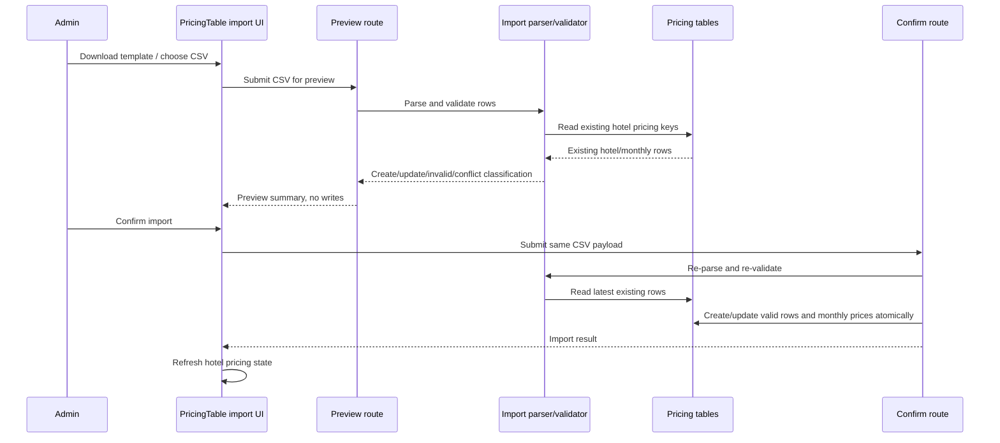

# feat: Add hotel pricing CSV import

## Summary

Extend the existing admin pricing workflow with a CSV import path for estimator hotel pricing. The implementation will add shared server-side parsing/validation, preview and confirm routes, database-backed duplicate prevention, a downloadable template, and a focused UI section inside the current pricing table.

---

## Problem Frame

Admins currently add or edit hotel pricing one row/month at a time. That is fine for small corrections but inefficient and error-prone when importing full hotel packages and seasonal monthly prices from a spreadsheet (see origin: `docs/brainstorms/2026-05-08-hotel-pricing-csv-import-requirements.md`).

---

## Requirements

- R1. Provide a dummy CSV template for estimator hotel pricing import.
- R2. Support one hotel per CSV row with required base hotel pricing data and optional monthly SAR prices.
- R3. Treat blank monthly values as fallback to the row's base SAR price.
- R4. Produce a preview before any database write occurs.
- R5. Preview rows grouped by create, update, invalid, and duplicate/conflict outcomes.
- R6. Give invalid rows enough row-level reason for an admin to correct the CSV.
- R7. Confirmed imports update existing matching hotel pricing rows instead of creating duplicates.
- R8. Confirmed imports create new hotel pricing rows only when unique.
- R9. Duplicate rows inside the uploaded CSV do not create duplicate database rows.
- R10. Only rows that pass validation are written on confirmation.
- R11. Apply only to estimator hotel pricing data used by budget calculations.
- R12. Preserve the current manual admin pricing workflow.

**Origin actors:** A1 Admin pricing manager, A2 Estimator user
**Origin flows:** F1 Preview hotel pricing CSV import, F2 Confirm validated import
**Origin acceptance examples:** AE1 template, AE2 monthly fallback, AE3 update existing, AE4 invalid rows, AE5 duplicate conflicts, AE6 scope separation

---

## Scope Boundaries

- No Hotel Nusuk directory import fields or behavior.
- No import for airline prices, service fees, exchange rates, or room multipliers.
- No XLSX support in this iteration.
- No fuzzy matching for slightly different hotel names.
- No external supplier sync.
- No replacement or broad redesign of the existing manual pricing workflow.

### Deferred to Follow-Up Work

- General-purpose import framework for other admin content areas.
- Pricing audit logging from `docs/plans/2026-05-05-001-feat-prd-gap-closure-plan.md`.

---

## Context & Research

### Relevant Code and Patterns

- `lib/db/schema.ts` defines `hotelPrices` and `hotelMonthlyPrices`; monthly prices already have a unique constraint on hotel + month.
- `components/admin/PricingTable.tsx` owns the admin pricing UI, inline edits, hotel creation form, and local hotel state updates.
- `app/(admin)/admin/pricing/page.tsx` fetches rates, hotels, airlines, services, and monthly prices and passes a `HotelWithMonthly` shape to `PricingTable`.
- `app/api/admin/pricing/[category]/route.ts` already handles admin-only pricing mutations for hotel base prices and monthly hotel prices.
- `app/api/admin/pricing/__tests__/route.test.ts` currently covers validation logic only, so import-specific route/integration behavior needs new focused coverage.
- `lib/budget/calculate.ts` consumes the aggregated hotel pricing shape used by estimator calculations; import correctness matters because future calculations read these rows.

### Institutional Learnings

- No `docs/solutions/` directory exists in this repo.

### External References

- `csv-parse` official docs: parser supports Node.js, sync/callback/stream APIs, quotes, escaping, line break discovery, and has no runtime dependencies. This is a better fit than ad hoc CSV splitting for spreadsheet-generated files.
- Papa Parse docs were considered; it is browser-friendly and can parse local files, but server-side validation remains the better source of truth for preview/confirm consistency in this admin workflow.

---

## Key Technical Decisions

- **Use `city + tier + normalized label` as the hotel pricing match key:** `city + tier` alone is too broad because the admin UI already supports adding multiple hotel entries per city/tier. The label distinguishes concrete hotel pricing rows while still matching the spreadsheet mental model.
- **Add a database-backed duplicate guard:** Import validation should catch duplicates before write, but duplicate prevention must not rely only on the UI or request timing. Persisting a normalized match key or equivalent uniqueness constraint on hotel pricing rows makes repeated imports safe.
- **Use a real CSV parser dependency:** Spreadsheet CSVs can contain commas, quotes, and newline variants. A small parser dependency keeps the behavior reliable and easier to test than manual splitting.
- **Keep parsing/validation in a shared server-side module:** Preview and confirm must classify rows the same way. Shared logic avoids drift between API branches and gives tests a narrow target.
- **Re-parse and re-validate on confirm:** The confirm request should not trust client-held preview state. It should apply the same validation path again and only write rows that still classify as valid create/update rows.
- **Keep template generation server-owned:** A server route or shared export should produce the canonical dummy CSV so UI copy, tests, and future docs point to one source of truth.

---

## Open Questions

### Resolved During Planning

- **Uniqueness key:** Use `city + tier + normalized label`, with a database-backed uniqueness guard.
- **Preview/confirm trust model:** Confirm re-parses and re-validates the CSV instead of trusting preview state.
- **Preview UI location:** Add the import controls inside the existing hotel pricing section of `PricingTable`, because the feature applies only to hotel pricing and should not look like a global pricing import.
- **CSV parser:** Add a small parser dependency rather than hand-rolling CSV parsing.

### Deferred to Implementation

- **Exact normalization algorithm:** The implementer should keep it deterministic and conservative, then cover whitespace/case cases in tests.
- **Exact template delivery shape:** Use the simplest route/component shape that lets admins download or copy the canonical CSV.
- **Transaction mechanics:** The plan requires create/update plus monthly writes to behave atomically per import; the exact Drizzle transaction wiring can be finalized during implementation.

---

## High-Level Technical Design

> *This illustrates the intended approach and is directional guidance for review, not implementation specification. The implementing agent should treat it as context, not code to reproduce.*

---

## Implementation Units

### U1. CSV import domain module and template

**Goal:** Create the reusable server-side import logic and canonical template for hotel pricing CSV rows.

**Requirements:** R1, R2, R3, R5, R6, R9, R11; F1; AE1, AE2, AE4, AE5, AE6

**Dependencies:** None

**Files:**
- Modify: `package.json`
- Modify: `pnpm-lock.yaml`
- Create: `lib/admin/hotel-pricing-import.ts`
- Test: `lib/admin/__tests__/hotel-pricing-import.test.ts`

**Approach:**
- Add a CSV parser dependency suitable for server-side parsing.
- Define the canonical one-hotel-per-row import shape with required city, tier, label, base SAR price, and optional monthly SAR prices.
- Export a canonical dummy CSV/template string from the same module that parses import input.
- Validate city and tier against existing enum values, require a non-empty label, allow blank monthly cells, and treat blank monthly cells as base price fallback.
- Detect duplicate keys within the uploaded CSV before any database write concerns.
- Return row-level classifications and messages in a shape that API routes and UI can consume.

**Execution note:** Implement the parser/validator test-first because it is pure logic and carries most of the import safety rules.

**Patterns to follow:**
- Enum lists and validation conventions from `app/api/admin/pricing/[category]/route.ts`.
- Existing domain pure-function test style in `lib/budget/__tests__/calculate.test.ts`.

**Test scenarios:**
- Covers AE1. Happy path: template output contains required base columns and all monthly SAR columns.
- Covers AE2. Happy path: valid row with blank monthly values parses as valid and resolves each blank month to the base SAR value.
- Happy path: quoted label/sublabel values containing commas parse correctly.
- Edge case: city casing/spacing normalization maps valid spreadsheet input to canonical city values if the implementation chooses to allow that; otherwise invalid variants get row-level errors consistently.
- Edge case: duplicate rows in the same CSV with the same normalized match key classify as conflicts and are not eligible for write.
- Error path: missing label reports a row-level label error.
- Error path: invalid tier reports a row-level tier error.
- Error path: zero, negative, or non-numeric base/monthly SAR values report row-level price errors.
- Error path: unknown required header or missing required header reports a file-level or row-level validation error that the UI can show.

**Verification:**
- Import classification can be tested without Next.js route context or database writes.
- Template and parser stay in sync because tests parse the generated template with sample rows.

---

### U2. Database-backed hotel pricing uniqueness

**Goal:** Make duplicate prevention durable by enforcing the import match key at the database/schema level.

**Requirements:** R7, R8, R9, R10; F2; AE3, AE5

**Dependencies:** U1

**Files:**
- Modify: `lib/db/schema.ts`
- Modify: `lib/db/seed.ts`
- Create: `drizzle/migrations/`
- Test: `lib/db/__tests__/schema.test.ts`

**Approach:**
- Add a stable normalized key or equivalent uniqueness mechanism to hotel pricing rows that represents `city + tier + normalized label`.
- Ensure seeded hotel rows and newly created manual hotel rows populate the same key.
- Add a uniqueness constraint so two hotel pricing rows cannot share the same import/match identity.
- Keep existing monthly price uniqueness unchanged.
- Avoid changing Hotel Nusuk directory tables; this applies only to estimator hotel pricing.

**Patterns to follow:**
- Existing `unique().on(...)` usage for `hotelMonthlyPrices`.
- Existing CUID/timestamp/schema style in `lib/db/schema.ts`.
- Seed idempotency style in `lib/db/seed.ts`.

**Test scenarios:**
- Happy path: seeded hotel pricing rows have deterministic match keys.
- Happy path: two different labels in the same city/tier are allowed.
- Edge case: same label with different casing/extra whitespace resolves to the same match identity and is blocked by the uniqueness guard.
- Integration: monthly price rows remain tied to the hotel row and are not duplicated by key changes.
- Error path: attempting to create a duplicate hotel pricing identity fails before duplicate rows can exist.

**Verification:**
- Schema and migration add duplicate prevention without altering Hotel Nusuk listings.
- Existing budget calculation and pricing fetch tests still operate on hotel pricing rows.

---

### U3. Preview and confirm API routes

**Goal:** Add admin-only API routes for previewing and confirming hotel pricing CSV imports.

**Requirements:** R4, R5, R6, R7, R8, R9, R10, R11; F1, F2; AE2, AE3, AE4, AE5, AE6

**Dependencies:** U1, U2

**Files:**
- Create: `app/api/admin/pricing/hotel-import/preview/route.ts`
- Create: `app/api/admin/pricing/hotel-import/confirm/route.ts`
- Test: `app/api/admin/pricing/__tests__/hotel-import-route.test.ts`

**Approach:**
- Both routes should require admin access, mirroring existing pricing route behavior.
- Preview route parses the uploaded CSV text, loads existing hotel pricing rows and monthly rows, classifies each CSV row as create/update/invalid/conflict, and returns a summary without writing.
- Confirm route re-parses/re-validates the CSV text, loads the latest existing rows, then writes only valid create/update rows.
- Create writes should create the base hotel pricing row and 12 monthly rows.
- Update writes should update base hotel fields and upsert/replace the 12 monthly rows for the existing hotel pricing row.
- Writes should behave atomically for a confirmation request so partial successful imports do not leave the pricing tables in an ambiguous state.
- The routes should not touch Hotel Nusuk directory tables.

**Patterns to follow:**
- Admin auth shape from `app/api/admin/pricing/[category]/route.ts`.
- Existing test organization in `app/api/admin/pricing/__tests__/route.test.ts`, but with route-level tests that mock auth/db behavior where needed.

**Test scenarios:**
- Covers AE2. Happy path: previewing a valid row with blank monthly values returns an eligible create/update preview and no writes.
- Covers AE3. Happy path: confirming a row matching an existing hotel updates the existing row and monthly prices instead of inserting another base row.
- Happy path: confirming a unique row creates one base hotel row and 12 monthly rows.
- Covers AE4. Error path: previewing a CSV with invalid city/tier returns row-level errors and no writes.
- Covers AE4. Confirm path: invalid rows are not written when mixed with valid rows.
- Covers AE5. Error path: duplicate rows inside the same CSV are classified as conflicts and are not written.
- Error path: unauthenticated request returns unauthorized and writes nothing.
- Error path: non-admin request returns forbidden and writes nothing.
- Integration: confirm re-validates latest DB state so a row that becomes a duplicate after preview does not create a duplicate on confirm.

**Verification:**
- Preview produces no database writes.
- Confirm writes only eligible create/update rows and leaves invalid/conflict rows unapplied.
- Repeated confirm with the same CSV updates existing rows rather than increasing base hotel row count.

---

### U4. Admin pricing import UI

**Goal:** Add a CSV import affordance to the existing hotel pricing section of the admin pricing table.

**Requirements:** R1, R4, R5, R6, R10, R12; F1, F2; AE1, AE2, AE4

**Dependencies:** U1, U3

**Files:**
- Modify: `components/admin/PricingTable.tsx`
- Test: create `components/admin/__tests__/PricingTableImport.test.tsx` or extend the closest existing admin component test if one exists.

**Approach:**
- Add a compact import panel near the "Harga Hotel" heading, alongside or near the existing add-hotel control.
- Provide access to the canonical dummy CSV template.
- Let admins select/upload CSV text, request preview, inspect create/update/invalid/conflict counts, and see enough row-level detail to correct errors.
- Disable or hide confirm until preview has at least one valid create/update row and no blocking duplicate/conflict policy issues, according to the domain module result.
- On confirm success, refresh the pricing table state so newly created/updated hotel and monthly prices are visible without requiring manual navigation if practical.
- Preserve the existing manual add-hotel and inline edit workflow.

**Patterns to follow:**
- Existing local state and fetch style in `components/admin/PricingTable.tsx`.
- Existing toast behavior from `components/admin/InlineEditCell.tsx` and other client components.
- Existing compact admin table styling in `PricingTable`.

**Test scenarios:**
- Covers AE1. Happy path: import panel exposes the CSV template action.
- Covers AE2. Happy path: after a preview response with valid rows, summary counts and monthly fallback indication render.
- Happy path: confirm is available after a valid preview and calls the confirm route with the selected CSV payload.
- Covers AE4. Error path: preview response with invalid rows renders row-level errors.
- Edge case: selecting a new file clears the prior preview/confirm state.
- Edge case: confirm is not available before preview or when preview has only invalid/conflict rows.
- Integration: existing add-hotel button and inline edit controls still render.

**Verification:**
- Admin can complete preview-confirm flow from `/admin/pricing`.
- Existing pricing edits remain usable.

---

### U5. Documentation and feature summary update

**Goal:** Document the final CSV template and update project feature documentation so admins and future agents understand the import surface.

**Requirements:** R1, R2, R11, R12; AE1, AE6

**Dependencies:** U1, U3, U4

**Files:**
- Modify: `docs/FEATURES.md`
- Create: `docs/templates/hotel-pricing-import-template.csv` or document why the generated template route is the only source of truth.

**Approach:**
- Add the hotel pricing CSV import to the Admin Pricing section.
- Include or reference the template columns and the blank-month fallback rule.
- Document that the import targets estimator pricing hotels only, not Hotel Nusuk directory content.
- Keep the template content aligned with the parser module's canonical template.

**Patterns to follow:**
- Existing concise feature summaries in `docs/FEATURES.md`.
- If a static template file is created, keep it under `docs/templates/` and ensure tests or implementation checks avoid drift from the canonical template.

**Test scenarios:**
- Test expectation: none -- documentation/template artifact only. Drift prevention is covered by U1 parser/template tests if the implementation links the static template to the canonical generator.

**Verification:**
- A future admin or implementer can identify the CSV columns and scope from project documentation.

---

## System-Wide Impact

- **Interaction graph:** Admin import writes to the same hotel pricing rows consumed by `fetchPricingConfig()` and `calculateBudget()`, affecting future estimator calculations and price badges.
- **Error propagation:** CSV parse/validation errors should stay row-level where possible; auth and malformed file errors can be request-level.
- **State lifecycle risks:** Preview is intentionally read-only. Confirm must re-validate and write atomically to avoid stale preview or partial monthly updates.
- **API surface parity:** Existing pricing mutation routes remain intact; new import routes add a bulk path without changing current inline-edit response contracts.
- **Integration coverage:** Route tests must prove preview does not write and confirm updates/creates the pricing + monthly rows together.
- **Unchanged invariants:** Hotel Nusuk listings, airline prices, services, exchange rates, room multipliers, auth, and budget formula logic do not change.

---

## Risks & Dependencies

| Risk | Mitigation |
|------|------------|
| Duplicate hotel pricing rows already exist before the uniqueness guard is added | Migration/implementation should detect conflicts and require manual cleanup rather than silently choosing a winner |
| CSV confirm uses stale preview assumptions | Confirm re-parses and re-validates against current DB state |
| Hand-rolled CSV parsing mishandles quoted spreadsheet data | Use a parser dependency with quote/escape support |
| Partial monthly writes leave inconsistent seasonal pricing | Confirm writes should be transactionally applied per import |
| UI becomes crowded in `PricingTable` | Keep import panel collapsed/compact and scoped to the hotel pricing section |

---

## Documentation / Operational Notes

- The import should be admin-only and should not expose pricing write surfaces to public users.
- After deployment, existing databases may need a one-time duplicate check before the unique guard migration can apply cleanly.
- Update `docs/FEATURES.md` after implementation to reflect CSV import support and template availability.

---

## Sources & References

- **Origin document:** [docs/brainstorms/2026-05-08-hotel-pricing-csv-import-requirements.md](../brainstorms/2026-05-08-hotel-pricing-csv-import-requirements.md)
- Related code: `lib/db/schema.ts`
- Related code: `components/admin/PricingTable.tsx`
- Related code: `app/(admin)/admin/pricing/page.tsx`
- Related code: `app/api/admin/pricing/[category]/route.ts`
- Related code: `lib/budget/calculate.ts`
- External docs: [csv-parse usage](https://csv.js.org/parse/)
- External docs: [Papa Parse documentation](https://www.papaparse.com/docs)
