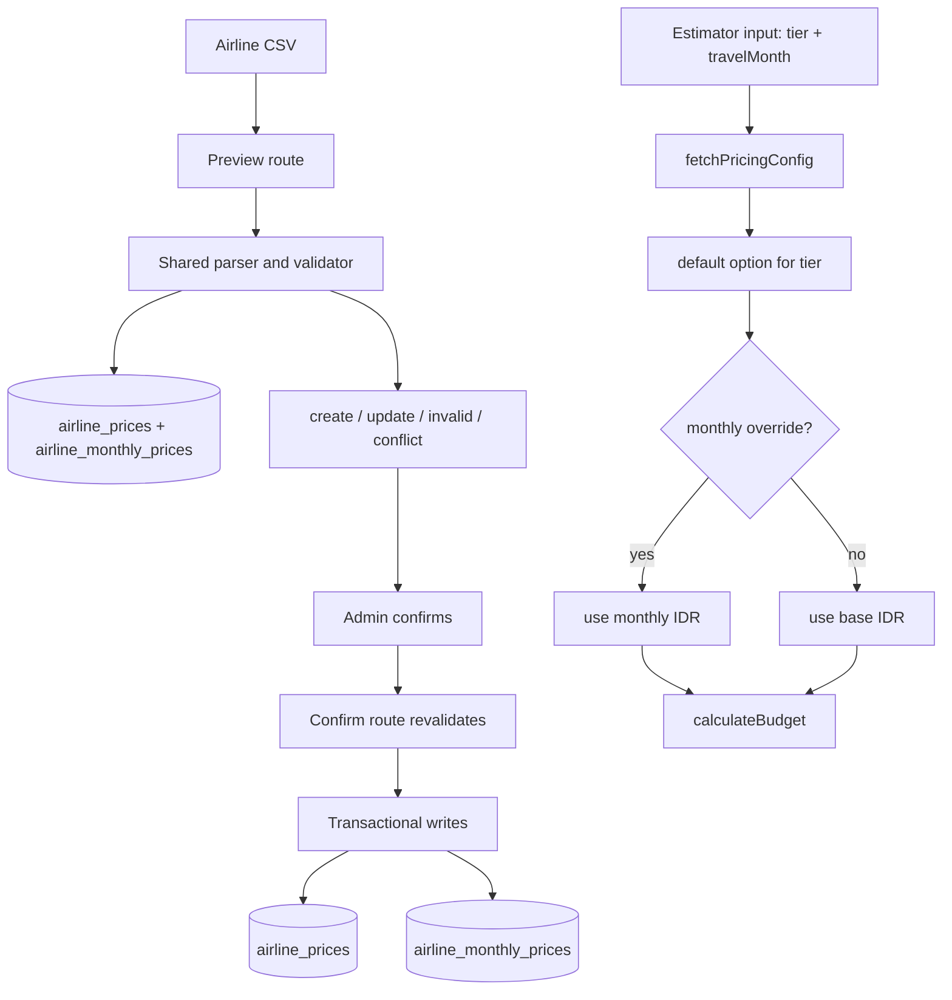

# refactor: Expand airline pricing model

## Summary

Refactor airline pricing from one flat price per tier into an admin-managed pricing surface that supports multiple airline options per tier, monthly IDR prices, deterministic default selection for the estimator, and CSV preview/confirm import. The estimator remains tier-based in v1, but the tier resolves to an admin-selected default airline option with month-aware pricing.

---

## Problem Frame

Airline pricing is currently too coarse for Umroh estimation because it cannot represent multiple carriers within the same tier or seasonal fare changes. Hotel pricing already has the safer operating model this needs: concrete rows, monthly prices, duplicate prevention, and a bulk import workflow.

---

## Requirements

- R1. Support multiple airline options per existing airline tier.
- R2. Give every airline option a visible label and optional descriptive sublabel.
- R3. Preserve existing tier values: `BUDGET`, `STANDARD`, `GARUDA`, and `BUSINESS`.
- R4. Store a base IDR round-trip price per person for each airline option.
- R5. Store optional monthly IDR round-trip prices per person for January through December.
- R6. Fall back to base airline price when a monthly price is blank or missing.
- R7. Prevent duplicate airline option rows for the same tier and normalized label.
- R8. Provide a dummy airline pricing CSV template.
- R9. Allow admins to preview airline pricing CSV rows before writes.
- R10. Classify preview rows as create, update, invalid, or duplicate/conflict with row-level correction reasons.
- R11. Re-validate submitted airline pricing data on confirm.
- R12. Update existing matching airline options on confirm instead of creating duplicates.
- R13. Write only rows that pass validation.
- R14. Preserve inline airline pricing editing as part of the admin workflow.
- R15. Keep existing estimates, AI parsing, and estimator forms compatible with the current four airline tiers.
- R16. Use travel-month airline pricing when a travel month and monthly override are present.
- R17. Fall back to base airline pricing when no travel month or monthly override is available.
- R18. Keep the estimator's user-facing airline selection tier-based in v1.

**Origin actors:** A1 Admin pricing manager, A2 Estimator user, A3 Planning/implementation agent
**Origin flows:** F1 Preview airline pricing CSV import, F2 Confirm airline pricing import, F3 Estimate with seasonal airline pricing
**Origin acceptance examples:** AE1 duplicate prevention, AE2 monthly fallback, AE3 template/preview, AE4 confirm revalidation, AE5 tier compatibility

---

## Scope Boundaries

- No live flight booking or reservation.
- No real-time fare scraping, OTA integration, or automatic external fare sync.
- No seat inventory, fare class, baggage, refund, route availability, or airline approval-rule modeling.
- No replacement of the simple tier-based estimator airline UX.
- No import refactor for hotels, services, exchange rates, or room multipliers as part of this plan.
- No historical fare analytics table in this iteration.

### Deferred to Follow-Up Work

- Letting estimator users choose a specific airline option inside a tier.
- A generalized import framework shared by hotels and airlines.
- Pricing audit logs from `docs/plans/2026-05-05-001-feat-prd-gap-closure-plan.md`.

---

## Context & Research

### Relevant Code and Patterns

- `lib/db/schema.ts` defines `airlinePrices` as one row shape with `tier`, `idr`, `label`, and `sublabel`; it also defines the hotel monthly pricing pattern to mirror.
- `lib/budget/calculate.ts` currently resolves `pricing.airlines[params.airline].idr`; this is the estimator calculation point that must become month-aware.
- `types/index.ts` keeps `AirlineTier` as the public estimator-facing airline type and defines the current `PricingConfig.airlines` record.
- `components/admin/PricingTable.tsx` owns inline airline edits and the existing hotel CSV import UI pattern.
- `app/api/admin/pricing/[category]/route.ts` handles manual pricing mutations and should remain the single manual admin pricing mutation surface.
- `lib/admin/hotel-pricing-import.ts` and `app/api/admin/pricing/hotel-import/*/route.ts` provide the closest implementation pattern for parser, preview, confirm, and template behavior.
- `docs/templates/hotel-pricing-import-template.csv` is the template style to mirror for airline pricing.

### Institutional Learnings

- No `docs/solutions/` directory exists in this repo.

### External References

- None used. The local hotel pricing import implementation is a stronger project-specific pattern than external guidance for this refactor.

---

## Key Technical Decisions

- **Keep estimator input tier-based:** `EstimateParams.airline` remains an `AirlineTier`, so existing forms, AI parsing, saved estimate payloads, and user mental model do not change.
- **Introduce a default airline option per tier:** When multiple options exist in a tier, calculations use the option marked as default for that tier. This makes v1 deterministic without adding a new public airline-option selector.
- **Expose every airline option in admin:** Inline editing should operate on concrete airline option rows, not only the four tier defaults. Admins need to distinguish and maintain multiple options per tier.
- **Use `tier + normalized label` as the duplicate key:** This matches the requirement to allow multiple options in a tier while preventing repeated imports of the same airline option.
- **Store monthly airline prices in a child table:** Mirror `hotelMonthlyPrices` with one row per airline option and month, keeping base price and seasonal overrides separate.
- **Preserve backward compatibility for manual PATCH by tier:** If an existing caller updates by tier only, update that tier's default option. New UI code should update by airline option id.
- **Treat saved estimates as tier-based recalculations:** Existing saved inputs still contain tier, not option id. Recalculation should use the current default option for that tier, consistent with the app's existing pricing-config behavior.

---

## Open Questions

### Resolved During Planning

- **Active airline option for estimator:** Use exactly one default airline option per tier. The admin UI can change the default; calculations read the current default.
- **Duplicate prevention key:** Use `tier + normalized label`, persisted as an `importKey` or equivalent unique value.
- **Inline editing scope:** Show and edit every airline option row in admin, with a visible default marker per tier.
- **Saved estimate behavior:** Saved estimates remain tier-based and resolve against the current default airline option when recalculated.

### Deferred to Implementation

- **Exact normalization algorithm:** Keep it conservative, deterministic, and covered by tests for case, whitespace, and punctuation variants.
- **Database enforcement for one default per tier:** Prefer a partial unique index where Drizzle/Postgres support is clean; otherwise enforce in transaction-level mutation logic and test the invariant.
- **Exact admin layout:** Reuse the existing `PricingTable` style, but the implementer may choose table grouping or collapsible tier sections based on readability.

---

## High-Level Technical Design

> *This illustrates the intended approach and is directional guidance for review, not implementation specification. The implementing agent should treat it as context, not code to reproduce.*



Expected data shape:

```ts
type AirlinePriceConfig = {
  id: string
  tier: AirlineTier
  idr: number
  label: string
  sublabel?: string | null
  isDefault: boolean
  monthlyPrices: Partial<Record<number, number>>
}

type PricingConfig = {
  airlines: Record<AirlineTier, AirlinePriceConfig>
  airlineOptions?: Record<AirlineTier, AirlinePriceConfig[]>
  // existing hotels/services/rates remain unchanged
}
```

---

## Implementation Units

### U1. Extend Airline Pricing Schema

**Goal:** Add the database structure needed for multiple airline options, duplicate prevention, default selection, and monthly prices.

**Requirements:** R1, R3, R4, R5, R7, R15

**Dependencies:** None

**Files:**
- Modify: `lib/db/schema.ts`
- Create: generated Drizzle migration file if this repo uses checked-in migrations for schema changes
- Test: schema-related tests if existing migration/schema tests are present

**Approach:**
- Add a persisted normalized duplicate key to `airlinePrices`, likely `importKey`, with a unique constraint.
- Add `isDefault` or equivalent default-selection field to `airlinePrices`.
- Add `airlineMonthlyPrices` with `airlinePriceId`, `month`, `idr`, timestamps if consistent, and a unique constraint on airline option + month.
- Migrate existing airline rows to unique import keys and default rows for their tier.
- Seed or backfill monthly prices only when needed; missing monthly rows should mean fallback to base price.

**Patterns to follow:**
- `hotelPrices.importKey`
- `hotelMonthlyPrices`

**Test scenarios:**
- Happy path: existing four tier rows remain valid default options after migration/backfill.
- Edge case: two airline options with the same tier and normalized label cannot both persist.
- Edge case: an airline option can have at most one monthly price per month.

**Verification:**
- Drizzle schema generation/push sees the new columns/table without dropping existing airline tier data.

---

### U2. Update Pricing Types and Estimator Calculation

**Goal:** Make airline pricing month-aware while preserving public tier-based estimator inputs.

**Requirements:** R6, R15, R16, R17, R18

**Dependencies:** U1

**Files:**
- Modify: `types/index.ts`
- Modify: `lib/budget/calculate.ts`
- Modify: `lib/ai/prompt.ts`
- Test: budget and prompt tests where present

**Approach:**
- Introduce an airline config shape with base IDR and monthly prices.
- Keep `PricingConfig.airlines` as `Record<AirlineTier, ...>` for the default option per tier.
- Optionally add `PricingConfig.airlineOptions` for admin/UI consumption if server page data benefits from shared types.
- In `calculateBudget`, resolve flight IDR from monthly price when `travelMonth` exists and the default option has that month.
- In `fetchPricingConfig`, select default airline options per tier and attach monthly rows.
- Keep AI parsing prompt values as the same four tier strings, but update dynamic pricing text to reflect default labels and current configured prices.

**Patterns to follow:**
- Existing hotel monthly fallback behavior in `lib/budget/calculate.ts`.
- Existing dynamic pricing prompt generation in `lib/ai/prompt.ts`.

**Test scenarios:**
- Happy path: February estimate uses February airline monthly IDR when present.
- Edge case: missing monthly airline price falls back to base IDR.
- Edge case: missing travel month falls back to base IDR.
- Regression: AI parser still describes airline choices as `BUDGET`, `STANDARD`, `GARUDA`, and `BUSINESS`.

**Verification:**
- Existing estimator calculations still work with only one default row per tier.

---

### U3. Build Airline CSV Import Module and Routes

**Goal:** Add airline import preview, confirm, and template behavior matching the hotel import workflow.

**Requirements:** R1, R2, R4, R5, R6, R7, R8, R9, R10, R11, R12, R13

**Dependencies:** U1

**Files:**
- Create: `lib/admin/airline-pricing-import.ts`
- Create: `app/api/admin/pricing/airline-import/preview/route.ts`
- Create: `app/api/admin/pricing/airline-import/confirm/route.ts`
- Create: `app/api/admin/pricing/airline-import/template/route.ts`
- Create: `docs/templates/airline-pricing-import-template.csv`
- Test: `lib/admin/__tests__/airline-pricing-import.test.ts`
- Test: `app/api/admin/pricing/__tests__/airline-import-route.test.ts`

**Approach:**
- Mirror the hotel import parser structure instead of creating a generic import framework.
- Use columns for tier, label, sublabel, base IDR, optional monthly IDR values, and an optional default marker.
- Classify rows as create/update/invalid/conflict using `tier + normalized label`.
- Detect duplicate rows inside the uploaded CSV before writes.
- On confirm, re-parse and re-query current database state before writing.
- Wrap create/update plus monthly price writes in a transaction.
- If imported rows mark a default option, validate there is at most one default per tier in the submitted file and reconcile the prior default inside the same transaction.

**Patterns to follow:**
- `lib/admin/hotel-pricing-import.ts`
- `app/api/admin/pricing/hotel-import/*/route.ts`
- `docs/templates/hotel-pricing-import-template.csv`

**Test scenarios:**
- Happy path: a valid CSV creates airline option rows and monthly prices.
- Happy path: a matching CSV row updates the existing airline option and monthly prices.
- Edge case: blank monthly values do not create monthly override rows and fall back to base.
- Error path: invalid tier, invalid price, missing label, or duplicate file row returns row-level reasons.
- Error path: multiple default markers for the same tier are classified as conflicts.
- Integration: confirm revalidates and writes only valid create/update rows.

**Verification:**
- Importing the same valid file twice updates existing rows and does not create duplicates.

---

### U4. Refactor Admin Airline Pricing UI

**Goal:** Let admins manage multiple airline options, defaults, monthly prices, and CSV imports from the existing pricing table surface.

**Requirements:** R1, R2, R5, R8, R9, R10, R14

**Dependencies:** U1, U3

**Files:**
- Modify: `components/admin/PricingTable.tsx`
- Modify: `app/(admin)/admin/pricing/page.tsx`
- Modify: `app/api/admin/pricing/[category]/route.ts`
- Test: `components/admin/__tests__/PricingTableImport.test.tsx`
- Test: `app/api/admin/pricing/__tests__/route.test.ts`

**Approach:**
- Load airline options and monthly prices for the admin page, not just one row per tier.
- Render airline options grouped by tier with visible label, sublabel, base IDR, monthly overrides, and default marker.
- Keep inline editing for concrete airline option rows by id.
- Support a tier-only PATCH fallback that updates the default option for compatibility, but make the UI send ids.
- Add controls to create a new airline option manually if this is already consistent with pricing UI patterns.
- Add import template download, preview summary, row-level errors, and confirm controls following the hotel import panel.
- Refresh or reconcile local state after confirm so the admin sees newly created and updated airline options.

**Patterns to follow:**
- Existing hotel creation and monthly edit UI in `components/admin/PricingTable.tsx`.
- Existing hotel import preview/confirm UI in `components/admin/PricingTable.tsx`.

**Test scenarios:**
- Happy path: admin edits a non-default airline option by id.
- Happy path: admin changes the default option for a tier and only one default remains visible.
- Happy path: import preview shows create/update/invalid/conflict groups.
- Regression: old tier-only airline price edit updates the tier default option.
- Edge case: monthly blank value clears or omits an override without breaking base price.

**Verification:**
- Admin pricing page can manage more than one airline option in the same tier without UI ambiguity.

---

### U5. Documentation and Fixtures

**Goal:** Make the new airline pricing shape understandable for admins and future implementation agents.

**Requirements:** R8, R15, R18

**Dependencies:** U3, U4

**Files:**
- Create: `docs/templates/airline-pricing-import-template.csv`
- Modify: `docs/FEATURES.md` if estimator/admin pricing behavior is documented there
- Modify: README or admin docs if pricing import docs already exist

**Approach:**
- Keep template values clearly dummy and IDR-denominated.
- Document that monthly values are optional and blank means base-price fallback.
- Document that estimator users still choose tiers, while admins choose which option is default for each tier.

**Test scenarios:**
- Test expectation: none beyond route/template tests from U3.

**Verification:**
- Template headers match parser expectations exactly.

---

## System-Wide Impact

- **Interaction graph:** Admin pricing page, pricing API routes, budget calculation, AI prompt generation, and Drizzle schema all touch the airline pricing shape.
- **Error propagation:** CSV parsing and validation errors should stay row-level in preview/confirm responses; database constraint failures should return admin-readable conflict errors where practical.
- **State lifecycle risks:** Default option changes can affect all future tier-based estimates; writes that change defaults and monthly prices should be transactional.
- **API surface parity:** New airline import routes should match hotel import behavior closely, and manual pricing PATCH should support both id-based updates and the existing tier-based default update.
- **Integration coverage:** Unit tests must be backed by route-level tests proving preview/confirm revalidation and admin mutation behavior.
- **Unchanged invariants:** Public estimator input remains `AirlineTier`; AI parsing should not emit specific airline option ids in v1.

---

## Risks & Dependencies

| Risk | Mitigation |
|------|------------|
| Default option ambiguity causes inconsistent estimates | Require one deterministic default option per tier, expose it in admin, and test fallback behavior |
| CSV import duplicates options already in the database | Persist a normalized `tier + label` key and revalidate on confirm |
| Monthly airline pricing breaks old estimates without travel month | Base price fallback remains the default path |
| Admin UI becomes too dense | Group by tier and reuse the existing compact pricing table/import patterns |
| Partial unique default enforcement is awkward in Drizzle | Prefer database enforcement, but keep transaction-level reconciliation and tests as the minimum invariant |

---

## Documentation / Operational Notes

- Run the Drizzle migration/push after schema changes and verify existing airline rows receive import keys/default state.
- Keep a rollback path for pricing data: schema migration should not remove existing `tier`, `idr`, `label`, or `sublabel` data.
- Seeded/default airline prices should remain conservative until real admin-reviewed data is imported.

---

## Sources & References

- **Origin document:** [docs/brainstorms/2026-05-09-airline-pricing-refactor-requirements.md](../brainstorms/2026-05-09-airline-pricing-refactor-requirements.md)
- **Related plan:** [docs/plans/2026-05-08-001-feat-hotel-pricing-csv-import-plan.md](2026-05-08-001-feat-hotel-pricing-csv-import-plan.md)
- Related code: `lib/db/schema.ts`
- Related code: `lib/budget/calculate.ts`
- Related code: `components/admin/PricingTable.tsx`
- Related code: `lib/admin/hotel-pricing-import.ts`
