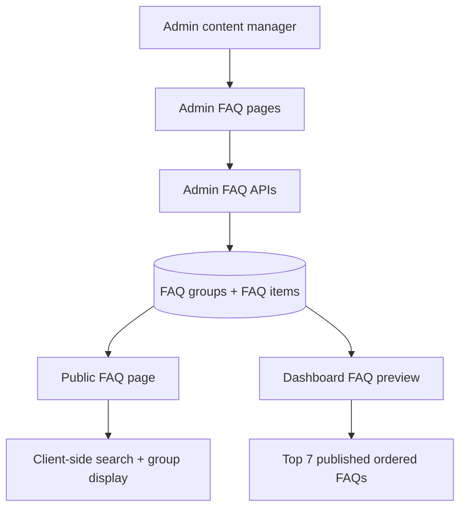

# feat: Add FAQ management

## Summary

Add FAQ as a database-backed content module that follows the existing admin stories/hotels pattern. The implementation creates admin-managed groups and Q&A items, public grouped/searchable FAQ viewing, dashboard preview capped at seven published items, and shared rendering for rich Markdown answers.

---

## Problem Frame

The origin requirements define a lightweight Q&A surface for recurring umroh questions without turning FAQ into a second guide system. The repo already has server-rendered public content pages, admin-only content CRUD, publish toggles, and Drizzle-backed content tables; this plan extends those patterns for FAQ.

---

## Requirements

- R1. FAQ content is shared between public visitors and logged-in users. (Origin R1)
- R2. The full FAQ page is public and shows only published FAQ items to non-admin users. (Origin R2, R3, AE1)
- R3. The full FAQ page groups FAQs by admin-managed groups and supports search across questions and answers. (Origin R4, R5, R6, AE2)
- R4. The logged-in dashboard includes a compact preview with no more than seven published FAQ items and a link to the full FAQ page. (Origin R7, R8, R9, AE3)
- R5. Admins can create, edit, delete, reorder, publish, and unpublish FAQ items. (Origin R13, R15, R16, R18, AE5, AE7)
- R6. Admins can create, edit, delete, and reorder FAQ groups. (Origin R10, R11, R12, AE4)
- R7. FAQ items remain structurally question + answer, while answers may use constrained rich formatting. (Origin R14, R17, AE6)
- R8. The implementation preserves the existing Panduan, stories, hotels, estimator, and pricing behavior. (Origin scope boundaries)

**Origin actors:** A1 Public visitor, A2 Logged-in user, A3 Admin content manager, A4 Planning/implementation agent

**Origin flows:** F1 Browse full FAQ page, F2 Use dashboard FAQ preview, F3 Manage FAQ groups, F4 Manage FAQ items

**Origin acceptance examples:** AE1 public visibility, AE2 search/group context, AE3 dashboard cap, AE4 admin group order, AE5 publish gating, AE6 rich answer rendering, AE7 item order

---

## Scope Boundaries

- No user-submitted questions.
- No per-user personalized FAQ content.
- No separate FAQ detail/article pages.
- No FAQ analytics, voting, or helpfulness feedback.
- No separate FAQ sets for public visitors and logged-in users.
- No replacement of existing Panduan guide content.
- No images or embeds as a planned v1 requirement.

### Deferred to Follow-Up Work

- Admin drag-and-drop ordering polish: v1 can use explicit numeric order fields or simple move controls; drag-and-drop can follow later if needed.
- Full-text database search: v1 uses client-side filtering over published FAQ content; server/database search can follow if FAQ volume grows.

---

## Context & Research

### Relevant Code and Patterns

- `lib/db/schema.ts` defines Drizzle tables and inferred types for persistent content models.
- `app/(admin)/admin/content/stories/page.tsx` and `app/(admin)/admin/content/hotels/page.tsx` show admin list pages with status badges and action controls.
- `components/admin/stories/StoryForm.tsx` and `components/admin/hotels/HotelListingForm.tsx` show client-side admin content forms with submit error handling, publish toggles, and route refresh.
- `app/api/admin/stories/route.ts`, `app/api/admin/stories/[id]/route.ts`, `app/api/admin/hotels/route.ts`, and `app/api/admin/hotels/[id]/route.ts` show admin-only CRUD API patterns and validation style.
- `app/(public)/cerita-jamaah/page.tsx` and `app/(public)/hotel-nusuk/page.tsx` show server-loaded published content pages with client filter components.
- `components/cerita-jamaah/StoryFilters.tsx` and `components/hotel-nusuk/HotelFilters.tsx` show lightweight client-side filtering patterns.
- `components/mdx/MDXComponents.tsx` and `next.config.mjs` show that Markdown/MDX rendering exists, but FAQ should not become file-backed MDX content because admin CRUD is required.
- `app/(dashboard)/dashboard/page.tsx` is the target for the logged-in FAQ preview.
- `components/nav/NavBar.tsx` is the target for adding public/admin FAQ navigation.
- `app/api/admin/stories/__tests__/route.test.ts`, `app/api/admin/hotels/__tests__/route.test.ts`, and `lib/db/__tests__/schema.test.ts` show nearby testing style.

### Institutional Learnings

- No relevant `docs/solutions/` learning was found during the local scan.

### External References

- Not used. Existing Next.js, Drizzle, admin form, and client filter patterns are sufficient for this feature.

---

## Key Technical Decisions

- Database-backed FAQ content: Admin CRUD, publish state, and ordering require runtime persistence, so FAQ should not be implemented as static MDX files.
- Two persistent concepts: FAQ groups and FAQ items should be separate so groups can be admin-managed and ordered independently from items.
- Client-side public search in v1: Published FAQ volume is expected to be modest, and local filtering mirrors existing public filter components without adding search infrastructure.
- Markdown-style answer rendering: Rich answers should support paragraphs, links, lists, and emphasis while avoiding raw HTML, images, and embeds so the Q&A boundary stays intact.
- Block deletion of non-empty groups: Preventing deletion while items still reference a group is simpler and safer than silently orphaning or moving FAQs during v1.
- Admin ordering by explicit order value or simple controls: This satisfies ordering requirements without committing v1 to a drag-and-drop UI.

---

## Open Questions

### Resolved During Planning

- Search approach: Use client-side search over the published FAQ payload for v1; defer database/full-text search.
- Rich answer mechanism: Use constrained Markdown-style rendering for answers and avoid raw HTML/images/embeds.
- Group deletion behavior: Do not delete groups that still contain FAQ items; require admins to move or delete items first.

### Deferred to Implementation

- Exact admin ordering interaction: Choose numeric inputs or simple move controls based on which is smallest and most consistent once the form/list is being built.
- Exact seed FAQ content: Add only minimal sample entries if needed for local development; real production FAQ copy can be managed by admins after launch.

---

## Output Structure

```text
app/(admin)/admin/content/faqs/
  page.tsx
  new/page.tsx
  [id]/edit/page.tsx
  FaqTableActions.tsx
app/(public)/faq/
  page.tsx
app/api/admin/faqs/
  route.ts
  [id]/route.ts
  groups/route.ts
  groups/[id]/route.ts
components/admin/faqs/
  FaqForm.tsx
  FaqGroupForm.tsx
components/faq/
  FaqList.tsx
  FaqPreview.tsx
  FaqAnswer.tsx
```

This tree is the intended output shape for review. The implementer may adjust names or split components if implementation reveals a cleaner local fit.

---

## High-Level Technical Design

> *This illustrates the intended approach and is directional guidance for review, not implementation specification. The implementing agent should treat it as context, not code to reproduce.*



---

## Implementation Units

### U1. FAQ Data Model and Migration

**Goal:** Add persistent FAQ groups and FAQ items with publish state, ordering, and relationships.

**Requirements:** R1, R2, R3, R4, R5, R6, R7

**Dependencies:** None

**Files:**
- Modify: `lib/db/schema.ts`
- Modify: `lib/db/__tests__/schema.test.ts`
- Create: `drizzle/migrations/0006_add_faq_management.sql`

**Approach:**
- Add an ordered FAQ group model with display name, optional slug/identifier if useful for stable admin operations, timestamps, and sort order.
- Add an ordered FAQ item model linked to a group, with question, rich answer content, publish flag, sort order, and timestamps.
- Use cascade or restricted behavior deliberately: item deletion can cascade from item-level operations, while group deletion with existing items should be blocked at the admin/API layer.

**Patterns to follow:**
- `lib/db/schema.ts` content table patterns for `pilgrimStories`, `storyItineraryDays`, `storyPackingItems`, and `hotelListings`
- `drizzle/migrations/0004_wandering_invaders.sql` and `drizzle/migrations/0005_stiff_midnight.sql` for recent content/pricing migration style

**Test scenarios:**
- Happy path: schema exports include FAQ group and FAQ item table columns needed for name/question/answer/publish/order/timestamps.
- Happy path: inferred select/insert types exist for FAQ groups and FAQ items.
- Integration: item table references the group table so grouped public rendering can be loaded deterministically.

**Verification:**
- FAQ schema is represented in Drizzle and covered by schema tests.
- Migration creates the persistent structures required by the rest of the plan.

---

### U2. Shared FAQ Query and Rendering Components

**Goal:** Create shared read/render helpers and reusable FAQ display components for public and dashboard surfaces.

**Requirements:** R1, R2, R3, R4, R7

**Dependencies:** U1

**Files:**
- Create: `lib/faq.ts`
- Create: `components/faq/FaqAnswer.tsx`
- Create: `components/faq/FaqList.tsx`
- Create: `components/faq/FaqPreview.tsx`
- Create: `components/faq/__tests__/FaqList.test.tsx`
- Create: `components/faq/__tests__/FaqPreview.test.tsx`

**Approach:**
- Centralize loading/grouping of published FAQs so public page and dashboard preview use the same ordering and visibility rules.
- Render FAQ answers with constrained Markdown-style formatting. Avoid raw HTML and keep output inside a Q&A card/list component.
- Keep grouped FAQ display reusable enough for the full public page and compact preview without duplicating visibility or formatting rules.

**Patterns to follow:**
- `components/cerita-jamaah/StoryFilters.tsx` and `components/hotel-nusuk/HotelFilters.tsx` for client-side filtering/display split
- `components/mdx/MDXComponents.tsx` for existing rich-content rendering conventions
- `components/ui/card.tsx`, `components/ui/input.tsx`, and existing color variables in `app/globals.css`

**Test scenarios:**
- Covers AE1. Happy path: given published grouped FAQ data, the list renders group labels, questions, and formatted answers.
- Covers AE6. Happy path: given Markdown-style answer content with paragraphs, links, lists, and emphasis, the answer renders formatted content within the Q&A item.
- Edge case: given an empty FAQ list, the component renders an empty state instead of a broken layout.
- Error path: given answer content containing raw HTML, it is not rendered as executable/raw HTML.
- Happy path: preview component renders at most seven items even if more are provided.

**Verification:**
- Shared components can render public/full and compact/dashboard FAQ data without admin-only fields leaking into user-facing UI.

---

### U3. Public FAQ Page with Grouping and Search

**Goal:** Add a public FAQ page that displays all published FAQ items grouped by admin-managed groups and searchable across question and answer content.

**Requirements:** R1, R2, R3, R4, R5, R6, R7

**Dependencies:** U1, U2

**Files:**
- Create: `app/(public)/faq/page.tsx`
- Create: `components/faq/__tests__/FaqSearch.test.tsx`

**Approach:**
- Load published FAQ groups/items server-side, ordered by group order then item order.
- Use a client component for search so users can filter already-loaded published FAQs without API round trips.
- Preserve group context while filtering by keeping group headings for groups with matching items.

**Patterns to follow:**
- `app/(public)/panduan/page.tsx` for public content index page layout
- `app/(public)/cerita-jamaah/page.tsx` and `components/cerita-jamaah/StoryFilters.tsx` for server-loaded content plus client filtering
- `components/nav/NavBar.tsx` for navigation links

**Test scenarios:**
- Covers AE1. Integration: unauthenticated public users can view the FAQ page with published items only.
- Covers AE2. Happy path: searching a word in a question filters to matching FAQ items while retaining the group heading.
- Covers AE2. Happy path: searching a word in an answer filters to matching FAQ items.
- Edge case: searching with no matches shows a clear empty result state.
- Edge case: a group with no matching items is hidden from filtered results.

**Verification:**
- The public page gives visitors a grouped searchable FAQ and never displays unpublished content.

---

### U4. Dashboard FAQ Preview

**Goal:** Add a compact FAQ preview section to the logged-in dashboard, capped at seven published items and linked to the full FAQ page.

**Requirements:** R1, R3, R4, R7, R8, R9

**Dependencies:** U1, U2

**Files:**
- Modify: `app/(dashboard)/dashboard/page.tsx`
- Create: `components/dashboard/__tests__/FaqPreviewSection.test.tsx`

**Approach:**
- Load the first seven published FAQ items using the same ordering rules as the public FAQ page.
- Render a compact Q&A preview below or beside estimate history in a way that does not dominate the dashboard.
- Include a link to the full FAQ page for the complete searchable list.

**Patterns to follow:**
- `app/(dashboard)/dashboard/page.tsx` for server-side auth and dashboard composition
- `components/dashboard/EstimateList.tsx` and `components/dashboard/__tests__/EstimateCard.test.tsx` for dashboard component/testing conventions

**Test scenarios:**
- Covers AE3. Happy path: given more than seven published FAQs, dashboard preview renders exactly seven.
- Covers AE3. Happy path: dashboard preview includes a link to the full FAQ page.
- Edge case: given zero published FAQs, dashboard preview omits the section or renders a non-disruptive empty state.
- Regression: estimate list and "Buat Estimasi Baru" action remain visible and unchanged.

**Verification:**
- Dashboard gives quick help without crowding out estimate history or primary estimate creation.

---

### U5. Admin FAQ APIs

**Goal:** Add admin-only CRUD APIs for FAQ groups and FAQ items, including publish state and ordering validation.

**Requirements:** R3, R5, R6, R7

**Dependencies:** U1

**Files:**
- Create: `app/api/admin/faqs/route.ts`
- Create: `app/api/admin/faqs/[id]/route.ts`
- Create: `app/api/admin/faqs/groups/route.ts`
- Create: `app/api/admin/faqs/groups/[id]/route.ts`
- Create: `app/api/admin/faqs/__tests__/route.test.ts`

**Approach:**
- Mirror the admin-only auth guard and CRUD style used by stories and hotel listings.
- Validate that FAQ questions and answers are non-empty when creating/updating items.
- Validate that FAQ items reference an existing group.
- Enforce publish state as an admin-controlled boolean.
- Enforce safe group deletion by rejecting deletion of non-empty groups.
- Support item/group ordering via explicit sort order values or simple update operations.

**Patterns to follow:**
- `app/api/admin/stories/route.ts`
- `app/api/admin/stories/[id]/route.ts`
- `app/api/admin/hotels/route.ts`
- `app/api/admin/hotels/[id]/route.ts`
- `app/api/admin/stories/__tests__/route.test.ts`
- `app/api/admin/hotels/__tests__/route.test.ts`

**Test scenarios:**
- Happy path: admin can create a FAQ group with a name and order.
- Happy path: admin can create a FAQ item assigned to an existing group with question, rich answer content, publish flag, and order.
- Happy path: admin can update question, answer, group, publish state, and order.
- Error path: unauthenticated request returns unauthorized for group and item operations.
- Error path: non-admin request returns forbidden for group and item operations.
- Error path: creating an item with an empty question or answer is rejected.
- Error path: creating or moving an item to a missing group is rejected.
- Error path: deleting a non-empty group is rejected.
- Integration: deleting a FAQ item removes it from subsequent list responses.

**Verification:**
- Admin APIs provide the management surface needed by UI without exposing unpublished content publicly.

---

### U6. Admin FAQ Management UI

**Goal:** Add admin pages and forms for managing FAQ groups and FAQ items.

**Requirements:** R5, R6, R7

**Dependencies:** U1, U5

**Files:**
- Create: `app/(admin)/admin/content/faqs/page.tsx`
- Create: `app/(admin)/admin/content/faqs/new/page.tsx`
- Create: `app/(admin)/admin/content/faqs/[id]/edit/page.tsx`
- Create: `app/(admin)/admin/content/faqs/FaqTableActions.tsx`
- Create: `components/admin/faqs/FaqForm.tsx`
- Create: `components/admin/faqs/FaqGroupForm.tsx`
- Create: `components/admin/faqs/__tests__/FaqForm.test.tsx`
- Create: `components/admin/faqs/__tests__/FaqGroupForm.test.tsx`

**Approach:**
- Add an admin FAQ list page with group context, question preview, publish status, order, and actions.
- Add create/edit forms for FAQ items with group select, question input, rich-answer textarea, order input/control, and publish toggle.
- Add group management in the same FAQ admin area unless implementation reveals a cleaner split; groups should remain easy to create/edit/order without overwhelming item editing.
- Add publish/unpublish and delete actions consistent with stories/hotels.

**Patterns to follow:**
- `app/(admin)/admin/content/stories/page.tsx`
- `app/(admin)/admin/content/hotels/page.tsx`
- `app/(admin)/admin/content/stories/StoriesTableActions.tsx`
- `app/(admin)/admin/content/hotels/HotelsTableActions.tsx`
- `components/admin/stories/StoryForm.tsx`
- `components/admin/hotels/HotelListingForm.tsx`

**Test scenarios:**
- Covers AE4. Happy path: group names and ordering entered by admin are represented in the list/forms.
- Covers AE5. Happy path: admin can create an unpublished FAQ item and see Draft status in admin list.
- Covers AE7. Happy path: changing item order changes the order shown in admin list data.
- Error path: form shows a validation or save error when API rejects missing required fields.
- Edge case: item form handles no available groups by prompting admin to create a group first.

**Verification:**
- Admins can manage FAQ groups and items without needing database access or code changes.

---

### U7. Documentation, Navigation, and Seed Polish

**Goal:** Update project documentation and optional seed data so the FAQ feature is discoverable and maintainable.

**Requirements:** R1, R2, R4, R8

**Dependencies:** U1, U3, U4, U6

**Files:**
- Modify: `docs/FEATURES.md`
- Modify: `lib/db/seed.ts`
- Modify: `components/nav/NavBar.tsx`
- Test: `components/nav/__tests__/NavBar.test.tsx`

**Approach:**
- Document FAQ as a shared public/logged-in content feature with admin-managed groups and Q&A items.
- Seed only a minimal local set if needed for development/demo; avoid pretending sample copy is production content.
- Ensure navigation gives public users a clear FAQ entry point and admins a clear FAQ management entry point.

**Patterns to follow:**
- Existing `docs/FEATURES.md` section style
- Existing `lib/db/seed.ts` logging and on-conflict style
- Existing `components/nav/NavBar.tsx` link style

**Test scenarios:**
- Happy path: public navigation includes FAQ.
- Happy path: admin navigation includes FAQ management when admin links are visible.
- Regression: logged-in dashboard and estimate navigation remain available.

**Verification:**
- The feature is discoverable from public, dashboard, and admin surfaces, and docs reflect the new capability.

---

## System-Wide Impact

- **Interaction graph:** Public FAQ page and dashboard preview read published FAQ data; admin FAQ pages mutate groups/items through admin-only APIs.
- **Error propagation:** Admin API validation errors should surface in FAQ forms the same way story/hotel form errors do.
- **State lifecycle risks:** Group deletion can orphan items if not guarded; this plan rejects deletion of non-empty groups.
- **API surface parity:** FAQ admin create/edit/delete/publish behavior should align with existing stories and hotels admin content patterns.
- **Integration coverage:** Public visibility, dashboard cap, admin publish gating, and group deletion guard need integration-style tests beyond isolated form tests.
- **Unchanged invariants:** Panduan remains static guide content; stories/hotels/pricing/estimator behavior is not changed by FAQ.

---

## Risks & Dependencies

| Risk | Mitigation |
|------|------------|
| Rich answers drift into long-form guide content | Constrain FAQ items to one question and one answer, avoid detail pages, and document images/embeds as out of scope |
| Unsafe rich content rendering | Use constrained Markdown rendering without raw HTML |
| Group deletion creates orphaned FAQ items | Reject deletion of non-empty groups |
| Dashboard becomes too crowded | Cap preview at seven items and include a link to the full FAQ page |
| Search becomes slow if FAQ volume grows substantially | Keep v1 client-side; defer database/full-text search as follow-up |
| Admin ordering UI becomes overbuilt | Start with explicit order values or simple controls; defer drag-and-drop polish |

---

## Documentation / Operational Notes

- Update `docs/FEATURES.md` with FAQ public page, dashboard preview, and admin content management behavior.
- No special production monitoring is required beyond normal route/API errors for this content feature.
- If seeded FAQ entries are added, they should be clearly sample/demo content and editable by admins.

---

## Sources & References

- **Origin document:** [docs/brainstorms/2026-05-10-faq-management-requirements.md](docs/brainstorms/2026-05-10-faq-management-requirements.md)
- Related code: `lib/db/schema.ts`
- Related code: `app/(admin)/admin/content/stories/page.tsx`
- Related code: `app/(admin)/admin/content/hotels/page.tsx`
- Related code: `components/admin/stories/StoryForm.tsx`
- Related code: `components/admin/hotels/HotelListingForm.tsx`
- Related code: `app/(public)/cerita-jamaah/page.tsx`
- Related code: `components/cerita-jamaah/StoryFilters.tsx`
- Related code: `app/(dashboard)/dashboard/page.tsx`
- Related code: `components/nav/NavBar.tsx`
