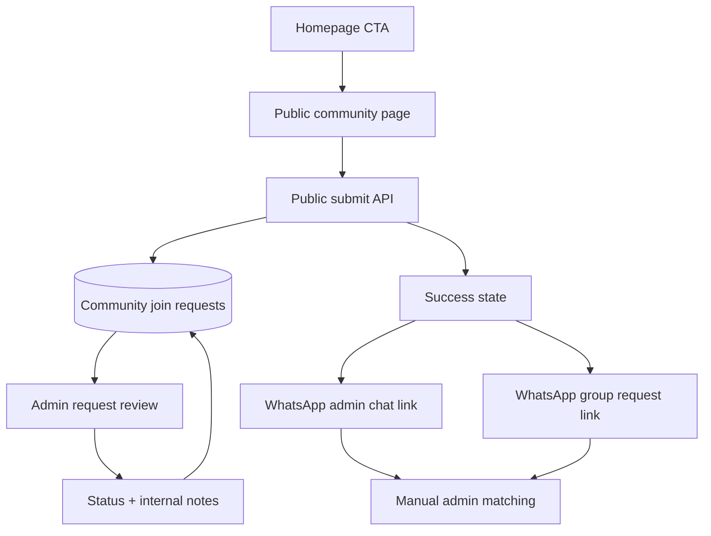

# feat: Add Umroh community join flow

## Summary

Add a public community join flow for the managed Umroh Mandiri WhatsApp group. The implementation stores a lightweight request, shows WhatsApp follow-through instructions, links homepage traffic to the dedicated page, and gives admins a review surface for manual matching.

---

## Problem Frame

The origin requirements define a low-friction public entry point for prospective community members while preserving admin review. Directly sending people to WhatsApp without any saved context makes matching and moderation noisy; forcing login would add too much friction for traffic from TikTok, Instagram, or WhatsApp links. This plan extends the existing Next App Router, Drizzle, admin content, and form patterns already used for stories, hotels, FAQ, and estimator flows.

---

## Requirements

**Public join experience**

- R1. A dedicated public community page is available from a shareable URL. (Origin R1)
- R2. The homepage links or routes interested users to the dedicated community page without embedding the full form. (Origin R2)
- R3. The form requires nama lengkap and nomor HP. (Origin R3, AE1)
- R4. The form accepts optional username sosial media and optional join intent. (Origin R4, R5, AE1)
- R5. Anonymous visitors can submit, and logged-in submitters can be associated with their user account when available. (Origin R6, R7)

**Post-submit WhatsApp guidance**

- R6. After successful submit, the user sees a success state confirming the request was recorded. (Origin R8, AE1)
- R7. The success state provides both the WhatsApp group request link and admin chat link. (Origin R9, AE2)
- R8. The success state instructs the user to use the same name and phone number on WhatsApp and sets admin-review expectations. (Origin R10, R11, AE2)

**Admin review**

- R9. Admins can view submitted community join requests with identity, optional context, submission date, status, and notes. (Origin R12, R13)
- R10. Admins can update status across baru, sudah dicocokkan, and ditolak. (Origin R14, AE4)
- R11. Admins can add and edit internal notes for matching context. (Origin R15, AE4)
- R12. The system flags possible duplicates from nomor HP and username sosial media without automatically rejecting requests. (Origin R16, R17, AE3)

**Origin actors:** A1 Prospective community member, A2 Admin, A3 Logged-in user

**Origin flows:** F1 Public community request, F2 WhatsApp follow-through, F3 Admin matching

**Origin acceptance examples:** AE1 minimal public submit, AE2 success state WhatsApp guidance, AE3 duplicate warning, AE4 admin status and note persistence

---

## Key Technical Decisions

- **Database-backed request model:** Community requests need admin review, status, notes, duplicate indicators, and user association, so they should be persisted like existing admin-managed content rather than handled as a purely client-side WhatsApp redirect.
- **Advisory duplicate detection:** The plan stores normalized phone and social identifiers for matching, but does not create unique constraints that block submission. This preserves the brainstorm decision that admin makes the final judgment.
- **Public submit API with optional auth context:** The submit path should accept anonymous visitors while reading the current session when present to attach a user ID. It must not use `requireAuth`.
- **WhatsApp links as configuration:** The group request link and admin chat target are operational values, not database content in v1. Planning them as configuration keeps the public flow simple while allowing deployment-specific links.
- **Admin review as inline list workflow:** The admin side should prioritize fast matching: list requests, see duplicate indicators, update status, and edit notes without requiring a full CRM or separate profile system.
- **Extend existing UI patterns:** The public page should follow existing public section styling, while admin pages should follow the FAQ/stories admin table and client form patterns.

---

## Scope Boundaries

- No automatic WhatsApp approval, WhatsApp bot verification, or webhook integration.
- No required consent checkbox in v1.
- No full join form on the homepage; homepage only links to the dedicated page.
- No CRM automation, segmentation, broadcast messaging, or community analytics.
- No hard duplicate rejection based on phone or social username.
- No bulk import/export for community join requests in v1.

### Deferred to Follow-Up Work

- Admin filters and search for high-volume request review.
- CSV export or import for community request management.
- Configurable WhatsApp links from the admin UI instead of deployment configuration.
- Rate limiting, captcha, or bot protection if public spam becomes a real issue.

---

## Context & Research

### Relevant Code and Patterns

- `lib/db/schema.ts` defines Drizzle tables, enums, foreign keys, inferred types, and content tables such as `pilgrimStories`, `hotelListings`, `faqGroups`, and `faqItems`.
- `drizzle/migrations/0008_add_activity_logs.sql` shows the current manual SQL migration style with indexes and foreign keys.
- `app/(public)/page.tsx`, `components/home/HeroSection.tsx`, and `components/home/SectionCards.tsx` are the homepage surfaces for the community CTA.
- `components/nav/NavBar.tsx`, `components/nav/MobileMenu.tsx`, and `components/nav/AdminDropdown.tsx` are navigation touchpoints if the community or admin request surfaces should be linked.
- `app/(admin)/admin/content/faqs/page.tsx` and `app/(admin)/admin/content/stories/page.tsx` show admin list pages with count summaries, status badges, action controls, and dark/gold styling.
- `components/admin/faqs/FaqForm.tsx` and `components/admin/stories/StoryForm.tsx` show client-side admin form submission, error display, `router.refresh`, and existing input styling.
- `app/api/admin/faqs/route.ts`, `app/api/admin/stories/route.ts`, and `app/api/admin/stories/[id]/route.ts` show admin-only API validation, CRUD, and `auth()` guard patterns.
- `components/nav/__tests__/NavBar.test.tsx`, `lib/db/__tests__/schema.test.ts`, and route tests under `app/api/admin/*/__tests__` show current test style.

### External Research

Not used. The feature follows established local Next.js, Drizzle, admin CRUD, and form patterns. WhatsApp itself is only linked externally in v1; no WhatsApp API contract is planned.

---

## High-Level Technical Design

The public side records the request before exposing WhatsApp next steps. Admin then uses the saved request list as the source of truth while manually matching incoming WhatsApp requests or chats.

---

## Implementation Units

### U1. Community Request Data Model and Migration

**Goal:** Add persistent storage for community join requests, status, normalized matching fields, optional user association, and admin notes.

**Requirements:** R5, R9, R10, R11, R12

**Dependencies:** None

**Files:**
- Modify: `lib/db/schema.ts`
- Modify: `lib/db/__tests__/schema.test.ts`
- Create: `drizzle/migrations/0009_add_community_join_requests.sql`
- Modify: `drizzle/migrations/meta/_journal.json`
- Create or update the matching Drizzle migration snapshot under `drizzle/migrations/meta/`

**Approach:**
- Add a request table with required full name and phone fields, optional social username and intent, nullable `userId`, status, admin note, timestamps, and normalized phone/social fields used for advisory duplicate detection.
- Add a status enum or constrained text representation for `NEW`, `MATCHED`, and `REJECTED`, mapped in UI to baru, sudah dicocokkan, and ditolak.
- Add indexes for normalized phone, normalized social username, status, and created date to support review and duplicate checks.
- Do not add unique constraints for phone or social username; duplicate handling is advisory by requirement.
- Use nullable `userId` with set-null behavior so deleting a user does not delete community request history.

**Execution note:** Start with schema test coverage for the new table and expected columns before wiring APIs.

**Patterns to follow:**
- `lib/db/schema.ts` table definitions and inferred type exports
- `lib/db/__tests__/schema.test.ts` column existence checks
- `drizzle/migrations/0008_add_activity_logs.sql` migration style

**Test scenarios:**
- Happy path: schema exports include request ID, user association, full name, phone, normalized phone, social username, normalized social username, intent, status, admin note, and timestamps.
- Happy path: inferred select/insert types exist for community join requests.
- Edge case: nullable user association is represented so anonymous requests can exist.
- Integration: migration creates indexes for duplicate lookup and admin review ordering.

**Verification:**
- Data model supports all public submit, admin review, duplicate flag, and optional login association requirements.

### U2. Public Submit Contract and Validation Helpers

**Goal:** Add shared validation/normalization and a public API route that stores join requests for anonymous or logged-in users.

**Requirements:** R3, R4, R5, R6, R12

**Dependencies:** U1

**Files:**
- Create: `lib/community/join-request.ts`
- Create: `lib/community/__tests__/join-request.test.ts`
- Create: `app/api/community/join/route.ts`
- Create: `app/api/community/__tests__/join-route.test.ts`

**Approach:**
- Centralize validation for required full name and phone, optional social username, and optional intent so public UI and API behavior stay aligned.
- Normalize phone numbers and social usernames for matching while preserving the user-entered display values.
- Accept anonymous submissions, but call `auth()` opportunistically and store `userId` when a logged-in session exists.
- Return the saved request or enough success metadata for the UI to render the success state. Do not return other matching records to public users.
- Detect possible duplicates server-side for internal/admin use, but never reject valid requests solely because a duplicate candidate exists.

**Execution note:** Implement validation and normalization test-first before adding the route.

**Patterns to follow:**
- `app/api/estimate/parse/route.ts` for JSON parsing and input validation style
- `app/api/admin/faqs/route.ts` for small route-local validation responses
- `app/api/estimate/__tests__/parse-route.test.ts` for route mocking style

**Test scenarios:**
- Covers AE1. Happy path: anonymous visitor submits full name and phone with blank optional fields, route returns success and inserts a request.
- Happy path: logged-in visitor submits the same payload and the inserted row includes `userId`.
- Edge case: extra spaces around name, phone, and social username are trimmed/preserved appropriately while normalized fields are stored for matching.
- Error path: missing or blank full name returns a validation error without writing.
- Error path: missing or blank phone returns a validation error without writing.
- Edge case: optional intent can be omitted or blank without failing.
- Integration: a duplicate phone or social username candidate does not block insert.

**Verification:**
- Public request creation works for anonymous and logged-in users, with safe validation and no auth requirement.

### U3. Public Community Page and Success State

**Goal:** Build the dedicated community page with a human-friendly form, success state, and WhatsApp follow-through links.

**Requirements:** R1, R3, R4, R5, R6, R7, R8

**Dependencies:** U2

**Files:**
- Create: `app/(public)/komunitas/page.tsx`
- Create: `components/community/CommunityJoinForm.tsx`
- Create: `components/community/__tests__/CommunityJoinForm.test.tsx`

**Approach:**
- Create a public page focused on joining the Umroh Mandiri community, with concise copy explaining admin review and manual matching.
- Build a client form using the existing dark/gold visual language and stable responsive dimensions.
- After successful submit, replace the form or move to a success panel that confirms data was recorded.
- Show both WhatsApp group request and admin chat actions from configuration, with clear instruction to use the same name and phone number as the form.
- If links are missing in configuration, keep the success state useful by explaining that admin will follow up or by hiding only the unavailable action with a clear non-broken fallback.

**Execution note:** Add component tests for submit and success-state behavior before polishing copy/styling.

**Patterns to follow:**
- `components/admin/faqs/FaqForm.tsx` and `components/admin/stories/StoryForm.tsx` for client form state, pending state, and error handling
- `components/home/HeroSection.tsx` for simple public hero copy
- `components/ui/button.tsx`, `components/ui/card.tsx`, and existing CSS variables

**Test scenarios:**
- Covers AE1. Happy path: user enters full name and phone, leaves optional fields blank, submits, and sees success confirmation.
- Covers AE2. Happy path: success state renders both WhatsApp actions when both links are configured.
- Covers AE2. Happy path: success state includes instruction to use the same name and phone number on WhatsApp.
- Edge case: optional social username and intent are included in the submitted payload when provided.
- Error path: API validation error is shown inline without losing entered form values.
- Error path: network failure shows a friendly retryable error.
- Edge case: missing WhatsApp configuration does not crash the page.

**Verification:**
- A public visitor can complete the join request and understand the next WhatsApp steps without logging in.

### U4. Homepage and Navigation Entry Points

**Goal:** Route users from existing public surfaces to the dedicated community page without moving the form onto the homepage.

**Requirements:** R2

**Dependencies:** U3

**Files:**
- Modify: `components/home/HeroSection.tsx`
- Modify: `components/home/SectionCards.tsx`
- Modify: `components/nav/NavBar.tsx`
- Modify: `components/nav/MobileMenu.tsx`
- Modify: `components/nav/__tests__/NavBar.test.tsx`

**Approach:**
- Add a homepage CTA that points to the community page while preserving existing estimator/admin behavior.
- Add a section card or equivalent homepage affordance if it improves discoverability without overcrowding the first viewport.
- Add a public navigation link if it fits the existing nav density; include mobile navigation parity if added on desktop.
- Keep the full join form only on the dedicated page.

**Patterns to follow:**
- Existing homepage `Link` + `Button` usage in `components/home/HeroSection.tsx`
- Existing section-card structure in `components/home/SectionCards.tsx`
- Desktop/mobile nav parity in `components/nav/NavBar.tsx` and `components/nav/MobileMenu.tsx`

**Test scenarios:**
- Happy path: homepage renders a link to the community page.
- Happy path: public nav, when updated, exposes the community link for unauthenticated users.
- Edge case: mobile menu includes the community link when desktop nav includes it.
- Regression: existing Panduan, Cerita Jamaah, Hotel Nusuk, FAQ, Dashboard, and admin nav links remain available as before.

**Verification:**
- Users can discover the community page from the homepage, and navigation changes do not regress existing links.

### U5. Admin Request Review API

**Goal:** Add admin-only APIs to list requests, update status, and edit internal notes.

**Requirements:** R9, R10, R11, R12

**Dependencies:** U1

**Files:**
- Create: `app/api/admin/community-requests/route.ts`
- Create: `app/api/admin/community-requests/[id]/route.ts`
- Create: `app/api/admin/community-requests/__tests__/route.test.ts`

**Approach:**
- Add admin-only list endpoint ordered by newest first, with enough fields for the admin table and duplicate indicators.
- Add admin-only update endpoint for status and admin note.
- Validate status values and reject non-admin requests using the existing `auth()` guard pattern.
- Compute or return duplicate signals using normalized phone/social fields without exposing duplicate details to public users.
- Keep delete out of v1 unless implementation discovers the admin table needs it for local consistency; status `REJECTED` covers the review workflow.

**Execution note:** Add route tests before UI work so the admin component can rely on a stable contract.

**Patterns to follow:**
- `app/api/admin/faqs/route.ts` and `app/api/admin/stories/[id]/route.ts` for admin guards and validation
- `app/api/admin/stories/__tests__/route.test.ts` for route test mocking style

**Test scenarios:**
- Happy path: admin list returns requests ordered newest first with review fields.
- Happy path: admin updates status from baru to sudah dicocokkan.
- Happy path: admin updates internal note without changing other fields.
- Covers AE3. Integration: request with matching normalized phone or social username is marked as possible duplicate.
- Covers AE4. Integration: updated status and note are returned and persisted.
- Error path: unauthenticated request returns unauthorized.
- Error path: non-admin request returns forbidden.
- Error path: invalid status is rejected without writing.
- Error path: unknown request ID returns not found.

**Verification:**
- Admin API supports the full manual review workflow with proper authorization and validation.

### U6. Admin Community Request Review UI

**Goal:** Add the admin page for reviewing community join requests, duplicate flags, status changes, and notes.

**Requirements:** R9, R10, R11, R12

**Dependencies:** U5

**Files:**
- Create: `app/(admin)/admin/community-requests/page.tsx`
- Create: `components/admin/community-requests/CommunityRequestActions.tsx`
- Create: `components/admin/community-requests/__tests__/CommunityRequestActions.test.tsx`
- Modify: `components/nav/AdminDropdown.tsx`
- Modify: `components/nav/MobileMenu.tsx`

**Approach:**
- Build a server-rendered admin list page that loads request rows and summarizes counts by status.
- Display full name, phone, optional social username, optional intent, created date, status badge, duplicate flag, and internal note summary.
- Provide inline actions or a compact editing component for status and admin note, using the existing client-action pattern from stories/FAQ admin.
- Add the admin page to desktop and mobile admin navigation.
- Keep the review UI focused on matching; avoid adding broad CRM features.

**Patterns to follow:**
- `app/(admin)/admin/content/faqs/page.tsx` for admin table structure and count summary
- `app/(admin)/admin/content/stories/StoriesTableActions.tsx` and `app/(admin)/admin/content/faqs/FaqTableActions.tsx` for client-side admin row actions
- `components/ui/badge.tsx` for status display

**Test scenarios:**
- Happy path: admin row actions render current status and note controls.
- Happy path: changing status sends the expected update and refreshes state.
- Happy path: editing note sends the expected update and shows the updated value.
- Covers AE3. Happy path: possible duplicate state is visibly flagged without disabling admin actions.
- Error path: failed update shows a local error and does not pretend the action succeeded.
- Regression: admin navigation includes the new review page alongside existing pricing/users/content links.

**Verification:**
- Admins can review, match, reject, and annotate community join requests from the admin panel.

### U7. End-to-End Coverage and Documentation Touches

**Goal:** Close integration gaps across public submit, success guidance, admin review, and configuration assumptions.

**Requirements:** R1, R2, R3, R4, R5, R6, R7, R8, R9, R10, R11, R12

**Dependencies:** U1, U2, U3, U4, U5, U6

**Files:**
- Modify: `.env.example`
- Modify: `docs/FEATURES.md`
- Modify or create relevant integration tests under `app/api/community/__tests__/` and `components/community/__tests__/`

**Approach:**
- Document the WhatsApp configuration values required for the success state.
- Add feature documentation that describes the public join page and admin review behavior at a high level.
- Ensure tests cover the cross-layer path from public form submit to admin-visible review data at the route/component level available in the current test setup.
- Verify the public copy remains clear that WhatsApp group approval is still admin-reviewed.

**Patterns to follow:**
- Existing `.env.example` style for environment placeholders
- `docs/FEATURES.md` feature inventory format
- Existing route/component test conventions

**Test scenarios:**
- Covers F1 and F2. Integration: a valid public submit creates data sufficient for success guidance and admin matching.
- Covers F3 and AE4. Integration: admin can update review state after a public request exists.
- Regression: missing optional social username and intent do not break admin display.
- Regression: public success copy includes matching-name/phone guidance.
- Documentation: configuration placeholders are documented clearly enough for deployment setup.

**Verification:**
- The feature is discoverable, configurable, tested across its main flow, and documented for future maintainers.

---

## Risks & Dependencies

- **WhatsApp links must be supplied before launch.** Without configured group/admin links, the success page cannot fully satisfy the follow-through requirements. The implementation should degrade gracefully but deployment should provide real values.
- **Public form spam is possible.** The brainstorm intentionally kept v1 lightweight. If spam appears, add rate limiting or bot protection as follow-up work.
- **Phone normalization can be imperfect.** The duplicate flag is advisory, so normalization mistakes should not block users. Admin remains final reviewer.
- **Migration metadata needs care.** The current repo uses Drizzle migration metadata, and the implementer should verify the next migration index and snapshot state before finalizing the migration files.
- **Admin nav density is already high.** Adding another admin item should preserve desktop and mobile usability.

---

## Documentation / Operational Notes

- Add WhatsApp group request and admin chat configuration placeholders to `.env.example`.
- Update `docs/FEATURES.md` with the public community join and admin review capabilities after implementation.
- Production deployment should verify both WhatsApp links before promoting the page from soft launch to active CTA placement.

---

## Open Questions

### Deferred to Implementation

- Exact configuration key names for WhatsApp group and admin chat links.
- Exact phone normalization rules for Indonesian and international formats.
- Whether admin status/note editing is best as inline controls or a compact modal once the table layout is built.
- Whether the community page should also appear in top navigation, or only homepage plus direct URL, if nav spacing becomes tight during implementation.
