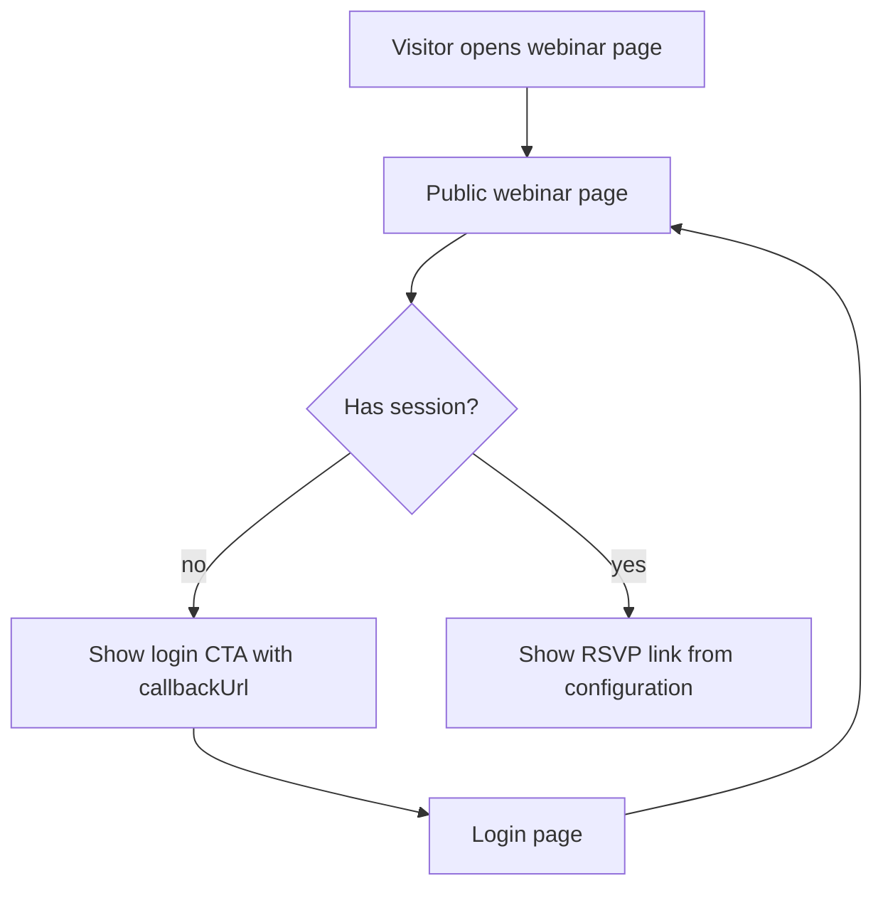

# feat: Add webinar RSVP gated link page

## Summary

Add a public-facing webinar page for the Umroh Mandiri webinar on Ahad, 14 Juni 2026. The page can be opened by anyone, but the actual RSVP link is visible only to logged-in users.

---

## Problem Frame

The product needs a shareable page for a dated webinar campaign without exposing the RSVP destination to anonymous visitors. Anonymous visitors should understand the event and be guided to the existing login flow first; registered users should see the RSVP action immediately after authentication.

---

## Requirements

- R1. The system provides a dedicated page for the Umroh Mandiri webinar on Ahad, 14 Juni 2026.
- R2. The page is reachable by public visitors without requiring login.
- R3. The RSVP URL is not rendered for anonymous visitors.
- R4. Logged-in users can see and open the RSVP URL from the webinar page.
- R5. Anonymous visitors see a clear login CTA that returns them to the webinar page after authentication.
- R6. The RSVP URL is configurable outside source code so admin or deployment operators can update the destination without editing the page.
- R7. Homepage and navigation surfaces can route users to the webinar page without bypassing the login gate for the RSVP link.

---

## Key Technical Decisions

- **Gate the link, not the page:** The webinar page should live under the public route group so campaign links work for all visitors. Server-side `auth()` decides which CTA to render.
- **Use server-side configuration for the RSVP URL:** Store the destination in a server-only environment variable such as `WEBINAR_RSVP_URL`. The page should render the URL only after `auth()` confirms a session.
- **Preserve callback flow:** Anonymous CTA links should point to `/login?callbackUrl=/webinar-umroh-mandiri` so a user who signs in lands back on the webinar page.
- **Keep this as content plus auth behavior:** No database table, RSVP tracking table, or admin CRUD is needed for this request.

---

## Scope Boundaries

- No RSVP form is built inside the app.
- No webinar attendance tracking, reminder email, payment, calendar invite, or CRM integration is included.
- No admin editor for webinar content is included; event copy and date can be code/config in this iteration.
- No role restriction beyond "logged in"; regular registered users and admins see the same RSVP link.

### Deferred to Follow-Up Work

- Admin-managed webinar/event pages if multiple events need to be published.
- RSVP click logging or conversion tracking if campaign performance needs to be measured.
- Calendar file generation or WhatsApp reminder automation.

---

## High-Level Technical Design

---

## Implementation Units

### U1. Public Webinar Page and RSVP Gate

- **Goal:** Create the webinar page and render different CTA states for anonymous and logged-in visitors.
- **Requirements:** R1, R2, R3, R4, R5, R6
- **Dependencies:** None
- **Files:**
  - Create: `app/(public)/webinar-umroh-mandiri/page.tsx`
  - Create: `app/(public)/webinar-umroh-mandiri/__tests__/page.test.tsx`
  - Modify: `.env.example`
- **Approach:** Use a server component that calls `auth()` and receives the RSVP URL from server-side environment configuration. Render event content for all visitors. Render the RSVP anchor only when a session exists and the RSVP URL is configured. Render login guidance for anonymous visitors, using a callback URL back to the webinar route.
- **Patterns to follow:** `app/(public)/komunitas/page.tsx` for public page layout and copy tone; `app/(public)/page.tsx` for `auth()` usage in a public server component; `.env.example` for documented deployment configuration.
- **Test scenarios:**
  - Happy path: with a logged-in session and RSVP URL configured, the page renders the webinar date and an RSVP link with the configured `href`.
  - Edge case: without a session, the page renders event details and login CTA, but no RSVP URL appears in the rendered output.
  - Edge case: with a logged-in session but missing RSVP URL, the page renders a soft unavailable message instead of a broken anchor.
  - Integration: login CTA includes `callbackUrl=/webinar-umroh-mandiri`.
- **Verification:** Public visitors can open the page, anonymous visitors cannot inspect the RSVP link from the HTML, and registered users see the RSVP action.

### U2. Route Accessibility and Navigation Entry Points

- **Goal:** Make the webinar route discoverable while preserving the public page and gated-link behavior.
- **Requirements:** R2, R7
- **Dependencies:** U1
- **Files:**
  - Modify: `middleware.ts`
  - Modify: `middleware.test.ts`
  - Modify: `components/nav/NavBar.tsx`
  - Modify: `components/nav/MobileMenu.tsx`
  - Modify: `components/nav/__tests__/NavBar.test.tsx`
  - Modify: `components/home/HeroSection.tsx` or `components/home/SectionCards.tsx`
- **Approach:** Add the webinar path to public route matching so unauthenticated visitors are not redirected before seeing the gated page. Add a clear "Webinar" entry point in navigation or homepage cards, following existing responsive nav patterns. Keep the link pointing to the page, not directly to the RSVP destination.
- **Patterns to follow:** `middleware.ts` `isPublicPath`; `middleware.test.ts` public/protected route assertions; `components/nav/NavBar.tsx` and `components/nav/MobileMenu.tsx` public link patterns; `components/home/SectionCards.tsx` card entry pattern.
- **Test scenarios:**
  - Happy path: `isPublicPath("/webinar-umroh-mandiri")` returns true.
  - Regression: `/dashboard` and `/admin/*` remain protected.
  - Happy path: public navigation renders a link to `/webinar-umroh-mandiri`.
  - Edge case: the navigation link never uses the external RSVP URL.
- **Verification:** Visitors can reach the webinar page from public surfaces, and middleware does not redirect anonymous users away from the page.

### U3. Documentation and Campaign Configuration Notes

- **Goal:** Document the feature and required RSVP configuration for deployment.
- **Requirements:** R6, R7
- **Dependencies:** U1, U2
- **Files:**
  - Modify: `docs/FEATURES.md`
  - Modify: `.env.example`
- **Approach:** Add a short feature entry explaining that the webinar page is public while the RSVP link is visible only to registered users. Document the RSVP URL environment variable and the behavior when it is absent.
- **Patterns to follow:** Existing `docs/FEATURES.md` sections for public pages and route behavior; existing `.env.example` comments for public configuration values.
- **Test scenarios:** Test expectation: none -- documentation and env sample changes are covered by U1/U2 behavioral tests.
- **Verification:** A deployer can identify the required environment variable before publishing the page.

---

## Acceptance Examples

- AE1. Given an anonymous visitor opens `/webinar-umroh-mandiri`, when the page renders, then the visitor sees webinar details and a login CTA but no RSVP link.
- AE2. Given a logged-in user opens `/webinar-umroh-mandiri`, when the RSVP URL is configured, then the user sees a visible RSVP button that opens the configured URL.
- AE3. Given a logged-in user opens the page while the RSVP URL is missing, when the page renders, then no broken external link is shown.

---

## Risks & Dependencies

- The RSVP URL must be configured before launch; otherwise logged-in users will see an unavailable state.
- The current login flow must preserve `callbackUrl` for a smooth return to the webinar page.
- If the RSVP provider URL contains private tokens, implementation should prefer a server-only env variable and only render it after authentication.

---

## Sources & Research

- `app/(public)/komunitas/page.tsx` shows the public campaign-like page style and Bahasa Indonesia copy tone.
- `app/(public)/page.tsx` shows server-side `auth()` usage in the public route group.
- `middleware.ts` and `middleware.test.ts` define the public route whitelist that must include the webinar page.
- `components/nav/NavBar.tsx`, `components/nav/MobileMenu.tsx`, and `components/home/SectionCards.tsx` define public entry-point patterns.
