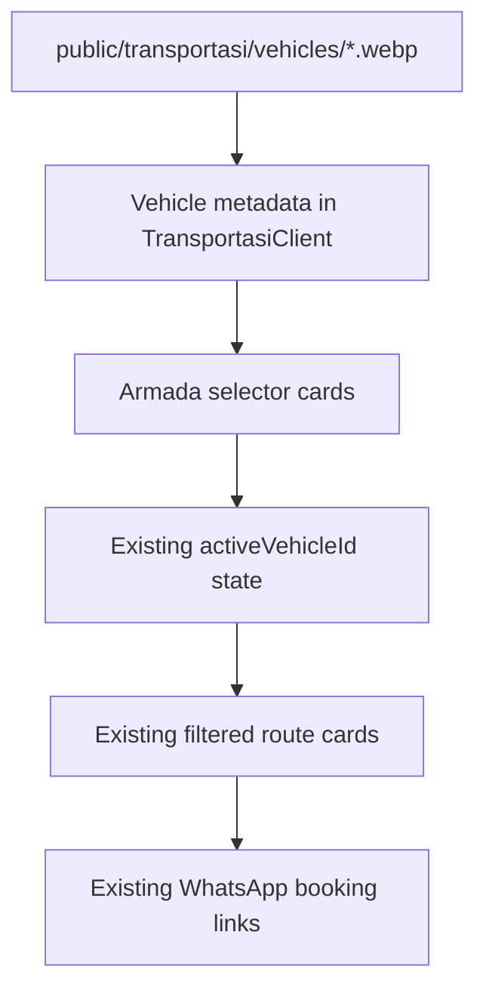

# feat: Add vehicle images to transportasi armada cards

## Summary

Add lightweight, locally served vehicle images to the `/transportasi` armada selector so users can visually distinguish Sedan, 7 Seater Minivan, 12 Seater HiAce, and GMC Yukon before choosing a route.

---

## Problem Frame

The transportasi page currently presents each armada type as a text-and-icon card. The pricing flow works, but users cannot visually confirm what kind of vehicle they are selecting. Vehicle images should make the page easier to scan while preserving the current search, tab selection, pricing, and WhatsApp booking behavior.

---

## Requirements

- R1. The `/transportasi` page shows a representative image for each vehicle type in the armada selector.
- R2. Vehicle images are stored under `public` in a lightweight browser-friendly format.
- R3. Images have descriptive alt text and stable dimensions to avoid layout shift.
- R4. The existing active armada selection, route filtering, price calculation, and WhatsApp CTA behavior remain unchanged.
- R5. The page remains usable and visually balanced on mobile and desktop.
- R6. Asset filenames and metadata are centralized so future vehicle types can add images without duplicating path strings in JSX.

---

## Key Technical Decisions

- **Use local static assets:** Store vehicle images in `public/transportasi/vehicles/` and reference them with root-relative paths such as `/transportasi/vehicles/sedan.webp`. This avoids remote image failures and keeps deployment simple.
- **Use WebP as the first lightweight format:** WebP is widely supported and much smaller than PNG/JPEG for this use case. AVIF can be considered later, but WebP is the lower-risk default for broad compatibility.
- **Attach image metadata to vehicle definitions:** Add `imageSrc`, `imageAlt`, and fixed dimensions/aspect metadata to each `Vehicle` entry in `TransportasiClient.tsx` so rendering stays data-driven.
- **Render images in the selector cards only:** The route price cards repeat per route, so adding vehicle images there would create noise. The armada selector is the right place because the user chooses the vehicle once, then scans routes.
- **Use owned, licensed, or generated assets only:** Do not copy random web images into the repo. Implementation should use user-provided photos, licensed product images, or generated/created neutral vehicle images.

---

## Scope Boundaries

- No database or admin upload UI for vehicle images.
- No changes to transport pricing, route data, exchange-rate behavior, or WhatsApp message content.
- No carousel, gallery, zoom view, or image lightbox.
- No remote image hosting or CMS integration.

### Deferred to Follow-Up Work

- Admin-managed vehicle catalog with editable image uploads.
- Multiple images per vehicle type.
- AVIF plus WebP `<picture>` sources if a formal image pipeline is added.
- Real fleet-photo management if SSU wants exact unit-level images instead of representative type images.

---

## High-Level Technical Design

---

## Implementation Units

### U1. Add Optimized Vehicle Assets

- **Goal:** Add lightweight static image files for each armada type.
- **Requirements:** R1, R2, R3, R5
- **Dependencies:** None
- **Files:**
  - Create: `public/transportasi/vehicles/sedan.webp`
  - Create: `public/transportasi/vehicles/7-seater-minivan.webp`
  - Create: `public/transportasi/vehicles/hiace-12-seater.webp`
  - Create: `public/transportasi/vehicles/gmc-yukon.webp`
- **Approach:** Source four owned/licensed/generated vehicle images, crop them consistently, and export as WebP. Target a consistent landscape aspect ratio such as 16:9 or 4:3, with each file small enough for fast mobile loading.
- **Patterns to follow:** Current static asset usage in `components/nav/NavBar.tsx`, `components/nav/MobileMenu.tsx`, and `app/(auth)/login/page.tsx` references files from `public` using root-relative paths.
- **Test scenarios:** Test expectation: none for binary image files.
- **Verification:** Confirm all four files exist, render locally, use WebP format, and are not oversized for small selector cards.

### U2. Extend Armada Data and Render Images

- **Goal:** Add image metadata to each vehicle and display the image inside the armada selector cards.
- **Requirements:** R1, R3, R4, R5, R6
- **Dependencies:** U1
- **Files:**
  - Modify: `app/(public)/transportasi/TransportasiClient.tsx`
- **Approach:** Extend the `Vehicle` interface with `imageSrc` and `imageAlt`. Add those fields to all four vehicles. In the vehicle selection tab button, render a fixed-aspect image area above or beside the existing icon/name/specs, using `object-cover`, rounded corners, and stable dimensions. Keep active-state border and top highlight behavior intact.
- **Patterns to follow:** Existing selector card classes in `TransportasiClient.tsx`, existing color tokens such as `var(--color-border)`, `var(--color-surface)`, and current mobile grid behavior (`grid-cols-2 md:grid-cols-4`).
- **Test scenarios:**
  - Happy path: the selector renders four vehicle images with meaningful accessible names.
  - Regression: clicking a vehicle tab still updates the capacity panel and route list.
  - Regression: WhatsApp links still use the selected vehicle name and selected route.
- **Verification:** Images appear in the selector without changing existing route calculations or CTA output.

### U3. Add Focused Regression Test

- **Goal:** Lock in the new image rendering while protecting existing tab behavior.
- **Requirements:** R1, R3, R4, R6
- **Dependencies:** U2
- **Files:**
  - Create: `app/(public)/transportasi/__tests__/TransportasiClient.test.tsx`
- **Approach:** Use the existing Vitest and Testing Library setup. Render `TransportasiClient`, assert all vehicle images are present by alt text, click another armada tab, and assert the selected capacity panel changes accordingly.
- **Patterns to follow:** Component tests under `components/**/__tests__/*.test.tsx`, especially their `@testing-library/react` and `vitest` imports.
- **Test scenarios:**
  - Happy path: all four image alt texts are visible.
  - Happy path: clicking `12 Seater (HiAce)` changes the capacity copy to `Kapasitas 12 Seater (HiAce)`.
  - Regression: the WhatsApp CTA remains present after tab changes.
- **Verification:** Run the focused test file with Vitest.

### U4. Responsive Visual QA

- **Goal:** Verify the image cards look clean in the actual page, not only in unit tests.
- **Requirements:** R3, R5
- **Dependencies:** U1, U2, U3
- **Files:** None expected.
- **Approach:** Start the local dev server, open `/transportasi`, and check desktop and mobile widths. Confirm the image crop does not hide the vehicle too aggressively, text does not overlap, and the selected-card border/top bar still reads clearly.
- **Patterns to follow:** Existing page spacing and dark green/gold visual language in `TransportasiClient.tsx`.
- **Test scenarios:** Test expectation: manual browser QA.
- **Verification:** Capture or inspect `/transportasi` at desktop and mobile widths; run `git diff --check`.

---

## Acceptance Examples

- AE1. Given a visitor opens `/transportasi`, when the armada selector renders, then each of Sedan, 7 Seater Minivan, 12 Seater HiAce, and GMC Yukon shows a matching vehicle image.
- AE2. Given a visitor taps `12 Seater (HiAce)`, when the selector updates, then the capacity panel and route cards still reflect the HiAce selection.
- AE3. Given the page is viewed on mobile, when the selector appears in a two-column grid, then vehicle images stay inside their cards and do not overlap the vehicle name or capacity text.

---

## Risks & Dependencies

- Asset licensing matters. Implementation should use owned, licensed, or generated images only.
- Real vehicle photos may have inconsistent angles/backgrounds; crop and color treatment should be normalized before saving.
- Adding images increases page weight. Each image should be optimized and sized for selector-card display, not uploaded as a full-resolution original.
- If using `next/image`, test setup may need a small mock or root-relative path assertion. A plain `img` can be sufficient here because these are small static assets.

---

## Sources & Research

- `app/(public)/transportasi/TransportasiClient.tsx` contains the current vehicle data, selector cards, route filtering, price calculation, and WhatsApp CTA behavior.
- `app/(public)/transportasi/page.tsx` defines the page metadata and confirms the client component is the main implementation surface.
- `components/nav/NavBar.tsx`, `components/nav/MobileMenu.tsx`, and `app/(auth)/login/page.tsx` show existing root-relative usage of `public/logo.png`.
- `public/` currently contains only logo/PDF assets, so this feature needs a new `public/transportasi/vehicles/` asset folder.
- Existing tests under `components/**/__tests__/*.test.tsx` establish the Vitest and Testing Library pattern for focused component regression tests.
