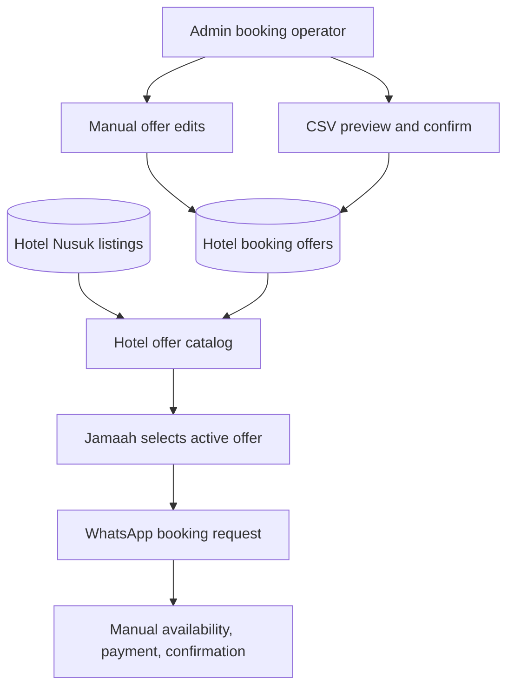

# feat: Add manual hotel booking catalog

## Summary

Add bookable hotel offers to the Hotel Nusuk journey so jamaah can browse current periods and prices, then continue the booking request through WhatsApp. The plan introduces a separate offer source of truth, admin maintenance with manual and CSV workflows, public catalog presentation, and request handoff copy that avoids implying guaranteed live inventory.

---

## Problem Frame

The current Hotel Nusuk page recommends hotels and shows estimator-oriented pricing, while the visa flow already tells jamaah to consult before buying. Some hotels are not available through OTA apps and require manual hotel contact, so the product needs an OTA-like browsing surface backed by the team's local Makkah/Madinah booking process rather than a full checkout system.

---

## Requirements

**Public catalog**
- R1. Show active hotel offers with hotel, city, period, price, and enough comparison context for jamaah to choose one.
- R2. Keep general hotel recommendations visible without presenting inactive hotels as bookable.
- R3. Make final availability, payment, and confirmation status clear before the WhatsApp handoff.

**Booking request handoff**
- R4. Let jamaah start a booking request from a specific active offer.
- R5. Include selected offer context in the WhatsApp message so admin can continue the process manually.

**Admin maintenance**
- R6. Let admins add, edit, disable, and mark hotel offers unavailable.
- R7. Let admins bulk refresh hotel offers through CSV preview and confirm.
- R8. Keep manual edits and CSV imports consistent when both update the same offer identity.

**Scope preservation**
- R9. Do not collect payment, issue confirmation, handle cancellation/refund, or integrate hotel inventory APIs in v1.
- R10. Keep booking offers separate from estimator monthly pricing and Hotel Nusuk listing content.

---

## Key Technical Decisions

- **Create dedicated hotel offer records:** Booking periods and request availability are not the same concept as estimator monthly pricing, so the plan should not overload `hotel_prices` or `hotel_monthly_prices`.
- **Link offers to Hotel Nusuk listings when possible:** The public catalog should reuse listing context, but offers must still carry their own period, price, request status, and terms.
- **Use an admin preview-confirm import flow:** Existing hotel, airline, FAQ, and story imports already validate before writing; bookable offers should follow that pattern.
- **Use a conservative offer identity:** The import match key should represent hotel, city, period, room basis, and offer label/variant enough to update intended offers without treating price changes as new offers.
- **WhatsApp is the request system for v1:** The app should generate a structured message and avoid introducing an in-app request lifecycle until admin tracking becomes a product requirement.
- **Treat offer text as untrusted input:** Admin-entered and imported hotel names, notes, terms, and prices should be validated for shape and rendered as text so public pages and WhatsApp URLs do not become injection or data-leak surfaces.

---

## High-Level Technical Design

---

## Implementation Units

### U1. Booking offer data model

**Goal:** Add persistent hotel booking offers that are distinct from estimator pricing and listing content.

**Requirements:** R1, R2, R6, R8, R10

**Dependencies:** None

**Files:**
- Modify: `lib/db/schema.ts`
- Create: `drizzle/migrations/<next>_add_hotel_booking_offers.sql`
- Create: `lib/admin/hotel-booking-offer-import.ts`
- Test: `lib/admin/__tests__/hotel-booking-offer-import.test.ts`

**Approach:** Add a booking-offer table with city, hotel/listing reference where available, display hotel name, period dates or period label, room or occupancy basis, currency/price, active/unavailable state, notes/terms, import key, and timestamps. Keep it independent from estimator pricing so budget calculations and offer availability do not affect each other. Normalize imported text, reject invalid numeric/date fields, and avoid storing user-submitted jamaah contact details in offer records.

**Patterns to follow:** `lib/db/schema.ts` CUID/timestamp conventions, `hotelListings` for public hotel metadata, and `hotel-pricing-import.ts` for import-key normalization style.

**Test scenarios:**
- Happy path: a valid CSV row parses into a booking offer with hotel name, city, period, price, status, and match key.
- Edge case: blank optional terms or notes parse without blocking the offer.
- Edge case: changing price for the same offer identity classifies as an update, not a new offer.
- Error path: invalid city, missing hotel name, missing period, or non-positive price returns row-level errors.
- Error path: duplicate offer identities in one CSV are classified as conflicts.
- Error path: unexpected HTML/script-like content is treated as plain text or rejected according to the parser's validation rules.

**Verification:** Offer parsing is testable without a database, and schema changes do not touch estimator pricing or Hotel Nusuk listing behavior.

### U2. Admin offer CRUD and CSV import

**Goal:** Give admins both small-edit and bulk-refresh workflows for bookable hotel offers.

**Requirements:** R6, R7, R8

**Dependencies:** U1

**Files:**
- Create: `app/api/admin/hotel-offers/route.ts`
- Create: `app/api/admin/hotel-offers/[id]/route.ts`
- Create: `app/api/admin/hotel-offers/import/preview/route.ts`
- Create: `app/api/admin/hotel-offers/import/confirm/route.ts`
- Create: `app/api/admin/hotel-offers/import/template/route.ts`
- Create: `app/api/admin/hotel-offers/__tests__/route.test.ts`
- Create: `app/api/admin/hotel-offers/__tests__/import-route.test.ts`
- Create: `app/(admin)/admin/content/hotel-offers/page.tsx`
- Create: `app/(admin)/admin/content/hotel-offers/new/page.tsx`
- Create: `app/(admin)/admin/content/hotel-offers/[id]/edit/page.tsx`
- Create: `components/admin/hotel-offers/HotelOfferForm.tsx`
- Create: `components/admin/hotel-offers/HotelOfferImportPanel.tsx`
- Test: `components/admin/hotel-offers/__tests__/HotelOfferForm.test.tsx`
- Test: `components/admin/hotel-offers/__tests__/HotelOfferImportPanel.test.tsx`

**Approach:** Mirror existing admin content and import patterns: admin-only API guards, validation in routes and parser, preview before write, confirm that re-parses current CSV, and UI forms that surface validation errors. Admins should be able to mark an offer inactive/unavailable without deleting historical context from the list. Route validation should enforce field bounds for dates, prices, currency, status, and text lengths before writes.

**Patterns to follow:** Admin auth behavior in `app/api/admin/hotels/route.ts`, import panel behavior in `components/admin/faqs/FaqImportPanel.tsx`, and preview/confirm trust model in `app/api/admin/pricing/hotel-import/*`.

**Test scenarios:**
- Happy path: admin creates an offer manually and sees it in the admin list.
- Happy path: admin updates period, price, notes, and status for an existing offer.
- Happy path: preview import summarizes create, update, invalid, and conflict rows without writing.
- Happy path: confirm import creates new offers and updates matching offers.
- Edge case: inactive/unavailable offers remain editable but are not public-bookable.
- Error path: unauthenticated and non-admin requests cannot mutate offers.
- Error path: confirm refuses conflict rows and writes only valid eligible rows.
- Error path: oversized notes, invalid dates, unsupported currency, or malformed prices are rejected before persistence.

**Verification:** Admin workflows can refresh many offers without deployment, and import behavior stays consistent with manual edits.

### U3. Public hotel offer catalog

**Goal:** Extend Hotel Nusuk into an offer browsing surface while preserving non-bookable recommendations.

**Requirements:** R1, R2, R3, R4, R9, R10

**Dependencies:** U1, U2

**Files:**
- Modify: `app/(public)/hotel-nusuk/page.tsx`
- Modify: `components/hotel-nusuk/HotelPriceList.tsx`
- Create: `components/hotel-nusuk/HotelOfferCatalog.tsx`
- Test: `components/hotel-nusuk/__tests__/HotelOfferCatalog.test.tsx`
- Test: `app/(public)/hotel-nusuk/__tests__/page.test.tsx`

**Approach:** Fetch active booking offers alongside current hotel listing/pricing data and render them as bookable cards or offer rows within the Hotel Nusuk journey. Keep inactive/general hotel recommendations visually distinct from active offers, and make period and price more prominent than estimator baseline pricing for bookable offers.

**Patterns to follow:** Current filter/search structure in `HotelPriceList`, disclaimer copy behavior in `HotelNusukDisclaimerPopup`, and transport WhatsApp CTA clarity in `app/(public)/transportasi/TransportasiClient.tsx`.

**Test scenarios:**
- Covers origin active-offer example. Happy path: an active offer renders hotel, city, period, and price.
- Covers origin inactive recommendation example. Edge case: a hotel with no active offer is shown as a recommendation or estimate, not as bookable.
- Edge case: filters/search still work when both active offers and recommendation-only hotels exist.
- Edge case: an unavailable offer is hidden from booking or clearly marked unavailable according to the final UI shape.
- Regression: existing Hotel Nusuk page still renders when there are no booking offers.

**Verification:** Jamaah can identify current offers without confusing them with estimator-only hotel recommendations.

### U4. WhatsApp booking request handoff

**Goal:** Generate structured WhatsApp requests from selected offers without implying confirmed booking.

**Requirements:** R3, R4, R5, R9

**Dependencies:** U3

**Files:**
- Create: `lib/hotel-booking/whatsapp.ts`
- Test: `lib/hotel-booking/__tests__/whatsapp.test.ts`
- Modify: `components/hotel-nusuk/HotelOfferCatalog.tsx`
- Test: `components/hotel-nusuk/__tests__/HotelOfferCatalog.test.tsx`

**Approach:** Centralize WhatsApp message construction so the CTA includes hotel, city, selected period, displayed price, and a clear request framing. The message should ask admin to check final availability and continue payment/confirmation manually. Keep the generated message limited to offer context and avoid adding passport, phone, payment, or other sensitive jamaah details to URL query parameters.

**Patterns to follow:** `TransportasiClient` message construction for selected route context and the existing Hotel Nusuk admin contact CTA.

**Test scenarios:**
- Covers origin WhatsApp handoff example. Happy path: booking CTA URL contains encoded hotel, period, price, and request context.
- Error path: missing admin WhatsApp configuration degrades to a safe contact fallback or disables the CTA with clear copy.
- Regression: message copy says availability and confirmation continue manually.
- Regression: CTA is only available for active/requestable offers.
- Security: generated WhatsApp URLs encode offer text safely and do not include sensitive personal or payment data.

**Verification:** Admin receives enough context to continue without asking the jamaah which offer they selected.

### U5. Navigation, documentation, and regression coverage

**Goal:** Make the feature discoverable and document the operational boundary for admins and future implementers.

**Requirements:** R1, R3, R6, R7, R9, R10

**Dependencies:** U2, U3, U4

**Files:**
- Modify: `app/(admin)/layout.tsx`
- Modify: `components/home/SectionCards.tsx`
- Modify: `app/(public)/visa/page.tsx`
- Modify: `docs/FEATURES.md`
- Test: `middleware.test.ts`
- Test: relevant component tests updated by U2-U4

**Approach:** Add admin navigation to hotel offers where existing admin content tools live, keep the public Hotel Nusuk entry point stable, and update visa copy only enough to reflect that some hotels can be requested through the catalog. Document that offer prices are maintained manually and are not live inventory guarantees.

**Patterns to follow:** Existing admin content navigation conventions and current public page links to `/hotel-nusuk`.

**Test scenarios:**
- Happy path: admin navigation exposes hotel offer management to admins.
- Happy path: public discovery still points jamaah to Hotel Nusuk.
- Regression: `/hotel-nusuk` remains a public path in middleware.
- Regression: documentation distinguishes booking offers from estimator pricing and Hotel Nusuk listing records.

**Verification:** Users and admins can find the feature, and docs preserve the manual payment/confirmation boundary.

---

## Scope Boundaries

- No online payment, automated confirmation, cancellation/refund flow, voucher issuance, or hotel API integration.
- No in-app booking request inbox in v1; WhatsApp remains the request system.
- No guarantee that displayed offers are live room inventory at click time.
- No changes to budget estimator formulas from booking offer prices.
- No broad redesign of Hotel Nusuk beyond adding the offer catalog experience.

### Deferred to Follow-Up Work

- In-app booking request tracking for admin operations.
- Offer audit history beyond timestamps and normal admin visibility.
- Automated inventory or supplier integration.
- Public detail pages per hotel offer if cards become too dense.

---

## System-Wide Impact

- Public Hotel Nusuk becomes both a recommendation directory and a booking-offer catalog, so UI copy must separate estimator information from requestable offers.
- Admin content tooling gains a new maintained data set with import behavior similar to existing FAQ, story, and pricing imports.
- Middleware should continue treating `/hotel-nusuk` as public; new admin offer routes remain admin-only.
- Estimator calculations should remain unchanged because booking offer prices are operational offer data, not estimator pricing input.

---

## Risks & Dependencies

- **Offer freshness risk:** Admins must keep offers current; stale prices would create support friction. Mitigate with clear admin status controls and import refresh workflow.
- **Inventory expectation risk:** Jamaah may read offer prices as guaranteed stock. Mitigate with public copy and WhatsApp message wording that names final availability checking.
- **Data duplication risk:** Hotel names can exist in listings, estimator pricing, and booking offers. Mitigate by linking offers to listings when possible while allowing offer-specific display data.
- **Import collision risk:** Weak match keys could update the wrong offer. Mitigate with conservative import identity and conflict previews.
- **Public text/input risk:** Offer names, notes, and terms come from admin forms or CSV imports and later render publicly. Mitigate with route/parser validation, text-only rendering, URL encoding, and length limits before persistence.

---

## Sources & Research

- Origin: `docs/brainstorms/2026-06-23-manual-hotel-booking-catalog-requirements.md`
- `app/(public)/hotel-nusuk/page.tsx` and `components/hotel-nusuk/HotelPriceList.tsx`: current Hotel Nusuk public surface.
- `app/(public)/visa/page.tsx`: current hotel consultation and approval framing.
- `lib/db/schema.ts`: existing `hotelPrices`, `hotelMonthlyPrices`, and `hotelListings` separation.
- `lib/admin/hotel-pricing-import.ts` and `app/api/admin/pricing/hotel-import/*`: CSV parser, preview, confirm, and template pattern.
- `components/admin/faqs/FaqImportPanel.tsx`: reusable admin import panel interaction pattern.
- `app/(public)/transportasi/TransportasiClient.tsx`: structured WhatsApp request message pattern.
