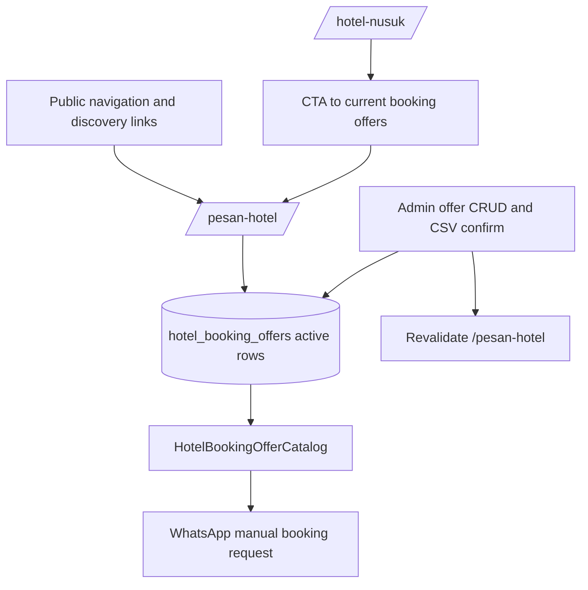

# Move Hotel Booking Offers to Pesan Hotel - Plan

## Goal Capsule

- **Objective:** Move the user-facing manual hotel booking offer catalog from `/hotel-nusuk` to a dedicated `/pesan-hotel` page while keeping `/hotel-nusuk` focused on hotel recommendations and estimator-style price references.
- **Authority hierarchy:** The existing manual booking catalog product contract remains authoritative for offer behavior, WhatsApp handoff, and manual payment/confirmation boundaries; this follow-up plan only changes public placement and discovery.
- **Execution profile:** Small cross-page feature adjustment touching public routes, navigation/discovery copy, cache invalidation, and regression tests.
- **Stop conditions:** Stop and ask if implementation discovers that `/pesan-hotel` must replace `/hotel-nusuk` completely, change admin workflows, or change the booking/payment model.
- **Tail ownership:** The implementer owns the route split, cache invalidation update, public copy, tests, and docs touched by this relocation.

---

## Product Contract

### Summary

Manual hotel booking offers should live on a dedicated `/pesan-hotel` page so jamaah who want to request a bookable offer have a clear destination, while `/hotel-nusuk` remains the hotel recommendation and reference-price directory.
The admin offer maintenance, CSV import, dummy template, data model, and WhatsApp request handoff remain unchanged except where public route cache invalidation and links must point to the new page.

### Problem Frame

The current implementation places active booking offers at the top of `/hotel-nusuk`, mixing an OTA-like request catalog with a recommendation directory.
That makes the page do two jobs: explaining Hotel Nusuk-style hotel references and presenting current team-maintained offers.
Moving offers to `/pesan-hotel` creates a clearer user journey: browse reference hotels on `/hotel-nusuk`, then request current manual booking offers on `/pesan-hotel`.

### Requirements

**Public route split**
- R1. `/pesan-hotel` must show active hotel booking offers with the existing filter, price, period, notes, terms, and WhatsApp handoff behavior.
- R2. `/hotel-nusuk` must no longer render the active booking offer list inline.
- R3. `/hotel-nusuk` must remain public and continue showing hotel reference pricing and recommendations.
- R4. `/hotel-nusuk` should provide a lightweight CTA or link to `/pesan-hotel` so users can move from reference browsing to current bookable offers.

**Discovery and copy**
- R5. Public navigation and home/visa discovery should expose `/pesan-hotel` where it helps users looking to book, without removing access to `/hotel-nusuk`.
- R6. User-facing copy must keep the manual boundary clear: availability check, payment, and confirmation continue through WhatsApp/admin follow-up.

**Admin and operational consistency**
- R7. Admin create, update, delete, and CSV confirm flows must revalidate `/pesan-hotel` after changing booking offers.
- R8. Existing admin paths, CSV import template behavior, dummy CSV, and offer data model must stay in place.

### Acceptance Examples

- AE1. **Covers R1, R6.** Given an active hotel booking offer exists, when a jamaah opens `/pesan-hotel`, they can see the offer details and start the WhatsApp request with manual follow-up copy.
- AE2. **Covers R2, R3, R4.** Given `/hotel-nusuk` has estimator hotel data, when a jamaah opens `/hotel-nusuk`, they see recommendations/reference prices and a path to `/pesan-hotel`, but not the booking-offer card grid.
- AE3. **Covers R5.** Given a visitor uses desktop or mobile navigation, when they look for booking services, they can discover `/pesan-hotel`.
- AE4. **Covers R7.** Given an admin imports or edits a booking offer, when the write completes, the `/pesan-hotel` page reflects the new active offers after revalidation.

### Scope Boundaries

- Do not change admin hotel offer CRUD URLs or CSV import workflows.
- Do not rename the database table, schema types, parser, dummy CSV, or WhatsApp helper.
- Do not change payment, availability checking, confirmation, cancellation, refund, or voucher behavior.
- Do not remove `/hotel-nusuk`; it remains the public Hotel Nusuk/reference page.
- Do not change estimator hotel pricing formulas.

---

## Planning Contract

### Key Technical Decisions

- KTD1. **Create a dedicated public route instead of toggling page sections:** `/pesan-hotel` should own the offer query and render `HotelBookingOfferCatalog`, making the booking journey addressable and cacheable on its own.
- KTD2. **Keep the existing catalog component:** `HotelBookingOfferCatalog` already encodes the offer filters, cards, manual handoff copy, and empty-filter behavior; reuse it from the new route rather than rebuilding the UI.
- KTD3. **Keep `/hotel-nusuk` as a reference directory:** Removing the offer query from `/hotel-nusuk` also reduces migration-order blast radius for that page, but it should still link users toward `/pesan-hotel` when they want current bookable offers.
- KTD4. **Revalidate the page that displays offers:** Admin offer writes currently revalidate `/hotel-nusuk`; after the split, those writes must revalidate `/pesan-hotel` so active offer changes are visible.
- KTD5. **Update discovery without collapsing service semantics:** Navigation can add or surface `Pesan Hotel` as a booking action while keeping `Hotel Nusuk` available for reference hotel browsing.

### High-Level Technical Design

### Assumptions

- `/pesan-hotel` should be public like `/hotel-nusuk`, `/visa`, and `/transportasi`.
- The current admin label "Hotel Booking Offers" can remain internal; this plan only changes the public destination.
- Existing `HotelBookingOfferCatalog` empty-offer behavior can remain `null` unless implementation decides a dedicated `/pesan-hotel` empty state is necessary for user clarity.

### Sources and Patterns

- `app/(public)/hotel-nusuk/page.tsx`: current mixed Hotel Nusuk and booking-offer page.
- `components/hotel-nusuk/HotelBookingOfferCatalog.tsx`: existing catalog UI to reuse on `/pesan-hotel`.
- `app/api/admin/hotel-booking-offers/route.ts`: create path that currently revalidates `/hotel-nusuk`.
- `app/api/admin/hotel-booking-offers/[id]/route.ts`: update/delete paths that currently revalidate `/hotel-nusuk`.
- `app/api/admin/hotel-booking-offers/import/confirm/route.ts`: CSV confirm path that currently revalidates `/hotel-nusuk`.
- `middleware.ts`: public route allowlist pattern.
- `components/nav/NavBar.tsx`, `components/nav/MobileMenu.tsx`, and `components/nav/LayananDropdown.tsx`: public navigation patterns.
- `components/home/SectionCards.tsx` and `app/(public)/visa/page.tsx`: public discovery links for hotel-related journeys.

---

## Implementation Units

### U1. Create the `/pesan-hotel` public booking page

**Goal:** Move the active offer query and `HotelBookingOfferCatalog` rendering into a dedicated public page.

**Requirements:** R1, R6

**Dependencies:** None

**Files:**
- Create: `app/(public)/pesan-hotel/page.tsx`
- Modify: `app/(public)/hotel-nusuk/page.tsx`
- Test: `app/(public)/pesan-hotel/__tests__/page.test.tsx`

**Approach:** Build `/pesan-hotel` from the existing booking-offer section in `/hotel-nusuk`: query active `hotelBookingOffers`, order by city, period, and hotel name, map offer fields into `HotelBookingOfferCatalogItem`, and build WhatsApp hrefs with `buildHotelBookingWhatsappHref`.
Remove the booking-offer query, mapping, imports, and inline catalog render from `/hotel-nusuk`.
Keep `/hotel-nusuk` metadata and hotel price/reference behavior focused on the directory.

**Patterns to follow:** Current server-page data mapping in `app/(public)/hotel-nusuk/page.tsx` and WhatsApp href construction in `lib/hotel-booking/whatsapp.ts`.

**Test scenarios:**
- Happy path: an active offer returned from the mocked DB renders on `/pesan-hotel` with hotel name, city, period label, price, and WhatsApp CTA.
- Edge case: no active offers does not break `/pesan-hotel`; if implementation adds an empty state, assert the empty copy.
- Regression: `/hotel-nusuk` no longer queries or renders active booking offers and still renders hotel reference pricing.
- Security/copy regression: `/pesan-hotel` still communicates that payment, verification, and confirmation continue manually.

**Verification:** `/pesan-hotel` becomes the only public page rendering the offer catalog, and `/hotel-nusuk` remains usable without booking-offer data.

### U2. Keep `/hotel-nusuk` as a reference page with a bridge to `/pesan-hotel`

**Goal:** Preserve Hotel Nusuk discovery while directing booking-intent users to the new page.

**Requirements:** R2, R3, R4, R6

**Dependencies:** U1

**Files:**
- Modify: `app/(public)/hotel-nusuk/page.tsx`
- Test: `app/(public)/hotel-nusuk/__tests__/page.test.tsx`

**Approach:** Add a lightweight CTA or text link near the top of `/hotel-nusuk` that points to `/pesan-hotel` for current manual booking offers.
Update page description/copy so Hotel Nusuk reads as recommendations/reference prices rather than the place where booking offers are listed.
Avoid adding a second catalog preview on this page.

**Patterns to follow:** Existing page heading and section copy in `app/(public)/hotel-nusuk/page.tsx`; public CTA tone from `app/(public)/transportasi/TransportasiClient.tsx`.

**Test scenarios:**
- Happy path: `/hotel-nusuk` contains a link to `/pesan-hotel`.
- Regression: `/hotel-nusuk` still renders "Estimasi Harga Hotel" and hotel reference rows when hotel price data exists.
- Regression: `/hotel-nusuk` does not render `Booking Manual Tersedia` or booking-offer card copy.

**Verification:** Users can still navigate from reference hotel browsing to booking offers without the two experiences sharing one list.

### U3. Update public discovery and route access

**Goal:** Make `/pesan-hotel` reachable from navigation and public entry points while keeping `/hotel-nusuk` available.

**Requirements:** R5

**Dependencies:** U1

**Files:**
- Modify: `middleware.ts`
- Modify: `components/nav/NavBar.tsx`
- Modify: `components/nav/MobileMenu.tsx`
- Modify: `components/nav/LayananDropdown.tsx`
- Modify: `components/home/SectionCards.tsx`
- Modify: `app/(public)/visa/page.tsx`
- Test: `middleware.test.ts`
- Test: `components/nav/__tests__/NavBar.test.tsx`

**Approach:** Add `/pesan-hotel` to the public route allowlist.
Expose `Pesan Hotel` in public navigation where booking services live, likely under the service dropdown and mobile service group, while keeping the existing `Hotel Nusuk` link for reference browsing.
Update home/visa references that currently send booking-intent users only to `/hotel-nusuk` so they can discover `/pesan-hotel` when they need a manual booking offer.

**Patterns to follow:** Public allowlist checks in `middleware.ts`, desktop dropdown behavior in `LayananDropdown`, mobile layanan grouping in `MobileMenu`, and home section-card structure in `SectionCards`.

**Test scenarios:**
- Happy path: `isPublicPath("/pesan-hotel")` and `isPublicPath("/pesan-hotel/")` return true.
- Happy path: desktop navigation exposes `Pesan Hotel` with href `/pesan-hotel`.
- Happy path: mobile menu exposes `Pesan Hotel` under the same service/discovery grouping.
- Regression: `Hotel Nusuk` remains present and points to `/hotel-nusuk`.
- Regression: dashboard and admin routes remain protected.

**Verification:** Public users can reach both hotel experiences, and adding `/pesan-hotel` does not loosen protected routes.

### U4. Point admin offer revalidation at `/pesan-hotel`

**Goal:** Ensure public offer changes invalidate the route that now renders offers.

**Requirements:** R7, R8

**Dependencies:** U1

**Files:**
- Modify: `app/api/admin/hotel-booking-offers/route.ts`
- Modify: `app/api/admin/hotel-booking-offers/[id]/route.ts`
- Modify: `app/api/admin/hotel-booking-offers/import/confirm/route.ts`
- Test: `app/api/admin/hotel-booking-offers/__tests__/route.test.ts`
- Test: `app/api/admin/hotel-booking-offers/import/__tests__/route.test.ts`

**Approach:** Replace offer-write `revalidatePath("/hotel-nusuk")` calls with `revalidatePath("/pesan-hotel")`.
Do not change admin URLs, import parsing, dummy CSV, or DB writes.
If route tests currently do not assert revalidation, add focused tests or extend existing mocks to pin the new path.

**Patterns to follow:** Existing `revalidatePath` use in hotel offer API routes and pricing import route tests for mocking route side effects.

**Test scenarios:**
- Happy path: creating a manual offer revalidates `/pesan-hotel`.
- Happy path: updating an offer revalidates `/pesan-hotel`.
- Happy path: deleting an offer revalidates `/pesan-hotel`.
- Happy path: confirming a CSV import with writable rows revalidates `/pesan-hotel`.
- Edge case: preview-only import still does not revalidate because it does not write.

**Verification:** Admin changes refresh the new public offer page and do not depend on `/hotel-nusuk` cache invalidation.

### U5. Update documentation and regression coverage

**Goal:** Keep feature docs and operational notes aligned with the new public destination.

**Requirements:** R5, R6, R8

**Dependencies:** U1, U2, U3, U4

**Files:**
- Modify: `docs/FEATURES.md`
- Modify: `docs/plans/2026-06-23-001-feat-manual-hotel-booking-catalog-plan.md` only if a short follow-up note is useful; do not rewrite its historical scope.
- Test: relevant tests from U1-U4

**Approach:** Update documentation that says booking offers are requested from `/hotel-nusuk` so it points to `/pesan-hotel`.
Keep references to CSV generated from Hotel Nusuk pricing rows accurate; the CSV source can still be Hotel Nusuk pricing even though the public booking destination changes.
Avoid rewriting the old plan as if the original implementation had always targeted `/pesan-hotel`.

**Patterns to follow:** Current feature documentation style in `docs/FEATURES.md`.

**Test scenarios:**
- Documentation check: `docs/FEATURES.md` names `/pesan-hotel` as the manual booking catalog destination.
- Regression: documentation still distinguishes booking offers from Hotel Nusuk directory/listing content and estimator pricing.

**Verification:** User-facing docs and historical planning artifacts no longer imply the booking offer catalog lives inside `/hotel-nusuk`.

---

## Verification Contract

| Gate | Applies to | Done signal |
|---|---|---|
| Public route tests | U1, U2 | `/pesan-hotel` renders active offers; `/hotel-nusuk` no longer renders offer cards and keeps hotel reference content. |
| Navigation and middleware tests | U3 | `/pesan-hotel` is public and discoverable; protected route expectations do not change. |
| Admin route tests | U4 | Offer writes and CSV confirm revalidate `/pesan-hotel`. |
| Targeted feature tests | U1-U4 | Hotel booking offer, nav, and middleware tests pass. |
| Full regression awareness | All units | Existing unrelated webinar/typecheck failures are not expanded by this work; any new failures in touched areas are resolved. |

---

## Definition of Done

- `/pesan-hotel` is the public page for active manual hotel booking offers.
- `/hotel-nusuk` remains public and focused on reference hotels/estimator pricing, with a clear route to `/pesan-hotel`.
- Navigation and public discovery expose `Pesan Hotel` without removing `Hotel Nusuk`.
- Admin offer writes revalidate `/pesan-hotel`.
- Tests cover the new public route, the removed inline catalog on `/hotel-nusuk`, public route allowlisting, navigation discovery, and revalidation path changes.
- Docs mention `/pesan-hotel` as the booking-offer destination and preserve the distinction between booking offers, Hotel Nusuk listings, and estimator pricing.
- No abandoned route-copy or duplicate catalog code remains after the move.
