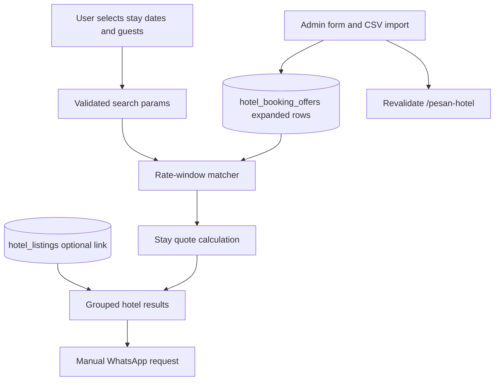
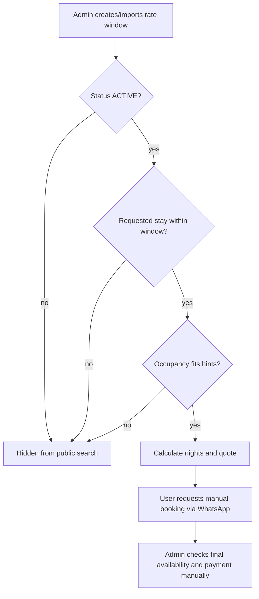

# Refactor Hotel Booking to Date Search - Plan

## Goal Capsule

- **Objective:** Refactor `/pesan-hotel` from a fixed-period offer catalog into an OTA-like hotel search experience where jamaah choose stay dates and see matching room/rate offers, while booking, payment, final availability checking, and confirmation remain manual through WhatsApp/admin follow-up.
- **Authority hierarchy:** The manual hotel booking catalog requirements remain authoritative for the business boundary: no in-app payment, no guaranteed inventory, and no automated confirmation. This plan owns the technical path for date-based search, quote calculation, admin rate maintenance, CSV import evolution, and public UI refactor.
- **Execution profile:** Standard-to-deep refactor across schema, import/admin workflows, public search UI, WhatsApp quote context, route cache invalidation, and regression tests.
- **Stop conditions:** Stop and ask if implementation discovers a need for payment collection, stored booking orders, live hotel inventory integration, tax/fee calculation, cancellation automation, or replacing `/hotel-nusuk`.
- **Tail ownership:** The implementer owns the data model migration, compatibility with existing offer rows, searchable public flow, admin/import updates, tests, and docs. Operational hotel availability remains outside the app and is handled manually after WhatsApp handoff.

---

## Product Contract

### Summary

The hotel booking surface should feel closer to Agoda or Booking.com at the browsing stage: a jamaah chooses check-in/check-out dates, room count, and guest count, then compares matching hotel room/rate offers.
The app still stops at a booking request. It does not charge the jamaah, reserve inventory, or confirm the hotel booking; the WhatsApp handoff carries the selected stay and quote context so the admin can check final availability and continue payment manually.

### Problem Frame

The current `/pesan-hotel` page lists active manual offers by admin-defined periods.
That is useful for publishing temporary offers, but it does not match the user mental model in an OTA flow: users start with dates, compare room options, and expect the price to reflect the stay they selected.
The refactor should keep the existing manual operations model but make the public page date-driven, searchable, and clearer about the difference between a displayed quote and a confirmed booking.

### Requirements

**Date-based public search**
- R1. `/pesan-hotel` must let users enter check-in date, check-out date, room count, adult count, and optional city/search filters before or while viewing hotel offers.
- R2. Search results must include only active rate windows that can satisfy the selected stay dates under the app's documented date-boundary semantics.
- R3. The result card must show the selected stay, nights, room count, per-night price basis, calculated stay quote, and manual follow-up boundary.
- R4. Users must still be able to browse an empty or no-date state without the page breaking; the page should prompt for dates or show currently open windows as guidance, not imply confirmed availability.

**OTA-like room/rate comparison**
- R5. A hotel may expose multiple room/rate options for the same date search, such as refundable vs. non-refundable or different room types.
- R6. Result cards must keep hotel identity, city, tier, room type, rate label, cancellation/terms, and inclusions visible enough for comparison.
- R7. The UI must avoid implying "charged now", "instant confirmation", or live room hold; any Agoda-like affordance must be adapted to "request booking" language.

**Manual WhatsApp handoff**
- R8. The WhatsApp message must include hotel, selected dates, nights, room count, guest count, rate label, quote amount, and the manual final-availability/payment boundary.
- R9. The handoff must continue to work when the admin WhatsApp contact is configured as either a URL or a phone number.
- R10. No payment, booking order, voucher, cancellation, refund, or inventory hold is created in this refactor.

**Admin maintenance and import**
- R11. Admins must be able to maintain room/rate windows with fields needed for date search, including room/rate label, date window, price basis, status, room capacity or occupancy hints, and terms.
- R12. Bulk CSV import must evolve to support the new date-search fields while keeping existing Hotel Nusuk generated CSV workflows usable.
- R13. Existing manual offer rows must remain readable after migration; implementation may backfill sensible defaults rather than requiring immediate full data cleanup.
- R14. Admin writes and imports must continue revalidating `/pesan-hotel` after any searchable rate data changes.

**Operational clarity**
- R15. Public copy, docs, and admin copy must consistently state that displayed prices are catalog/request quotes and final availability plus payment are handled manually.
- R16. `/hotel-nusuk` remains a recommendation/reference page and should continue bridging users to `/pesan-hotel` without becoming the date-search UI.

### Acceptance Examples

- AE1. **Covers R1, R2, R3.** Given an active rate window covers July 1-5, 2026, when a jamaah searches check-in July 1 and check-out July 5, the result appears with four nights and a stay quote calculated from the stored per-night amount.
- AE2. **Covers R2.** Given a rate window ends before the requested checkout boundary, when the jamaah searches those dates, that rate does not appear as bookable/requestable.
- AE3. **Covers R5, R6.** Given one hotel has two matching rates for the same dates, when results render, the jamaah can compare the room/rate labels, terms, and prices without losing the shared hotel identity.
- AE4. **Covers R7, R8, R10.** Given a jamaah clicks the request button, when WhatsApp opens, the message includes selected stay and quote details and says admin must check final availability and payment next.
- AE5. **Covers R11, R12, R13.** Given an admin imports a CSV with room type and rate-window columns, when preview and confirm succeed, the public search can find those rows by date.
- AE6. **Covers R15, R16.** Given a jamaah reaches hotel discovery from `/hotel-nusuk`, when they want booking, they are routed to `/pesan-hotel` for date search while `/hotel-nusuk` remains reference-only.

### Scope Boundaries

- Do not add online payment, payment links, deposits, invoices, voucher issuance, cancellation automation, or refund handling.
- Do not integrate with Agoda, Booking.com, hotel channel managers, or live hotel inventory APIs.
- Do not create guaranteed room holds or decrement inventory on click.
- Do not create a full booking/order management system in this refactor.
- Do not replace `/hotel-nusuk`, estimator hotel pricing, or existing hotel listing content.
- Do not calculate taxes, service fees, exchange-rate conversions, or commission unless the current stored price already includes them as admin-provided display data.

### Deferred to Follow-Up Work

- Persisting booking request leads inside the app before WhatsApp handoff.
- Calendar-style per-day rate overrides, blackout dates, allotment counts, and stop-sell rules.
- Multi-room split occupancy, children ages, promo codes, taxes/fees, and currency conversion.
- Admin dashboards for request conversion, payment status, or hotel-contact workflow.

---

## Planning Contract

### Key Technical Decisions

- KTD1. **Refactor existing offers into searchable rate windows before introducing a new booking system:** Keep `hotel_booking_offers` as the operational source for v1 and expand its semantics/columns so each row can represent a hotel room/rate window. This reduces migration blast radius and preserves existing admin/import behavior while enabling date search.
- KTD2. **Use selected stay dates as quote inputs, not confirmation inputs:** The public flow calculates a catalog quote for the requested stay and carries it to WhatsApp. It must not persist a booking or promise that the room is held.
- KTD3. **Group matching rate rows by hotel in the UI:** The result shape should look like OTA hotel cards with room/rate options inside each hotel, instead of a flat list of unrelated offers. This makes multiple rates per hotel understandable without creating a new hotel-detail page first.
- KTD4. **Treat check-out as the non-stay boundary:** Quote calculation should count nights from check-in inclusive to check-out exclusive. The implementation must pin how stored rate-window end dates map to that search rule so off-by-one behavior is tested.
- KTD5. **Evolve CSV import with compatibility defaults:** Add new columns for room/rate search fields, but keep old rows parseable by defaulting room type, occupancy hints, and request-copy fields. Admins can refine imported rows later.
- KTD6. **Keep WhatsApp as the only v1 action sink:** The request button should generate a richer WhatsApp message from the selected quote. No request table is introduced unless implementation discovers an unavoidable auditing need, which is a stop condition.

### High-Level Technical Design

### Data Semantics

- A searchable rate window is a current manual booking offer row that has a date window, a room/rate label, a per-night or admin-defined room basis, a price amount, terms, and status.
- `ACTIVE` means visible/requestable in search, not guaranteed inventory.
- `UNAVAILABLE` means admin can keep the row for reference but users should not be able to request it.
- `INACTIVE` means archived/draft and hidden from search.
- Search check-in/check-out dates are user intent. They are not a reservation, hold, or confirmation.
- The first implementation should support same-rate stays fully contained in one window. Splitting one stay across multiple rate windows is deferred unless implementation discovers it is already required by imported pricing data.

### Assumptions

- Existing `priceAmount` values are treated as admin-maintained catalog prices for the row's `roomBasis`, likely per room per night unless the row explicitly says otherwise.
- The first public search supports one selected room count and aggregate guest count; detailed per-room guest allocation is deferred.
- Admins can continue using bulk CSV refreshes to publish date windows rather than maintaining live inventory.
- Existing imported dummy CSV can be regenerated or evolved for the new columns; old templates should not silently break preview.

### Sources and Patterns

- `docs/brainstorms/2026-06-23-manual-hotel-booking-catalog-requirements.md`: source product boundary for manual booking catalog.
- `docs/plans/2026-06-28-001-feat-pesan-hotel-offer-route-plan.md`: current route split and `/pesan-hotel` ownership.
- `app/(public)/pesan-hotel/page.tsx`: current server-side active offer query and catalog mapping.
- `components/hotel-nusuk/HotelBookingOfferCatalog.tsx`: current public offer filtering and card UI.
- `lib/db/schema.ts`: existing `hotelListings` and `hotelBookingOffers` tables.
- `lib/admin/hotel-booking-offer-payload.ts`: admin payload validation and import-key construction.
- `lib/admin/hotel-booking-offer-import.ts`: CSV parser/template pattern and conflict handling.
- `lib/hotel-booking/whatsapp.ts`: WhatsApp message and href construction.
- `components/admin/hotel-booking-offers/HotelBookingOfferForm.tsx`: existing manual offer form.
- `components/admin/hotel-booking-offers/HotelBookingOfferImportPanel.tsx`: preview/confirm import UX.
- User-provided Agoda room-rate screenshot: public UI reference for date/room comparison pattern, adapted to manual request language.

---

## Implementation Units

### U1. Expand the hotel booking offer data model for date-search rate windows

**Goal:** Add the minimum fields and semantics needed to treat existing offer rows as searchable room/rate windows.

**Requirements:** R2, R5, R6, R11, R13

**Dependencies:** None

**Files:**
- Modify: `lib/db/schema.ts`
- Create: `drizzle/migrations/<next>_hotel_booking_rate_windows.sql`
- Modify: `lib/db/__tests__/schema.test.ts`
- Modify: `docs/FEATURES.md`

**Approach:** Extend `hotel_booking_offers` rather than replacing it in the first refactor. Add fields that support OTA-style comparison without creating a booking system: room/rate display label, room type, occupancy hints, optional refundable/cancellation labels, optional inclusions, min/max nights if needed, sort priority, and last-verified/admin display metadata where useful.
Keep existing `periodStart`, `periodEnd`, `roomBasis`, `currency`, `priceAmount`, `status`, and `importKey` compatible. Backfill defaults for existing rows so they remain searchable or at least readable after migration.
Document the date-boundary semantics in code comments or docs where the matcher and import parser use them.

**Patterns to follow:** Existing CUID/timestamp/schema style in `lib/db/schema.ts`, enum definitions for city/tier/status, and migration naming conventions in `drizzle/migrations/`.

**Test scenarios:**
- Happy path: schema exports include the new rate-window fields and existing hotel booking offer columns remain present.
- Migration/backfill: existing rows can receive defaults for room/rate display fields without nullability failures.
- Regression: `hotelListings` references still use `onDelete: set null` and existing offer status enum values remain valid.

**Verification:** Existing offers remain valid records, and the schema can represent multiple searchable room/rate options for one hotel and date window.

### U2. Add date search, matching, and quote calculation helpers

**Goal:** Centralize validation and quote calculation so public UI, WhatsApp handoff, and tests use the same date-search semantics.

**Requirements:** R1, R2, R3, R4, R8

**Dependencies:** U1

**Files:**
- Create: `lib/hotel-booking/search.ts`
- Create: `lib/hotel-booking/__tests__/search.test.ts`
- Modify: `lib/hotel-booking/whatsapp.ts`
- Modify: `lib/hotel-booking/__tests__/whatsapp.test.ts`

**Approach:** Add helpers for parsing search params, validating check-in/check-out dates, calculating nights, matching requested stays against rate windows, checking occupancy hints, and computing stay quote totals.
Keep the helpers framework-agnostic so server pages and future API routes can use them without duplicating logic.
Extend WhatsApp message construction to accept selected search context and quote details while preserving the current phone/URL contact handling.

**Patterns to follow:** Existing pure helper tests in `lib/hotel-booking/__tests__/whatsapp.test.ts` and parser validation style from `lib/admin/hotel-booking-offer-payload.ts`.

**Test scenarios:**
- Happy path: check-in July 1 and check-out July 5 yields four nights and multiplies a per-night rate by four and by selected room count.
- Edge case: same-day or reversed date ranges are rejected with user-safe validation output.
- Edge case: a stay outside the rate window is not matched.
- Edge case: a stay touching the end boundary follows the documented check-out semantics.
- Edge case: guest count above occupancy hints excludes or marks the rate as not suitable, depending on the final helper contract.
- Regression: WhatsApp href still works for phone-number and URL admin contacts.
- Copy regression: WhatsApp message includes selected dates, nights, room count, guests, quote amount, and manual final-availability/payment text.

**Verification:** Date and quote behavior is test-pinned before the public UI consumes it.

### U3. Refactor `/pesan-hotel` into a search-first public page

**Goal:** Replace the fixed offer list with a date-search experience that renders grouped matching hotel/rate results and keeps manual booking language clear.

**Requirements:** R1, R2, R3, R4, R5, R6, R7, R15, R16

**Dependencies:** U1, U2

**Files:**
- Modify: `app/(public)/pesan-hotel/page.tsx`
- Create or modify: `components/hotel-booking/HotelBookingSearchForm.tsx`
- Create or modify: `components/hotel-booking/HotelBookingSearchResults.tsx`
- Create or modify: `components/hotel-booking/HotelRateOptionCard.tsx`
- Modify or move: `components/hotel-nusuk/HotelBookingOfferCatalog.tsx`
- Test: `app/(public)/pesan-hotel/__tests__/page.test.tsx`
- Test: `components/hotel-booking/__tests__/HotelBookingSearchResults.test.tsx`

**Approach:** Let the server page read validated search params and query active rate windows. When valid dates are present, filter to matching windows and group results by hotel/listing identity. When dates are missing or invalid, show the search form and guidance rather than a misleading "book now" list.
Build a denser OTA-like result card: hotel identity on the left, rate rows on the right, selected quote and "Ajukan Booking via WhatsApp" action. Use "Request", "Ajukan", or "Cek availability" language instead of "Book and pay now".
Preserve empty states for no active offers, no matching dates, and invalid search input.

**Patterns to follow:** Current styling in `components/hotel-nusuk/HotelBookingOfferCatalog.tsx`, form state patterns from existing client components, and route-level metadata/revalidation conventions from `app/(public)/pesan-hotel/page.tsx`.

**Test scenarios:**
- Happy path: valid search params render hotel result groups and rate options with calculated total quote.
- Happy path: clicking the WhatsApp action produces a href containing the selected stay context.
- Empty state: no dates entered shows a prompt to choose dates and does not imply guaranteed availability.
- Empty state: valid dates with no matching rates shows a no-results message and keeps the search form populated.
- Edge case: invalid date params show validation copy and do not crash the server page.
- Regression: payment/manual copy appears near result actions.
- Regression: `/hotel-nusuk` continues linking to `/pesan-hotel` and remains reference-only.

**Verification:** A user can choose dates, compare matching hotel/rate rows, and start a manual WhatsApp request without seeing fixed-period offers unrelated to their stay.

### U4. Update admin manual form and table for rate-window fields

**Goal:** Let admins create and edit searchable rate windows without relying only on CSV.

**Requirements:** R11, R13, R14, R15

**Dependencies:** U1, U2

**Files:**
- Modify: `components/admin/hotel-booking-offers/HotelBookingOfferForm.tsx`
- Modify: `app/(admin)/admin/content/hotel-booking-offers/page.tsx`
- Modify: `app/(admin)/admin/content/hotel-booking-offers/new/page.tsx`
- Modify: `app/(admin)/admin/content/hotel-booking-offers/[id]/edit/page.tsx`
- Modify: `lib/admin/hotel-booking-offer-payload.ts`
- Modify: `lib/admin/__tests__/hotel-booking-offer-payload.test.ts`
- Test: `components/admin/hotel-booking-offers/__tests__/HotelBookingOfferForm.test.tsx`

**Approach:** Add admin inputs for the new rate-window fields while keeping the existing basic fields intact. The form should still support selecting a Hotel Nusuk listing and auto-filling hotel identity fields.
Update payload validation with bounded text, numeric occupancy/min-night validation, and defaults for partial updates. Update admin table columns so operators can scan room/rate label, period/window, price basis, status, and last update.
Keep `/api/admin/hotel-booking-offers` route URLs unchanged.

**Patterns to follow:** Existing controlled form style in `HotelBookingOfferForm`, payload validation style in `hotel-booking-offer-payload.ts`, and admin table styling in `app/(admin)/admin/content/hotel-booking-offers/page.tsx`.

**Test scenarios:**
- Happy path: creating a rate window with room/rate fields submits valid payload and redirects back to the admin table.
- Happy path: editing an existing offer preserves fields not touched by a partial update and recomputes the import key only from identity fields that define uniqueness.
- Validation: invalid occupancy, min nights, price, unsupported currency, or malformed dates return clear errors.
- Regression: selecting a Hotel Nusuk listing still copies hotel name, city, and tier.
- Regression: create/update/delete continue revalidating `/pesan-hotel`.

**Verification:** Admins can maintain date-search-ready rate rows manually and existing offer operations still work.

### U5. Evolve CSV template, parser, and bulk import for searchable rates

**Goal:** Keep bulk refresh practical as the data model shifts from fixed offers to searchable room/rate windows.

**Requirements:** R11, R12, R13, R14

**Dependencies:** U1, U2, U4

**Files:**
- Modify: `lib/admin/hotel-booking-offer-import.ts`
- Modify: `lib/admin/__tests__/hotel-booking-offer-import.test.ts`
- Modify: `docs/templates/hotel-booking-offer-import-template.csv`
- Modify: `docs/templates/hotel-booking-offer-import-ota-2027-dummy.csv`
- Modify: `app/api/admin/hotel-booking-offers/import/template/route.ts`
- Modify: `app/api/admin/hotel-booking-offers/import/preview/route.ts`
- Modify: `app/api/admin/hotel-booking-offers/import/confirm/route.ts`
- Test: `app/api/admin/hotel-booking-offers/import/template/__tests__/route.test.ts`
- Test: `app/api/admin/hotel-booking-offers/import/__tests__/route.test.ts`

**Approach:** Add CSV headers for the new rate-window fields. Keep required headers limited to the minimum needed for a valid searchable row, and default optional columns so existing generated Hotel Nusuk CSVs remain easy to complete.
Update import-key normalization only if the uniqueness definition changes. A likely key remains hotel identity plus date window plus room basis/rate label, with room type included if it becomes distinct from room basis.
Update preview and confirm to surface new validation errors and to write the new fields transactionally.

**Patterns to follow:** Current `parseHotelBookingOfferCsv` summary/error shape, max file-size/row-count checks in import routes, and existing template parity tests.

**Test scenarios:**
- Happy path: a v2 CSV row with room type, occupancy hints, cancellation label, date window, price, and status parses as create.
- Happy path: an existing/legacy CSV row without optional new columns parses with defaults or clear upgrade guidance.
- Conflict: duplicate hotel/date/room/rate rows in one upload are marked conflict.
- Validation: malformed dates, unsupported status/currency, invalid price, and out-of-range occupancy are rejected.
- Confirm: writable import rows persist new fields and revalidate `/pesan-hotel`.
- Template parity: docs template and downloadable template stay aligned.
- Dummy fixture: OTA 2027 dummy CSV remains parseable and aligned with source pricing assumptions.

**Verification:** Admins can bulk-create/update searchable rate windows without manual per-row editing.

### U6. Preserve navigation, docs, and operational boundaries

**Goal:** Ensure the refactor is discoverable and does not create support confusion around payment or availability guarantees.

**Requirements:** R7, R10, R15, R16

**Dependencies:** U3, U4, U5

**Files:**
- Modify: `docs/FEATURES.md`
- Modify: `app/(public)/hotel-nusuk/page.tsx`
- Modify: `app/(public)/visa/page.tsx`
- Modify: `components/nav/LayananDropdown.tsx`
- Modify: `components/nav/MobileMenu.tsx`
- Modify: `components/home/SectionCards.tsx`
- Test: `app/(public)/hotel-nusuk/__tests__/page.test.tsx`
- Test: `components/nav/__tests__/NavBar.test.tsx`
- Test: `middleware.test.ts`

**Approach:** Keep current discovery paths, but update copy where needed so `/pesan-hotel` now means date-based request search rather than a flat fixed-period catalog. Preserve `/hotel-nusuk` as reference browsing and keep public middleware access unchanged.
Document that this refactor changes browsing/search behavior only; operations after request remain manual.

**Patterns to follow:** Existing documentation style in `docs/FEATURES.md` and route/navigation test patterns from the previous `/pesan-hotel` split.

**Test scenarios:**
- Happy path: public navigation still exposes `Pesan Hotel` and `Hotel Nusuk` separately.
- Happy path: `/hotel-nusuk` CTA still points booking-intent users to `/pesan-hotel`.
- Regression: `/pesan-hotel` remains public in middleware.
- Documentation: `docs/FEATURES.md` describes date search, manual quote/request, CSV maintenance, and no in-app payment.

**Verification:** The user journey is discoverable, and docs/copy do not imply payment or confirmed booking.

---

## System-Wide Impact

- **Data lifecycle:** Existing `hotel_booking_offers` data must survive migration and remain admin-visible. Backfill/default choices are operationally important because admins may already depend on CSV rows.
- **Public cache:** `/pesan-hotel` stays revalidated by admin writes and imports. Search params should not create stale assumptions about availability; cache behavior must be checked after the server-page refactor.
- **Support posture:** More OTA-like UI can increase user expectation of instant booking. Copy and WhatsApp text are part of the risk control, not polish.
- **Estimator separation:** Date-search booking prices must not feed budget estimator formulas unless a future plan explicitly changes estimator behavior.

---

## Risks & Dependencies

- **Off-by-one date risk:** Hotel searches use check-out as a non-stay date, while existing offers have a stored end date that may have been treated as inclusive display text. Mitigate with explicit helper semantics and edge-case tests.
- **Overpromising risk:** Agoda-like UI can imply instant confirmation. Mitigate with "request booking", "admin cek availability", and "payment manual" copy at every action point.
- **Import compatibility risk:** Adding CSV columns can break admin bulk workflows. Mitigate with optional defaults, template parity tests, and clear preview errors.
- **Data duplication risk:** Hotel identity may exist in `hotelListings`, `hotelPrices`, and booking offers. Continue linking offers to `hotelListings` when possible while allowing offer-specific display fields.
- **Query complexity risk:** Filtering by dates, status, city, search, and occupancy may grow. Mitigate by keeping the first matcher simple, indexed by status/city/date window, and deferring split-window stays.

---

## Verification Contract

| Gate | Applies to | Done signal |
|---|---|---|
| Schema and migration checks | U1 | New rate-window fields exist, existing offer rows remain valid, and schema tests cover the added columns/defaults. |
| Date-search helper tests | U2 | Date validation, night calculation, window matching, occupancy handling, and quote calculation are pinned by unit tests. |
| Public page/component tests | U3 | `/pesan-hotel` renders search form, valid matching results, no-date guidance, invalid-date state, and no-results state. |
| WhatsApp tests | U2, U3 | Manual request href includes selected stay, guest, room, rate, quote, and manual follow-up copy. |
| Admin form/API tests | U4 | Create/update/delete support new fields, preserve partial update behavior, and revalidate `/pesan-hotel`. |
| CSV import tests | U5 | Template, parser, preview, confirm, conflict handling, dummy fixture, and backwards-compatible defaults pass. |
| Discovery regression tests | U6 | `/hotel-nusuk`, nav, home/visa links, and middleware still expose the right public surfaces. |
| Full regression awareness | All units | Existing unrelated webinar/date and type-cast failures are not expanded by this refactor; any new failure in touched hotel booking areas is resolved. |

---

## Definition of Done

- `/pesan-hotel` supports date-driven hotel search with check-in/check-out, room count, and guest count.
- Matching results are derived from active searchable rate windows and grouped so users can compare hotel room/rate options.
- Quote calculation for selected stay dates is deterministic, tested, and used consistently in UI and WhatsApp handoff.
- WhatsApp request copy carries the selected stay and quote while stating that admin checks final availability and payment manually.
- Admin form, table, API validation, and CSV import support the new rate-window fields.
- Existing offer data remains valid or is backfilled with safe defaults after migration.
- `/hotel-nusuk` remains a reference page and continues routing booking-intent users to `/pesan-hotel`.
- Documentation clearly distinguishes date-search manual booking quotes from live inventory, confirmed bookings, payment, and estimator hotel pricing.
- Touched tests pass, and known unrelated failures are documented rather than hidden.
- Abandoned flat-catalog code paths are removed or intentionally retained only as compatibility helpers.
