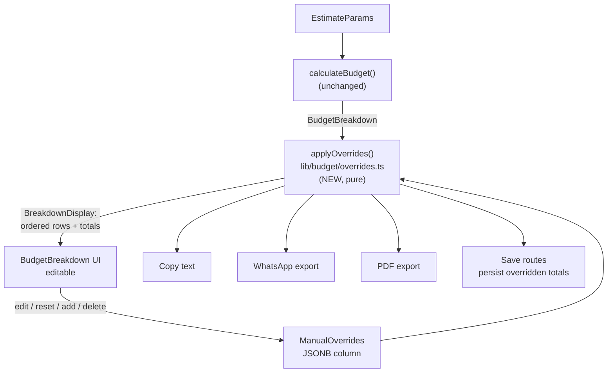
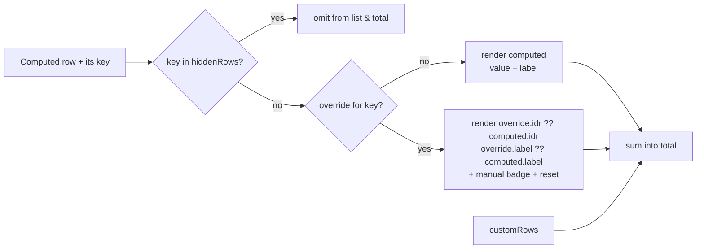

# feat: Manual (spreadsheet-style) editing of estimate cost breakdown

## Summary

Today the **Rincian Biaya** panel on the estimate page (`/estimate/new`, `/estimate/[id]`) is *fully derived* — `calculateBudget(params, pricingConfig)` recomputes every row on each render, save, and export. Nothing about the rows is stored; the DB keeps only `params`, `rawInput`, `aiNotes`, `title`, and denormalized totals.

This plan adds a **manual-override layer** so an admin can edit the breakdown like a spreadsheet: change any row's amount, rename any row, delete a row, and add custom line-items (e.g. "Manasik", "Handling"). Manual edits are **sticky** — they survive parameter recomputes and are cleared only by an explicit per-row reset. Overrides **persist to the DB** and flow through every downstream surface (on-screen total, Copy, WhatsApp export, PDF export) so the numbers sent to a jamaah are exactly the numbers the admin edited.

**Product Contract preservation:** N/A — solo (bootstrap) plan, no upstream requirements doc.

---

## Problem Frame

**Who:** Admin users (the estimator is admin-gated in `app/(dashboard)/estimate/new/page.tsx`).

**Problem:** The auto-calculated breakdown is a good starting point but can't reflect real negotiated prices, one-off costs, or line items the pricing engine doesn't model. Admins currently have no way to adjust a specific number without changing global pricing config or accepting a wrong figure. They want an Excel-like edit surface on the rows already shown.

**Current shape:** `calculateBudget()` (`lib/budget/calculate.ts:78`) returns a `BudgetBreakdown` with fixed fields — `hotelMadinahIdr`, `hotelMakkahIdr`, `serviceItems[]`, `flightIdr`, `totalIdrPax`, `totalIdrGrp`. It is called in four places, each of which renders those fields directly:
1. `components/estimator/EstimatorClient.tsx:121` (live UI)
2. `app/api/estimate/route.ts:114` (POST save → stores totals)
3. `app/api/estimate/[id]/route.ts` (PATCH save → stores totals)
4. `app/api/estimate/[id]/export/route.ts:34` (export → WhatsApp/PDF)

Because the breakdown is not persisted, there is no seam today to inject manual edits or carry them to exports.

---

## Requirements

- **R1** — Admin can edit the **amount (Rp)** of any existing computed row inline.
- **R2** — Admin can edit the **label** of any existing computed row inline.
- **R3** — Admin can **delete** (hide) any computed row from the breakdown and total.
- **R4** — Admin can **add** custom rows (free label + Rp amount) that count toward the total.
- **R5** — Manual edits are **sticky**: changing parameters (nights, pax, hotel, etc.) recomputes only rows that have no override; overridden rows keep their manual value.
- **R6** — Each overridden/hidden row shows a **"manual" badge** and a **reset (↺)** control that restores it to the auto-computed value/visibility.
- **R7** — The **Total per Orang** and **Total grup** recompute from the merged (override-aware) rows.
- **R8** — Overrides **persist to the DB** on save and reload with the estimate.
- **R9** — Overrides are reflected in **Copy**, **WhatsApp export**, and **PDF export** — all three render the merged rows, not the raw computed breakdown.
- **R10** — An estimate with no overrides behaves exactly as today (backward compatible; no visual or numeric change).

**Success criteria:** An admin opens an estimate, changes "Hotel Makkah" to a negotiated Rp value and adds a "Manasik" row, saves, reopens it — the edits are intact, the total reflects them, and the WhatsApp/PDF export shows the same numbers.

---

## Key Technical Decisions

**KTD1 — Overrides live in a separate JSONB column, not inside `params`.**
`params` is the *input* to the pricing engine and is validated by `validateEstimateParamsShape`. Overrides are an *output-layer* concern applied after computation. Mixing them would corrupt the clean "params → calculateBudget" contract and every existing param validator/test. Add a new nullable `manual_overrides jsonb` column on `estimates`. Null/absent = today's behavior (satisfies R10).

**KTD2 — One pure merge layer (`applyOverrides`) sits downstream of `calculateBudget`, and every consumer routes through it.**
Rather than teach four call sites about overrides, introduce `lib/budget/overrides.ts` exposing `applyOverrides(breakdown, overrides, pax) → BreakdownDisplay` (`pax` is required to derive `totalIdrGrp`) (an ordered row list + override-aware totals). UI, Copy, WhatsApp, PDF, and save-time total computation all consume `BreakdownDisplay`. This keeps override semantics in exactly one tested place. Consumers stop reading raw `breakdown.hotelMadinahIdr` etc. and read the merged rows instead.

**KTD3 — Overrides pin to *stable row keys*, which the merge layer defines canonically.**
For stickiness (R5) and per-row reset (R6), each computed row needs an identity independent of its label. Canonical keys: `hotelMadinah`, `hotelMakkah`, `service:<ServiceKey>` (e.g. `service:VISA`), `flight`. Custom rows carry a generated `id`. Overrides are keyed maps, so a param change that recomputes `hotelMadinah` still finds its override by key.

**KTD4 — Sticky precedence: manual value wins per-row until reset (R5).**
`applyOverrides` resolves each row as: `override.idr ?? computed.idr` and `override.label ?? computed.label`; `hiddenRows` drop a computed row entirely; `customRows` append. Reset = delete that key from the override map, so the row falls back to computed. This is preferred over "recompute wipes edits" because the whole point is negotiated numbers surviving param tweaks (chosen by user).

**KTD5 — Override shape is validated at the API boundary with a dedicated `validateManualOverrides`.**
Mirrors the existing `validateEstimateParamsShape` pattern in `lib/estimate/params.ts`. Rejects malformed maps, non-integer/negative amounts, over-long labels, and unknown row keys that aren't `custom` — so a hostile client can't inject arbitrary structure into the JSONB column.

**KTD6 — Persisted totals are the *overridden* totals.**
`estimates.totalIdrPax` / `totalIdrGrp` (used by dashboard cards and sorting) must reflect what the admin sees. Save routes compute them via `applyOverrides`, not raw `calculateBudget`.

---

## High-Level Technical Design

The feature inserts a single pure merge layer between the existing pricing engine and every consumer. Nothing computes a breakdown twice; overrides are resolved once per surface.



**Per-row precedence resolved by `applyOverrides`:**



---

## Data Model

New JSONB column `manual_overrides` on `estimates` (nullable). Shape (TypeScript, added to `types/index.ts`):

```ts
// Directional shape — not final implementation
interface RowOverride { label?: string; idr?: number }   // partial, per computed row key

interface CustomRow { id: string; label: string; idr: number }

interface ManualOverrides {
  overrides: Record<string, RowOverride>   // key: "hotelMadinah" | "hotelMakkah" | "service:VISA" | "flight"
  customRows: CustomRow[]
  hiddenRows: string[]                      // computed-row keys the admin removed
}

// Output of the merge layer, consumed by UI + exports + totals
interface BreakdownDisplayRow {
  key: string
  label: string
  idr: number
  sublabel?: string        // e.g. hotel formula, kept for computed rows unless overridden
  source: "computed" | "overridden" | "custom"
  shared?: boolean         // preserve existing ÷pax badge for service rows
}

interface BreakdownDisplay {
  rows: BreakdownDisplayRow[]
  totalIdrPax: number
  totalIdrGrp: number
  sarRate: number
  usdRate: number
}
```

An override map is stored only when non-empty; an estimate with no manual edits stores `null` (R10).

---

## Implementation Units

### U1. Override types and canonical row keys

**Goal:** Define the override data model and the single source of canonical row keys that stickiness depends on.
**Requirements:** R1–R5, R10 (foundation).
**Dependencies:** none.
**Files:**
- `types/index.ts` (add `RowOverride`, `CustomRow`, `ManualOverrides`, `BreakdownDisplayRow`, `BreakdownDisplay`)
**Approach:** Add the interfaces from the Data Model section. Export a `const` list / helper for the canonical computed-row keys (`hotelMadinah`, `hotelMakkah`, `service:<key>`, `flight`) so U2 and the validator share one definition rather than duplicating string literals. Keep `BudgetBreakdown` unchanged — the display types are additive.
**Patterns to follow:** existing enum + interface style in `types/index.ts`.
**Test scenarios:** `Test expectation: none — pure type/constant declarations, exercised by U2's tests.`

### U2. Pure override-merge layer (`applyOverrides`) + validator

**Goal:** The one tested place where computed breakdown + overrides become a `BreakdownDisplay`, plus boundary validation of override shape.
**Requirements:** R4, R5, R6 (reset semantics), R7, R9.
**Dependencies:** U1.
**Files:**
- `lib/budget/overrides.ts` (new) — `applyOverrides(breakdown, overrides, pax)`, `computeOverriddenTotals`, and a `breakdownToBaseRows(breakdown, pax)` helper that flattens the fixed `BudgetBreakdown` fields into keyed base rows (mirrors the row assembly currently inlined in `BudgetBreakdown.tsx:54`).
- `lib/estimate/overrides.ts` (new) — `validateManualOverrides(v): v is ManualOverrides` (co-located with the existing `params.ts` validators; keep `params.ts` focused).
- `lib/budget/__tests__/overrides.test.ts` (new)
- `lib/estimate/__tests__/overrides.test.ts` (new)
**Approach:** `breakdownToBaseRows` produces the ordered base rows (Hotel Madinah, Hotel Makkah, each service, Penerbangan) with canonical keys, formulas as `sublabel`, and the `shared` flag for divide-by-pax services. `applyOverrides` then: drops `hiddenRows`, applies `override.idr/label` per remaining row (marking `source:"overridden"` when either present), appends `customRows` as `source:"custom"`, and recomputes `totalIdrPax` = sum of visible row idr; `totalIdrGrp = totalIdrPax * pax`. Null/empty overrides → rows identical to today's UI order and values (guarantees R10). Validator rejects: non-object, unknown keys not in the canonical set and not custom, non-integer or negative `idr`, labels over a max length, `customRows` without id/label/idr.
**Execution note:** Pure logic with sticky/precedence rules — implement test-first.
**Patterns to follow:** `validateEstimateParamsShape` in `lib/estimate/params.ts`; row assembly in `components/estimator/BudgetBreakdown.tsx:54-71`.
**Test scenarios:**
- Empty/undefined overrides → rows and totals byte-identical to base breakdown (order preserved). *Covers R10.*
- Amount override on `hotelMakkah` → that row's idr replaced, `source:"overridden"`, total reflects new value, other rows unchanged. *Covers R1, R7.*
- Label override only → idr stays computed, label replaced, `source:"overridden"`. *Covers R2.*
- `hiddenRows:["flight"]` → Penerbangan absent from rows and excluded from total. *Covers R3.*
- Custom row added → appended with `source:"custom"`, counted in total. *Covers R4.*
- Override for `service:VISA` when that service isn't selected (not in base rows) → override ignored, no phantom row. (Stickiness edge — override key present but base row absent.) *Covers R5.*
- Reset semantics: absence of a key = computed fallback (assert removing a key returns the row to computed value). *Covers R6.*
- `totalIdrGrp = totalIdrPax * pax` after overrides.
- `validateManualOverrides`: accepts a well-formed object; rejects negative idr, non-integer idr, unknown non-custom key, over-length label, custom row missing `idr`, and non-object input.

### U3. DB migration and schema column

**Goal:** Persist overrides.
**Requirements:** R8, R10.
**Dependencies:** none (can land in parallel with U1/U2).
**Files:**
- `lib/db/schema.ts` (add `manualOverrides: jsonb("manual_overrides")` to `estimates`, nullable)
- `drizzle/migrations/0012_*.sql` (generated via `pnpm db:generate`)
**Approach:** Add the nullable column after `params` in the `estimates` table (`lib/db/schema.ts:201`). Generate the migration with drizzle-kit (do not hand-write the SQL — follow the existing generated-migration convention; sequence continues after `0011_far_rictor.sql`). Nullable with no default so existing rows read as "no overrides".
**Execution note:** Config/schema unit — verify by running `pnpm db:generate` and confirming the emitted SQL is an additive `ALTER TABLE ... ADD COLUMN`, then `pnpm db:migrate` against a dev DB.
**Patterns to follow:** existing `jsonb` columns (`params`, activity-log `input/output/metadata`); prior additive migrations like `0006_add_faq_management.sql`.
**Test scenarios:** `Test expectation: none — schema/migration; covered indirectly by U5 save-route tests. Verify the migration is additive and nullable.`

### U4. Editable BudgetBreakdown UI + EstimatorClient wiring

**Goal:** Turn the read-only Rincian Biaya panel into a spreadsheet-like editor and thread override state through the client.
**Requirements:** R1–R7.
**Dependencies:** U1, U2.
**Files:**
- `components/estimator/BudgetBreakdown.tsx` (make rows editable; consume `BreakdownDisplay` from `applyOverrides`)
- `components/estimator/EstimatorClient.tsx` (hold `manualOverrides` in reducer state, apply overrides for render, wire load/save/dirty)
- `components/estimator/__tests__/BudgetBreakdown.test.tsx` (extend)
**Approach:**
- `EstimatorClient`: add `manualOverrides` to `State` and an `UPDATE_OVERRIDES` reducer action (merge-patch like `UPDATE_PARAMS`). Compute `const display = applyOverrides(breakdown, state.manualOverrides, state.params.pax)` and pass `display` to `BudgetBreakdown`. Seed from a new `existingOverrides` prop (detail page). Include overrides in the `paramsUnchanged` dirty check so editing a row enables the save button; extend the save `body` to send `manualOverrides` (see U5).
- `BudgetBreakdown`: render `display.rows`. Each row: inline-editable label (text) and amount (numeric, IDR-parsed) via controlled inputs that emit override patches; an `x` control to hide a computed row / delete a custom row; a "+ Tambah baris" control to append a custom row (generate `id` client-side). Rows with `source:"overridden"` or hidden show a **manual badge** and a **↺ reset** button (emits an override-key deletion). Preserve the existing `÷pax` badge, hotel `sublabel` formulas, kurs footer, and soft-selling note. `buildCopyText` now iterates `display.rows` (satisfies the Copy half of R9).
**Execution note:** Start from the current render in `BudgetBreakdown.tsx:109-135`; keep the non-editable read path identical when there are zero overrides so R10 holds visually.
**Patterns to follow:** reducer + dispatch pattern already in `EstimatorClient.tsx:42`; `ParamsPanel` onChange-patch convention; existing inline styling with CSS vars.
**Test scenarios:**
- Renders computed rows unchanged when `manualOverrides` is empty. *Covers R10.*
- Editing an amount input dispatches an override patch and the displayed total updates. *Covers R1, R7.*
- Editing a label updates that row's text only. *Covers R2.*
- Delete control hides a computed row and drops it from the total. *Covers R3.*
- "Tambah baris" adds an editable custom row that counts toward the total. *Covers R4.*
- An overridden row shows the manual badge + reset; clicking reset restores the computed value and removes the badge. *Covers R6.*
- Changing pax/nights (param change) leaves an overridden row's manual value intact while a non-overridden row recomputes. *Covers R5 (integration across ParamsPanel → EstimatorClient → BudgetBreakdown).*
- Copy text reflects an overridden amount and a custom row. *Covers R9 (copy path).*

### U5. Save APIs accept, validate, and persist overrides

**Goal:** POST and PATCH store `manualOverrides` and override-aware totals.
**Requirements:** R7 (override-aware totals, per KTD6), R8.
**Dependencies:** U1, U2, U3.
**Files:**
- `app/api/estimate/route.ts` (POST)
- `app/api/estimate/[id]/route.ts` (PATCH)
- `app/api/estimate/__tests__/save-route.test.ts`, `app/api/estimate/__tests__/route.test.ts` (extend)
**Approach:** Accept optional `manualOverrides` in the request body. When present, run `validateManualOverrides` (return `400 "manual overrides invalid"` on failure, with an `estimate_save`/`estimate_update` error activity log entry mirroring the existing validation-failure logging). Compute totals from `applyOverrides(calculateBudget(params, pricing), overrides, params.pax)` instead of raw breakdown, and persist `manualOverrides` (or `null` when absent/empty) plus the overridden `totalIdrPax`/`totalIdrGrp`. Detail page (`app/(dashboard)/estimate/[id]/page.tsx`) passes `estimate.manualOverrides` into `EstimatorClient` as `existingOverrides`.
**Patterns to follow:** the validate → log-on-error → compute → insert/update flow already in `app/api/estimate/route.ts:62-142` and the PATCH block in `[id]/route.ts`.
**Test scenarios:**
- POST with valid overrides persists the column and stores overridden totals (not raw). *Covers R8, R6.*
- POST with malformed overrides → 400 + error activity log; no row inserted.
- POST without `manualOverrides` behaves exactly as today (column null, raw totals). *Covers R10.*
- PATCH updating overrides recomputes and stores new totals; GET returns them.
- PATCH clearing overrides (empty/absent) resets the column to null and restores raw totals.

### U6. Export parity (WhatsApp, PDF, export route)

**Goal:** Exports render the merged rows so sent numbers match the edited screen.
**Requirements:** R9.
**Dependencies:** U1, U2, U3 (export route reads the `manualOverrides` column added in U3).
**Files:**
- `lib/export/whatsapp.ts`
- `lib/export/pdf.ts`
- `app/api/estimate/[id]/export/route.ts`
- `lib/export/__tests__/*` (extend existing export tests)
**Approach:** Export route loads `estimate.manualOverrides`, builds `display = applyOverrides(calculateBudget(params, pricing), overrides, params.pax)`, and passes `display` to both generators. Refactor `generateWhatsAppText` (currently iterates `breakdown.hotelMadinahIdr` / `serviceItems` / `flightIdr` at `whatsapp.ts:42-55`) and the PDF row builders (`pdf.ts:134-166`) to iterate `display.rows` and use `display.totalIdrPax/Grp`. Preserve headers, hotel sublabels (from row `sublabel`), kurs footer, and disclaimers. Rows with `source:"custom"` render label + amount only (no formula sublabel).
**Execution note:** Behavior-preserving refactor for the zero-override case — assert existing export snapshots/text are unchanged when no overrides exist before adding override cases.
**Patterns to follow:** current `row(label, value)` helper in `whatsapp.ts:38`; `styles.row` element construction in `pdf.ts`.
**Test scenarios:**
- WhatsApp text with no overrides is unchanged from current output. *Covers R10.*
- WhatsApp text reflects an overridden amount, a renamed row, a hidden row, and a custom row, with a matching total. *Covers R9.*
- PDF generation succeeds with overrides present and includes custom rows / excludes hidden rows (assert on the row model passed to the renderer or generated text, not pixel output).
- Export route selects overridden totals for both formats.

---

## Scope Boundaries

**In scope:** editable amounts, labels, add/delete rows, sticky per-row overrides with reset, DB persistence, and export/copy parity — for the estimate breakdown only, admin-gated as today.

### Deferred to Follow-Up Work
- Column-level edits beyond label/amount (e.g. editing the per-night SAR formula inputs inline) — this plan edits the *result* rows, not the formula.
- Reordering rows via drag-and-drop.
- Per-row currency entry (all custom rows are IDR).
- An override audit trail / "edited by" history beyond the existing `activity_logs` entries.
- Undo/redo stack for edits within a session.

**Non-goals:** changing the pricing engine (`calculateBudget`) math, changing global pricing config, or exposing manual editing to non-admin users.

---

## Risks & Dependencies

- **Total drift between UI and DB.** If any surface computes totals from raw `breakdown` instead of `applyOverrides`, the dashboard number won't match the edited screen. *Mitigation:* KTD2 — a single merge layer; U5/U6 explicitly route through it; tests assert overridden totals persist and export.
- **Backward compatibility.** Existing estimates have no override column. *Mitigation:* nullable column + `applyOverrides` treating null as identity; R10 test scenarios in U2/U4/U5/U6 assert zero-override output is unchanged.
- **Untrusted JSONB.** Overrides are client-supplied and stored raw. *Mitigation:* `validateManualOverrides` at both save routes (KTD5) with negative/non-integer/unknown-key/length rejection.
- **Stale override keys.** A service override whose service is later deselected leaves an orphan key. *Mitigation:* `applyOverrides` ignores override keys with no matching base row (tested); orphans are harmless and can be pruned on save.
- **Dependency:** U4/U5/U6 all depend on U2's `applyOverrides` contract; land U1+U2 first and keep the `BreakdownDisplay` shape stable.

---

## Verification Contract

- `pnpm test` green, including new `lib/budget/__tests__/overrides.test.ts`, `lib/estimate/__tests__/overrides.test.ts`, extended estimator, save-route, and export tests.
- `pnpm db:generate` produces one additive `ALTER TABLE estimates ADD COLUMN manual_overrides jsonb` migration; `pnpm db:migrate` applies cleanly.
- Manual smoke: edit an amount + rename a row + add a custom row on `/estimate/new`, save, reopen from dashboard — edits intact, total correct; download PDF and copy WhatsApp text — both show the edited numbers.
- Zero-override regression: an unedited estimate renders, saves, and exports identically to pre-change behavior.

## Definition of Done

All six units implemented and merged; every R1–R10 requirement has passing coverage; migration applied; exports and dashboard totals reflect overrides; unedited estimates are byte-for-byte unchanged in UI and exports.

---

## Sources & Research

- Live UI + row assembly: `components/estimator/BudgetBreakdown.tsx`, `components/estimator/EstimatorClient.tsx`
- Pricing engine (single breakdown source): `lib/budget/calculate.ts:78`
- Save/validate flow: `app/api/estimate/route.ts`, `app/api/estimate/[id]/route.ts`, `lib/estimate/params.ts`
- Export renderers: `lib/export/whatsapp.ts`, `lib/export/pdf.ts`, `app/api/estimate/[id]/export/route.ts`
- Schema + migration convention: `lib/db/schema.ts:201`, `drizzle/migrations/`, `package.json` (`db:generate`/`db:migrate`)
- Scoping decisions confirmed with user: full spreadsheet editing (values + labels + add/remove), sticky "manual wins until reset" precedence, persist to DB + reflect in all exports.
