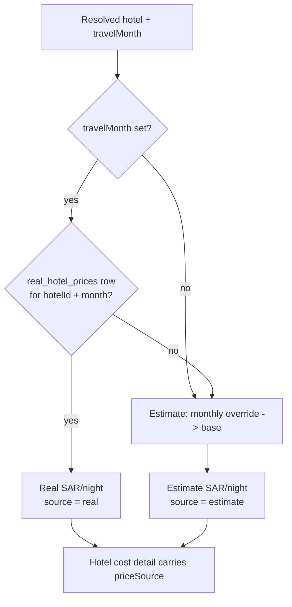
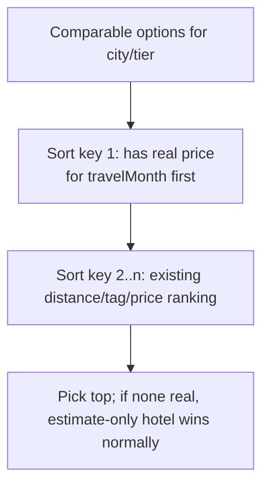

# feat: Real Hotel Price Layer (real-first, estimate fallback)

## Summary

The estimator currently prices hotels from `hotel_prices` / `hotel_monthly_prices` (SAR/night), which are **estimates** and often wrong. This adds a **real price layer** sourced from hotel price-catalog PDFs: an admin transcribes each catalog into the existing CSV import shape, which upserts a new `real_hotel_prices` table (per hotel, per month). Budget resolution then prefers the **real** price for the requested `travelMonth`, falling back to the existing estimate when no real price exists. When no hotel is explicitly named, hotel selection prefers real-priced hotels among the tag/tier/distance-comparable options the parser already ranks (`pelataran`, `jalan kaki`, `ring 1`, …).

**Scope confirmed with user:** separate real-price table (estimate data untouched), monthly/seasonal prices, real-first resolution, structured import via the existing CSV path. A dedicated admin UI for managing catalogs is **deferred**.

---

## Problem Frame

- **Who:** Admin (curates real prices) and jamaah/sales users (get more accurate estimates).
- **Pain:** `hotel_prices.sarPerNight` (+ monthly overrides) are ballpark estimates; quoted totals drift from reality, and the recent editable-breakdown work only lets users *hand-correct* after the fact.
- **Goal:** Give the estimator an authoritative price source per hotel per month, used automatically before the estimate, without discarding the estimate fallback for hotels/months not yet catalogued.
- **Non-goal:** Reading PDFs at runtime, an AI PDF-extraction pipeline, or a bespoke admin catalog UI (all deferred — see Scope Boundaries).

---

## Requirements

- **R1** — Store real hotel prices per hotel per month (1-12), separate from the estimate tables, traceable to a source catalog.
- **R2** — Budget calculation uses the real SAR/night for the resolved hotel + `travelMonth` when present; otherwise falls back to today's estimate resolution (monthly override → base). Real requires a month (real prices are seasonal).
- **R3** — Real prices enter through the existing hotel-pricing CSV import mechanism (admin transcribes the PDF), matching **existing** hotels by `importKey`; unmatched rows are reported, not silently created.
- **R4** — When no hotel is explicitly named, selection prefers real-priced hotels among the comparable set, keeping the existing tag/tier/distance ranking (`pelataran`, `jalan kaki`, `dekat`, proximity). If no real-priced hotel is comparable, fall back to estimate-only hotels.
- **R5** — The resolved price's source (`real` | `estimate`) is available to downstream surfaces so it can be shown to build trust and asserted in tests.
- **R6** — No regression: with no `real_hotel_prices` rows, every estimate produces byte-identical output to today.

---

## Key Technical Decisions

- **KTD1 — Separate `real_hotel_prices` table mirroring `hotel_monthly_prices`.** Columns: `hotelPriceId` (FK → `hotel_prices`, cascade), `month` (1-12), `sarPerNight`, `sourceLabel` (catalog provenance, e.g. "Katalog Emaar 2027"), `updatedAt`, `unique(hotelPriceId, month)`. Keeps the estimate tables untouched (clean rollback, R1/R6) and reuses a proven shape. Rejected: a `source: real|estimate` flag on `hotel_monthly_prices` — mixes two concepts in one table and complicates the "estimate untouched" guarantee.
- **KTD2 — Real price is a per-hotel-option `realMonthlyPrices` map on `PricingConfig`, parallel to the existing `monthlyPrices`.** `fetchPricingConfig` loads both; parser and calculator read from one config object. Mirrors the current `monthlyPrices: Record<month, sar>` exactly.
- **KTD3 — Resolution is month-gated.** Real prices are seasonal, so real-first applies only when `travelMonth` is set. `travelMonth == null` → estimate base (unchanged). Documented so it isn't mistaken for a bug.
- **KTD4 — Import reuses `parseHotelPricingCsv` + `normalizeHotelPricingImportKey`.** The real-price CSV shares the estimate import's header/month-column shape (`lib/admin/hotel-pricing-import.ts`), so admins use one familiar format; the real importer only differs in its **target table** and in **matching to existing hotels only** (no create). Rejected: a new CSV grammar — needless divergence.
- **KTD5 — Real-priced-hotel preference is a soft primary sort key in `findComparableHotel`,** applied before the existing distance/price ranking, and never *excludes* estimate-only hotels. Satisfies R4 ("real dulu, kalau tidak ada pakai estimasi") without narrowing the candidate pool.

Product Contract preservation: N/A (solo bootstrap; no upstream brainstorm).

---

## High-Level Technical Design

Price resolution for a single resolved hotel (Madinah or Makkah), given `travelMonth`:

Hotel **selection** when no hotel is named (parser side), among options for the city+tier:

Data flow: `real_hotel_prices` (DB) -> `fetchPricingConfig` attaches `realMonthlyPrices` per hotel -> parser prefers real-priced hotels (KTD5) & annotates the prompt -> `calculateBudget` resolves real-first (KTD3) and stamps `priceSource`.

---

## Implementation Units

### U1. `real_hotel_prices` schema + migration

**Goal:** Add the real-price table and its Drizzle migration.
**Requirements:** R1.
**Dependencies:** none.
**Files:**
- `lib/db/schema.ts` (add `realHotelPrices` table + inferred types, mirroring `hotelMonthlyPrices` at lines 113-128)
- `drizzle/migrations/00NN_real_hotel_prices.sql` (generated)
**Approach:** Define `realHotelPrices` with `hotelPriceId` FK (`onDelete: "cascade"`), `month` integer, `sarPerNight` integer, `sourceLabel` text, `updatedAt`, and `unique(hotelPriceId, month)`. Export `RealHotelPrice = typeof realHotelPrices.$inferSelect`. Generate the migration with the repo's drizzle-kit flow (`db:generate`); do not hand-write SQL beyond what generation produces.
**Patterns to follow:** `hotelMonthlyPrices` table definition and the existing `drizzle/migrations/*.sql` files.
**Test scenarios:**
- Migration applies cleanly on a schema that already has `hotel_prices` (FK resolves).
- Deleting a `hotel_prices` row cascades and removes its `real_hotel_prices` rows.
- `unique(hotelPriceId, month)` rejects a duplicate (hotel, month) insert.
**Verification:** `db:generate` produces one migration; a local `db:push`/migrate creates the table; the unique + FK constraints exist.

### U2. Load real prices into `PricingConfig`

**Goal:** Surface each hotel option's real monthly prices alongside its estimate `monthlyPrices`.
**Requirements:** R1, R6.
**Dependencies:** U1.
**Files:**
- `types/index.ts` (add `realMonthlyPrices: Record<number, number>` to `HotelPriceConfig` / `HotelOptionConfig`; extend `PricingConfig` if a top-level lookup is cleaner)
- `lib/budget/calculate.ts` (`fetchPricingConfig`: query `realHotelPrices`, build `realByHotelId` map, attach per option — mirror the existing `monthlyByHotelId` build at the hotel-options assembly)
**Approach:** Add a `db.select().from(realHotelPrices)` to the `Promise.all`, fold into `monthlyByHotelId`-style `realByHotelId[hotelPriceId][month] = sarPerNight`, and set `realMonthlyPrices: realByHotelId[h.id] ?? {}` on each hotel config (both `hotelsMap` and `hotelOptionsMap`). Default to `{}` so absence is a no-op (R6).
**Patterns to follow:** the `monthlyByHotelId` / `hotelMonthlyPrices` loading already in `fetchPricingConfig`.
**Test scenarios:**
- With no real rows, `realMonthlyPrices` is `{}` on every option and downstream output is unchanged.
- A hotel with real rows for months 2 and 8 exposes exactly `{2: x, 8: y}`.
- A real row whose `hotelPriceId` no longer exists is simply absent (no crash) — guarded by the FK, but assert the map build tolerates it.
**Verification:** unit test on a `fetchPricingConfig`-shaped assembly (or the map builder extracted as a pure helper) shows correct `realMonthlyPrices` wiring.

### U3. Real-first price resolution + `priceSource`

**Goal:** Prefer the real SAR/night for the requested month; expose which source was used.
**Requirements:** R2, R5, R6.
**Dependencies:** U2.
**Files:**
- `lib/budget/calculate.ts` (`resolveHotelSar` → return `{ sarPerNight, source }`; thread `source` through `calculateBudget` into `hotelMadinahDetail` / `hotelMakkahDetail`)
- `types/index.ts` (add `priceSource: "real" | "estimate"` to `HotelCostDetail`)
**Approach:** In `resolveHotelSar(config, travelMonth)`: if `travelMonth != null` and `config.realMonthlyPrices[travelMonth] != null`, return that with `source: "real"`; else current logic (monthly estimate override → base) with `source: "estimate"` (KTD3). Set `priceSource` on each hotel's `HotelCostDetail`. No change to the SAR→IDR math.
**Execution note:** Behavior-bearing pricing change — add the failing calculation test first (real overrides estimate for the month; estimate wins when no real row), then implement.
**Patterns to follow:** existing `resolveHotelSar` and `calculateHotelIdrPerPerson` in `calculate.ts`.
**Test scenarios:**
- Hotel has real=SAR 900 for month 2, estimate base=650 → month 2 total uses 900, `priceSource: "real"`.
- Same hotel, `travelMonth=8` with no real row for 8 → estimate path, `priceSource: "estimate"`.
- `travelMonth=null` → estimate base even if real rows exist (KTD3), `priceSource: "estimate"`.
- Real present for Makkah but not Madinah → Makkah `real`, Madinah `estimate` in one estimate.
- No real rows anywhere → identical `hotelMadinahIdr` / `hotelMakkahIdr` / totals to the pre-change fixture (R6 regression guard).
**Verification:** `lib/budget/__tests__/calculate.test.ts` covers the matrix above and the regression fixture is unchanged.

### U4. Real-price CSV import (existing-hotel match only)

**Goal:** Ingest a transcribed catalog into `real_hotel_prices` via the existing CSV shape.
**Requirements:** R1, R3.
**Dependencies:** U1.
**Files:**
- `lib/admin/real-hotel-pricing-import.ts` (new — parse + upsert)
- `lib/admin/__tests__/real-hotel-pricing-import.test.ts` (new)
- the existing admin pricing-import API route (wire a `priceSource: "real"` mode, or a sibling endpoint) — locate the caller of `lib/admin/hotel-pricing-import.ts` under `app/api/admin/` and mirror it
**Approach:** Reuse `parseHotelPricingCsv` + `MONTH_COLUMNS` to parse the same header shape (hotel identity + 12 month columns) plus a `sourceLabel`. Resolve each row to an **existing** `hotel_prices.id` via `normalizeHotelPricingImportKey`; rows with no match are returned as `invalid`/`unmatched` (not created — KTD4). For matched rows, upsert `real_hotel_prices` on `(hotelPriceId, month)`. Wrap writes in a transaction. Do **not** touch `hotel_prices` or `hotel_monthly_prices`.
**Patterns to follow:** `lib/admin/hotel-pricing-import.ts` (parse/validate/status result shape) and its admin route handler.
**Test scenarios:**
- Valid CSV for an existing hotel with months 2 & 8 → two `real_hotel_prices` rows, `sourceLabel` stored.
- Re-import with a changed price for (hotel, month 2) → row updated in place (upsert on unique key), not duplicated.
- CSV row for a hotel not in `hotel_prices` → reported unmatched; nothing written.
- Blank/invalid month cell → row-level validation error, other rows still import.
- Import writes nothing to `hotel_prices` / `hotel_monthly_prices` (estimate tables untouched).
**Verification:** import test suite green; a sample catalog CSV round-trips into `real_hotel_prices` with correct provenance.

### U5. Prefer real-priced hotels in selection + prompt annotation

**Goal:** When no hotel is named, prefer real-priced hotels among comparable options, keeping tag/distance ranking.
**Requirements:** R4.
**Dependencies:** U2.
**Files:**
- `lib/ai/parse.ts` (`findComparableHotel` / `rankComparableHotels`: add a leading "has real price for travelMonth" sort key; thread `travelMonth` into selection)
- `lib/ai/prompt.ts` (`buildDynamicPricingBlock`: annotate options that have real prices, e.g. `, harga_real=ya`, so the LLM also leans toward them)
**Approach:** Compute `hasReal(hotel, travelMonth)` from `realMonthlyPrices`. In ranking, sort real-priced options ahead of estimate-only ones **before** the existing distance/price comparison (KTD5); never filter estimate-only options out. Keep `hasProximityIntent` / `distanceScore` untouched so `pelataran` / `jalan kaki` matching is preserved. Annotate the prompt's hotel-option lines when real coverage exists so the model's own choice aligns.
**Execution note:** The deterministic ranking is the source of truth; the prompt annotation is a hint. Test the ranking, not the LLM.
**Patterns to follow:** existing `findComparableHotel`, `rankComparableHotels`, `distanceScore` in `parse.ts`.
**Test scenarios:**
- Two same-tier options, one with a real price for the requested month → real-priced one selected, no explicit hotel named.
- Proximity intent ("pelataran") with a real-priced pelataran option → that option wins (real + tag both satisfied).
- Proximity intent where only an **estimate-only** hotel matches the tag → estimate hotel still selected (soft preference, R4 fallback).
- Explicit hotel named that has no real price → still selected (explicit request overrides preference); its price later resolves via estimate (U3).
- `travelMonth=null` → preference is inert; ranking equals today's behavior.
**Verification:** parse/selection unit tests cover the preference + fallback matrix; existing selection tests still pass.

### U6. Show price source in the breakdown (light)

**Goal:** Indicate on hotel rows whether the shown price is real or estimate.
**Requirements:** R5.
**Dependencies:** U3.
**Files:**
- `lib/budget/overrides.ts` (carry `priceSource` from `HotelCostDetail` onto the display row, if not already present via `hotelDetail`)
- `components/estimator/BudgetBreakdown.tsx` (a small badge on hotel rows: "harga real" vs "estimasi")
- `components/estimator/__tests__/BudgetBreakdown.test.tsx`
**Approach:** `hotelDetail` already flows to the display row; read `hotelDetail.priceSource` and render a `Badge` (reuse the existing `Badge` component) next to the hotel formula. Real → gold/positive tone; estimate → muted. Amount-overridden hotels drop `hotelDetail` already, so no badge there (correct — the number is manual).
**Test scenarios:**
- Hotel row with `priceSource: "real"` renders a "harga real" badge.
- Hotel row with `priceSource: "estimate"` renders an "estimasi" badge (or none, per final copy).
- Amount-overridden hotel row shows neither (hotelDetail absent).
**Verification:** component test asserts the badge per source; visual check deferred to browser verification.

---

## Scope Boundaries

**In scope:** `real_hotel_prices` table + migration; real-price loading into `PricingConfig`; real-first month-gated resolution with `priceSource`; real-price CSV import (existing-hotel match only) via the existing admin import mechanism; real-priced-hotel selection preference + prompt hint; a light source badge in the breakdown.

### Deferred to Follow-Up Work
- Dedicated admin UI to upload and manage real-price catalogs (list/edit/delete, per-catalog view). Real prices enter via the existing CSV import for now (admin transcribes the PDF).
- **AI-assisted PDF extraction** (upload a PDF, have Claude extract rows for review). Requires an `@anthropic-ai/sdk` bump for PDF document blocks + file-upload handling the app doesn't have yet.
- Creating **new** hotels from a real-price import (real prices attach to existing hotels only).
- Exposing `priceSource` in WhatsApp/PDF/Salin exports (breakdown UI only for now).

### Out of Scope (non-goals)
- Feeding PDFs to the LLM at estimate time.
- A year dimension on real prices (month-only, matching the current model). Revisit if catalogs span years.
- Changing the SAR→IDR math, room multipliers, or override behavior.

---

## Open Questions

- **Q1 — `travelMonth` coverage (most material).** Real prices are month-gated (KTD3), but the parser defaults `travelMonth=null` unless a month is mentioned, so a month-less estimate never reaches the real layer. Decide: (a) accept for v1 — real applies only to month-specified requests (current plan assumption); (b) default to a representative month; or (c) nudge users to pick a travel month to widen real-price coverage. Leaning (a).
- **Q2 — Multiple catalogs, same hotel+month.** `unique(hotelPriceId, month)` makes the latest import win; `sourceLabel` records provenance but conflicts aren't surfaced. Acceptable for v1 (latest catalog is authoritative); revisit if overlapping catalogs disagree.
- **Q3 — PDF↔DB hotel-name matching.** The real import matches by `importKey` / normalized label; a catalog that names hotels differently from `hotel_prices` yields `unmatched` rows the admin must reconcile by hand. Confirm `normalizeHotelPricingImportKey` is forgiving enough, or add an alias step, if catalog and DB naming diverge.

---

## Verification Contract

- `lib/budget/__tests__/calculate.test.ts` — real-first matrix (U3) + unchanged regression fixture (R6).
- `lib/admin/__tests__/real-hotel-pricing-import.test.ts` — parse/match/upsert/unmatched (U4).
- `lib/ai/parse.ts` selection tests — real preference + fallback (U5).
- `components/estimator/__tests__/BudgetBreakdown.test.tsx` — source badge (U6).
- Full suite + `tsc --noEmit` green; the pre-existing date-dependent webinar test failure is unrelated.
- Manual: import a small sample catalog CSV, run an estimate for a covered hotel+month, confirm the real price and "harga real" badge; run a covered hotel for an uncovered month, confirm estimate fallback.

## Definition of Done

- All six units landed with their tests; no regression in existing estimate/export/overrides suites.
- With zero `real_hotel_prices` rows, estimates are byte-identical to pre-change (R6).
- A catalogued hotel+month prices from the real layer with a visible source badge; uncatalogued hotel/month falls back to estimate.
- Unnamed-hotel requests prefer real-priced hotels while preserving `pelataran`/`jalan kaki` tag matching.

## Sources & Research

No external research — the approach is settled and every pattern exists locally: `hotel_monthly_prices` (table shape, U1), `fetchPricingConfig` monthly loading (U2), `resolveHotelSar` (U3), `lib/admin/hotel-pricing-import.ts` + `parseHotelPricingCsv` (U4), `findComparableHotel` / `distanceScore` / `hasProximityIntent` (U5). Related prior plans: `docs/plans/2026-05-08-001-feat-hotel-pricing-csv-import-plan.md`, `docs/plans/2026-05-09-002-feat-concrete-hotel-selection-plan.md`, `docs/plans/2026-05-11-001-feat-hotel-price-distance-metadata-plan.md`.
