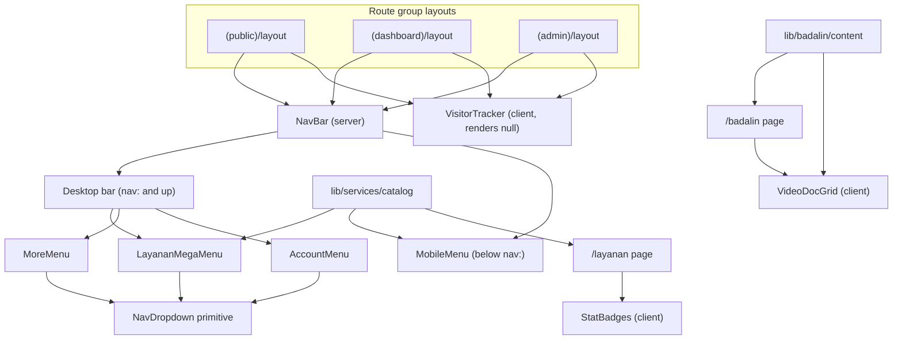
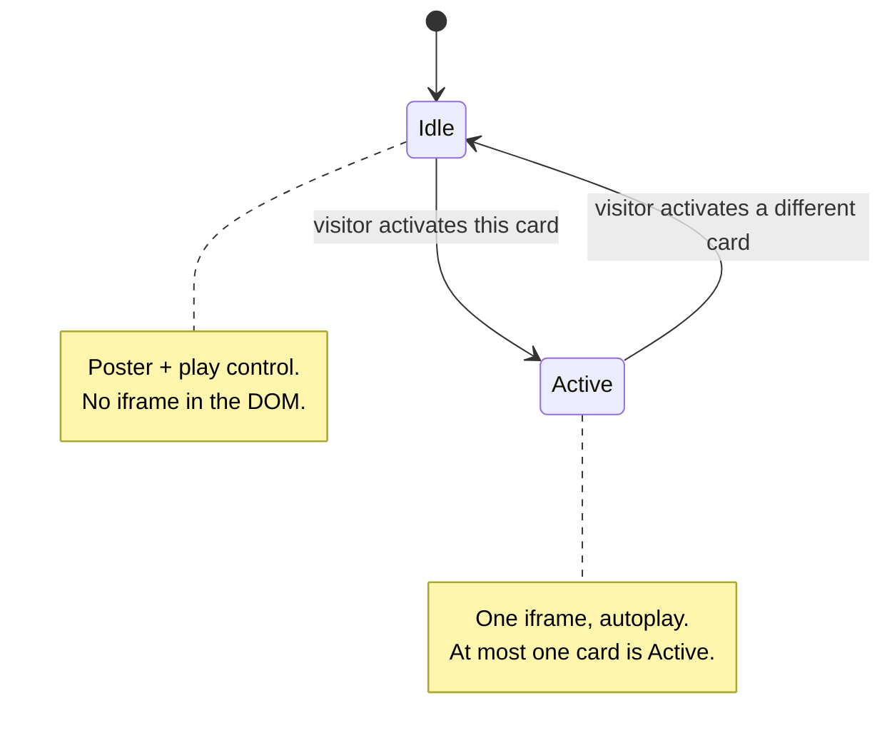

# SSU Navigasi & Layanan - Plan

## Goal Capsule

**Objective:** Port the Claude Design project *SSU Navigasi & Layanan* into the app — a rebuilt desktop navbar and mobile menu with a new information architecture, plus the two public pages the design introduces (`/layanan`, `/badalin`).

**Authority hierarchy:** This plan > the design file's visual intent > the design file's literal markup. The design is a `.dc.html` Design Canvas artifact; its inline styles, CDN icon masks, and JS-driven breakpoint are preview mechanics, not shipping code. Where this plan deviates from the design (admin sub-navigation, CTA gating, breakpoint mechanism), the plan wins and says why.

**Execution profile:** Sequential — U1 and U2 are groundwork every later unit imports; U3 must land before U4/U5 remove the stat badges from the navbar; U6 and U7 are independent of each other once U2 exists.

**Stop conditions:** Stop and ask if (a) the visitor-tracking split changes the numbers `/api/visitor` returns, or (b) an existing test outside `components/nav/` starts failing — that signals the nav change reached further than intended.

**Tail ownership:** Real YouTube IDs, real Badalin prices, and dedicated pages for Booking HHR / Muthowwif are explicitly out of this plan (see Scope Boundaries).

---

## Product Contract

### Summary

Replace the current navbar and mobile menu with the design's condensed IA — a **Layanan** mega menu carrying the full six-service catalog, a **Lainnya** overflow dropdown, and an avatar-based account menu — and add the two public pages the design defines: `/layanan` (service catalog, and the new home of the community stat badges) and `/badalin` (a new service page with a video documentation grid).

### Problem Frame

**Who:** Every visitor to the public site, plus admins who navigate to the admin area through the nav.

**Problem.** The current navbar puts nine text links, three stat pills, a CTA, the user's email, and a sign-out button on one 56px row. On a 1280px viewport it does not fit: the email truncates mid-domain, two-word labels ("Cerita Jamaah", "Hotel Nusuk", "Panel Admin") wrap to a second line inside a fixed-height container, and items push past the right edge. On mobile, the overlay is a flat 10-item list plus two collapsible groups with a 7-item admin sub-list, separated by `border-b border-[var(--color-surface)]` — `rgba(255,255,255,0.03)`, effectively invisible. The brand mark is `` sized `h-8 w-auto` in the overlay, which renders as a broken-image placeholder.

**The deeper cause is IA, not CSS.** Every destination sits at the top level, so the row grows linearly with the site. The design fixes that by grouping: services move into a mega menu, secondary content moves into an overflow dropdown, account actions move behind an avatar, and the stat pills move off the nav entirely onto a page that has room for them.

**Two new surfaces come with it.** The design's service catalog names six services, of which only Visa Umroh and Sewa Transportasi have pages today. It also introduces **Badalin** — a badal umroh service whose selling point is documentation, so its page is built around a grid of nine YouTube recordings.

### Requirements

**Desktop navigation**

- R1. The desktop bar carries five targets: brand wordmark, Layanan (mega-menu trigger), Panduan, Komunitas, Lainnya (overflow trigger) — plus the CTA and account control on the right.
- R2. The Layanan mega menu spans the nav width and renders all six catalog services as cards with icon, name, description, and price, a BARU badge on new services, and a footer row linking to `/layanan`.
- R3. The Lainnya dropdown holds Cerita Jamaah, Hotel Nusuk, FAQ, and Webinar.
- R4. The account control is an avatar button; its menu shows the signed-in user's name and email, Dashboard, the admin group when the user is an admin, and Keluar.
- R5. A signed-out visitor sees a Masuk control in place of the avatar.
- R6. At most one nav overlay is open at a time; a click outside or the Escape key closes whichever is open.

**Mobile navigation**

- R7. The mobile bar is a 56px row: brand wordmark, compact Buat Estimasi control, hamburger.
- R8. The overlay is sectioned — LAYANAN (two-column service cards), JELAJAHI (link list), AKUN — with a pinned bottom CTA that clears the iOS safe area.
- R9. Opening the overlay locks body scroll; activating any link closes it and restores scroll.
- R10. Neither surface renders `/logo.png`; the brand is set in type.

**Layanan page**

- R11. `/layanan` is public and carries a hero (three community stat pills, heading, subtitle), the six-card catalog grid, and a WhatsApp consultation panel.
- R12. Catalog entries without a dedicated page link to WhatsApp with a service-specific message; Booking Hotel links to the existing `/hotel-nusuk`.
- R13. The catalog rendered on `/layanan`, in the mega menu, and in the mobile overlay comes from one module.

**Badalin page**

- R14. `/badalin` is public and carries a hero (BARU badge, name, tagline, description, WhatsApp CTA, documentation anchor, starting price), a three-step process panel, the video documentation grid, and a closing CTA.
- R15. A video card renders a poster with a play control and mounts its YouTube iframe only after the visitor activates that card.
- R16. Badalin's copy, price, and video list live in one content module whose placeholder YouTube IDs are marked as placeholders.
- R17. Badalin appears in the service catalog carrying the BARU badge.

**Non-regression**

- R18. Visitor pageview tracking keeps firing on every public page after the stat badges leave the navbar.
- R19. Buat Estimasi keeps its admin gate — a live gold CTA for admins, a disabled "Coming Soon" control for everyone else.
- R20. Sign-out keeps working through the existing server action on both surfaces.
- R21. Admins keep reaching all seven admin sub-pages from the nav.

**Success criteria.** On a 1280px viewport the navbar sits on one line with no wrapped labels and nothing clipped at the right edge; a signed-out visitor opens Layanan, reaches `/badalin`, and plays a documentation video; the same visitor at 390px gets the sectioned overlay with a visible brand mark; the visitor counter on `/layanan` keeps incrementing across page views elsewhere on the site.

### Scope Boundaries

#### Deferred to follow-up work

- Dedicated pages for Booking HHR and Muthowwif — their catalog cards route to WhatsApp for now.
- Real YouTube video IDs and real Badalin pricing — the content module ships with marked placeholders.
- Opening Buat Estimasi to non-admins — a product decision, not a design one.
- Wiring the service catalog into the homepage `SectionCards` grid, which still hardcodes its own list.
- An `/admin` index page, which would let the account menu carry a single Panel Admin link instead of the expandable group (see KTD7).

#### Outside this change

- Any redesign of `/`, `/visa`, `/transportasi`, `/hotel-nusuk`, or the estimator.
- The Design Canvas runtime (`support.js`). It is the preview interpreter for `<x-dc>`, `sc-if`, `sc-for`, and `DCLogic` — generated from `dc-runtime/src/*.ts`, carrying no project logic. Nothing in it ships.

---

## Planning Contract

### Key Technical Decisions

**KTD1 — Port the design, don't transplant it.** The design's markup is inline `style=` attributes and icons drawn as CSS masks over `https://unpkg.com/lucide-static@0.469.0/...`. Ship Tailwind classes plus the existing CSS variables in `app/globals.css`, and `lucide-react` components for icons. Every icon the design uses (`Stamp`, `HeartHandshake`, `Bus`, `BedDouble`, `TrainFront`, `UserCheck`, `Play`, and the rest) exists in the installed `lucide-react@0.468`. Verified against the package. This removes ~40 render-blocking external requests per page and keeps the icon set consistent with the rest of the app.

**KTD2 — The desktop/mobile split stays CSS-driven.** The design decides between the two navs with React state (`window.innerWidth < 900` set in `componentDidMount`). In a Next.js app that renders the wrong tree on the server and flashes on hydration. Render both trees and toggle with a custom Tailwind breakpoint `nav: 900px`, mirroring the existing `hidden md:flex` / `md:hidden` pattern. 900px rather than the current `md` (768px) because the mega-menu trigger row plus CTA plus avatar is still tight at 768px — 900px is the design's own measured cutoff.

**KTD3 — `NavBar` stays an async server component.** It keeps calling `await auth()` and keeps defining `handleSignOut` as a `"use server"` action passed down as a prop. Every new interactive piece is a separate client component. This is the pattern already in place and the reason the current file compiles at all; nothing about the redesign requires changing it.

**KTD4 — One dropdown primitive for all three overlays.** `AdminDropdown.tsx` and `LayananDropdown.tsx` are byte-for-byte identical apart from the icon, label, and link list, and each installs its own `document` `mousedown` listener — so today two independent listeners race to close two independent popovers. The design's runtime already models the correct behavior: one handler, one "which overlay is open" value. Build a single `NavDropdown` that owns outside-click, Escape, and single-open coordination, and let the mega menu, Lainnya, and the account menu consume it. Delete both old files.

**KTD5 — The service catalog is one module.** The design repeats its `SERVICES` array across the mega menu, the mobile overlay, and the `/layanan` grid because the `.dc.html` preview has one render function. Three copies in three React trees would drift within a release. `lib/services/catalog.ts` becomes the single source; the three surfaces differ only in card density.

**KTD6 — Visitor tracking splits from the stat badges.** `VisitorCounter` renders the three pills *and* fires the `/api/visitor` beacon that records every public pageview. The design moves the pills to the `/layanan` hero, so shipping it naively would silence tracking site-wide. Split into `VisitorTracker` (client, renders `null`, mounted in the three layouts, fires the beacon exactly as today) and `StatBadges` (client, `GET`s the stats, renders the pills, used only on `/layanan`). `/layanan` therefore issues one `POST` and one `GET` instead of a single `POST`. Accepted: the alternative is a shared context or a prop-drilled server fetch, which is more machinery than one extra request on one page justifies.

**KTD7 — Panel Admin stays an expandable group, deviating from the design.** The design renders Panel Admin as a single link. There is no `/admin` index route — the seven admin pages are reachable only from the nav's admin submenu, and the admin layout itself renders only a badge strip. A single link would either 404 or strand admins on one page. Keep the seven links as an expandable group inside the account menu (desktop) and the AKUN section (mobile), with the design's Panel Admin row as its header. Revisit when an `/admin` index exists.

**KTD8 — Badalin video embeds are click-to-load.** Nine eager YouTube iframes would dominate the page's load. The design already models the facade: an idle poster with a play control, swapped for the iframe on activation, one active at a time. Ship that. The poster is a CSS stripe pattern until real thumbnails exist.

**KTD9 — The brand mark becomes type.** Both surfaces render `SSU` in Amiri plus the `Serba Serbi Umroh` wordmark instead of ``. This is the design's own choice and it removes the broken-image placeholder in the mobile overlay and the `h-8 w-12` crop in the navbar in one move.

### High-Level Technical Design

Component topology after the change. Server components are the entry points; every overlay is a client leaf.

Where each of today's nav destinations lands:

| Today (top level) | After |
|---|---|
| Panduan | Top level, unchanged |
| Komunitas | Top level, unchanged |
| Cerita Jamaah | Lainnya dropdown / JELAJAHI |
| Hotel Nusuk | Lainnya dropdown / JELAJAHI, and the Booking Hotel catalog card |
| FAQ | Lainnya dropdown / JELAJAHI |
| Webinar | Lainnya dropdown / JELAJAHI |
| Layanan (Visa, Transportasi) | Layanan mega menu, expanded to six services |
| Dashboard | Account menu / AKUN |
| Panel Admin (7 links) | Account menu / AKUN, as an expandable group |
| Email + Keluar | Account menu / AKUN |
| 3 stat pills | `/layanan` hero |
| Buat Estimasi | Right side of the bar, unchanged gating |

Video card state, which is the only non-trivial state machine in the plan:

### Assumptions

- The WhatsApp number is `6285161134844` — the number already used by `WhatsAppFloatingButton` and the visa page. The design ships `6281234567890` as an editor-prop default, which is a placeholder.
- A signed-out visitor sees Masuk where the avatar would be. The design only renders the signed-in state; this preserves current behavior.
- The avatar shows the first letter of the user's name, falling back to the first letter of their email. The design hardcodes `B`.
- Sewa Transportasi's catalog card points at the existing `/transportasi`; Visa Umroh's at `/visa`.

---

## Implementation Units

### U1. Design tokens, breakpoint, and dropdown animation

**Goal:** Land the shared visual primitives every later unit imports, so no unit invents its own hover gold or its own fade-in.

**Requirements:** Supports R1-R17 (no requirement of its own).

**Dependencies:** none.

**Files:**
- `tailwind.config.ts` — add `screens: { nav: "900px" }` under `theme.extend`; add the `gold-hover`, `danger-text`, and `text-soft` colors to the existing `colors` map.
- `app/globals.css` — add `--color-gold-hover: #d9bc66`, `--color-danger-text: #e08585`, `--color-text-soft: #d9d4c4`, and the `ssuFadeDown` keyframes the design uses for dropdown entry.

**Approach:** Extend, don't restructure. `theme.extend.screens` appends `nav` without disturbing `sm`/`md`/`lg`, so no existing `md:` utility in the repo changes meaning. The new color variables follow the naming already in `:root` and get Tailwind aliases the same way `gold-muted` does.

**Patterns to follow:** the existing `:root` block in `app/globals.css` and the `colors` map in `tailwind.config.ts`.

**Test expectation:** none — configuration and token declarations with no behavior to assert.

**Verification:** `pnpm build` succeeds and a scratch element using `nav:flex` and `text-gold-hover` compiles.

---

### U2. Service catalog module

**Goal:** One typed module describing the six services, consumed by the mega menu, the mobile overlay, and `/layanan`.

**Requirements:** R2, R12, R13, R17.

**Dependencies:** none.

**Files:**
- `lib/services/catalog.ts` (new)
- `lib/services/__tests__/catalog.test.ts` (new)

**Approach:** Each entry carries an id, name, short description, price string, `isNew` flag, a `lucide-react` icon component, and an `href`. Entries resolve to one of three destinations: an internal route (`/visa`, `/transportasi`, `/hotel-nusuk`), or a `wa.me` URL built from the shared number with a service-specific prefilled message. Keep the price as a display string — these are marketing "mulai dari" figures, not values anything computes with. Export the catalog and a small helper for the WhatsApp message so the two consultation CTAs on `/layanan` and `/badalin` don't hand-roll their own encoding.

**Patterns to follow:** the `sections` array in `components/home/SectionCards.tsx` for the shape of a link-plus-icon catalog; the WhatsApp href constants at the top of `app/(public)/visa/page.tsx` for message encoding.

**Test scenarios:**
- The catalog contains exactly six services, and every entry has a non-empty name, description, and href.
- Badalin is the only entry with `isNew: true`, and its href is `/badalin`.
- Visa Umroh resolves to `/visa`, Sewa Transportasi to `/transportasi`, Booking Hotel to `/hotel-nusuk`.
- Booking HHR and Muthowwif resolve to `wa.me` URLs containing the shared number and a URL-encoded message naming that service.
- Every entry's icon is a defined `lucide-react` export (guards against a typo'd import surviving as `undefined` and crashing render).

**Verification:** `pnpm test lib/services` passes; the module has no React import (it is data, usable from server and client).

---

### U3. Split visitor tracking from the stat badges

**Goal:** Keep pageview tracking site-wide while the pills move to `/layanan`.

**Requirements:** R18, and R11 in part.

**Dependencies:** U1.

**Execution note:** Write the tracker's beacon tests first, before deleting `VisitorCounter`. Tracking is invisible in the UI, so a silent break here would not surface until the counter flatlines in production — the tests are the only thing that proves the split preserved the beacon.

**Files:**
- `components/nav/VisitorTracker.tsx` (new)
- `components/nav/__tests__/VisitorTracker.test.tsx` (new)
- `components/layanan/StatBadges.tsx` (new)
- `components/layanan/__tests__/StatBadges.test.tsx` (new)
- `components/nav/VisitorCounter.tsx` (delete)
- `app/(public)/layout.tsx`, `app/(dashboard)/layout.tsx`, `app/(admin)/layout.tsx` — mount `VisitorTracker`

**Approach:** `VisitorTracker` keeps the effect body of today's `VisitorCounter` verbatim — same blacklist, same `POST`-for-public / `GET`-for-blacklisted branch, same `pathname` dependency — and returns `null`. `StatBadges` `GET`s `/api/visitor`, applies the same baseline offset, and renders the three pills with the live indicator. Neither component changes `app/api/visitor/route.ts`; the endpoint's behavior is unchanged.

**Patterns to follow:** `components/nav/VisitorCounter.tsx` as it stands — this unit is a split, not a rewrite. Preserve the loading skeleton's fixed `115px × 26px` so `/layanan` does not shift layout on hydration.

**Test scenarios:**
- On a public path, the tracker issues `POST /api/visitor` with the current pathname in the body and the JSON content-type header.
- On `/dashboard`, `/admin/...`, `/login`, and `/api/...`, the tracker issues `GET` with no body.
- The tracker renders nothing into the DOM.
- A failed fetch is caught and does not throw or unmount the tree.
- `StatBadges` renders the fixed-size skeleton before the response resolves, then the three pills.
- The visitor pill formats the count with `id-ID` grouping and includes the baseline offset (a response of `8778` renders `8.878+`).
- The two static pills render their configured community and pilgrim figures regardless of fetch outcome.

**Verification:** navigating between two public pages in dev issues one `POST` per navigation, matching pre-change behavior.

---

### U4. Desktop navbar rebuild

**Goal:** Replace the desktop bar with the design's five-target IA, built on one shared dropdown primitive.

**Requirements:** R1, R2, R3, R4, R5, R6, R19, R20, R21.

**Dependencies:** U1, U2, U3.

**Files:**
- `components/nav/NavDropdown.tsx` (new — outside-click, Escape, single-open coordination)
- `components/nav/LayananMegaMenu.tsx` (new)
- `components/nav/MoreMenu.tsx` (new)
- `components/nav/AccountMenu.tsx` (new)
- `components/nav/NavBar.tsx` (rewrite)
- `components/nav/LayananDropdown.tsx` (delete)
- `components/nav/AdminDropdown.tsx` (delete)
- `components/nav/__tests__/NavBar.test.tsx` (rewrite)
- `components/nav/__tests__/LayananMegaMenu.test.tsx` (new)
- `components/nav/__tests__/AccountMenu.test.tsx` (new)

**Approach:** `NavBar` keeps its server-component shape and its `handleSignOut` action, and drops from ~150 lines of inline link markup to a bar composed of the three client overlays plus the CTA. Single-open coordination lives in one client component that owns "which overlay is open" and renders the three triggers — the design's runtime does exactly this with one piece of state and one `document` listener, and it is why its three menus never overlap. The mega menu is positioned against the sticky `<nav>` and spans its full width; the other two are anchored popovers.

Height moves from `h-14` to `h-[60px]` per the design. The CTA keeps its current admin gate (KTD, not a design change): admins get the gold link to `/estimate/new`, everyone else gets the disabled "Coming Soon" control that exists today.

**Patterns to follow:** the server-action-as-prop wiring in the current `NavBar.tsx`; the `aria-expanded` / `aria-haspopup` attributes on the current dropdown triggers; `components/ui/button.tsx` variants for the CTA and Masuk controls.

**Test scenarios:**
- The nav landmark renders for a null session.
- Panduan and Komunitas render as links with their current hrefs.
- Layanan and Lainnya render as buttons with `aria-haspopup`, and both panels are absent from the DOM before activation.
- Activating Layanan reveals all six catalog services, with the BARU badge present only on Badalin and the footer link pointing to `/layanan`.
- Activating Lainnya reveals Cerita Jamaah, Hotel Nusuk, FAQ, and Webinar with their existing hrefs — `/cerita-jamaah`, `/hotel-nusuk`, `/faq`, `/webinar-umroh-mandiri`.
- Activating Lainnya while Layanan is open closes Layanan (single-open).
- A `mousedown` outside any overlay closes the open one; a `mousedown` inside it does not.
- Escape closes the open overlay.
- A null session renders a Masuk link to `/login` and no avatar.
- A `USER` session renders the avatar; its menu shows the email, a Dashboard link, and a Keluar submit control, and no admin group.
- An `ADMIN` session's account menu exposes the admin group, and expanding it reveals all seven admin hrefs.
- The CTA is a disabled control for a `USER` session and a link to `/estimate/new` for an `ADMIN` session.

**Verification:** `pnpm test components/nav` passes; at 1280px the bar occupies one line with no wrapped labels and nothing clipped at the right edge.

---

### U5. Mobile bar and overlay rebuild

**Goal:** Replace the mobile surface with the design's sectioned overlay and fix the broken brand mark.

**Requirements:** R7, R8, R9, R10, R19, R20, R21.

**Dependencies:** U1, U2, U3.

**Files:**
- `components/nav/MobileMenu.tsx` (rewrite)
- `components/nav/__tests__/MobileMenu.test.tsx` (new)

**Approach:** Keep the two mechanics that already work — the `createPortal` into `document.body` behind a `mounted` guard, and the body-scroll lock with cleanup on unmount. Replace everything else. The bar becomes brand + compact CTA + hamburger; the overlay becomes three labelled sections over a pinned footer whose padding uses `env(safe-area-inset-bottom)`. LAYANAN renders the catalog as a two-column card grid; JELAJAHI renders the six secondary links; AKUN carries Dashboard, the admin group, and Keluar. Section dividers move to `rgba(201,168,76,0.1)`, replacing the near-invisible `var(--color-surface)` borders.

**Patterns to follow:** the portal-plus-`mounted`-guard and the scroll-lock effect in the current `MobileMenu.tsx`; the server-action form wrapper for Keluar, which must keep closing the overlay before awaiting the action.

**Test scenarios:**
- The hamburger exposes an accessible name and the overlay is absent until it is activated.
- Opening sets `document.body.style.overflow` to `hidden`; closing restores it; unmounting while open also restores it.
- LAYANAN renders all six catalog services, with the BARU badge only on Badalin.
- JELAJAHI renders Panduan, Cerita Jamaah, Hotel Nusuk, Komunitas, Webinar, and FAQ with their existing hrefs.
- AKUN shows Dashboard and Keluar for a signed-in user, and exposes the seven admin links only when the user is an admin.
- Both CTAs — the compact one in the bar and the pinned one in the overlay footer — are disabled for a non-admin and link to `/estimate/new` for an admin.
- Activating any link closes the overlay.
- The rendered tree contains no `img` element (guards the regression that produced the broken brand mark).

**Verification:** `pnpm test components/nav` passes; at 390px the overlay scrolls its body while the footer CTA stays pinned, and the brand renders as type.

---

### U6. `/layanan` page

**Goal:** Ship the service catalog page that the mega menu and mobile overlay both link to.

**Requirements:** R11, R12, R13.

**Dependencies:** U1, U2, U3.

**Files:**
- `app/(public)/layanan/page.tsx` (new)
- `components/layanan/ServiceCard.tsx` (new)
- `components/layanan/__tests__/ServiceCard.test.tsx` (new)
- `middleware.ts` — add `/layanan` to `isPublicPath`
- `middleware.test.ts` — cover the new public path

**Approach:** A server component page exporting `metadata`, rendering the hero (`StatBadges` from U3, an Amiri heading, a subtitle), the catalog grid, and the consultation panel. The grid is `auto-fit` / `minmax(280px, 1fr)` per the design, which needs no breakpoint classes. `ServiceCard` is the shared full-density card; the mega menu and mobile overlay keep their own denser variants rather than forcing one component to serve three densities through props.

**Patterns to follow:** `app/(public)/transportasi/page.tsx` for the metadata-export-plus-component page shape; `app/(public)/visa/page.tsx` for hero composition and the WhatsApp CTA treatment.

**Test scenarios:**
- The page module exports `metadata` with a non-empty title.
- The grid renders one card per catalog entry.
- A card with a price renders it; a card whose price is absent renders no price row and does not render an empty element in its place.
- The BARU badge renders only on the Badalin card.
- Each card's link target matches its catalog `href`.
- `isPublicPath("/layanan")` and `isPublicPath("/layanan/")` are both true.

**Verification:** `pnpm test middleware components/layanan` passes; `/layanan` loads signed-out.

---

### U7. `/badalin` page

**Goal:** Ship the Badalin service page, including the click-to-load video documentation grid.

**Requirements:** R14, R15, R16, R17.

**Dependencies:** U1, U2.

**Files:**
- `lib/badalin/content.ts` (new — copy, price, three steps, nine video entries)
- `app/(public)/badalin/page.tsx` (new)
- `components/badalin/VideoDocGrid.tsx` (new, client)
- `components/badalin/__tests__/VideoDocGrid.test.tsx` (new)
- `middleware.ts` — add `/badalin` to `isPublicPath`
- `middleware.test.ts` — cover the new public path

**Approach:** The page is a server component: hero, the three-step panel, `VideoDocGrid`, closing CTA. The content module carries every string and the nine video entries (title, duration, meta, YouTube ID) with the placeholder IDs marked in a comment so they are obviously unfilled rather than mysteriously broken. `VideoDocGrid` is the only client piece; it holds the active index and swaps a card's poster for its iframe on activation. The `#dokumentasi` anchor in the hero targets the grid's section.

**Patterns to follow:** `app/(public)/visa/page.tsx` for a long-form service page composed of sections; the content-module shape of `components/home/SectionCards.tsx`'s `sections` array.

**Test scenarios:**
- The grid renders one card per content entry, each with its title, duration, and meta label.
- On mount, zero `iframe` elements are present and every card shows a play control.
- Activating one card mounts exactly one `iframe`, whose `src` contains that entry's YouTube ID.
- Activating a second card leaves exactly one `iframe`, now carrying the second entry's ID.
- Each play control exposes an accessible name identifying its video.
- The page module exports `metadata` with a non-empty title, and the hero's documentation link targets `#dokumentasi`.
- `isPublicPath("/badalin")` and `isPublicPath("/badalin/")` are both true.

**Verification:** `pnpm test middleware components/badalin` passes; `/badalin` loads signed-out and no network request reaches `youtube.com` until a card is activated.

---

## Verification Contract

| Gate | Command | Applies to |
|---|---|---|
| Unit and component tests | `pnpm test` | All units |
| Scoped test run during work | `pnpm test <path>` | U2-U7 |
| Lint | `pnpm lint` | All units |
| Production build | `pnpm build` | U1 especially (Tailwind config change) |

Manual checks before the work is considered done:

- 1280px: navbar on one line, no wrapped labels, nothing clipped right.
- 900px and 899px: exactly one nav renders on each side of the breakpoint, with no flash of the wrong one on reload.
- 390px: overlay body scrolls, footer CTA stays pinned above the home indicator, brand renders as type.
- Navigate `/` → `/panduan` → `/layanan`: the visitor count on `/layanan` reflects the earlier views.
- Signed out, signed in as `USER`, and signed in as `ADMIN`: the account area and CTA each show the right state on both surfaces.

---

## Definition of Done

**Global**

- All seven units are implemented and `pnpm test`, `pnpm lint`, and `pnpm build` pass.
- `components/nav/VisitorCounter.tsx`, `components/nav/LayananDropdown.tsx`, and `components/nav/AdminDropdown.tsx` are deleted, with no remaining imports of them.
- No component in `components/nav/` renders `/logo.png`.
- The six services render from `lib/services/catalog.ts` on all three surfaces — no second copy of the list exists in the tree.
- Every manual check in the Verification Contract passes.
- Abandoned approaches are removed from the diff — no commented-out old navbar markup, no unused dropdown variant left behind.

**Per unit**

| Unit | Done signal |
|---|---|
| U1 | `nav:` utilities and the new color aliases compile; no existing `md:` utility changed meaning. |
| U2 | Catalog tests pass; the module imports no React. |
| U3 | Tracker tests pass; a dev navigation between public pages issues one `POST` per view. |
| U4 | Rewritten `NavBar.test.tsx` passes; the 1280px check passes. |
| U5 | `MobileMenu.test.tsx` passes; the 390px check passes. |
| U6 | `/layanan` loads signed-out with six cards and live stat pills. |
| U7 | `/badalin` loads signed-out with nine idle cards and no YouTube request until activation. |

---

## Sources & Research

- **Design artifact:** Claude Design project `d78a8edb-4281-411f-9198-7d5b9fe89e42` ("Navbar dan layanan responsif"), file `SSU Navigasi & Layanan.dc.html`. Read via the `claude_design` MCP. Its `renderVals()` block carries the service catalog, the explore/overflow link lists, the three Badalin steps, and the nine video titles this plan ports.
- **`support.js` in the same project** is the generated Design Canvas runtime (`<x-dc>`, `sc-if`, `sc-for`, `DCLogic`, `style-hover`). It contains no project logic and nothing from it ships.
- **`docs/2026-07-25-navbar-context-for-design.md`** — the codebase context bundle that was uploaded to the design session, holding the pre-change source of all five nav components.
- **Current nav constraints** live in `components/nav/__tests__/NavBar.test.tsx`, which asserts six specific top-level links. The new IA moves four of them behind the Lainnya dropdown and one into the account menu, so that file is rewritten rather than extended — see U4.
- **`app/api/visitor/route.ts`** is unchanged by this plan; U3 only moves which components call it.
- **`middleware.ts`** gates every route not listed in `isPublicPath`, which is why U6 and U7 each touch it — a new public page without that entry redirects to `/login`.
