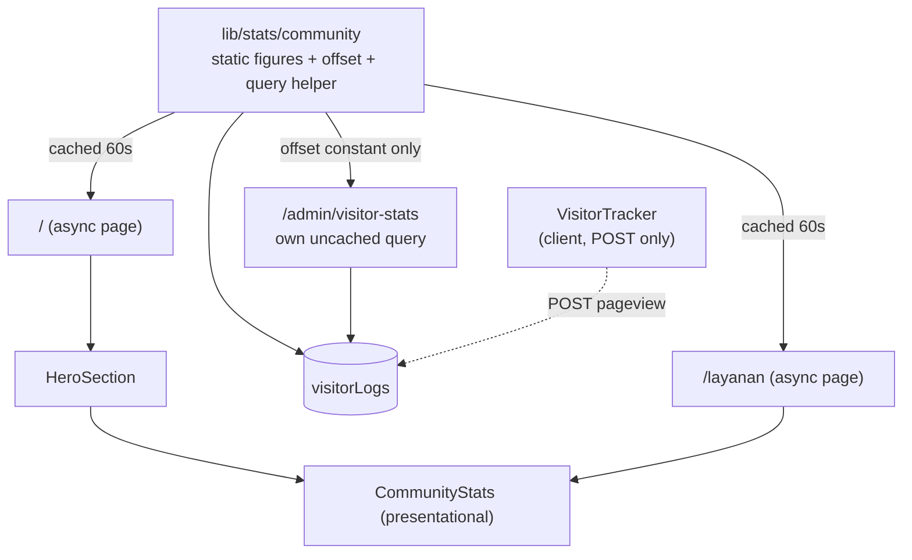

# Community stats resurfaced - Plan

## Goal Capsule

**Objective:** Bring the three social-proof figures — community members, pilgrims helped, visitors — back onto the homepage, rendered from one shared module and one consistent number.

**Authority hierarchy:** This plan > the current `StatBadges` implementation. The existing component is the starting point, not the target: it fetches on the client and shows a skeleton, and this plan replaces both.

**Execution profile:** Sequential. U1 is the module every later unit imports; U2 must land before U3 and U4 can read from it.

**Stop conditions:** Stop and ask if the visitor query turns out to be slow enough on real data that a 60-second cache is not sufficient, or if removing the client fetch changes what `/api/visitor` must keep supporting.

**Tail ownership:** Making the two static figures admin-editable is out of scope (see Scope Boundaries).

---

## Product Contract

### Summary

The three figures currently live only on `/layanan`, in a client component that flashes a skeleton before its number arrives. This plan makes them a server-rendered presentational component fed by one shared stats module, puts them in the homepage hero where a first-time visitor actually sees them, and settles the visitor figure on one number so the public badge and the admin dashboard stop disagreeing.

### Problem Frame

**Who:** First-time visitors landing on `/`, and the admin reading `/admin/visitor-stats`.

**Problem.** Three things are wrong at once.

*They are in the wrong place.* The navbar redesign moved the pills out of the nav — correctly, they were part of what made the bar overflow — and onto the `/layanan` hero. But `/layanan` is a destination a visitor reaches after they already trust the site. The homepage, which is where trust gets established, now has no social proof at all: `components/home/HeroSection.tsx` is a heading, two paragraphs, and four buttons.

*They arrive untidily.* `components/layanan/StatBadges.tsx` is a client component that mounts, renders a fixed-size skeleton, fetches `GET /api/visitor`, then swaps in the number. The skeleton exists specifically to stop the hero from jumping — a workaround for a fetch that did not need to be on the client at all. Both pages that would host these figures are already async server components doing their own database work.

*They disagree.* The public badge adds a promotional offset of 100 to the raw unique-visitor count; `app/(admin)/admin/visitor-stats/page.tsx` adds 1420 to the same underlying number. The admin therefore cannot use their own dashboard to check what a visitor is being shown.

**Current shape.** Two of the three figures are hardcoded constants inside the component (`COMMUNITY_SIZE`, `PILGRIMS_HELPED`); only the visitor count is real. The admin page queries `visitorLogs` directly rather than going through `/api/visitor`, so the two surfaces already compute the same metric by two different paths.

### Requirements

**Display**

- R1. The three figures render from one component, used on both the homepage hero and `/layanan`.
- R2. The figures are present on first paint — no skeleton, no layout shift, no client fetch.
- R3. The visitor figure is computed per render from `visitorLogs`, not hardcoded.
- R4. The component sits in the homepage hero between the introductory copy and the call-to-action buttons.

**Consistency**

- R5. The two static figures and the visitor offset come from one module that every surface reads.
- R6. The public badge and the admin dashboard report the same visitor figure for the same underlying data — the offset is 100 everywhere.
- R7. The admin analytics view keeps reading fresh, uncached numbers; only the public surfaces may serve a cached figure.

**Non-regression**

- R8. Pageview tracking is untouched — `components/nav/VisitorTracker.tsx` and the `POST /api/visitor` path keep working exactly as they do now.
- R9. A database failure while reading the count degrades to the two static figures rather than taking the page down.
- R10. `/layanan` renders as it does today apart from where its numbers come from.

**Success criteria.** A logged-out visitor loading `/` sees the three figures in the hero with no flash and no shift, and the number they see matches what `/admin/visitor-stats` reports at that moment.

### Scope Boundaries

#### Deferred to follow-up work

- Making `COMMUNITY_SIZE` and `PILGRIMS_HELPED` editable from the admin panel. They stay hand-edited constants, just in one place instead of inside a component.
- Removing `GET /api/visitor`. This change leaves it with no caller — `VisitorTracker` only POSTs, and the badge stops fetching — but deleting a public route is a contract change worth its own decision.
- Rate-limiting the unauthenticated `POST /api/visitor`, which a prior review flagged as spammable.
- Adding metrics beyond the existing three.

#### Outside this change

- Any redesign of the homepage hero or the `/layanan` hero beyond inserting the stats.
- The navbar. The pills are not going back there; that is what the previous change existed to fix.

---

## Planning Contract

### Key Technical Decisions

**KTD1 — The figures render on the server; the client fetch goes away.** Both host pages are already async server components that query the database (`app/(public)/page.tsx` selects featured stories; `app/(public)/layanan/page.tsx` is dynamic). Fetching the count during render removes the skeleton, the second HTTP round trip, and the layout-shift risk the skeleton existed to paper over. This is what "tidier" means here — the untidiness is the client fetch, not the styling. `app/(admin)/admin/visitor-stats/page.tsx` already reads `visitorLogs` directly from a server component, so this follows a pattern the repo has rather than introducing one.

**KTD2 — The stats component is presentational; the pages fetch.** `CommunityStats` takes the resolved visitor count as a prop instead of awaiting it internally. Keeping it synchronous means it renders in a test with a plain value, and it keeps `HeroSection` synchronous too — an async child inside a sync server component works at runtime but makes both awkward to assert against. The two pages are already async, so the fetch costs them nothing structurally.

**KTD3 — One module owns all three figures and the offset.** `lib/stats/community.ts` exports the two static figures, `VISITOR_BASELINE_OFFSET`, and the query helper. This is the fix for the 100-vs-1420 split: the numbers cannot diverge again because there is only one of each. Module placement follows the existing `lib/` convention (`lib/faq.ts`, `lib/panduan.ts`, `lib/services/`, `lib/badalin/`).

**KTD4 — The offset is 100 everywhere, and the admin dashboard's displayed figure drops.** The public number is the one that matters, so the admin should see what a visitor sees. `/admin/visitor-stats` currently shows raw + 1420; after this it shows raw + 100, a visible drop of 1320 on that page. This is intended, not a regression.

**KTD5 — The public count is cached for 60 seconds; the admin view is not.** `countDistinct` over `visitorLogs` currently runs once per `/layanan` render. After this change it also runs on every homepage render — the highest-traffic route. `ip_hash` is indexed, so this is an index walk rather than a table scan, but it is still work that scales with every pageview the tracker records. Wrapping the public helper in Next's `unstable_cache` with a 60-second revalidate bounds that cost while keeping the figure honest at minute resolution. The admin page keeps its own direct, uncached query because it is an analytics view where staleness is the wrong trade (R7).

**KTD6 — A failed count degrades, it does not throw.** In a client component a failed fetch left a skeleton on screen. In a server component an uncaught error takes down the whole route. The helper returns `null` for the visitor figure on error and the component renders the two static pills without the third (R9).

### High-Level Technical Design

Where each number comes from after the change. The dashed edge is the tracking path, which this plan does not touch.

The admin page takes the offset from the module but keeps its own query — that split is KTD5, and it is the only place two paths to the same table remain deliberate.

---

## Implementation Units

### U1. Shared community-stats module

**Goal:** One place that owns the two static figures, the visitor offset, and the cached count query.

**Requirements:** R3, R5, R6, R7, R8.

**Dependencies:** none.

**Files:**
- `lib/stats/community.ts` (new)
- `lib/stats/__tests__/community.test.ts` (new)

**Approach:** Export `COMMUNITY_SIZE` and `PILGRIMS_HELPED` as the display strings they are today, `VISITOR_BASELINE_OFFSET` as `100`, a formatter that applies the offset and `id-ID` grouping, and `getPublicVisitorCount()` — the cached helper that runs the `countDistinct` over `visitorLogs` and returns the raw number, or `null` when the query fails. Keep the offset out of the query helper: the helper returns truth, the formatter adds the promotional padding, so a caller that wants the real number can have it.

**Patterns to follow:** the `countDistinct(visitorLogs.ipHash)` query in `app/api/visitor/route.ts`'s GET handler and in `app/(admin)/admin/visitor-stats/page.tsx`; module shape from `lib/services/catalog.ts` (named exports, typed, JSDoc on the non-obvious ones).

**Test scenarios:**
- The formatter applies the offset and `id-ID` grouping: a raw count of `8778` renders `8.878`.
- The formatter returns null-ish output (not `NaN`, not `"null"`) when handed `null`.
- `VISITOR_BASELINE_OFFSET` is exactly `100` — this is the constant the admin page and the public badge both depend on, so pin it.
- The static figures are non-empty strings.
- With the database mocked to reject, `getPublicVisitorCount()` resolves to `null` rather than rejecting.
- With the database mocked to return a row, it resolves to the raw count with no offset applied.

**Verification:** the module's tests pass, and the two static figures and the offset exist in exactly one place in the tree.

---

### U2. Presentational stats component, and `/layanan` moved onto it

**Goal:** Replace the client-fetching badge with a server-rendered presentational component, and switch `/layanan` over.

**Requirements:** R1, R2, R9, R10.

**Dependencies:** U1.

**Execution note:** Write the degraded-path test before the happy path. A `null` count is the case that used to be impossible (a client skeleton just stayed on screen) and is now the case that can take down a route.

**Files:**
- `components/stats/CommunityStats.tsx` (new)
- `components/stats/__tests__/CommunityStats.test.tsx` (new)
- `components/layanan/StatBadges.tsx` (delete)
- `components/layanan/__tests__/StatBadges.test.tsx` (delete)
- `app/(public)/layanan/page.tsx` (await the helper, pass the count down)

**Approach:** `CommunityStats` takes `{ visitorCount }` and renders the three pills, keeping the existing visual treatment — gold pill, `--color-border`, the pulsing dot on the visitor pill. No `"use client"`, no `useEffect`, no skeleton branch: with the number resolved before render there is nothing to wait for. `/layanan` awaits `getPublicVisitorCount()` and passes the result.

**Patterns to follow:** the pill styling in the current `components/layanan/StatBadges.tsx` — carry the classes over rather than restyling; `app/(public)/layanan/page.tsx` for how the page composes its hero.

**Test scenarios:**
- With `visitorCount: null`, the two static pills render and the visitor pill is absent — and the render does not throw.
- With `visitorCount: 8778`, the visitor pill reads `8.878+ Pengunjung`.
- All three pills render with the static figures taken from the shared module, not from literals in the component.
- The rendered tree contains no element with a pulse/skeleton role for a pending state — there is no pending state.
- `/layanan` renders three pills for a resolved count.

**Verification:** the new component's tests pass, the deleted component's tests are gone with no dangling imports, and `/layanan` shows the figures with no flash on a hard reload.

---

### U3. Homepage hero placement

**Goal:** Put the figures where a first-time visitor sees them.

**Requirements:** R1, R2, R4.

**Dependencies:** U1, U2.

**Files:**
- `components/home/HeroSection.tsx`
- `components/home/__tests__/HeroSection.test.tsx` (new)
- `app/(public)/page.tsx` (await the helper, pass the count to the hero)

**Approach:** `HeroSection` gains a `visitorCount` prop and renders `CommunityStats` between the descriptive paragraph and the button row. `app/(public)/page.tsx` already awaits a database call and `auth()` in a `Promise.all` — add the stats helper to that same batch so the page does not serialize a third round trip.

**Patterns to follow:** the existing `Promise.all` in `app/(public)/page.tsx`; the prop-threading shape already used for `isAdmin`.

**Test scenarios:**
- The hero renders the heading, the three pills, and the four call-to-action links together.
- The pills sit between the descriptive paragraph and the first button in document order.
- With `visitorCount: null`, the hero still renders its heading and buttons.
- The existing `isAdmin` behavior is unchanged: the estimate link appears for an admin and not otherwise.

**Verification:** the hero's tests pass, and `/` shows the figures in the hero on a hard reload with no shift.

---

### U4. Unify the admin dashboard on the shared offset

**Goal:** Make the admin see the same visitor figure the public sees.

**Requirements:** R6, R7.

**Dependencies:** U1.

**Files:**
- `app/(admin)/admin/visitor-stats/page.tsx`

**Approach:** Delete the local `BASELINE_OFFSET = 1420` and import `VISITOR_BASELINE_OFFSET` from the shared module. Keep the page's own uncached query — this view must not read a 60-second-old number (R7). Update the on-page label that currently prints the offset value so it reflects the new number rather than a stale literal.

**Patterns to follow:** the existing summary-card layout on that page; change only the number's source.

**Test expectation:** none — the only change is which constant the page reads, and U1 pins that constant. The guarantee that matters here (both surfaces agree) is carried by U1's pinned-offset test, so a test on this page would assert the same fact twice.

**Verification:** `/admin/visitor-stats` shows a figure exactly 100 above the raw unique-visitor count, and the same figure the public badge shows.

---

## Verification Contract

| Gate | Command | Applies to |
|---|---|---|
| Unit and component tests | `pnpm test` | All units |
| Scoped run during work | `pnpm test <path>` | U1-U3 |
| Production build | `pnpm build` | All units |

Manual checks before this is done:

- Hard-reload `/` logged out: the three figures are present in the first paint, and nothing below them shifts.
- Hard-reload `/layanan`: same, and the hero is otherwise unchanged from today.
- Compare the number on `/` against `/admin/visitor-stats` within the same minute — they match.
- Navigate `/` → `/panduan` → `/`: the visitor figure still increments (tracking untouched), allowing for the 60-second cache.

---

## Definition of Done

**Global**

- `pnpm test` and `pnpm build` pass.
- `components/layanan/StatBadges.tsx` and its test are deleted, with no remaining imports.
- No component holds a literal for a community figure or the visitor offset — all three come from `lib/stats/community.ts`.
- No public surface performs a client-side fetch for these numbers.
- Every manual check above passes.

**Per unit**

| Unit | Done signal |
|---|---|
| U1 | Module tests pass; the offset is pinned at 100 and a failing query resolves to `null`. |
| U2 | `/layanan` renders the figures server-side with no skeleton; the `null` path renders two pills without throwing. |
| U3 | `/` shows the figures in the hero between the copy and the buttons. |
| U4 | The admin figure equals the public figure for the same underlying count. |

---

## Open Questions

- **How slow is the count on production data?** `ip_hash` carries an index (`visitor_logs_ip_hash_idx` in `lib/db/schema.ts`), so the count is not a sequential table scan — but `COUNT(DISTINCT ip_hash)` still walks the whole index, and that cost grows with every tracked pageview. The 60-second cache (KTD5) bounds how often that happens. If it is already slow at current volume, the answer is a periodically-materialized figure rather than a cached query. Measure during implementation; do not pre-optimize.

---

## Sources & Research

- `components/layanan/StatBadges.tsx` — the component being replaced: client fetch, fixed-size skeleton, `BASELINE_OFFSET = 100`, `id-ID` formatting, pulsing live dot.
- `app/(admin)/admin/visitor-stats/page.tsx` — the divergent offset (`1420`) and the precedent for querying `visitorLogs` directly from a server component.
- `app/api/visitor/route.ts` — the `countDistinct(visitorLogs.ipHash)` shape the shared helper mirrors. Its GET handler loses its last caller in this change (see Scope Boundaries).
- `app/(public)/page.tsx` — already async with a `Promise.all`; U3 extends that batch rather than adding a serial fetch.
- `components/home/HeroSection.tsx` — currently heading, two paragraphs, four buttons, no social proof.
- `docs/plans/2026-07-25-001-feat-navbar-layanan-redesign-plan.md` — the change that moved these pills out of the navbar (KTD6 there), and why they are not going back.
