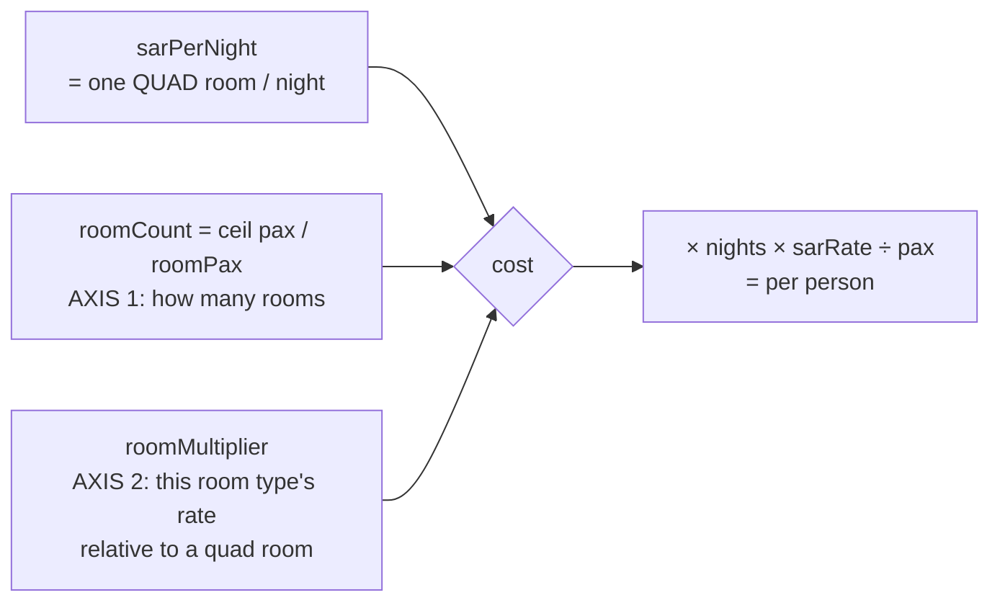

# fix: Correct room-type price multipliers, replace SINGLE with QUINT

## Goal Capsule

Hotel cost per person is wrong for every room type except Quad, because the pricing formula scales the same axis twice. Fix it by redefining `roomMultiplier` as a **room-rate ratio** and setting every ratio to 1.0, so `roomCount` alone carries the occupancy math. At the same time, retire the SINGLE room type (no such room in operations) and introduce QUINT (5 per room).

---

## Summary

`lib/budget/calculate.ts` computes hotel cost as:

```
roomCount = ceil(pax / roomPax)
totalIdr  = sarPerNight × nights × roomMultiplier × roomCount × sarRate
perPerson = totalIdr / pax
```

`sarPerNight` is the price of **one quad room per night**. `roomCount` already answers "how many rooms does this occupancy need". The stored `roomMultiplier` values (Quad 1.0 / Triple 1.25 / Double 1.5 / Single 2.8) are a **per-person uplift table** — a second scaling of that same axis. Applying both over-charges every non-Quad type.

With 4 pax at SAR 235:

| Type | roomCount | multiplier | SAR/night | Per person | Correct | Error |
|---|---|---|---|---|---|---|
| Quad | 1 | 1.0 | 235 | 58.75 | 58.75 | — |
| Triple | 2 | 1.25 | 587.50 | 146.88 | 117.50 | +25% |
| Double | 2 | 1.5 | 705 | 176.25 | 117.50 | +50% |
| Single | 4 | 2.8 | 2,632 | 658 | 235 | +180% |

**The correction is a data change, not a formula change.** Once every multiplier is 1.0, the existing formula produces exactly the right figure. The code work in this plan is almost entirely the SINGLE→QUINT swap; the pricing bug closes when the four `room_multipliers` rows are corrected.

---

## Problem Frame

- **Who:** Admins quoting non-Quad packages, and the jamaah receiving those quotes.
- **Pain:** Any Triple/Double quote is 25–50% too expensive. The error grows as occupancy drops, so the room types chosen by smaller or higher-budget groups are the most wrong.
- **Why now:** The real-price layer just landed, so hotel rates are finally authoritative. An accurate rate multiplied by a wrong multiplier still produces a wrong quote — the multiplier is now the dominant remaining error.
- **Non-goal:** Re-basing hotel prices. `sarPerNight` stays "one quad room per night"; the 804 imported real prices are untouched.

---

## Requirements

- **R1** — `roomMultiplier` means "price of a room of this type ÷ price of a quad room". It must never again encode per-person uplift.
- **R2** — Per-person hotel cost must equal `sarPerNight × nights × roomCount ÷ pax` for every room type, given ratio 1.0.
- **R3** — SINGLE is removed from every layer: type union, validation, seed data, AI prompt, UI, exports.
- **R4** — QUINT (5 pax/room) is available everywhere SINGLE was.
- **R5** — Saved estimates keep loading. No stored estimate currently uses SINGLE, but a stored value outside the known set must not crash the page.
- **R6** — The Quad path is unchanged: existing Quad quotes must produce byte-identical figures.

---

## Key Technical Decisions

- **KTD1 — Redefine the multiplier rather than delete it.** Setting all ratios to 1.0 makes the field inert today, so deleting it is tempting. Keep it: it is admin-editable data, and a supplier who genuinely charges more for a 5-bed room can be modelled by changing one row instead of shipping code. The risk of keeping an inert field is that someone later "restores" the uplift numbers — mitigated by KTD2.
- **KTD2 — Encode the semantics where the mistake would be made.** The column comment in `lib/db/schema.ts`, the seed rows, and a comment at the formula in `lib/budget/calculate.ts` must all state that the value is a *room-rate ratio* and that `roomCount` already handles occupancy. This is the primary defence against regression; the values alone do not explain themselves.
- **KTD3 — No Postgres enum migration is required.** `room_multipliers.type` is a plain `text` primary key and no `roomTypeEnum` exists — the pgEnum list covers city, hotel tier, airline tier, service key, role, and community status only. SINGLE→QUINT is therefore a row swap plus a TypeScript union edit. This removes the migration risk the request anticipated.
- **KTD4 — No backfill for saved estimates.** All 22 stored estimates use QUAD (21) or DOUBLE (1); none uses SINGLE. The single DOUBLE estimate will re-price downward on next load — that is the fix working, not data loss, because stored `params` are re-costed at read time rather than storing a frozen total.

---

## High-Level Technical Design

The bug is two scalings of one axis. The corrected model keeps them on separate axes:



Before this fix, `roomMultiplier` carried per-person uplift — the same information as Axis 1 — so the two multiplied together. After it, Axis 2 answers a question Axis 1 cannot: *does a room of this type cost a different nightly rate?* Today the answer is "no" for every type, so all ratios are 1.0.

---

## Implementation Units

### U1. Swap SINGLE for QUINT in the type contract

**Goal:** Make QUINT the fifth-occupancy room type and remove SINGLE at the type and validation layer.
**Requirements:** R3, R4, R5.
**Dependencies:** none.
**Files:**
- `types/index.ts` (`RoomType` union: drop `"SINGLE"`, add `"QUINT"`)
- `lib/estimate/params.ts` (`ROOM_TYPES` array at line 5, used by the validator at line 26)
- `lib/estimate/__tests__/` (validator coverage — locate the existing params test)

**Approach:** `RoomType` is a plain TS union; there is no Postgres enum to migrate (KTD3). Order the union by descending occupancy (`QUINT | QUAD | TRIPLE | DOUBLE`) so it reads as an occupancy ladder. Keep the validator's unknown-value behaviour permissive enough that a stored estimate carrying an unrecognised `roomType` falls back to the default rather than throwing (R5) — check what the validator currently does with an unknown value before changing it.
**Patterns to follow:** the existing `HotelTier` union and its validation in the same file.
**Test scenarios:**
- Params carrying `roomType: "QUINT"` validate successfully.
- Params carrying `roomType: "SINGLE"` no longer validate, and the caller falls back to the default rather than throwing (Covers R5).
- Params carrying an arbitrary unknown string behave the same as the SINGLE case — the guard is about unknown values generally, not a SINGLE special case.
**Verification:** typecheck passes; every `RoomType` consumer either compiles or is listed in U3/U4.

### U2. Correct the multiplier data and pin its meaning

**Goal:** Close the pricing bug and make its semantics unmistakable.
**Requirements:** R1, R2, R6.
**Dependencies:** U1.
**Files:**
- `lib/db/seed.ts` (the four `room_multipliers` rows → five, all ratio 1.0)
- `lib/db/schema.ts` (column comment on `roomMultipliers.multiplier` and `.type`)
- `lib/budget/calculate.ts` (comment at `calculateHotelIdrPerPerson` — no logic change)
- `lib/budget/__tests__/calculate.test.ts`

**Approach:** Seed rows become QUINT/5, QUAD/4, TRIPLE/3, DOUBLE/2 — every `multiplier` the string `"1.0"` (the column is `text` to avoid float drift; keep that convention). **The formula is not edited.** With ratio 1.0 the existing expression already yields `sarPerNight × nights × roomCount ÷ pax`; changing the code as well would be a second correction of an already-corrected result. The comments are the deliverable here alongside the data — see KTD2.

Production carries its own `room_multipliers` rows, so seeding a local database does not fix the deployed figures. The unit is not done until the production rows are corrected too; treat that as a required step, not a follow-up.

**Execution note:** Behaviour-bearing pricing change — write the per-room-type expectation matrix first and watch it fail against the current multipliers, then correct the data. The failing output is the proof that the bug was real.
**Patterns to follow:** the existing `describe("real price layer (U3)")` block in `lib/budget/__tests__/calculate.test.ts` for fixture shape.
**Test scenarios:**
- 4 pax, SAR 235, 1 night, per room type: QUAD 58,750 IDR-equivalent per person at rate 1; DOUBLE and TRIPLE both 2 rooms → exactly 2× the Quad per-person figure; QUINT 1 room → equal to Quad per person at 4 pax (both need one room).
- 5 pax QUINT → 1 room; per person is lower than the same 5 pax as QUAD (which needs 2 rooms). This is the arithmetic the "quint is cheaper per person" expectation rests on (Covers R4).
- Quad at any pax count produces figures byte-identical to before the change (Covers R6) — the regression guard for the untouched path.
- A multiplier other than 1.0 still scales the room rate linearly, proving the field remains functional for a future supplier difference (Covers R1).
**Verification:** the matrix passes; the pre-existing Quad fixtures in the suite are unchanged; production `room_multipliers` reads back five rows at 1.0.

### U3. Propagate to the AI parse and prompt layer

**Goal:** Let the model emit QUINT and stop it emitting SINGLE.
**Requirements:** R3, R4.
**Dependencies:** U1.
**Files:**
- `lib/ai/parse.ts` (`ROOM_TYPES` const)
- `lib/ai/prompt.ts` (JSON schema line and the extraction rules)
- `lib/ai/__tests__/parse.test.ts`

**Approach:** Add the Indonesian vocabulary the model will actually meet — "quint", "kamar 5", "berlima" → QUINT — mirroring how the prompt already maps airline and tier synonyms. Removing SINGLE from the schema line is not sufficient on its own; the prompt should not leave a gap where a lone traveller's request has no room type to land on, so state what a 1-person request maps to (QUAD, since that is the room they will occupy).
**Patterns to follow:** the month-name and airline synonym lists already in `lib/ai/prompt.ts`.
**Test scenarios:**
- Claude returning `roomType: "QUINT"` is preserved through parse.
- Claude returning `roomType: "SINGLE"` is rejected by validation and the default applies rather than propagating an invalid value.
- The system prompt contains QUINT and does not contain SINGLE.
**Verification:** parse suite green; prompt assertions cover both directions.

### U4. Propagate to UI and exports

**Goal:** Show QUINT wherever SINGLE appeared, with correct occupancy copy.
**Requirements:** R3, R4.
**Dependencies:** U1, U2.
**Files:**
- `components/estimator/ParamsPanel.tsx`
- `components/estimator/SentenceCard.tsx`
- `lib/export/pdf.ts`
- `components/estimator/__tests__/SentenceCard.test.tsx`
- `components/estimator/__tests__/EstimatorPreFill.test.tsx`

**Approach:** The room-type picker renders label + occupancy + multiplier from the config, so the card content follows the data once U2 lands. What needs a decision is the multiplier line: with every ratio at 1.0, showing "×1" on all four cards is noise that invites the question the bug came from. Prefer showing occupancy alone ("5 orang/kamar") and surfacing the ratio only when it differs from 1.0.
**Patterns to follow:** the existing tier picker cards in `ParamsPanel.tsx`.
**Test scenarios:**
- The picker offers QUINT and does not offer SINGLE.
- Selecting QUINT updates the sentence chip to the QUINT label.
- A ratio other than 1.0 renders its multiplier; a ratio of 1.0 does not.
- PDF export renders the QUINT label for a QUINT estimate.
**Verification:** component suites green; manual check of the picker at mobile and desktop.

### U5. Update production data and re-verify end to end

**Goal:** Land the corrected multipliers in the deployed database and confirm real quotes move.
**Requirements:** R2, R6.
**Dependencies:** U2, U4.
**Files:** none (data + verification).
**Approach:** Apply the five corrected rows to production. `pnpm db:push` syncs *schema*, not seed rows, so the rows need an explicit update path — reuse the seed routine or a one-off script, matching whichever the repo already uses for pricing data. Then re-cost a known package through the UI.
**Execution note:** Verification here is runtime, not unit-test — the point is that deployed figures changed.
**Test scenarios:** none (no new behaviour) — `Test expectation: none — production data application and manual re-verification; behaviour is covered by U2.`
**Verification:** a Double quote drops to two-thirds of its previous figure; a Quad quote is unchanged; the one stored DOUBLE estimate re-costs downward on load.

---

## Scope Boundaries

**In scope:** multiplier semantics and data; SINGLE→QUINT across type, validation, AI, UI, exports; pricing regression coverage; production data correction.

### Deferred to Follow-Up Work
- Admin UI for editing room multipliers (they are DB rows; no editor exists today).
- Per-hotel room-type rates — if a hotel ever charges genuinely different nightly rates per room type, that is a schema change (rate per hotel *per type*), not a global ratio.
- Mixed-occupancy groups (e.g. 5 pax as one Quad + one Single) — the model assumes one room type per estimate.

### Out of Scope (non-goals)
- Re-basing `sarPerNight` or re-interpreting the 804 imported real prices.
- Changing the real-vs-estimate price layer, manual overrides, or the save flow.
- Rounding policy for `idrPerPerson`.

---

## Open Questions

- **Q1 — Does a quint room really cost the same nightly rate as a quad?** The chosen model sets every ratio to 1.0, which asserts it does. That is in mild tension with the earlier statement that a quint room is *more expensive* to rent. Under 1.0, a 5-person group pays about 20% less per person than the same group in quads; if the supplier does charge a premium for a 5-bed room, the QUINT row should carry that ratio (e.g. `"1.15"`) and nothing else in this plan changes. **Worth confirming against one real supplier quote before U5 touches production.**
- **Q2 — Should Triple and Double really be 1.0?** Same question, lower stakes: a hotel that prices a 2-bed room below a 4-bed room would want a ratio under 1.0. Starting at 1.0 is the defensible default because it asserts nothing the data does not support.
- **Q3 — Is `ceil(pax / roomPax)` the right room count for awkward group sizes?** 4 pax as TRIPLE yields 2 rooms (3 + 1), charging two full rooms. That is arithmetically consistent, but a real agent might book one Quad instead. Out of scope here; flagged because the corrected pricing makes it more visible.

---

## Verification Contract

- `lib/budget/__tests__/calculate.test.ts` — the per-room-type expectation matrix (U2), plus the untouched Quad regression fixtures (R6).
- `lib/ai/__tests__/parse.test.ts` — QUINT accepted, SINGLE rejected, prompt content (U3).
- `components/estimator/__tests__/` — picker options, chip label, conditional multiplier display (U4).
- `lib/estimate/` params validation — unknown `roomType` falls back rather than throwing (U1).
- Full suite plus `tsc --noEmit` green. Two date-dependent webinar tests in `app/(public)/webinar-umroh-mandiri/` are already failing on `main` and are unrelated.
- Manual: a Double quote drops to two-thirds; a Quad quote is unchanged.

## Definition of Done

- Every room type prices as `sarPerNight × nights × roomCount ÷ pax`; Quad output is unchanged from before the fix.
- SINGLE is absent from the type union, validation, seed, AI prompt, UI, and exports; QUINT is present in all of them.
- The room-rate-ratio meaning of `roomMultiplier` is stated at the schema, the seed, and the formula.
- Production `room_multipliers` holds five rows at ratio 1.0, and a real quote has been re-checked in the browser.
- Q1 is either confirmed against a supplier quote or recorded as an accepted assumption.

## Sources & Research

No external research — the correction is arithmetic and every pattern is local. Grounding gathered during planning: the price basis is fixed by `docs/prompts/real-hotel-price-extraction.md` (lines 20, 71), which requires catalogue prices to be transcribed as one quad room per night; `room_multipliers.type` is a `text` primary key with no corresponding `pgEnum`; and a query of the 22 stored estimates found 21 QUAD and 1 DOUBLE, with no SINGLE. Related prior plan: `docs/plans/2026-07-24-001-feat-real-hotel-price-layer-plan.md`.
