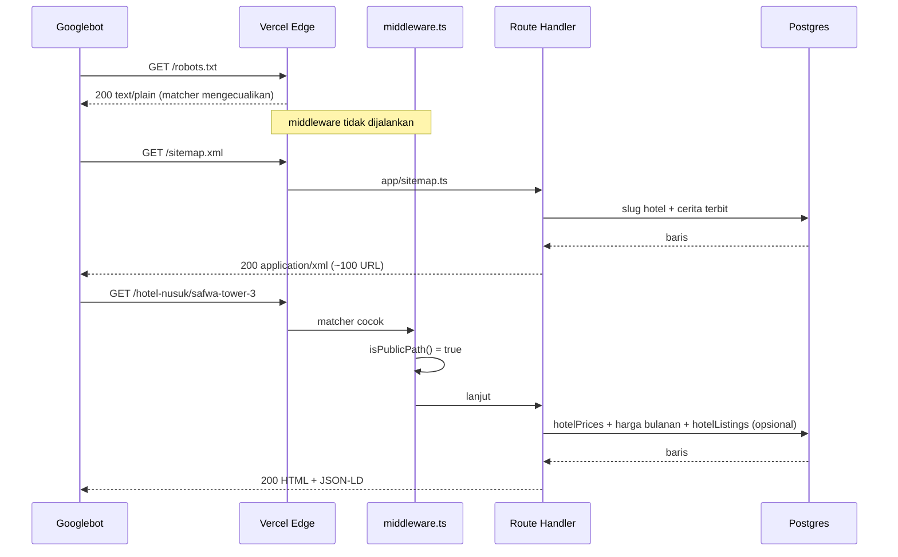
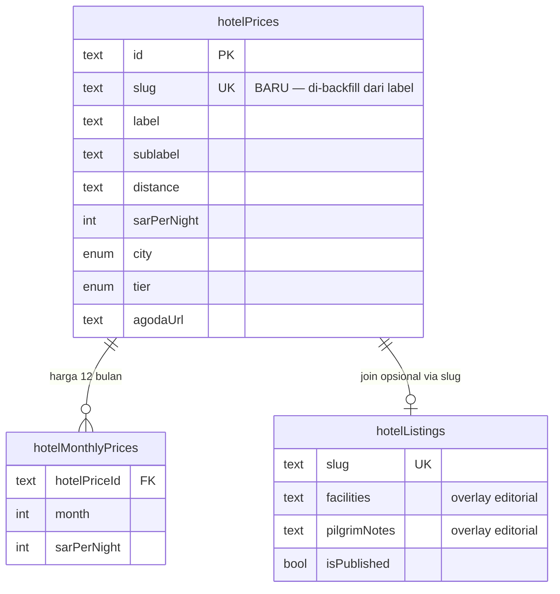
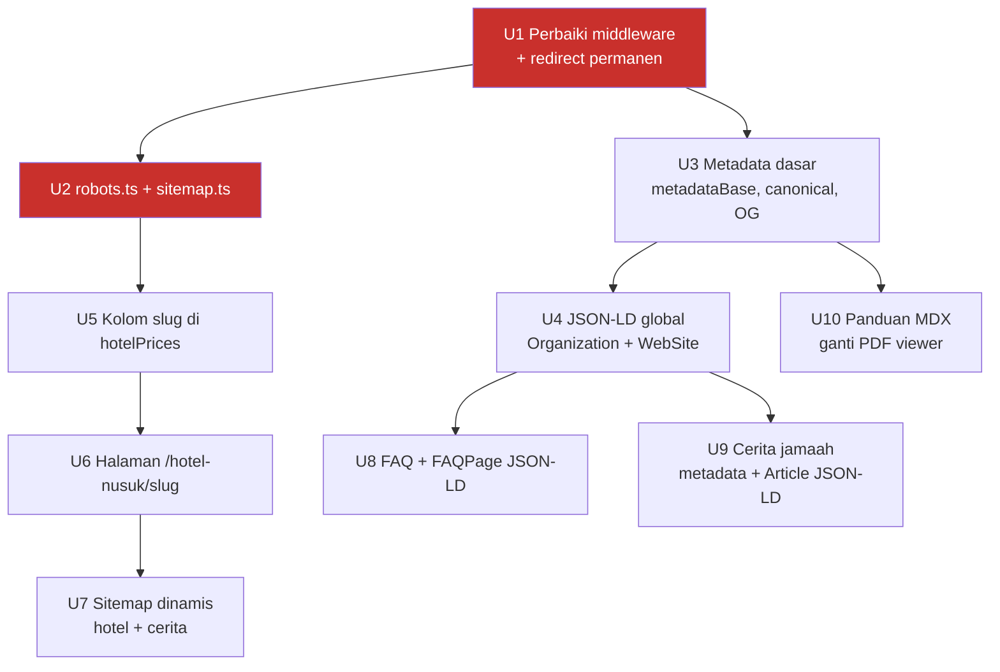

# feat: SEO Foundation — Membuat Serba Serbi Umroh Terlihat di Google - Plan

## Goal Capsule

**Objective.** Situs `serbaserbiumroh.id` saat ini praktis tidak terlihat oleh Google: hanya 1 halaman terindeks, `robots.txt` dan `sitemap.xml` di-redirect ke halaman login, dan konten unggulan terkunci di dalam PDF. Rencana ini membuka jalur crawl, lalu menerbitkan ~100 halaman terindeks dari data dan aset yang **sudah dimiliki** — tanpa bergantung pada produksi artikel baru.

**Product authority.** Keputusan produk diambil dalam sesi brainstorm 2026-07-26 (tidak ada dokumen requirements terpisah; `product_contract_source: ce-plan-bootstrap`). Keputusan yang mengikat rencana ini:

- Strategi bertahap: brand → long-tail → transaksional → head term.
- Kapasitas konten: solo + AI, 4-8 artikel/bulan. Rencana harus meminimalkan ketergantungan pada penulisan manual.
- PDF panduan dibuka penuh jadi HTML terindeks; PDF tetap tersedia sebagai unduhan.
- Metrik sukses: lead WhatsApp dan anggota komunitas. Halaman terindeks dan trafik organik adalah indikator antara.
- Sumber halaman hotel: `hotelPrices` sebagai tulang punggung, `hotelListings` sebagai pelengkap opsional.

**Open blockers.** Tidak ada blocker produk. Tiga asumsi operasional perlu diverifikasi saat eksekusi — lihat [Asumsi](#asumsi).

**Target repo:** `umroh-planner` (repo ini).

---

## Problem Frame

Investigasi langsung terhadap produksi (`www.serbaserbiumroh.id`, Vercel, Next.js 14.2.29) pada 2026-07-26 menemukan:

| Temuan | Bukti |
|---|---|
| `robots.txt` → 307 ke `/login` | `curl` sebagai Googlebot; `middleware.ts:66` matcher menangkap semua path, `isPublicPath()` (`middleware.ts:6-23`) tidak memuatnya |
| `sitemap.xml` → 307 ke `/login` | Sama. Tidak ada `app/sitemap.ts` maupun `app/robots.ts` di repo |
| Hanya 1 halaman terindeks | Query `site:serbaserbiumroh.id` hanya mengembalikan homepage |
| Konten panduan tidak terbaca | `app/(public)/panduan/[slug]/page.tsx:47-59` merender PDF viewer. `/panduan/panduan-umroh-mandiri` = **64 kata** terbaca crawler |
| FAQ kosong di produksi | Halaman live menampilkan "FAQ belum tersedia" — 47 kata |
| Title & H1 tanpa keyword | `app/layout.tsx:19-22` → `title: "Serba Serbi Umroh"`. H1 homepage identik |
| Tidak ada canonical/OG/JSON-LD | `grep` untuk `metadataBase`, `alternates`, `openGraph`, `application/ld` = 0 hasil di `app/`, `components/`, `lib/` |
| `/hotel` bocor ke login | `app/(public)/hotel/page.tsx` hanya `redirect()`, tapi `/hotel` tidak ada di `isPublicPath` |
| Halaman publik tidak ter-cache CDN | Semua halaman: `cache-control: private, no-cache, no-store` + `x-vercel-cache: MISS`, termasuk `/hotel-nusuk` yang punya `export const revalidate = 3600` |
| Apex → www memakai 307 sementara | `curl -sI https://serbaserbiumroh.id/` → `307`, bukan 308 permanen |

Perbandingan volume konten terbaca crawler:

| Halaman | Kata | Pembanding |
|---|---|---|
| `/` | 274 | `safaraya.id/` = 1.299 |
| `/panduan/panduan-umroh-mandiri` | 64 | — |
| `/faq` | 47 | — |
| `/cerita-jamaah` | 99 | — |
| `/hotel-nusuk` | 5.085 | `safaraya.id/hotels` = 1.812 |

**Aset yang belum dimanfaatkan.** `hotelPrices` (`lib/db/schema.ts:58`) berisi ~87 hotel produksi dengan `label`, `sublabel`, `distance`, `sarPerNight`, link Agoda/Booking/Trip, ditambah `hotelMonthlyPrices` (harga 12 bulan) dan `realHotelPrices`. Tidak ada satu pun halaman detail per hotel. Secara terpisah, `hotelListings` (`lib/db/schema.ts:335`) sudah memiliki `slug`, `facilities`, dan `pilgrimNotes` — tapi `grep` menunjukkan tabel itu **hanya dibaca route admin**; tidak ada halaman publik yang menampilkannya.

---

## Requirements

| ID | Requirement |
|---|---|
| R1 | `robots.txt` dan `sitemap.xml` dapat diakses crawler tanpa redirect, mengembalikan content-type yang benar |
| R2 | Sitemap memuat seluruh halaman publik, termasuk route dinamis, dan mengecualikan halaman terproteksi |
| R3 | Setiap halaman publik memiliki canonical URL absolut pada host kanonis tunggal |
| R4 | Title dan description setiap halaman publik memuat keyword yang ditargetkan, dengan pola brand yang konsisten |
| R5 | Halaman publik menyertakan structured data yang sesuai jenisnya (Organization, WebSite, FAQPage, BreadcrumbList, Article) |
| R6 | Setiap hotel di `hotelPrices` memiliki halaman detail sendiri yang terindeks pada URL stabil |
| R7 | Isi ketiga panduan terbaca sebagai HTML oleh crawler; PDF tetap tersedia sebagai unduhan |
| R8 | Halaman FAQ menampilkan konten nyata dan menghasilkan `FAQPage` structured data |
| R9 | Halaman publik yang tidak bergantung sesi dapat di-cache CDN |
| R10 | Tidak ada halaman terproteksi (dashboard, admin, estimate, login) yang masuk indeks |

---

## Key Technical Decisions

**KTD1 — Host kanonis adalah `www.serbaserbiumroh.id`.** Apex sudah me-redirect ke www, dan www adalah satu-satunya URL yang saat ini terindeks. Mengganti arah kanonis sekarang akan membuang sinyal indeks yang sudah ada. `metadataBase` disetel ke www, dan redirect apex dinaikkan dari 307 ke 308 permanen di pengaturan domain Vercel.

**KTD2 — Matcher middleware memakai daftar-kecuali, bukan daftar-izin.** Menambahkan `robots.txt` dan `sitemap.xml` ke `isPublicPath()` tidak cukup: keduanya adalah *metadata route* Next.js yang harus dieksekusi sebagai route handler, dan middleware yang menangkapnya mencegah eksekusi itu sepenuhnya ([vercel/next.js#58436](https://github.com/vercel/next.js/discussions/58436)). Perbaikannya ada di `config.matcher`, dengan `isPublicPath()` tetap sebagai lapisan otorisasi halaman.

**KTD3 — `hotelPrices` jadi tulang punggung halaman hotel, `hotelListings` jadi overlay opsional.** `hotelPrices` sudah terisi ~87 baris di produksi dengan data pembeda yang tidak dimiliki kompetitor (harga per bulan, jarak, link booking). `hotelListings` punya field editorial yang lebih kaya tapi kemungkinan besar hampir kosong karena tidak pernah tampil publik. Menjadikan `hotelPrices` sebagai spine berarti 87 halaman terbit segera; join opsional ke `hotelListings` via `slug` membuat halaman makin kaya seiring admin mengisi `pilgrimNotes` — tanpa memblokir peluncuran.

**KTD4 — Slug hotel disimpan sebagai kolom, bukan diturunkan saat runtime.** Slug yang dihitung dari `label` setiap request akan berubah diam-diam ketika admin mengedit nama hotel, memutus URL yang sudah terindeks. Kolom `slug` yang unik dan di-backfill sekali membuat URL stabil terhadap perubahan label.

**KTD5 — Konten panduan pindah ke MDX, PDF turun jadi unduhan sekunder.** Ketiga file MDX sudah ada di `content/panduan/` dan pipeline MDX sudah terpasang (`next.config.mjs`, `mdx-components.tsx`). Yang menghalangi hanyalah `PDF_MAPPING` di `app/(public)/panduan/[slug]/page.tsx:23-27` yang membajak render sebelum MDX dipakai. Menghapus pembajakan itu membuat konten HTML terbaca; tombol unduh PDF dipertahankan sebagai pelengkap.

**KTD6 — Redirect `/hotel` pindah ke `next.config.mjs`.** `redirect()` di dalam page component menghasilkan 307 sementara dan tetap harus melewati middleware. Memindahkannya ke `redirects()` dengan `permanent: true` menghasilkan 308, dieksekusi sebelum middleware, dan menghapus kebutuhan file page itu sama sekali.

---

## High-Level Technical Design

Urutan crawl setelah perbaikan — perhatikan bahwa `robots.txt` dan `sitemap.xml` kini melewati middleware sepenuhnya:

Sumber data halaman detail hotel — `hotelPrices` wajib, `hotelListings` opsional:

Urutan pengerjaan dan ketergantungan:

Merah menandai unit pemblokir: tanpa keduanya, seluruh pekerjaan lain tetap tidak terlihat Google.

---

## Implementation Units

### U1. Buka jalur crawl di middleware dan redirect

**Goal.** Hentikan middleware menangkap metadata route dan aset, jadikan `/hotel` redirect permanen, dan pulihkan cache CDN untuk halaman yang tidak bergantung sesi.

**Requirements.** R1, R9, R10

**Dependencies.** Tidak ada. Unit pertama — semua unit lain tidak berguna sebelum ini mendarat.

**Files.**
- `middleware.ts` — ubah `config.matcher`
- `middleware.test.ts` — perluas cakupan
- `next.config.mjs` — tambah `redirects()`
- `app/(public)/hotel/page.tsx` — hapus (digantikan redirect config)

**Approach.** Perluas pola pengecualian pada `config.matcher` agar mencakup `robots.txt`, `sitemap.xml`, dan `sitemap-*.xml`, di samping pengecualian `_next/static`, `_next/image`, dan `favicon.ico` yang sudah ada. Pertahankan `isPublicPath()` apa adanya sebagai lapisan otorisasi halaman — perubahan ada di matcher, bukan di fungsi itu.

Pindahkan `/hotel → /hotel-nusuk` ke `redirects()` di `next.config.mjs` dengan `permanent: true`, lalu hapus `app/(public)/hotel/page.tsx`. Redirect di config dieksekusi sebelum middleware, jadi masalah "bocor ke login" hilang dengan sendirinya.

Verifikasi apakah header cache membaik setelah matcher dipersempit. Hipotesisnya: middleware NextAuth menyentuh cookie di setiap request sehingga menandai respons `private, no-store` — halaman seperti `/panduan` dan `/faq` yang tidak memanggil `auth()` pun terkena. Jika hipotesis benar, halaman tanpa `auth()` akan mulai ter-cache. Jika tidak, catat sebagai temuan dan buka follow-up; **jangan** memperluas unit ini menjadi refactor sesi.

**Patterns to follow.** `middleware.test.ts` sudah memakai pola `vi.mock("next-auth")` lalu `await import("./middleware")` untuk menguji `isPublicPath` secara terisolasi. Ikuti pola itu.

**Test scenarios.**
- `isPublicPath("/hotel-nusuk")` mengembalikan `true`; `/dashboard` dan `/admin/users` tetap `false` (regresi dari perilaku sekarang).
- Pola matcher yang diekspor tidak cocok dengan `/robots.txt`, `/sitemap.xml`, dan `/sitemap-0.xml` — uji regex matcher secara langsung terhadap ketiga string itu.
- Pola matcher tetap cocok dengan `/dashboard` dan `/admin/pricing`, memastikan pengecualian tidak melubangi proteksi.
- Test nav-link yang sudah ada (`middleware.test.ts:23-39`) tetap lulus setelah `/hotel` dihapus — jika `/hotel` masih dirujuk salah satu array nav, test itu akan gagal dan menandakan link perlu diperbarui.

**Verification.** `curl -sI https://<preview>/robots.txt` mengembalikan 200 dengan `content-type: text/plain` tanpa `location`. `/hotel` mengembalikan 308 ke `/hotel-nusuk`. Route terproteksi masih melempar ke `/login`.

---

### U2. Tambahkan robots.ts dan sitemap.ts statis

**Goal.** Terbitkan `robots.txt` yang valid dan sitemap berisi seluruh route publik statis.

**Requirements.** R1, R2, R10

**Dependencies.** U1 (tanpa perbaikan matcher, kedua file ini tidak akan pernah dieksekusi).

**Files.**
- `app/robots.ts` — baru
- `app/sitemap.ts` — baru
- `lib/seo/routes.ts` — baru, daftar route publik statis sebagai satu sumber kebenaran
- `lib/seo/__tests__/routes.test.ts` — baru
- `app/__tests__/sitemap.test.ts` — baru

**Approach.** Pakai konvensi metadata file Next.js (`app/robots.ts`, `app/sitemap.ts`) alih-alih file statis di `public/`, supaya sitemap bisa memuat route dinamis di U7.

`robots.ts` mengizinkan semua user-agent, melarang `/admin`, `/dashboard`, `/estimate`, `/login`, dan `/api`, lalu menunjuk ke sitemap dengan URL absolut pada host kanonis.

Simpan daftar route publik statis di `lib/seo/routes.ts` supaya sitemap dan test menariknya dari satu tempat. Route yang bersifat kampanye berbatas waktu tidak masuk daftar — lihat [Open Questions](#open-questions) soal `/webinar-umroh-mandiri`.

Di tahap ini sitemap hanya memuat route statis. U7 menambahkan slug dinamis setelah halaman hotel ada.

**Test scenarios.**
- `sitemap()` mengembalikan entri untuk setiap route di `lib/seo/routes.ts`, masing-masing dengan `url` absolut berawalan host kanonis.
- Tidak ada entri sitemap yang cocok dengan `/admin`, `/dashboard`, `/estimate`, `/login`, atau `/api` — iterasi seluruh hasil dan tegakkan.
- `robots()` mengembalikan aturan `disallow` untuk kelima prefiks terproteksi dan field `sitemap` berisi URL absolut.
- Setiap route di `lib/seo/routes.ts` lolos `isPublicPath()` — menangkap kasus route masuk sitemap tapi justru dilempar ke login.

**Verification.** Di preview deployment, `/robots.txt` mengembalikan `text/plain` dan `/sitemap.xml` mengembalikan `application/xml` yang valid, keduanya 200 tanpa redirect.

---

### U3. Metadata dasar: metadataBase, canonical, template judul, OpenGraph

**Goal.** Beri setiap halaman publik canonical absolut, judul berpola konsisten, dan kartu sosial.

**Requirements.** R3, R4

**Dependencies.** U1

**Files.**
- `app/layout.tsx` — perluas export `metadata`
- `lib/seo/config.ts` — baru, host kanonis dan default metadata
- `app/(public)/*/page.tsx` — tambah `alternates.canonical` per halaman
- `app/(dashboard)/**`, `app/(admin)/**`, `app/(auth)/login/page.tsx` — tambah `robots: { index: false }`
- `components/home/HeroSection.tsx` — H1 beranda
- `app/opengraph-image.tsx` atau `public/og-default.png` — gambar OG default
- `lib/seo/__tests__/config.test.ts` — baru

**Approach.** Setel `metadataBase` ke host kanonis di `app/layout.tsx`, ditambah `title.template` (`%s | Serba Serbi Umroh`) dengan `title.default` yang memuat keyword, bukan sekadar nama brand. Judul homepage saat ini murni brand; ganti dengan yang menyertakan proposisi produk.

Judul per halaman yang sudah ada tidak konsisten — sebagian memakai sufiks `| SSU`, sebagian `| Serba Serbi Umroh`, sebagian tanpa sufiks. Setelah `title.template` aktif, hapus sufiks manual agar tidak terduplikasi.

Tambahkan `alternates.canonical` di setiap halaman publik. Untuk route dinamis, canonical dibangun dari slug di dalam `generateMetadata`.

Setel `robots: { index: false, follow: false }` pada semua route terproteksi. Ini sabuk pengaman kedua di samping `Disallow` di robots.txt — halaman yang tertaut dari luar tetap bisa terindeks meski di-disallow, karena disallow mencegah crawl, bukan indexing.

Ganti H1 beranda di `components/home/HeroSection.tsx`. Saat ini H1 berbunyi `"Serba Serbi Umroh"` — identik dengan nama brand dan tanpa keyword. H1 adalah sinyal on-page terkuat setelah title, dan ini satu-satunya perubahan copy yang terlihat pengguna dalam unit ini; pastikan kalimat penggantinya memuat proposisi produk sekaligus keyword yang ditargetkan.

**Patterns to follow.** Halaman publik sudah mengekspor `metadata` object atau `generateMetadata` — perluas yang ada, jangan ganti polanya. `app/(public)/panduan/[slug]/page.tsx:16-21` menunjukkan pola `generateMetadata` async yang berlaku di repo ini.

**Test scenarios.**
- `metadataBase` yang diekspor cocok dengan host kanonis di `lib/seo/config.ts`; tidak ada nilai hardcode terpisah di `app/layout.tsx`.
- `title.template` menghasilkan `"FAQ Umroh Mandiri | Serba Serbi Umroh"` untuk judul halaman `"FAQ Umroh Mandiri"`.
- `generateMetadata` untuk slug panduan yang ada mengembalikan `alternates.canonical` berupa URL absolut yang memuat slug tersebut.
- `generateMetadata` untuk slug yang tidak ada mengembalikan objek kosong tanpa melempar error (perilaku sekarang di `panduan/[slug]/page.tsx:19` — pertahankan).
- Tidak ada judul halaman publik yang berakhiran `| SSU` atau `| Serba Serbi Umroh` setelah refactor — mencegah sufiks ganda saat template diterapkan.
- Metadata halaman dashboard dan admin memuat `robots.index === false`.
- Beranda merender tepat satu `<h1>`, dan isinya bukan lagi persis `"Serba Serbi Umroh"`. Test beranda yang sudah ada (`app/(public)/__tests__/page.test.tsx:38`) menegaskan heading bernama `"Serba Serbi Umroh"` — test itu harus diperbarui bersamaan, bukan dilonggarkan.

**Verification.** Lihat sumber halaman preview: `<link rel="canonical">` ada dengan URL absolut, judul mengikuti template, dan tag `og:*` terisi.

---

### U4. Structured data global: Organization dan WebSite

**Goal.** Sediakan komponen JSON-LD yang dapat dipakai ulang, dan pasang schema tingkat situs.

**Requirements.** R5

**Dependencies.** U3

**Files.**
- `components/seo/JsonLd.tsx` — baru
- `lib/seo/schema.ts` — baru, fungsi pembangun schema
- `app/(public)/layout.tsx` — sisipkan Organization + WebSite
- `lib/seo/__tests__/schema.test.ts` — baru

**Approach.** Komponen `JsonLd` kecil yang merender `` atau `<` ter-escape di output JSON-LD yang dirender — uji dengan nama entitas berisi karakter tersebut.
- `Integration:` merender `app/(public)/layout.tsx` menghasilkan tepat satu blok `application/ld+json` untuk Organization dan satu untuk WebSite, tidak terduplikasi per halaman anak.

**Verification.** Tempel HTML halaman ke Google Rich Results Test — Organization dan WebSite terdeteksi tanpa error.

---

### U5. Tambahkan kolom slug ke hotelPrices

**Goal.** Beri setiap hotel identitas URL yang stabil.

**Requirements.** R6

**Dependencies.** U2

**Files.**
- `lib/db/schema.ts` — tambah kolom `slug` pada `hotelPrices`
- `drizzle/` — migrasi hasil generate
- `lib/hotels/slug.ts` — baru, pembuat slug
- `lib/hotels/__tests__/slug.test.ts` — baru
- `scripts/backfill-hotel-slugs.ts` — baru
- `app/api/admin/pricing/route.ts` — isi slug saat pembuatan baru

**Approach.** Tambahkan `slug: text("slug").unique()` — **nullable dulu**, supaya migrasi tidak gagal pada baris yang sudah ada. Script backfill mengisi seluruh baris dari `label`, lalu kolom bisa dijadikan `notNull` di follow-up setelah produksi terkonfirmasi terisi penuh.

Pembuat slug menormalkan `label` ke kebab-case ASCII. Label hotel memuat angka dan kadang tanda baca (`"Safwa Tower 3"`), jadi pertahankan angka. Tabrakan diselesaikan dengan menambahkan sufiks numerik — deterministik, berdasarkan urutan `importKey` agar backfill berulang menghasilkan hasil sama.

Impor harga yang sudah ada memakai `importKey` sebagai kunci upsert. Slug harus diisi saat pembuatan baris baru, tapi **tidak pernah ditulis ulang** pada update — mengubah slug memutus URL terindeks (KTD4).

**Execution note.** Tulis test pembuat slug lebih dulu; aturan tabrakan dan normalisasi lebih mudah dibenahi lewat test daripada lewat inspeksi data.

**Test scenarios.**
- `"Safwa Tower 3"` → `"safwa-tower-3"`.
- Label dengan aksen, ampersand, dan tanda baca ganda menghasilkan slug ASCII bersih tanpa tanda hubung beruntun atau di ujung.
- Dua label berbeda yang menormalkan ke slug sama menghasilkan `"x"` dan `"x-2"`, dan urutannya deterministik terhadap `importKey`.
- Label kosong atau yang hanya berisi tanda baca menghasilkan slug fallback, bukan string kosong.
- `Integration:` menjalankan backfill dua kali tidak mengubah slug yang sudah ada dan tidak membuat duplikat.
- Membuat baris `hotelPrices` baru lewat route admin akan mengisi slug; mengubah `label` baris yang sudah ada **tidak** mengubah slugnya.

**Verification.** Setelah backfill, hitungan baris `hotelPrices` dengan slug non-null sama dengan total baris, dan hitungan slug unik sama dengan total baris.

---

### U6. Halaman detail hotel di /hotel-nusuk/[slug]

**Goal.** Terbitkan satu halaman terindeks per hotel, dengan harga bulanan nyata dan konteks jarak.

**Requirements.** R3, R5, R6

**Dependencies.** U3, U4, U5

**Files.**
- `app/(public)/hotel-nusuk/[slug]/page.tsx` — baru
- `app/(public)/hotel-nusuk/[slug]/__tests__/page.test.tsx` — baru
- `lib/hotels/detail.ts` — baru, query gabungan
- `lib/hotels/__tests__/detail.test.ts` — baru
- `components/hotel-nusuk/HotelDetail.tsx` — baru
- `components/hotel-nusuk/HotelPriceList.tsx` — tautkan kartu ke halaman detail

**Approach.** Halaman server component memuat baris `hotelPrices` berdasarkan slug, harga 12 bulannya dari `hotelMonthlyPrices`, kurs SAR terkini, dan — bila ada — baris `hotelListings` yang cocok slug-nya untuk `facilities` dan `pilgrimNotes`. Overlay `hotelListings` bersifat opsional: halaman harus tetap utuh ketika tidak ada baris yang cocok, karena tabel itu kemungkinan hampir kosong di produksi.

Halaman ini menanggung risiko *doorway page* (lihat [Risiko](#risiko-dan-mitigasi)). Mitigasinya: setiap halaman harus memuat konten yang benar-benar bervariasi antar hotel — tabel harga 12 bulan dalam IDR, jarak, tier, kota, link booking, dan `pilgrimNotes` bila terisi. Hindari template paragraf identik yang hanya berganti nama hotel.

`generateStaticParams` mengembalikan seluruh slug supaya halaman ter-render statis saat build. Pertahankan `revalidate = 3600` sesuai halaman induk agar perubahan harga menyebar tanpa deploy ulang.

Sertakan `dynamicParams = true` dan buat `generateStaticParams` gagal dengan aman menjadi array kosong ketika database tidak terjangkau. `generateStaticParams` menjalankan query saat build, dan build Vercel tidak selalu punya akses database — `app/(public)/cerita-jamaah/[slug]/page.tsx:9` sudah menyetel `dynamicParams = true`, indikasi kuat pola ini memang dibutuhkan di repo ini. Tanpa pengaman itu, satu build tanpa akses DB akan menggagalkan seluruh deploy, bukan sekadar melewatkan pra-render.

Sertakan JSON-LD `BreadcrumbList` (Beranda → Hotel Nusuk → nama hotel). **Jangan** pakai schema `Hotel` atau `Offer`: SSU bukan penyedia akomodasi dan harganya estimasi, bukan penawaran yang bisa dipesan — menandainya sebagai `Offer` berisiko manual action karena markup tidak cocok dengan konten.

Ubah kartu di `HotelPriceList` menjadi tautan ke halaman detail, membentuk jalur internal link dari halaman induk yang sudah terindeks.

**Test scenarios.**
- Halaman merender nama hotel, kota, tier, dan jarak untuk slug yang ada.
- Slug yang tidak dikenal memanggil `notFound()`, bukan melempar error.
- Hotel tanpa baris `hotelListings` yang cocok tetap merender lengkap, tanpa bagian fasilitas atau catatan.
- Hotel dengan `pilgrimNotes` terisi merender teks itu di halaman.
- Harga bulanan tampil dalam IDR memakai kurs SAR terkini; bulan tanpa override memakai `sarPerNight` dasar — cermin logika di `app/(public)/hotel-nusuk/page.tsx:36-49`.
- `generateMetadata` menghasilkan title dan description yang memuat nama hotel dan kotanya, plus canonical absolut yang memuat slug.
- JSON-LD BreadcrumbList memuat tiga item terurut dengan URL absolut.
- `Integration:` `generateStaticParams` mengembalikan satu entri per baris `hotelPrices` yang punya slug.
- `generateStaticParams` mengembalikan array kosong, bukan melempar error, ketika query database gagal — build harus tetap lanjut dan halaman dirender on-demand.
- Kartu di `HotelPriceList` merender tautan ke `/hotel-nusuk/<slug>` untuk setiap hotel yang punya slug.

**Verification.** Build menghasilkan ~87 route statis di bawah `/hotel-nusuk/`. Kunjungi tiga hotel dari tier berbeda dan pastikan isinya benar-benar berbeda, bukan hanya berganti nama.

---

### U7. Perluas sitemap dengan route dinamis

**Goal.** Masukkan halaman hotel dan cerita jamaah ke sitemap.

**Requirements.** R2

**Dependencies.** U2, U6

**Files.**
- `app/sitemap.ts` — tambahkan sumber dinamis
- `app/__tests__/sitemap.test.ts` — perluas

**Approach.** Query slug hotel dari `hotelPrices` dan slug cerita terbit dari `pilgrimStories` (`isPublished = true`), gabungkan dengan route statis. Slug panduan berasal dari `getAllGuides()` di `lib/panduan.ts` — sumber filesystem, bukan database.

Pakai `updatedAt` sebagai `lastModified` di mana tersedia. Jaga sitemap tetap satu file: pada ~100 URL, batas 50.000 URL Next.js masih sangat jauh, jadi sitemap index belum diperlukan.

Cerita yang belum terbit tidak boleh muncul — kondisi filter itu adalah batas kebocoran, bukan sekadar detail query.

**Test scenarios.**
- Sitemap memuat satu entri per slug hotel yang dikembalikan query.
- Cerita dengan `isPublished: false` tidak muncul di output — sediakan campuran terbit dan draf di fixture.
- Ketiga slug panduan dari `getAllGuides()` muncul.
- Setiap entri punya `url` absolut dan `lastModified` yang valid bila sumbernya menyediakan timestamp.
- `Integration:` kegagalan database saat build tidak membuat sitemap gagal total — route statis tetap terbit dan kegagalan tercatat di log.

**Verification.** `/sitemap.xml` di preview memuat ~100 URL, seluruhnya mengembalikan 200 saat dicek acak.

---

### U8. Isi FAQ dan terbitkan FAQPage structured data

**Goal.** Ubah halaman FAQ dari kosong jadi aset rich-snippet.

**Requirements.** R5, R8

**Dependencies.** U4

**Files.**
- `app/(public)/faq/page.tsx` — tambah metadata lengkap dan JSON-LD
- `app/(public)/faq/__tests__/page.test.tsx` — baru
- `lib/seo/schema.ts` — tambah `buildFaqPageSchema`
- `docs/data/faq-seed.csv` — baru, konten awal untuk diimpor lewat CMS admin

**Approach.** Halaman FAQ sudah punya struktur CMS yang benar (`getPublishedFaqGroups()`, komponen `FaqList`) — yang hilang hanya isinya. Perubahan kode: metadata lengkap (halaman ini hanya punya `title`, tanpa description) plus JSON-LD `FaqPage` yang dibangun dari grup terbit.

Bagian konten dikerjakan lewat importer admin yang sudah ada (`app/api/admin/faqs/import/`), bukan lewat seed di kode — konten FAQ dimiliki operator, bukan repo. Sediakan `docs/data/faq-seed.csv` sebagai bahan awal yang bisa diimpor admin: pertanyaan nyata seputar visa, hotel, biaya, dan dokumen umroh mandiri, ditulis memakai frasa yang benar-benar dicari orang.

`FaqPage` hanya boleh dirender saat ada minimal satu FAQ terbit. Merender schema kosong saat halaman menampilkan "FAQ belum tersedia" adalah ketidakcocokan markup-konten yang berisiko manual action.

**Test scenarios.**
- Ketika `getPublishedFaqGroups()` mengembalikan grup berisi item, halaman merender JSON-LD `FaqPage` dengan satu entri `Question` per item.
- Ketika tidak ada grup terbit, halaman merender pesan kosong yang sudah ada dan **tidak** memuat JSON-LD `FaqPage`.
- Teks jawaban yang memuat markup ter-escape aman di JSON-LD.
- Metadata halaman memuat description dan canonical absolut.
- `Integration:` grup dengan item campuran terbit dan tidak hanya memasukkan yang terbit ke schema.

**Verification.** Rich Results Test mendeteksi FAQPage tanpa error setelah konten diimpor.

---

### U9. Perkuat halaman cerita jamaah

**Goal.** Jadikan cerita jamaah beserta itinerary dan anggarannya dapat ditemukan.

**Requirements.** R3, R4, R5

**Dependencies.** U4

**Files.**
- `app/(public)/cerita-jamaah/[slug]/page.tsx` — perluas `generateMetadata`, tambah JSON-LD
- `app/(public)/cerita-jamaah/[slug]/__tests__/page.test.tsx` — baru
- `app/(public)/cerita-jamaah/page.tsx` — perluas metadata halaman daftar
- `lib/seo/schema.ts` — tambah `buildArticleSchema`

**Approach.** Halaman ini paling dekat dengan long-tail bernilai tinggi — pencarian seperti "pengalaman umroh mandiri berdua biaya" persis cocok dengan bentuk datanya (`pax`, `totalBudgetIdr`, `hotelTier`, `makkahNights`, `madinahNights`, ditambah `storyItineraryDays` dan `storyPackingItems`).

Perkuat `generateMetadata` supaya title dan description menyusun fakta konkret dari data cerita — kota asal, jumlah jemaah, bulan, dan rentang anggaran — bukan kalimat generik. Ini menghasilkan judul unik per cerita tanpa penulisan manual.

Tambahkan JSON-LD `Article` plus `BreadcrumbList`. Halaman ini memanggil `auth()` (`page.tsx:69`), jadi tetap dirender dinamis; jangan ubah itu di sini.

**Test scenarios.**
- `generateMetadata` menghasilkan title yang memuat nama penulis dan kota asal, serta description yang memuat jumlah jemaah dan anggaran.
- Cerita tanpa `travelMonth`/`travelYear` tetap menghasilkan metadata valid tanpa segmen tanggal menggantung.
- Slug tidak dikenal mengembalikan metadata kosong tanpa melempar error.
- JSON-LD `Article` memuat headline, tanggal terbit, dan penulis; angka anggaran ter-format, bukan bilangan mentah.
- Cerita belum terbit tidak dapat diakses langsung lewat URL slug-nya.
- Halaman daftar memuat description dan canonical.

**Verification.** Tiga cerita berbeda menghasilkan tiga title dan description yang benar-benar berbeda di hasil pencarian.

---

### U10. Terbitkan panduan sebagai HTML terindeks

**Goal.** Buka aset konten terbaik — buat isinya terbaca crawler.

**Requirements.** R7

**Dependencies.** U3

**Files.**
- `app/(public)/panduan/[slug]/page.tsx` — hapus pembajakan PDF viewer
- `app/(public)/panduan/[slug]/__tests__/page.test.tsx` — baru
- `content/panduan/**/*.mdx` — perluas isi
- `components/panduan/PdfViewer.tsx` — turunkan jadi komponen unduhan sekunder
- `app/(public)/panduan/page.tsx` — perluas metadata halaman indeks

**Approach.** Hapus percabangan `PDF_MAPPING` di `app/(public)/panduan/[slug]/page.tsx:47-59` sehingga ketiga panduan menempuh jalur render MDX yang sudah ada. Pipeline MDX sudah terpasang (`next.config.mjs`, `mdx-components.tsx`, `@next/mdx`) dan `MDX_MODULES` sudah memetakan ketiganya — kodenya sudah ada, hanya terlewati.

Pertahankan tautan unduh PDF sebagai pelengkap di bawah konten HTML, bukan sebagai pengganti.

Ini unit yang paling berat isinya: ketiga file MDX perlu benar-benar memuat isi panduan. Kerjakan satu panduan penuh sampai selesai lebih dulu (`persiapan/panduan-umroh-mandiri.mdx` — yang paling bernilai SEO), verifikasi hasilnya, baru lanjut ke dua sisanya. Panduan yang MDX-nya masih kerangka akan tampil lebih buruk daripada saat masih berupa PDF, jadi jangan lepas ketiganya sekaligus jika hanya satu yang siap.

Gunakan heading MDX yang mencerminkan pertanyaan nyata pencari, bukan judul bab dokumen.

**Execution note.** Lepas per panduan, bukan sekaligus. Panduan yang isinya belum siap sebaiknya tetap memakai PDF viewer sampai MDX-nya lengkap.

**Test scenarios.**
- Slug panduan yang isinya sudah lengkap merender konten MDX sebagai HTML, bukan komponen PDF viewer.
- Tautan unduh PDF tetap ada di halaman untuk slug yang punya entri di `PDF_MAPPING`.
- Panduan tanpa PDF terkait merender tanpa tautan unduh dan tanpa error.
- Slug tidak dikenal memanggil `notFound()` (perilaku sekarang di `page.tsx:44` — pertahankan).
- `generateStaticParams` mengembalikan ketiga slug panduan.
- `Integration:` halaman panduan yang dirender memuat lebih dari 500 kata teks — jaring pengaman terhadap regresi ke kerangka kosong.
- Sidebar panduan tetap merender ketiga panduan sebagai navigasi.

**Verification.** `curl` sebagai Googlebot ke `/panduan/panduan-umroh-mandiri` mengembalikan lebih dari 1.000 kata teks, naik dari 64.

---

## Scope Boundaries

### Termasuk

Tahap 1 (fondasi teknis), tahap 2 (mesin halaman database), dan tahap 3 (pembukaan panduan) dari strategi bertahap yang disepakati.

### Ditunda ke pekerjaan lanjutan

- **Tahap 4 — produksi artikel baru.** Bentuk dan prioritasnya bergantung pada data Search Console yang belum ada. Rencanakan setelah 4-8 minggu data indexing masuk.
- **Tahap 5 — pelacakan konversi** ke lead WhatsApp dan pengajuan komunitas. Butuh keputusan instrumentasi terpisah.
- **Refactor sesi pada homepage.** `app/(public)/page.tsx:18` memanggil `auth()` untuk menampilkan kontrol admin, yang membuatnya dirender dinamis. Memindahkan cek itu ke komponen klien akan membuat homepage bisa di-cache CDN, tapi menyentuh perilaku UI dan berisiko membocorkan kontrol admin bila keliru. Kerjakan terpisah setelah U1 memastikan penyebab header cache.
- **Menyatukan `hotelPrices` dan `hotelListings`.** Overlay opsional di U6 sudah cukup untuk sekarang. Migrasi penyatuan bisa dipertimbangkan setelah terlihat seberapa banyak `pilgrimNotes` benar-benar diisi.
- **Menjadikan kolom `slug` `notNull`.** Setelah backfill produksi terverifikasi terisi penuh.
- **Membuka estimator ke user umum.** Keputusan produk di luar cakupan SEO, meski akan memengaruhi konversi halaman biaya.
- **Optimasi region Vercel.** Origin saat ini `iad1` (AS Timur) untuk audiens Indonesia. Memindahkan ke `sin1` akan memperbaiki TTFB, tapi berkonsekuensi pada latensi database dan perlu dievaluasi terpisah.

### Bukan bagian dari produk ini

- Backlink building berbayar dan guest posting.
- Mengejar keyword head "umroh mandiri" pada tahap ini — dikuasai media nasional (Traveloka, CNN, Hukumonline), bukan target realistis sebelum fondasi berjalan.
- Multi-bahasa atau `hreflang`. Audiens berbahasa Indonesia; `lang="id"` sudah benar.

---

## Asumsi

| # | Asumsi | Cara verifikasi | Dampak bila salah |
|---|---|---|---|
| A1 | Google Search Console belum disiapkan untuk domain ini | Cek dashboard GSC | Bila sudah ada, langsung submit sitemap dan laporan Coverage jadi masukan tahap berikutnya |
| A2 | `hotelListings` hampir kosong di produksi | `SELECT count(*) FROM hotel_listings WHERE is_published = true` | Bila justru terisi, overlay U6 langsung bernilai dan urutan pengisian data bisa dilewati |
| A3 | Header `no-store` berasal dari middleware NextAuth, bukan dari `auth()` di level halaman | Bandingkan header sebelum dan sesudah U1 | Bila header tidak membaik, R9 pindah ke follow-up; unit lain tidak terpengaruh |
| A4 | Kolom `distance` di `hotelPrices` cukup konsisten untuk jadi konten halaman | Ambil sampel nilai berbeda di produksi | Bila terlalu tidak konsisten, halaman detail lebih bertumpu pada tabel harga bulanan |

---

## Risiko dan Mitigasi

| Risiko | Dampak | Mitigasi |
|---|---|---|
| **Halaman hotel dianggap doorway page.** 87 halaman dari satu template berisiko dinilai konten hasil generate. | Halaman tidak terindeks atau, lebih buruk, manual action tingkat situs. | Setiap halaman memuat data yang benar-benar berbeda: tabel harga 12 bulan, jarak, tier, link booking. Hindari paragraf template. Pantau rasio indexing di GSC; bila di bawah 50% setelah 6 minggu, hentikan dan perkaya sebelum menambah halaman lain. |
| **Perubahan matcher melubangi proteksi rute.** Pengecualian yang terlalu longgar bisa membuka `/admin` atau `/dashboard`. | Kebocoran data. | Test regresi eksplisit menegaskan route terproteksi tetap cocok dengan matcher. Uji regex matcher langsung, bukan hanya `isPublicPath`. |
| **Panduan MDX dilepas dalam keadaan kerangka.** Mengganti PDF dengan MDX setengah jadi menurunkan kualitas dibanding kondisi sekarang. | Kehilangan kepercayaan pengguna dan sinyal thin content. | Lepas per panduan. Test integrasi menuntut lebih dari 500 kata sebagai jaring pengaman. |
| **Backfill slug bertabrakan atau tidak deterministik.** | URL terindeks berubah di deploy berikutnya. | Slug disimpan sebagai kolom, tidak pernah ditulis ulang saat update. Penyelesaian tabrakan berurut pada `importKey`. Test idempotensi backfill. |
| **Membuka PDF panduan menghilangkan nilai lead magnet.** | Sebagian pengunjung yang tadinya menukar kontak dengan unduhan kini langsung membaca. | Keputusan produk yang sudah diambil sadar. Mitigasi: pertahankan ajakan gabung komunitas di dalam konten panduan, bukan sebagai gerbang di depannya. |
| **Sitemap memuat URL yang mengembalikan non-200.** | Error di Search Console, sinyal kualitas menurun. | Test menegaskan setiap route sitemap lolos `isPublicPath()`. Cek acak setelah deploy. |
| **Build gagal karena query database saat build.** U6 dan U7 sama-sama menjalankan query di `generateStaticParams` dan `sitemap()`, dan build Vercel tidak selalu punya akses database. | Deploy gagal total, bukan sekadar kehilangan pra-render. | Kedua fungsi gagal dengan aman ke array kosong; `dynamicParams = true` membuat halaman dirender on-demand. Ada preseden di repo (`cerita-jamaah/[slug]/page.tsx:9`). Uji jalur kegagalan secara eksplisit. |

---

## Open Questions

| # | Pertanyaan | Kapan diputuskan |
|---|---|---|
| Q1 | Apakah `/webinar-umroh-mandiri` masuk sitemap? Halaman ini merujuk acara 16 Juni 2026 yang sudah lewat, dan halaman kampanye kedaluwarsa adalah sinyal kualitas negatif. Pilihan: keluarkan dari sitemap, jadikan halaman arsip webinar yang bernilai abadi, atau `noindex`. | Sebelum U2 |
| Q2 | Berapa panjang isi MDX yang dianggap "siap lepas" per panduan? | Sebelum U10 |
| Q3 | Apakah `pilgrimNotes` diisi manual per hotel, atau di-draft dengan AI dari data yang ada lalu disunting? Memengaruhi seberapa cepat overlay U6 bernilai. | Setelah U6 mendarat dan A2 terverifikasi |

---

## System-Wide Impact

- **Middleware (U1)** menyentuh setiap request di aplikasi. Ini perubahan berisiko tertinggi dalam rencana meski diff-nya kecil. Perlakukan test regresinya sebagai wajib, bukan pelengkap.
- **Metadata layout (U3)** memengaruhi setiap halaman, termasuk dashboard dan admin. `title.template` akan berlaku ke judul admin juga — verifikasi hasilnya masih masuk akal.
- **Kolom slug (U5)** mengubah tabel yang dipakai importer harga dan estimator. Alur impor harus tetap berjalan.
- **Operator/admin.** U8 mengandalkan admin mengimpor konten FAQ lewat CMS yang sudah ada. Halaman FAQ tetap kosong sampai langkah itu dilakukan — pekerjaan operasional, bukan pekerjaan kode.

---

## Catatan Operasional

Pekerjaan berikut terjadi di luar repo dan diperlukan agar rencana ini benar-benar berdampak:

1. **Verifikasi Google Search Console** untuk `www.serbaserbiumroh.id` (dan properti domain untuk apex). Verifikasi lewat DNS lebih tahan lama daripada file; alternatifnya pakai `metadata.verification.google` yang bisa ditambahkan di U3.
2. **Submit sitemap** setelah U2 mendarat di produksi.
3. **Naikkan redirect apex → www dari 307 ke 308** di pengaturan domain Vercel.
4. **Impor konten FAQ** lewat CMS admin (U8).
5. **Ajukan indexing manual** untuk 5-10 halaman prioritas lewat URL Inspection setelah sitemap masuk, mempercepat crawl awal.

---

## Verification Contract

| Gate | Perintah / cara | Kriteria lulus |
|---|---|---|
| Unit test | `pnpm test` | Seluruh suite hijau, termasuk test middleware, slug, sitemap, dan schema baru |
| Build | `pnpm build` | Berhasil; menghasilkan ~87 route statis `/hotel-nusuk/[slug]` dan 3 route `/panduan/[slug]` |
| Crawl | `curl -sI -A Googlebot https://<url>/robots.txt` dan `/sitemap.xml` | Keduanya 200, tanpa `location`, content-type benar |
| Volume konten | Ambil `/panduan/panduan-umroh-mandiri` sebagai Googlebot, hitung kata | Lebih dari 1.000 kata, naik dari 64 |
| Structured data | Google Rich Results Test pada beranda, FAQ, satu halaman hotel, satu cerita | Terdeteksi tanpa error |
| Proteksi rute | `curl` ke `/dashboard` dan `/admin/users` tanpa sesi | Masih 307 ke `/login` |
| Cakupan sitemap | Ambil `/sitemap.xml`, cek acak 10 URL | Semua 200; tidak ada URL terproteksi |

---

## Definition of Done

- [ ] `/robots.txt` dan `/sitemap.xml` mengembalikan 200 dengan content-type benar di produksi
- [ ] Sitemap memuat ~100 URL: statis, 87 hotel, cerita terbit, 3 panduan
- [ ] Setiap halaman publik punya canonical absolut pada `www.serbaserbiumroh.id`
- [ ] Setiap hotel di `hotelPrices` punya slug unik dan halaman detail yang bisa diakses
- [ ] `/panduan/panduan-umroh-mandiri` mengembalikan lebih dari 1.000 kata HTML ke crawler
- [ ] Halaman FAQ menampilkan konten nyata dan menghasilkan FAQPage structured data
- [ ] Route dashboard, admin, estimate, dan login mengembalikan `noindex` dan tetap terproteksi
- [ ] Search Console terverifikasi dan sitemap tersubmit
- [ ] Redirect apex → www memakai 308
- [ ] Seluruh test lulus; `pnpm build` berhasil

---

## Sources & Research

**Investigasi produksi langsung (2026-07-26).** Seluruh temuan pada Problem Frame diverifikasi dengan `curl` sebagai Googlebot terhadap `www.serbaserbiumroh.id`, plus pembacaan sumber pada branch `main`. Jumlah kata diukur dari HTML yang dirender setelah membuang `<script>` dan `<style>`.

**Analisis kompetitor.** `safaraya.id` — H1 `"Solusi Visa dan Umrah Mandiri Termurah, Atur Sendiri Paketmu!"`, `robots.txt` valid, 1.299 kata di beranda. Catatan: `sitemap.xml` mereka rusak — seluruh `<loc>` menunjuk ke `https://safaraya-newweb-draft.lovable.app/`, bukan domain produksi. Mereka unggul karena kontennya terbaca, bukan karena rapi secara teknis.

**Lanskap SERP "umroh mandiri".** Peringkat teratas dikuasai penerbit nasional, bukan produk sejenis: [Traveloka](https://www.traveloka.com/id-id/explore/destination/panduan-lengkap-umroh-mandiri-acc/1002818), [CNN Indonesia](https://www.cnnindonesia.com/edukasi/20251029163947-561-1289797/apa-saja-syarat-dan-cara-daftar-umroh-mandiri), [Hukumonline](https://www.hukumonline.com/berita/a/umrah-mandiri-kini-legal--kenali-syaratnya-lt68faf7239339e/). Ini mendasari KTD untuk menyasar terma transaksional dan long-tail lebih dulu.

**Interaksi middleware dengan metadata route Next.js.** [vercel/next.js Discussion #58436](https://github.com/vercel/next.js/discussions/58436) mengonfirmasi `robots.ts` dan `sitemap.ts` tidak dieksekusi ketika middleware menangkapnya — mendasari KTD2.

**Konvensi repo.** Test memakai Vitest dengan `vi.mock` untuk `@/lib/db` dan `@/auth` (`app/(public)/__tests__/page.test.tsx:1-20`); test middleware memakai pola `await import("./middleware")` setelah mock (`middleware.test.ts:1-14`). Tidak ada `docs/solutions/`, `AGENTS.md`, maupun `CLAUDE.md` di repo — tidak ada learning institusional yang perlu dibawa.
