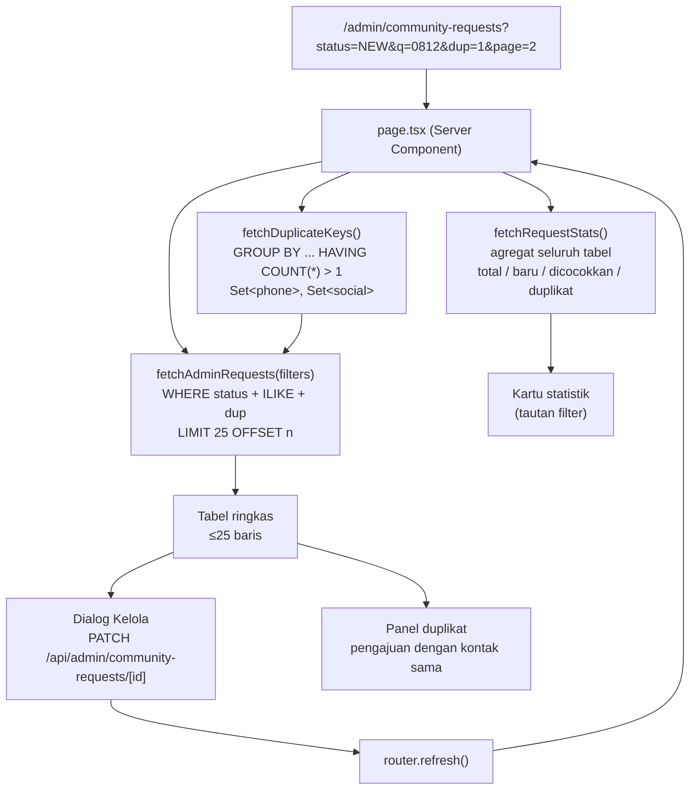

# feat: Rombak dashboard admin Pengajuan Komunitas

## Goal Capsule

Halaman `/admin/community-requests` merender **1616 baris sekaligus**, dan setiap baris memuat form edit penuh (select status + textarea + tombol Simpan). Akibatnya hanya ~2 baris muat di layar, tabel butuh scroll horizontal 1120px, dan tidak ada cara memfilter, mencari, atau menelusuri 240 kemungkinan duplikat.

Rencana ini mengubahnya menjadi dashboard triase yang bisa dipakai: baris ringkas, edit lewat dialog, filter status + pencarian + paginasi di sisi server, dan duplikat yang bisa dibandingkan dengan pasangannya.

**Selesai ketika:** admin bisa membuka halaman, memfilter ke "kemungkinan duplikat", mencari satu nomor telepon, melihat pengajuan lain dengan nomor yang sama, mengubah status + catatan, dan menyimpannya — tanpa scroll horizontal dan tanpa halaman merender lebih dari 25 baris.

---

## Problem Frame

### Yang rusak hari ini

Dari `app/(admin)/admin/community-requests/page.tsx`:

| Masalah | Akar penyebab | Dampak |
|---|---|---|
| Semua 1616 baris dirender | `db.select().from(communityJoinRequests)` tanpa `limit` | Payload HTML besar, halaman lambat, dan tumbuh linear seiring pengajuan masuk |
| Tinggi baris ~300px | `CommunityRequestActions` (select + textarea + tombol) ditanam di setiap `<td>` | ~2 baris per layar; memindai 1616 pengajuan praktis mustahil |
| Scroll horizontal | `min-w-[1120px]` untuk 7 kolom | Kolom Aksi terpotong di tepi kanan (terlihat di tangkapan layar) |
| Statistik header mati | Teks biasa: "1616 pengajuan tersimpan, 240 kemungkinan duplikat" | Angka duplikat terlihat tapi tidak ada cara membukanya |
| Tidak ada filter/pencarian | Tidak ada `searchParams` sama sekali | Menemukan satu pengajuan berarti Ctrl+F di 1616 baris |
| Duplikat buntu | Badge "Cek duplikat" tidak menautkan ke pengajuan pasangannya | Admin tahu ada duplikat tapi tidak bisa membandingkan |
| Kolom Tanggal membungkus 3 baris | Kolom terlalu sempit untuk `"27 Jul 2026, 04.49"` | Menambah tinggi baris tanpa memberi informasi |

### Jebakan teknis utama

`addDuplicateFlags` di `lib/community/admin-requests.ts` menghitung duplikat dengan membangun `Map` frekuensi dari **seluruh array yang diberikan**. Fungsi itu benar hanya karena pemanggilnya mengambil semua baris.

Begitu paginasi server-side masuk, fungsi itu hanya melihat 25 baris — dan akan melaporkan "tidak ada duplikat" untuk pengajuan yang pasangannya ada di halaman 40. Ini bukan degradasi halus; ini data yang salah di kolom yang jadi alasan utama admin membuka halaman ini. Deteksi duplikat **harus** pindah ke agregat SQL sebelum paginasi dinyalakan (U1 sebelum U2).

---

## Scope Boundaries

### Di dalam lingkup
- Perombakan visual halaman `/admin/community-requests` dan komponennya
- Filter status, pencarian, filter duplikat, dan paginasi server-side
- Deteksi duplikat pindah ke agregat SQL + penautan ke pengajuan pasangan
- Aksi kontak cepat (WhatsApp, salin nomor)

### Bukan lingkup (non-goal)
- Perubahan skema database — indeks yang ada (`normalized_phone`, `normalized_social`, `status+created_at`) sudah cukup
- Perubahan kontrak `PATCH /api/admin/community-requests/[id]` — endpoint yang ada tetap dipakai apa adanya
- Halaman admin lain (`users`, `pricing`, `content`, `visitor-stats`)
- Form publik pendaftaran komunitas

### Ditunda ke pekerjaan lanjutan
- **Aksi massal** (checkbox pilih-banyak + `PATCH` batch) — dipertimbangkan saat scoping dan sengaja ditunda; butuh endpoint baru dan semantik kegagalan sebagian. Layout toolbar di U4 harus menyisakan ruang untuk baris aksi massal agar penambahan nanti tidak memaksa tata ulang.
- **Penggabungan duplikat** (satu baris terkelompok mewakili banyak pengajuan) — U6 menampilkan pasangan berdampingan supaya admin bisa memutuskan; menggabungkan record adalah keputusan produk tersendiri.
- **Ekspor CSV** pengajuan terfilter
- Menyeragamkan pola paginasi ini ke halaman admin lain

---

## Requirements

| ID | Requirement |
|---|---|
| R1 | Halaman merender maksimal 25 pengajuan per permintaan; sisanya lewat paginasi |
| R2 | Flag duplikat dihitung terhadap **seluruh tabel**, bukan hanya baris di halaman aktif |
| R3 | Admin bisa memfilter berdasarkan status (Baru / Sudah dicocokkan / Ditolak / Semua) |
| R4 | Admin bisa memfilter ke pengajuan yang ditandai kemungkinan duplikat |
| R5 | Admin bisa mencari berdasarkan nama, nomor telepon, atau username sosial |
| R6 | Filter dan halaman aktif tercermin di URL, sehingga bisa di-bookmark dan bertahan saat refresh |
| R7 | Statistik header (total / baru / dicocokkan / duplikat) jadi kontrol filter yang bisa diklik, dan tetap menghitung seluruh tabel terlepas dari filter aktif |
| R8 | Tinggi baris tabel ≤ 72px; form edit tidak lagi ditanam di baris |
| R9 | Status + catatan admin diedit lewat dialog yang dibuka dari baris, memakai endpoint PATCH yang sudah ada |
| R10 | Pengajuan yang ditandai duplikat bisa menampilkan pengajuan lain dengan nomor/username ternormalisasi yang sama |
| R11 | Nomor telepon bisa diklik untuk membuka WhatsApp dan bisa disalin ke clipboard |
| R12 | Tidak ada scroll horizontal pada viewport ≥ 1024px |
| R13 | Perilaku admin-only saat ini tetap: setiap jalur baca/tulis tetap di balik `requireAdmin()` |

---

## Key Technical Decisions

### KTD1 — Deteksi duplikat pindah ke agregat SQL, bukan hitungan di memori

`SELECT normalized_phone FROM community_join_requests GROUP BY normalized_phone HAVING COUNT(*) > 1` (dan pasangannya untuk `normalized_social_username`) menghasilkan himpunan kunci duplikat untuk seluruh tabel. Halaman memuat kedua himpunan itu satu kali, lalu menandai baris di halaman aktif berdasarkan keanggotaan himpunan.

*Kenapa:* satu-satunya cara R2 tetap benar di bawah R1. Kedua kolom sudah terindeks (`community_join_requests_normalized_phone_idx`, `community_join_requests_normalized_social_idx`), jadi agregat ini murah.

*Alternatif yang ditolak:* subquery `EXISTS` berkorelasi per baris — benar juga, tapi memindahkan biaya ke setiap render baris dan memperumit query paginasi. Himpunan kunci lebih sederhana dan bisa dites tanpa database.

*Catatan skala:* dua himpunan itu berukuran jumlah nilai duplikat berbeda (~ratusan pada 1616 baris), bukan jumlah baris. Kalau tabel tumbuh ke ratusan ribu, ganti dengan `EXISTS` berkorelasi — kondisi pemicunya dicatat di Risks.

### KTD2 — Status filter sebagai URL searchParams, bukan state React

Halaman tetap Server Component. Filter dan paginasi lewat `searchParams`; toolbar adalah Client Component tipis yang menulis ke URL via `router.replace`.

*Kenapa:* memenuhi R6 tanpa biaya, mempertahankan pengambilan data di server, dan mengikuti pola yang sudah ada di `app/(dashboard)/estimate/new/page.tsx`. Next 14.2.35 memberi `searchParams` sebagai objek sinkron biasa — **bukan** Promise. Jangan salin pola `await ctx.params` dari route handler; itu bentuk yang berbeda.

### KTD3 — Edit lewat dialog, bukan baris yang bisa diperluas

`components/ui/dialog.tsx` (Radix) sudah ada di repo. Baris menampilkan tombol "Kelola" yang membuka dialog berisi status + catatan admin + Simpan.

*Kenapa:* R8 hanya bisa dipenuhi kalau form keluar dari baris. Dialog mengungguli baris yang diperluas di sini karena catatan admin adalah textarea multi-baris — memperluas baris akan mengembalikan masalah tinggi yang sama, cuma sesuai permintaan.

### KTD4 — Statistik header dihitung dengan query agregat terpisah

Kartu statistik tetap menghitung seluruh tabel bahkan ketika filter aktif (R7).

*Kenapa:* kalau angka mengikuti filter, memfilter ke "Baru" akan menampilkan "1612 baru" dari 1612 hasil — tautologi tanpa informasi. Menghitung seluruh tabel menjaganya tetap berguna sebagai navigasi.

### KTD5 — Pencarian pakai `ILIKE` dengan pola prefix-and-suffix

`ILIKE '%term%'` pada `full_name`, `phone`, dan `social_username`.

*Kenapa:* pada 1616 baris, scan sekuensial tidak terasa. Pencarian teks lengkap atau trigram akan menambah beban migrasi tanpa manfaat nyata di ukuran ini. Kalau tabel tumbuh melewati ~50rb baris, tinjau ulang — dicatat di Risks.

---

## High-Level Technical Design

### Aliran data setelah perubahan



Poin penting: `fetchDuplicateKeys()` menyuplai **baik** predikat filter duplikat (R4) maupun penandaan per baris (R2). Satu sumber kebenaran, dipakai dua kali.

### Bentuk baris: sebelum dan sesudah

```
SEBELUM — 7 kolom, min-width 1120px, tinggi ~300px

┌──────────┬────────────┬──────────┬────────┬────────┬─────────┬──────────────────┐
│ Nama     │ Kontak     │ Alasan   │Tanggal │ Status │Duplikat │ Aksi             │
├──────────┼────────────┼──────────┼────────┼────────┼─────────┼──────────────────┤
│ Irham    │ 0812840... │ mau tau  │ 27 Jul │ [Baru] │    —    │ Status           │
│ Ghifari  │ @irhamg... │ upadate  │ 2026,  │        │         │ [ Baru        ▾] │
│          │            │ info     │ 04.49  │         │        │ Catatan admin    │
│          │            │ umroh    │        │         │        │ ┌──────────────┐ │
│          │            │ mandiri  │        │         │        │ │              │ │
│          │            │          │        │         │        │ └──────────────┘ │
│          │            │          │        │         │        │ [   Simpan   ]   │
└──────────┴────────────┴──────────┴────────┴────────┴─────────┴──────────────────┘
   ↑ hanya ~2 baris muat di layar; kolom Aksi terpotong di tepi kanan


SESUDAH — 5 kolom, muat di 1024px, tinggi ~64px

┌───────────────────────┬──────────────────────┬──────────┬───────────────┬─────────┐
│ Pemohon               │ Alasan               │ Masuk    │ Status        │         │
├───────────────────────┼──────────────────────┼──────────┼───────────────┼─────────┤
│ Irham Ghifari         │ mau tau upadate      │ 6 jam    │ [Baru]        │ Kelola  │
│ 0812-8405-1103 · WA ⧉ │ info umroh mandiri   │ lalu     │               │         │
├───────────────────────┼──────────────────────┼──────────┼───────────────┼─────────┤
│ Dessy Dwi Lestari     │ Ingin tahu umroh     │ 8 jam    │ [Baru]        │ Kelola  │
│ 0819-9516-6383 · WA ⧉ │ mandiri itu seperti… │ lalu     │ [2 duplikat]  │         │
└───────────────────────┴──────────────────────┴──────────┴───────────────┴─────────┘
   ↑ ~10 baris muat di layar; badge duplikat membuka panel pembanding
```

Ringkasan penggabungan kolom: Nama+Kontak → **Pemohon**; Status+Duplikat → **Status** (badge bertumpuk); Aksi → satu tombol **Kelola**.

*Sketsa di atas adalah arahan tata letak, bukan spesifikasi piksel. Lebar kolom dan pilihan ikon diserahkan ke implementasi.*

---

## Output Structure

```
lib/community/
  admin-requests.ts                      (dimodifikasi — flag duplikat berbasis himpunan)
  admin-requests-query.ts                (baru — filter/cari/paginasi + statistik)
  __tests__/
    admin-requests.test.ts               (baru)
    admin-requests-query.test.ts         (baru)

components/admin/community-requests/
  CommunityRequestsToolbar.tsx           (baru — pencarian + chip filter)
  CommunityRequestsPagination.tsx        (baru)
  CommunityRequestRow.tsx                (baru — sel pemohon/kontak ringkas)
  CommunityRequestEditDialog.tsx         (baru — menggantikan CommunityRequestActions)
  DuplicatePartnerPanel.tsx              (baru)
  CommunityRequestActions.tsx            (dihapus di U5)
  __tests__/
    CommunityRequestsToolbar.test.tsx    (baru)
    CommunityRequestEditDialog.test.tsx  (baru — diadaptasi dari test Actions)
    DuplicatePartnerPanel.test.tsx       (baru)

app/(admin)/admin/community-requests/
  page.tsx                               (dimodifikasi — ditulis ulang di U3, disempurnakan di U4-U6)
  __tests__/
    page.test.tsx                        (baru)

app/api/admin/community-requests/
  duplicates/[id]/route.ts               (baru — di U6)
  duplicates/__tests__/route.test.ts     (baru)
```

Pohon ini adalah deklarasi lingkup, bukan batasan kaku. Daftar `Files:` per unit yang jadi acuan.

---

## Implementation Units

### U1. Deteksi duplikat pindah ke agregat SQL

**Goal:** flag duplikat tetap benar ketika halaman hanya memuat sebagian baris.

**Requirements:** R2

**Dependencies:** tidak ada

**Files:**
- `lib/community/admin-requests.ts` (modifikasi)
- `lib/community/__tests__/admin-requests.test.ts` (baru)

**Approach:**
Tambahkan `fetchDuplicateKeys()` yang menjalankan dua query `groupBy` + `having(count > 1)` — satu untuk `normalizedPhone`, satu untuk `normalizedSocialUsername` (abaikan yang null) — dan mengembalikan `{ phones: Set<string>, socials: Set<string> }`.

Ubah `addDuplicateFlags` agar menerima himpunan itu sebagai argumen kedua dan menentukan flag lewat keanggotaan himpunan, bukan dengan membangun `Map` dari array masukan. Pisahkan keputusan penandaan murni ke fungsi tanpa I/O agar bisa dites tanpa database.

`GET /api/admin/community-requests` (`app/api/admin/community-requests/route.ts`) juga memanggil `addDuplicateFlags` — perbarui pemanggilan itu di unit yang sama supaya tidak ada pemanggil yang rusak.

**Pola yang diikuti:** agregat drizzle `count()`/`groupBy` di `app/(admin)/admin/visitor-stats/page.tsx:20-33`.

**Execution note:** ini menukar mesin di balik kolom yang sudah dipercaya admin. Tulis test penandaan lebih dulu terhadap perilaku lama (dua pengajuan bernomor sama → keduanya ditandai) sebelum menukar implementasinya, supaya paritas terbukti, bukan diasumsikan.

**Test scenarios:**
- Dua pengajuan berbagi `normalizedPhone` → keduanya `possibleDuplicate: true`, `duplicateByPhone: true`
- Dua pengajuan berbagi `normalizedSocialUsername` → keduanya `duplicateBySocial: true`, `duplicateByPhone: false`
- Pengajuan berbagi nomor **dan** sosial → kedua flag true
- `normalizedSocialUsername` null pada beberapa pengajuan → tidak pernah ditandai duplikat sosial; null tidak saling cocok
- **Regresi inti:** satu pengajuan yang diberikan sendirian (mensimulasikan satu halaman) tetap `possibleDuplicate: true` ketika nomornya ada di himpunan kunci duplikat — inilah yang gagal di implementasi lama
- Himpunan kunci kosong → tidak ada baris yang ditandai
- `fetchDuplicateKeys` mengecualikan nilai dengan jumlah tepat 1

**Verification:** test paritas lulus; `GET /api/admin/community-requests` masih mengembalikan flag yang identik untuk dataset penuh.

---

### U2. Lapisan query: filter, pencarian, paginasi, statistik

**Goal:** satu modul yang mengubah filter jadi baris terpaginasi plus hitungan seluruh tabel.

**Requirements:** R1, R3, R4, R5, R7

**Dependencies:** U1

**Files:**
- `lib/community/admin-requests-query.ts` (baru)
- `lib/community/__tests__/admin-requests-query.test.ts` (baru)

**Approach:**
Ekspor tipe filter — status (`"NEW" | "MATCHED" | "REJECTED" | "ALL"`), `q` (string), `duplicatesOnly` (boolean), `page` (number) — plus parser yang mengubah `searchParams` mentah jadi bentuk itu dengan default aman dan penjepitan batas.

Ekspor `fetchAdminRequests(filters)` yang membangun `where` secara kondisional: `eq(status)` bila bukan ALL; grup `or()` berisi `ilike` pada `fullName`/`phone`/`socialUsername` bila `q` tidak kosong; `or(inArray(normalizedPhone, dupPhones), inArray(normalizedSocialUsername, dupSocials))` bila `duplicatesOnly`. Urutkan `desc(createdAt)`, `limit(25)`, `offset((page-1)*25)`. Kembalikan baris plus jumlah total hasil terfilter untuk paginasi.

Ekspor `fetchRequestStats(duplicateKeys)` — total, baru, dicocokkan, jumlah duplikat — dihitung dari seluruh tabel, tidak terpengaruh filter (KTD4). Hitungan duplikat butuh himpunan kunci dari U1, jadi fungsi ini menerimanya sebagai argumen ketimbang mengulang agregatnya.

Escape karakter wildcard `%` dan `_` pada masukan pencarian sebelum menyusun pola `ILIKE`; kalau tidak, mencari `_` mencocokkan semua. Nilainya tetap dilewatkan sebagai parameter terikat lewat `ilike()` drizzle — jangan pernah merangkai string SQL.

**Pembagian tanggung jawab paginasi.** Parser adalah fungsi murni dan tidak tahu jumlah total, jadi ia hanya menjepit ke minimum (nilai apa pun < 1 jadi 1). Penjepitan ke *halaman terakhir yang valid* terjadi di `fetchAdminRequests` setelah query hitungan berjalan: bila halaman yang diminta melampaui halaman terakhir, kembalikan halaman terakhir yang valid beserta barisnya dan laporkan nomor halaman efektif itu supaya U3 bisa merender kontrol paginasi yang benar. Tabel kosong (nol hasil) tetap mengembalikan array kosong di halaman 1, bukan error.

**Pola yang diikuti:** parsing `searchParams` dengan default terjepit di `app/(dashboard)/estimate/new/page.tsx:84-90`.

**Test scenarios:**
- Parser: `?status=NEW` → status NEW; `?status=SAMPAH` → ALL (nilai tidak dikenal jangan bikin error)
- Parser: `?page=0`, `?page=-3`, `?page=abc` → semua jadi halaman 1
- Parser: `?q=` kosong atau hanya spasi → dianggap tidak ada pencarian
- Parser: `?dup=1` → `duplicatesOnly: true`; nilai lain → false
- Pencarian mencocokkan nama parsial tanpa peduli huruf besar-kecil ("irham" cocok "Irham Ghifari")
- Pencarian mencocokkan potongan nomor telepon ("84051" cocok "081284051103")
- Pencarian mencocokkan username sosial
- Escape wildcard: `q="_"` tidak mengembalikan seluruh tabel
- Filter status dan pencarian digabung dengan AND, bukan OR
- `duplicatesOnly` dengan himpunan kunci kosong → nol hasil, bukan seluruh tabel
- Paginasi: halaman 2 mengembalikan baris 26-50 dalam urutan `createdAt` desc
- Halaman melampaui halaman terakhir → mengembalikan baris halaman terakhir yang valid dan melaporkan nomor halaman efektifnya, bukan array kosong
- Nol hasil sama sekali → array kosong dengan halaman efektif 1, tidak error
- `fetchRequestStats` mengembalikan hitungan seluruh tabel yang tidak berubah saat filter diterapkan
- Hitungan duplikat `fetchRequestStats` cocok dengan jumlah baris yang ditandai duplikat oleh U1

**Verification:** dijalankan pada data seed 1616 baris, `fetchAdminRequests` mengembalikan ≤25 baris untuk filter apa pun, dan jumlah total sesuai hitungan manual.

---

### U3. Halaman disambung ke lapisan query, dengan kontrol paginasi

**Goal:** halaman berhenti merender seluruh tabel. Bentuk baris belum berubah — unit ini hanya soal pengambilan data.

**Requirements:** R1, R6, R13

**Dependencies:** U1, U2

**Files:**
- `app/(admin)/admin/community-requests/page.tsx` (modifikasi)
- `components/admin/community-requests/CommunityRequestsPagination.tsx` (baru)
- `app/(admin)/admin/community-requests/__tests__/page.test.tsx` (baru)

**Approach:**
Terima `searchParams` sebagai prop halaman (objek sinkron biasa — Next 14.2, lihat KTD2). Parse lewat parser U2, panggil `fetchDuplicateKeys`, `fetchRequestStats`, dan `fetchAdminRequests`. Pertahankan `await requireAdmin()` sebagai baris pertama.

Kontrol paginasi adalah tautan Server Component (`<Link>` yang mempertahankan searchParams saat ini dan mengganti `page`), bukan komponen client — tidak ada state yang perlu dipegang. Tampilkan "Menampilkan 26-50 dari 1616".

Pertahankan `min-w-[1120px]` di unit ini. Baris masih memuat form edit inline yang butuh ~220px, jadi mencabut lebar minimum sekarang hanya membuat tabel gepeng tanpa menghilangkan scroll. R12 dipenuhi di U5, saat kolom benar-benar disusutkan dari 7 jadi 5.

**Test scenarios:**
- Halaman merender tepat 25 baris ketika ada 1616 pengajuan
- Halaman menghormati `?page=2` dan menampilkan slice kedua
- Halaman menghormati `?status=MATCHED` dan hanya merender pengajuan yang cocok
- Tautan paginasi mempertahankan filter aktif (dari `?status=NEW&page=1`, tautan berikutnya adalah `?status=NEW&page=2`)
- Tautan "Sebelumnya" tidak dirender/dinonaktifkan di halaman 1; "Berikutnya" tidak dirender/dinonaktifkan di halaman terakhir
- Nol hasil dengan filter aktif → pesan "tidak ada hasil" plus aksi hapus-filter, bukan pesan kosong "Belum ada pengajuan komunitas"
- Nol pengajuan sama sekali (tanpa filter) → pesan kosong asli tetap muncul
- Pengguna non-admin → `requireAdmin()` menolak sebelum ada query yang jalan

**Verification:** buka halaman dengan 1616 baris; HTML terkirim memuat 25 baris; navigasi ke halaman 2 mempertahankan filter.

---

### U4. Toolbar filter dan kartu statistik yang bisa diklik

**Goal:** filter, pencarian, dan statistik jadi terlihat dan bisa dioperasikan.

**Requirements:** R3, R4, R5, R6, R7

**Dependencies:** U3

**Files:**
- `components/admin/community-requests/CommunityRequestsToolbar.tsx` (baru)
- `components/admin/community-requests/__tests__/CommunityRequestsToolbar.test.tsx` (baru)
- `app/(admin)/admin/community-requests/page.tsx` (modifikasi)

**Approach:**
Toolbar adalah Client Component: input pencarian (debounce ~300ms sebelum menulis URL), chip status, dan toggle "kemungkinan duplikat". Setiap perubahan memanggil `router.replace` dengan searchParams terbarui dan mereset `page` ke 1 — kalau tidak, mempersempit filter dari halaman 40 mendarat di hasil kosong.

Empat teks statistik yang ada diganti kartu: Total, Baru, Sudah dicocokkan, Kemungkinan duplikat. Masing-masing adalah `<Link>` yang menerapkan filter terkait. Kartu yang aktif ditandai (border emas) supaya keadaan filter jelas terbaca.

Sisakan ruang vertikal di bawah baris toolbar untuk baris aksi massal yang ditunda (lihat Scope Boundaries) supaya penambahan nanti tidak memaksa tata ulang.

Pakai `components/ui/input.tsx` yang sudah ada — sudah memakai token warna repo.

**Pola yang diikuti:** token desain di `app/globals.css` (`--color-gold`, `--color-surface`, `--color-border`, `--color-text-muted`); gaya tabel admin di `app/(admin)/admin/users/page.tsx`.

**Test scenarios:**
- Mengetik di kotak pencarian menulis `?q=` ke URL setelah debounce
- Ketikan cepat berturut-turut hanya menghasilkan satu penulisan URL (debounce terbukti, bukan diasumsikan)
- Mengosongkan kotak pencarian menghapus `q` dari URL, bukan menyisakan `?q=`
- Mengklik chip status menulis `?status=` dan **mereset `page` ke 1**
- Mengklik chip status yang sudah aktif mengembalikannya ke ALL (toggle mati)
- Toggle duplikat menulis `?dup=1` dan menghapusnya saat dimatikan
- Mengubah filter apa pun mereset `page` ke 1
- Kartu statistik menampilkan hitungan seluruh tabel meskipun filter aktif (R7/KTD4)
- Kartu yang aktif punya penanda visual berbeda dan `aria-current`
- Input pencarian punya label yang bisa diakses

**Verification:** filter dan pencarian ditampilkan di URL; refresh browser memulihkan keadaan yang sama; kartu statistik tetap konstan saat filter berubah.

---

### U5. Baris ringkas dan dialog edit

**Goal:** memenuhi tuntutan visual inti — baris ≤72px, tanpa scroll horizontal, edit lewat dialog.

**Requirements:** R8, R9, R11, R12

**Dependencies:** U3

**Files:**
- `components/admin/community-requests/CommunityRequestRow.tsx` (baru)
- `components/admin/community-requests/CommunityRequestEditDialog.tsx` (baru)
- `components/admin/community-requests/__tests__/CommunityRequestEditDialog.test.tsx` (baru)
- `components/admin/community-requests/CommunityRequestActions.tsx` (dihapus)
- `components/admin/community-requests/__tests__/CommunityRequestActions.test.tsx` (dihapus)
- `app/(admin)/admin/community-requests/page.tsx` (modifikasi)

**Approach:**
Ringkas 7 kolom jadi 5 sesuai sketsa di High-Level Technical Design: Pemohon (nama + kontak), Alasan, Masuk, Status (badge status + badge duplikat bertumpuk), dan tombol Kelola. Cabut `min-w-[1120px]` di sini — setelah kolom disusutkan, R12 baru benar-benar tercapai.

Sel Pemohon menampilkan nama, nomor terformat sebagai tautan `wa.me`, dan tombol salin. Nomor `081...` harus dinormalkan ke `62...` untuk URL `wa.me`. Pertahankan indikator "Terhubung dengan akun" yang ada saat `userId` terisi.

Sel Alasan dipotong ke satu baris dengan CSS (`line-clamp-1`) alih-alih helper `truncate()` yang ada, sehingga teks lengkap tetap ada di DOM untuk pencarian browser dan pembaca layar. Kolom Masuk memakai waktu relatif ("6 jam lalu") dengan tanggal absolut di atribut `title` — ini yang membereskan pembungkusan tiga baris.

`CommunityRequestEditDialog` memindahkan logika `CommunityRequestActions` yang ada ke `components/ui/dialog.tsx`. Pertahankan bentuk `fetch` PATCH, penanganan error, dan `router.refresh()` apa adanya — hanya wadahnya yang berubah. Tutup dialog saat sukses; pertahankan terbuka dan tampilkan error saat gagal.

Adaptasi `CommunityRequestActions.test.tsx` yang ada jadi test dialog, jangan tulis ulang dari nol — test itu sudah mengunci perilaku PATCH yang benar.

**Execution note:** hapus `CommunityRequestActions.tsx` dan testnya dalam unit yang sama setelah dialog berfungsi. Meninggalkan komponen lama berarti nanti seseorang menambal jalur edit yang salah.

**Test scenarios:**
- Baris merender nama, nomor, alasan, tanggal relatif, dan badge status
- Nomor telepon menghasilkan tautan `wa.me` dengan format `62`, bukan `081`
- Tombol salin menaruh nomor mentah ke clipboard
- Tombol salin dan tautan WhatsApp punya nama yang bisa diakses yang menyebut nomornya, bukan hanya ikon telanjang
- Alasan lebih panjang dari satu baris dipotong visual tetapi teks lengkap ada di DOM
- Alasan null merender placeholder, bukan "null"
- Indikator "Terhubung dengan akun" muncul hanya ketika `userId` terisi
- Klik Kelola membuka dialog dengan status dan catatan saat ini terisi
- Simpan mengirim PATCH ke `/api/admin/community-requests/[id]` dengan status dan catatan baru
- PATCH sukses menutup dialog dan memicu refresh
- PATCH gagal menampilkan pesan error dan **membiarkan dialog terbuka** dengan input pengguna utuh
- Tombol simpan dinonaktifkan selama request berlangsung
- Escape / klik luar menutup dialog tanpa menyimpan
- Fokus pindah ke dialog saat terbuka dan kembali ke tombol Kelola saat tertutup

**Verification:** ukur tinggi baris yang dirender ≤72px; tabel muat di viewport 1024px tanpa scroll horizontal; alur edit bekerja penuh lewat endpoint yang sudah ada.

---

### U6. Panel pembanding duplikat

**Goal:** badge duplikat berhenti jadi jalan buntu — admin bisa melihat pengajuan mana yang bertabrakan.

**Requirements:** R10

**Dependencies:** U1, U5

**Files:**
- `app/api/admin/community-requests/duplicates/[id]/route.ts` (baru)
- `app/api/admin/community-requests/duplicates/__tests__/route.test.ts` (baru)
- `components/admin/community-requests/DuplicatePartnerPanel.tsx` (baru)
- `components/admin/community-requests/__tests__/DuplicatePartnerPanel.test.tsx` (baru)

**Approach:**
`GET /api/admin/community-requests/duplicates/[id]` mengambil `normalizedPhone` dan `normalizedSocialUsername` pengajuan, lalu mengembalikan pengajuan **lain** yang cocok pada salah satunya. Setiap hasil menandai apakah cocok lewat nomor, sosial, atau keduanya. Jaga dengan `requireAdmin()`, sama seperti route sibling-nya (R13).

Endpoint terpisah, bukan dimuat awal bersama halaman: hanya sebagian kecil baris yang ditandai duplikat, dan admin hanya membuka sedikit di antaranya. Memuat awal berarti menerbangkan data untuk 240 pengajuan agar mungkin dilihat tiga.

Badge duplikat di sel Status jadi bisa diklik dan membuka panel: nama, nomor, tanggal, dan status setiap pasangan, dengan penunjuk cocok-lewat-apa. Panel bersifat baca-saja — memutuskan apa yang harus dilakukan tetap urusan dialog Kelola. Sediakan keadaan memuat dan keadaan error yang bisa dicoba ulang.

**Test scenarios:**
- Endpoint mengembalikan pengajuan lain dengan `normalizedPhone` sama
- Endpoint mengembalikan pengajuan lain dengan `normalizedSocialUsername` sama
- Endpoint **mengecualikan** pengajuan yang diminta itu sendiri dari hasil
- Pengajuan dengan `normalizedSocialUsername` null tidak pernah cocok dengan pengajuan bersosial-null lain lewat jalur sosial
- Setiap hasil melaporkan dengan benar cocok lewat nomor, sosial, atau keduanya
- Pengajuan tanpa duplikat mengembalikan array kosong, bukan 404
- ID tidak dikenal mengembalikan 404
- Pengguna non-admin mendapat 403; pengguna anonim mendapat 401
- Panel merender daftar pasangan setelah dibuka
- Panel menampilkan keadaan memuat selagi fetch berlangsung
- Fetch gagal menampilkan error dengan aksi coba lagi
- Panel bisa ditutup dan tidak memicu ulang fetch yang tidak perlu saat dibuka lagi

**Verification:** buka sebuah pengajuan yang ditandai duplikat pada dataset asli; panel menampilkan pasangan yang benar dengan alasan kecocokan yang benar.

---

## Risks & Dependencies

| Risiko | Dampak | Mitigasi |
|---|---|---|
| Paritas duplikat rusak diam-diam saat U1 menukar mesin | Admin memakai kolom duplikat untuk triase; salah negatif berarti pengajuan ganda lolos | Test paritas U1 ditulis terhadap perilaku lama sebelum penukaran; skenario satu-baris-terisolasi adalah pemblokir eksplisit |
| Himpunan kunci duplikat tumbuh tak terbatas | `fetchDuplicateKeys` memuat seluruh nilai duplikat berbeda ke memori | Baik di ~1616 baris (ratusan kunci). Tinjau ulang di ~50rb baris; ganti ke `EXISTS` berkorelasi. Dicatat di KTD1 |
| `ILIKE '%term%'` tidak bisa pakai indeks | Pencarian melambat seiring pertumbuhan tabel | Tidak terasa di ukuran sekarang. Ambang tinjauan ulang sama (~50rb baris), lihat KTD5 |
| Bentuk `searchParams` Next 14 vs 15 | Menyalin pola `await ctx.params` dari route handler bikin halaman rusak | KTD2 menyatakan bentuknya eksplisit; test halaman U3 menangkapnya langsung |
| Filter tidak mereset paginasi | Mempersempit filter dari halaman 40 mendarat di hasil kosong dan terasa seperti bug | Reset `page` eksplisit di U4, ditutupi skenario test tersendiri |

**Dependensi:** tidak ada. Semua yang dibutuhkan sudah ada di repo — `components/ui/dialog.tsx`, `input.tsx`, `badge.tsx`, drizzle `count`/`groupBy`/`ilike`/`inArray`, dan indeks yang relevan.

---

## Verification Contract

1. `npx vitest run` lulus, termasuk semua berkas test baru
2. `npx tsc --noEmit` bersih
3. `npx next lint` bersih
4. Pada dataset 1616 baris: halaman merender 25 baris, tanpa scroll horizontal di 1024px, tinggi baris ≤72px
5. Filter berputar penuh: klik kartu duplikat → cari nomor → buka panel pasangan → edit lewat dialog → simpan → daftar ter-refresh dengan filter tetap utuh
6. Pengguna non-admin ditolak di halaman dan di kedua endpoint API

---

## Definition of Done

- [ ] R1-R13 terpenuhi dan bisa ditunjukkan
- [ ] U1-U6 selesai dengan skenario testnya masing-masing terimplementasi
- [ ] `CommunityRequestActions.tsx` dan testnya dihapus; tidak ada jalur edit ganda yang tertinggal
- [ ] Kontrak Verifikasi di atas lulus sepenuhnya
- [ ] Tidak ada perubahan skema DB dan tidak ada perubahan pada kontrak `PATCH /api/admin/community-requests/[id]`

---

## Assumptions

- **A1** — "Memperbaiki tampilan" mencakup alur kerja (filter, pencarian, paginasi), bukan hanya kosmetik. Dikonfirmasi pengguna saat scoping.
- **A2** — Duplikat ditangani lewat filter + penautan ke pasangan, bukan penggabungan baris. Dikonfirmasi pengguna saat scoping.
- **A3** — 25 baris per halaman. Angka awal yang wajar; ubah bila terasa terlalu sedikit saat dipakai.
- **A4** — Nomor telepon Indonesia yang dinormalkan ke prefix `62` untuk tautan `wa.me`. WhatsApp adalah saluran komunitas utama produk ini (lihat `components/ui/WhatsAppFloatingButton.tsx`).

---

## Sources & Research

- `app/(admin)/admin/community-requests/page.tsx` — implementasi saat ini yang jadi masalah
- `components/admin/community-requests/CommunityRequestActions.tsx` — form inline yang dipindah ke dialog di U5
- `lib/community/admin-requests.ts` — deteksi duplikat di memori yang ditukar di U1
- `app/(admin)/admin/visitor-stats/page.tsx:20-33` — pola agregat drizzle `count()`/`groupBy` yang diikuti U1/U2
- `app/(dashboard)/estimate/new/page.tsx:38-90` — pola parsing `searchParams` sinkron Next 14 yang diikuti U2/U3
- `app/globals.css:8-17` — token desain (`--color-gold`, `--color-surface`, `--color-border`, `--color-text-muted`)
- `lib/db/schema.ts:262-285` — skema `communityJoinRequests` dan indeks yang ada
- Tidak ada riset eksternal yang dijalankan: pola lokal untuk agregat drizzle dan `searchParams` Next 14 sudah kuat, dan tidak ada permintaan eksternal eksplisit.
