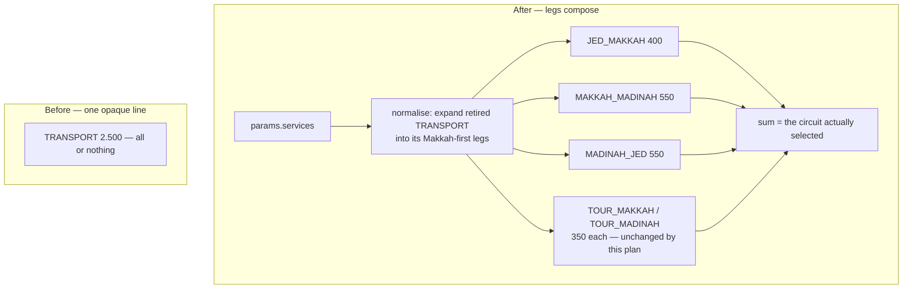
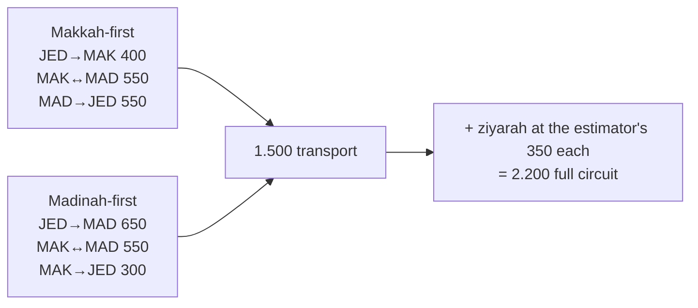

# feat: Split transport into route segments, add muthowif

## Goal Capsule

Transport is a single all-or-nothing line (`TRANSPORT`, "Full Rute", SAR 2.500). Replace it with the individual legs an itinerary is actually made of, so an estimate can charge for the Jeddah–Makkah transfer alone — the common case — and "full route" becomes the sum of the legs selected rather than a separate product. Add `MUTHOWIF` alongside, on by default.

---

## Summary

The estimator prices transport as one service key. A jamaah who only needs the airport transfer is quoted the whole circuit; a jamaah doing the full circuit is quoted a number that no longer matches the published rates. Both come from the same cause: the leg structure exists in the business but not in the data model.

The legs already exist, priced, in `app/(public)/transportasi/TransportasiClient.tsx`. This plan moves that structure into the estimator's service catalogue: five directional legs plus the two ziyarah services already in place. `TRANSPORT` retires, and the 19 saved estimates using it map onto the legs it stood for.

`MUTHOWIF` is added as a divide-by-pax service and joins the default set.

---

## Problem Frame

- **Who:** the admin quoting an estimate, and the jamaah receiving it.
- **Pain:** every quote carries the full circuit whether or not the trip needs it. There is no way to quote a single transfer, and no way to explain how SAR 2.500 was reached.
- **Why now:** the published rates on `/transportasi` and the estimator's figure have drifted 67% apart (see KTD3). Splitting the legs makes the estimator's number derivable from the published one instead of a parallel claim.
- **Non-goal:** unifying the two price stores. This plan reads the leg prices across once; a shared source is deferred (see Scope Boundaries).

---

## Requirements

- **R1** — Transport is selectable per leg. An estimate can carry one leg, several, or none.
- **R2** — Selecting one itinerary's three legs plus both ziyarah reproduces the full circuit; no separate "full route" key exists to double-count against.
- **R3** — Default services are VISA, SISKOPATUH, the Jeddah→Makkah leg, and MUTHOWIF.
- **R4** — `MUTHOWIF` is divide-by-pax, like the legs and the ziyarah services.
- **R5** — `TRANSPORT` is retired. The 19 saved estimates that reference it still open, and re-cost to the legs it represented.
- **R6** — Leg prices match the Staria rates **as published** on `/transportasi` — inclusive of the SSU and airport-pickup fees, not the raw `basePrice` behind them — and the customer-facing quote names each leg at that rate.
- **R7** — Both itinerary directions are quotable: Makkah-first and Madinah-first.

---

## Key Technical Decisions

- **KTD1 — Five directional legs, not three bidirectional ones.** The published rates are not symmetric: Jeddah→Makkah is 400 while Makkah→Jeddah is 300, and Jeddah→Madinah is 650 against Madinah→Jeddah's 550. `/transportasi` publishes only the Makkah→Madinah direction (550); this plan applies it to both ways as a deliberate assumption, which is why that one key is bidirectional. Modelling three legs with a direction flag would force one of each pair to carry the wrong rate, so each priced direction gets its own key:

  | Key | Route | Published Staria (SAR) | = basePrice + fees |
  |---|---|---|---|
  | `TRANSPORT_JED_MAKKAH` | Jeddah Airport → Makkah | **400** | 300 + 50 + 50 |
  | `TRANSPORT_JED_MADINAH` | Jeddah Airport → Madinah | **650** | 550 + 50 + 50 |
  | `TRANSPORT_MAKKAH_MADINAH` | Makkah ↔ Madinah | **550** | 500 + 50 |
  | `TRANSPORT_MAKKAH_JED` | Makkah → Jeddah Airport | **300** | 250 + 50 |
  | `TRANSPORT_MADINAH_JED` | Madinah → Jeddah Airport | **550** | 500 + 50 |

  These are the rates the page renders, not the `basePrice` fields behind them: `calculatePriceSAR` adds a flat 50 SAR SSU fee to every route and another 50 for an airport pickup. Seeding the raw `basePrice` array would leave the estimator 50–100 SAR under the published figure on every leg — the same drift this plan exists to close.

  **An itinerary uses three of these five, never all five** — a trip arrives at Jeddah once and leaves once, so `JED_MAKKAH` and `JED_MADINAH` are alternatives, as are the two return legs. This satisfies R7 without extra machinery: Makkah-first is JED_MAKKAH + MAKKAH_MADINAH + MADINAH_JED (1.500), Madinah-first is JED_MADINAH + MAKKAH_MADINAH + MAKKAH_JED (1.500). The two itineraries cost the same, which is a useful check that the rates were read correctly.

- **KTD2 — Ziyarah stays on the existing `TOUR_MAKKAH` / `TOUR_MADINAH` keys.** They are already in the enum, already divide-by-pax, already labelled "Tour Ziarah", and one saved estimate uses each. Introducing transport-namespaced duplicates would strand those rows for no gain. "Full route" in R2 therefore means one itinerary's three legs plus these two.

- **KTD3 — Take the leg prices from `/transportasi`, and treat the resulting total as the correction it is.** Compare like with like: `TRANSPORT` is the transport line alone, and ziyarah bills separately on its own keys (KTD2). An itinerary's three legs come to **1.500 SAR** published; the retiring `TRANSPORT` charges **2.500**. The estimator has been quoting **67% above** the published rate, a **1.000 SAR** gap on every full-circuit quote.

  **Settled by the operator (Q1):** the published figure is the one to quote. The number the business shows the public is the number its quotes should carry, and itemising the legs lets a jamaah check each one against that page — which is what the old opaque 2.500 made impossible.

- **KTD4 — `service_key` is a real Postgres enum, so this needs a migration.** Unlike `room_multipliers.type` (plain text, corrected with a data script), `serviceKeyEnum` is `pgEnum`. Postgres can add enum values but cannot drop them, so `TRANSPORT` stays in the type and is retired at the application layer: removed from `SERVICE_KEYS`, deleted from `service_fees`, and normalised away on read. Attempting a true drop would mean recreating the type and rewriting every dependent column — disproportionate to the gain.

- **KTD5 — Saved estimates are migrated on read, not backfilled.** `estimates.params` is JSONB re-costed at load, so a `TRANSPORT` entry can be expanded into the legs it stood for at read time. This keeps the stored rows untouched and reversible while the leg prices are still being confirmed. The mapping is Makkah-first (the itinerary the label implies): `TRANSPORT` → the three Makkah-first legs.

---

## High-Level Technical Design

How a quote's transport lines are assembled, before and after:

The two itineraries R7 requires, and why they reconcile:

---

## Implementation Units

### U1. Extend the service catalogue

**Goal:** Add the five leg keys and `MUTHOWIF` to the type and the database enum.
**Requirements:** R1, R4, R6, R7.
**Dependencies:** none.
**Files:**
- `types/index.ts` (`SERVICE_KEYS`)
- `lib/db/schema.ts` (`serviceKeyEnum`)
- `drizzle/migrations/` (generated)
- `lib/db/seed.ts` (`service_fees` rows)
- `app/api/admin/pricing/[category]/route.ts` (**third** hardcoded `SERVICE_KEYS` copy — import from `@/types` instead)
- `app/api/admin/pricing/__tests__/route.test.ts` (fourth copy, in the test)

**Approach:** Add six values to `serviceKeyEnum` and generate the migration; Postgres appends enum values without a table rewrite. Note that on drizzle's transactional migrate path a newly added enum value cannot be referenced in the same transaction, so the migration and the seed must be separate steps.

Seed the six rows at the KTD1 prices, `divideByPax: true`, currency SAR — **after Q1 settles the price basis** (KTD3), since the rows and their assertions are written from it.

`MUTHOWIF`'s price is not yet known (Q2). Seed it `enabled: false` rather than at amount 0: `calculateBudget` skips a disabled service but happily prices a zero-amount one, and U3 puts `MUTHOWIF` in the default set — a "SAR 0" line would otherwise reach customer quotes the moment U3 lands.

`SERVICE_KEYS` is duplicated in four places (`types/index.ts`, `lib/ai/parse.ts`, the admin pricing route, and its test). Collapse the admin route onto the exported constant here; without it the six new keys are unpriceable through the admin UI, which is the surface that answers Q2. Leave `TRANSPORT` in the enum per KTD4; U2 removes it from `SERVICE_KEYS`.

Labels should name the route plainly ("Transportasi Jeddah → Makkah"), not the vehicle: the estimator has one tier today and burying "Staria" in six labels would need six edits when that changes.

**Patterns to follow:** the existing `serviceFees` seed rows, and the `room_multipliers` sync in `lib/db/sync-room-multipliers.ts` for the upsert-and-read-back shape — `onConflictDoNothing` cannot correct a deployed row, which is what left the old multipliers stale.
**Test scenarios:**
- Every key in `SERVICE_KEYS` resolves to a `service_fees` row after seeding — no key can be selected that cannot be priced.
- The five leg prices equal the Staria figures in KTD1.
- `MUTHOWIF` seeds with `divideByPax: true` (Covers R4) and `enabled: false`, so it cannot price at 0.
- No seeded `service_fees` row exists outside `SERVICE_KEYS` — the converse of the check above, which is what catches a retired key being re-seeded.
- An admin price update succeeds for `MUTHOWIF` and for a leg key (proves the route's key list is no longer a separate copy).
**Verification:** `db:push` applies; the six rows read back at the intended values.

### U2. Retire TRANSPORT and normalise saved estimates

**Goal:** Remove `TRANSPORT` from selectable services without breaking the 19 estimates that reference it.
**Requirements:** R2, R5.
**Dependencies:** U1.
**Files:**
- `types/index.ts` (drop `TRANSPORT` from `SERVICE_KEYS`)
- `lib/estimate/services.ts` (new — normaliser)
- `lib/estimate/params.ts` (validation)
- `lib/budget/calculate.ts` (apply the normaliser before pricing)
- `lib/estimate/overrides.ts` (`service:TRANSPORT` override keys validate against `SERVICE_KEYS` too)
- `components/estimator/EstimatorClient.tsx` (reducer seeds from `existingParams` and posts them back on save)
- `app/api/estimate/route.ts` (duplicate re-validates the source estimate's stored params)
- `lib/db/seed.ts` (remove the `TRANSPORT` row, or seeding resurrects what this unit deletes)
- `lib/estimate/__tests__/services.test.ts` (new)
- **Fixture updates — 19 files reference `"TRANSPORT"` in typed positions and will fail `tsc` the moment the key leaves `SERVICE_KEYS`.** Repoint each at `TRANSPORT_JED_MAKKAH`; the retired key survives only inside this unit's own normaliser fixtures. Heaviest: `lib/budget/__tests__/{calculate,overrides}.test.ts`, `lib/export/__tests__/{whatsapp,pdf}.test.ts`, `components/estimator/__tests__/*.test.tsx`, `app/api/estimate/__tests__/*.test.ts`.

**Approach:** A `normaliseServices()` helper maps a stored service list to the current key set: `TRANSPORT` expands to the three Makkah-first legs (KTD5), unknown keys are dropped rather than thrown on. It also rewrites the manual-override map, since `service:<KEY>` override keys validate against the same constant.

Pricing is not the only boundary stored params cross. Apply it at **every** entry point, or the retired key resurfaces as a 400: the reducer seeds state straight from `existingParams` and posts it back on save; the duplicate endpoint re-validates the source estimate before it ever reaches `calculateBudget`. Guarding only `calculate.ts` fixes the displayed total and breaks both write paths — and the verification would pass vacuously, because `calculateBudget` already skips an unknown key without throwing.

Mirror `resolveRoomMultiplier`, which guards the room-type lookup at every call site for exactly this reason: the same class of bug — a persisted enum value the code no longer knows — has already bitten this codebase once.

Delete the `TRANSPORT` row from `service_fees` so it cannot be selected through the admin surface either.

**Execution note:** Behaviour-bearing and touching stored data — write the expansion test against a fixture holding the retired key, and watch it fail, before adding the normaliser.
**Patterns to follow:** `lib/estimate/room-types.ts` (`resolveRoomMultiplier`) — defensive resolution of a persisted value the enum no longer offers.
**Test scenarios:**
- A saved estimate carrying `TRANSPORT` expands to the three Makkah-first legs and prices at 1.500 SAR before ziyarah (Covers R5).
- A saved estimate carrying an arbitrary unknown key drops it and still prices the rest — the guard is about unknown values generally, not a `TRANSPORT` special case.
- A list already holding leg keys passes through untouched; expansion is not applied twice.
- `TRANSPORT` no longer validates as an input service.
- A stored `TRANSPORT` estimate can be **edited and re-saved** without a 400 — the check that catches guarding only the pricing boundary.
- Duplicating a stored `TRANSPORT` estimate returns 201 and prices to the legs.
- A stored `service:TRANSPORT` manual override still validates, and its hand-set price is either remapped or explicitly dropped rather than silently lost.
**Verification:** the 19 stored estimates open, re-cost, save, and duplicate. Note that "does not throw" is not sufficient evidence — an unrecognised key is skipped silently by `calculateBudget` with or without this unit.

### U3. Change the default service set

**Goal:** New estimates start with VISA, SISKOPATUH, Jeddah→Makkah, and MUTHOWIF.
**Requirements:** R3.
**Dependencies:** U1.
**Files:**
- `types/index.ts` (`DEFAULT_PARAMS.services`)
- `components/estimator/__tests__/EstimatorPreFill.test.tsx`

**Approach:** One-line change to the default array. The visible effect is that a fresh estimate quotes the airport transfer rather than the full circuit — the point of the whole plan, so it is worth an explicit test rather than trusting the constant.
**Test scenarios:**
- A fresh estimate's services are exactly the four in R3.
- Its transport cost equals the Jeddah→Makkah leg alone, not the circuit (Covers R3).
**Verification:** a new estimate renders four service rows with the Jeddah→Makkah line.

### U4. Surface the legs in the parser and the pickers

**Goal:** Let the AI and the manual controls select legs and muthowif.
**Requirements:** R1, R7.
**Dependencies:** U1.
**Files:**
- `lib/ai/prompt.ts` (service list and extraction rules)
- `lib/ai/parse.ts` (`SERVICE_KEYS`)
- `components/estimator/ServiceCheckboxGrid.tsx`
- `components/estimator/SentenceCard.tsx` (services chip summary)
- `lib/ai/__tests__/parse.test.ts`

**Approach:** Teach the prompt the vocabulary an admin actually types — "jemput bandara", "antar Jeddah", "full rute", "muthowif"/"mutawif" — and map "full rute" to **one itinerary's three legs** plus both ziyarah — Makkah-first unless the input names Madinah first — rather than to a single key, since no single key remains. Mapping it to all five legs would charge two Jeddah arrivals. Eleven checkboxes is a long undifferentiated list; group the legs under a transport heading so the ziyarah and non-transport services stay findable.
**Patterns to follow:** the airline and month synonym lists already in `lib/ai/prompt.ts`.
**Test scenarios:**
- "full rute" yields three legs plus both ziyarah, never five — a five-leg result means two arrivals were charged.
- "full rute, Madinah dulu" yields the Madinah-first three legs.
- "muthowif" and the "mutawif" spelling both yield `MUTHOWIF`.
- A request naming only the airport transfer yields `TRANSPORT_JED_MAKKAH` alone.
- The prompt contains no reference to the retired `TRANSPORT` key.
**Verification:** parse suite green; the grid offers every key in `SERVICE_KEYS`.

### U5. Apply to production and re-verify a real quote

**Goal:** Land the catalogue change on the deployed database and confirm quotes move as intended.
**Requirements:** R5, R6.
**Dependencies:** U1–U4.
**Files:** `scripts/sync-service-fees.ts` (new — one-off production sync, mirroring `scripts/sync-room-multipliers.ts`).
**Approach:** Apply the enum migration and the `service_fees` rows to production, then delete the `TRANSPORT` row. Reuse the sync-script shape from `scripts/sync-room-multipliers.ts` rather than running the full seed against a live database.
**Execution note:** Runtime verification, not unit tests — the point is that deployed quotes changed.
**Test scenarios:** none — `Test expectation: none — production data application; behaviour is covered by U1–U4.`
**Verification:** a default estimate quotes the Jeddah→Makkah leg; a Makkah-first circuit totals **1.500 SAR of transport** (2.200 including ziyarah at the estimator's unchanged 350); one of the 19 stored estimates opens, re-costs, saves, and duplicates. Also confirm a dashboard card and its detail page agree — stored `totalIdrPax` is not recomputed by KTD5's read-time approach, so the 19 cards will show pre-change totals until they are refreshed.

---

## Scope Boundaries

**In scope:** the five leg keys and `MUTHOWIF`; retiring `TRANSPORT` with read-time normalisation; the new default set; parser, prompt, and picker support; production application.

### Deferred to Follow-Up Work
- **One source of truth for transport prices.** They live hardcoded in `app/(public)/transportasi/TransportasiClient.tsx` and, after this plan, also in `service_fees`. This plan copies them across once; keeping them in step is a separate change, and until it lands a rate edited on one side silently disagrees with the other.
- **Vehicle-tier selection.** `/transportasi` prices four tiers (Sedan, Staria, HiAce, GMC); the estimator assumes Staria. A group larger than Staria's seven cannot physically fit the vehicle it is being quoted for, so a tier that follows pax is worth doing — but it is a pricing-model change, not a catalogue one.
- **Taif ziyarat and the train-station transfers.** Priced on `/transportasi`, absent here; nothing in the request asked for them.

### Out of Scope (non-goals)
- Changing how divide-by-pax services are computed.
- The hotel or airline pricing layers.
- Dropping `TRANSPORT` from the Postgres enum type (KTD4).

---

## Open Questions

- **Q1 — RESOLVED (operator, 2026-07-27): use the rates published on `/transportasi`, fees included.** The legs seed at 400 / 650 / 550 / 300 / 550, so an itinerary's transport is 1.500 rather than the retiring 2.500. The operator accepted the 1.000 SAR reduction knowing it is a per-group figure that divides by pax. U1 is no longer blocked.
- **Q2 — What does muthowif cost, and does it belong on by default?** U1 seeds the key `enabled: false` so the rest of the plan can proceed without a zero-priced line reaching a quote. Two answers are needed before U5: the price, and the evidence that a muthowif applies to a default umrah quote at all — R3 puts a charge on every new estimate that this plan asserts rather than argues.
- **Q3 — Should ziyarah move to the `/transportasi` price?** The estimator charges SAR 350; `/transportasi` publishes 300 (250 base + the 50 SSU fee). Same drift as Q1, on keys this plan otherwise leaves alone. Left out of scope deliberately — flagged because after this plan a single quote mixes two price bases. Answering it yes moves the full circuit from 2.200 to 2.100.

- **Q4 — Should the default be one leg or three?** R3 defaults to the Jeddah→Makkah transfer alone, but `DEFAULT_PARAMS` already ships 4 nights Madinah and 9 nights Makkah — a two-city trip whose transport the default does not cover. If most quotes are full-circuit, the operator re-adds two legs on every one of them and an unedited quote understates transport by 1.000 SAR. Needs the share of single-transfer versus full-circuit quotes to settle.

- **Q5 — RESOLVED (operator, 2026-07-27): itemise the legs.** A full-circuit quote names each leg at its published rate rather than collapsing to a subtotal. This is the answer to the Problem Frame's "no way to explain how SAR 2.500 was reached" — the jamaah can now check every line against the public page. The export grows to roughly 21 lines of transfer detail on a full circuit; that verbosity is accepted as the cost of the transparency.

---

## Verification Contract

- `lib/estimate/__tests__/services.test.ts` — retired-key expansion, unknown-key tolerance, idempotence (U2).
- `lib/ai/__tests__/parse.test.ts` — "full rute" and muthowif vocabulary, absence of the retired key (U4).
- `components/estimator/__tests__/EstimatorPreFill.test.tsx` — the default set and its transport cost (U3).
- Seed/catalogue coverage — every `SERVICE_KEYS` entry has a priced row (U1).
- Full suite plus `tsc --noEmit` green. The two date-dependent webinar tests in `app/(public)/webinar-umroh-mandiri/` already fail on `main` and are unrelated.
- Manual: a default estimate shows the Jeddah→Makkah line; a Makkah-first circuit totals 1.500 SAR of transport (2.200 with ziyarah unchanged); a stored `TRANSPORT` estimate opens, re-costs, saves, and duplicates.

## Definition of Done

- Transport is quotable per leg, and a full circuit is one itinerary's three legs plus both ziyarah.
- New estimates default to VISA, SISKOPATUH, Jeddah→Makkah, and MUTHOWIF.
- `TRANSPORT` is unselectable, and all 19 estimates referencing it still open, re-cost, save, and duplicate.
- Leg prices match the Staria rates as published on `/transportasi`, fees included.
- Leg rows seed at the published `/transportasi` rates per Q1, and the customer-facing exports itemise them per Q5.
- **Q2 has a confirmed non-zero muthowif price** before U5; `enabled: false` holds the line until then.

## Sources & Research

No external research — the leg structure and its prices are already in the repo. Grounding gathered while planning: `app/(public)/transportasi/TransportasiClient.tsx` carries a four-tier route matrix (12 routes × 4 vehicle tiers) hardcoded in the component, rendered through `calculatePriceSAR`, from which the Staria figures in KTD1 are taken; `serviceKeyEnum` in `lib/db/schema.ts` is a `pgEnum`, unlike the plain-text `room_multipliers.type`; and production `service_fees` holds `TRANSPORT` at SAR 2.500 against ziyarah at SAR 350, while 19 of 22 stored estimates reference `TRANSPORT`. Related prior plan: `docs/plans/2026-07-26-001-fix-room-type-price-multiplier-plan.md`, whose read-time-resolution pattern U2 reuses.
