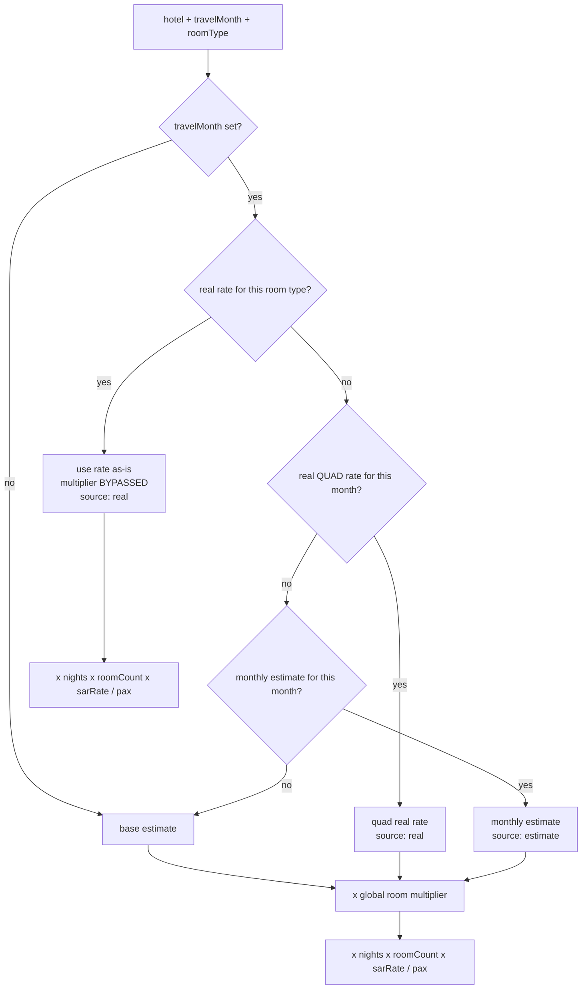

# feat: Per-room-type real hotel prices from supplier catalogues

## Goal Capsule

**Objective:** Give Quad, Triple, Double (and, where a catalogue ever prints one, Quint) their own real SAR/night rate per hotel per month, sourced from the catalogues in `docs/pricelist/`, instead of deriving every non-quad rate from one global ratio.

**Authority:** This plan is authoritative on the storage shape, the resolution ladder, and the CSV contract. The supplier catalogues in `docs/pricelist/` are authoritative on the numbers — never adjust a printed rate to make it fit a pattern.

**Execution profile:** Behaviour-bearing pricing change on top of a proven import path. Land the schema and resolution work behind the existing quad-only behaviour first, then transcribe data.

**Stop conditions:**
- Do not commit. The user asked for this work uncommitted; leave changes in the working tree and report what changed.
- Stop and ask if a catalogue's basis is ambiguous (per-person vs per-room, or a currency other than SAR) rather than guessing a conversion.
- Stop if a hotel's Quad rate transcribed from a catalogue contradicts the value already in `docs/data/real-hotel-prices-2027.csv` by more than rounding — that is a data conflict, not a room-type question.

**Tail ownership:** The implementer owns the transcription accuracy pass (U5) and the production import (U7). Neither is complete on a green test suite alone.

---

## Product Contract

### Summary

`real_hotel_prices` stores one SAR/night per (hotel, month), understood as the price of one **Quad** room. Every other room type is derived at calculation time by multiplying that quad rate by a single global ratio shared by all hotels — Quint 1.15, Triple 0.85, Double 0.70 — declared in `lib/estimate/room-types.ts` as "a starting point with the right ordering, NOT supplier-confirmed figures".

The supplier catalogues print the real answer. They quote DBL / TRPL / QUAD per room per night, and the step between beds is a flat SAR increment that differs per hotel:

| Hotel (catalogue) | DBL | TRPL | QUAD | Step/bed | Real DBL÷QUAD | App uses |
|---|---|---|---|---|---|---|
| AZKA Al-Safa, 20 Jun-1 Jul | 520 | 570 | 620 | +50 | 0.839 | 0.70 |
| Maysan Al Mashaer, 16-25 Jun | 455 | 535 | 615 | +80 | 0.740 | 0.70 |
| Maysan Al Maqam, 16-25 Jun | 345 | 395 | 445 | +50 | 0.775 | 0.70 |
| Maysan Altaqwa, 23 Jun-20 Sep | 360 | 410 | 460 | +50 | 0.783 | 0.70 |

Two consequences follow. Double and Triple quotes come out low across the board, and no single global ratio can be right, because the true ratio is a function of each hotel's own per-bed increment against its own base.

This plan adds a room-type dimension to the real-price layer — schema, CSV import, and resolution — and rebuilds `docs/data/real-hotel-prices-2027.csv` from `docs/pricelist/` so covered hotels carry their own printed Double and Triple rates. Hotels no catalogue covers price exactly as they do today.

### Problem Frame

**Who:** Admins quoting non-quad packages through `/estimate/new`, and the jamaah receiving those quotes.

**Pain:** A Double quote is priced from a ratio nobody confirmed. Against the four catalogue rows above, the real ratio runs 0.74-0.84 while the app applies 0.70 — so the smaller, higher-budget groups get the least trustworthy numbers. The `harga real` badge appears on these quotes, which asserts an authority the derived figure does not have.

**Why now:** The real-price layer landed in `docs/plans/2026-07-24-001-feat-real-hotel-price-layer-plan.md` and made the quad rate authoritative. `docs/plans/2026-07-26-001-fix-room-type-price-multiplier-plan.md` then fixed the double-scaling bug and explicitly deferred "per-hotel room-type rates — if a hotel ever charges genuinely different nightly rates per room type, that is a schema change". The catalogues confirm they do. This plan is that deferred item.

**Non-goal:** Re-basing `sarPerNight`. It stays "one quad room per night", and the global multiplier stays in place as the fallback for every hotel, month, and room type a catalogue does not cover.

### Requirements

**Storage and import**

- R1. A real price is stored per (hotel, month, room type), traceable to its source catalogue.
- R2. Existing real prices are preserved and understood as Quad rates.
- R3. The import CSV carries a room-type column; a row that omits it imports as Quad, so today's file and template keep working unchanged.

**Pricing correctness**

- R4. When a real rate exists for the resolved hotel, month, and room type, the estimate uses it directly and does not apply the global room multiplier.
- R5. When no room-type-specific rate exists, resolution falls back through the quad real rate, then the monthly estimate, then the base estimate — each with the global multiplier applied, exactly as today.
- R6. With no room-type rows present, every estimate produces output identical to before this change.
- R7. Quint carries a real rate only where a catalogue prints one, and is priced by the fallback path everywhere else. Most catalogues quote DBL/TRPL/QUAD only; Saif Al Yamani and Al Manara do print a 5-bed rate. Quint is never derived from a quad rate at transcription time.

**Data**

- R8. `docs/data/real-hotel-prices-2027.csv` carries Double and Triple rates for every hotel a catalogue covers that also exists in the database.
- R9. A rate transcribed from a catalogue is distinguishable from a forecast-filled rate by its import batch's `sourceLabel`.

### Acceptance Examples

- AE1. Given AZKA Al-Safa has a July Double real rate of 550 and the global Double multiplier is 0.70, when 2 pax quote a July Double, the nightly rate used is 550 — not 700 x 0.70.
- AE2. Given a hotel has a July Quad real rate but no Double rate, when 2 pax quote a July Double, the nightly rate used is the quad real rate x 0.70, and the breakdown still reads `harga real`.
- AE3. Given 5 pax quote a Quint at a hotel whose catalogue prints no 5-bed rate, the nightly rate used is the quad real rate x 1.15 (R7).
- AE5. Given 5 pax quote a Quint at a hotel whose catalogue does print a 5-bed rate, that rate is used as-is with the multiplier bypassed, exactly like Double and Triple (R7).
- AE4. Given a CSV row with an empty `room_type` cell, when it imports, its months land as Quad rates (R3).

### Scope Boundaries

**In scope:** the room-type dimension on `real_hotel_prices`; the CSV and import path; room-type-aware resolution in the budget calculation and in the rates shown by the pickers; transcription of `docs/pricelist/` into the 2027 CSV; the extraction and verification prompt docs; the production import.

#### Deferred to Follow-Up Work

- A dedicated admin UI for real-price catalogues. Still deferred from the 2026-07-24 plan; the import endpoint and `pnpm import:real-prices` remain the data path.
- Room-type rates on `hotel_monthly_prices` (the estimate layer). Only the real layer gains the dimension here.
- Mixed-occupancy groups (5 pax as one Quad plus one Double). The model still assumes one room type per estimate.
- Backfilling `realMonthlyPrices` onto the tier-fallback options built by `fallbackHotelOptions` in `lib/estimate/hotel-selection.ts`, which carry no real prices today.

#### Out of Scope (non-goals)

- Re-basing `sarPerNight` or changing what the quad rate means.
- Removing the global room multiplier. It remains the fallback and stays admin-tunable.
- Runtime PDF reading or an automated extraction pipeline. Transcription stays a prompted, human-reviewed step.
- Committing the work.

---

## Planning Contract

### Key Technical Decisions

- KTD1. Add a `room_type` column to `real_hotel_prices` rather than a new table. The row shape, the FK, the upsert, and every consumer stay identical; only the unique key widens from `(hotel_price_id, month)` to `(hotel_price_id, month, room_type)`. A parallel table would fork the resolution code into two ladders that must be kept in step. The migration backfills existing rows to `QUAD`, which is what they already mean (R2).

- KTD2. Store each room type's printed rate, not a per-hotel ratio. The catalogues print absolute SAR per room per night; a stored ratio would be a derived number that re-opens the same "where did this figure come from" question the global multiplier has. It also survives a catalogue that prices two room types independently rather than by a fixed step.

- KTD3. A room-type-specific real rate bypasses the global multiplier entirely (R4). This is the one place the change can silently corrupt every quote: applying 0.70 on top of an already-Double rate under-prices by 30%. Make the bypass explicit in the resolution return value rather than inferring it at the call site, so the calculator cannot forget.

- KTD4. Resolution is a four-step ladder per (hotel, month, room type), and only step 1 bypasses the multiplier:

  1. real rate for that room type — used as-is;
  2. real Quad rate for that month — x global multiplier;
  3. monthly estimate — x global multiplier;
  4. base estimate — x global multiplier.

  Steps 2-4 are today's behaviour unchanged, which is what makes R6 and R7 hold without special-casing either.

- KTD5. Nest the room type inside the existing map on `PricingConfig`: `realMonthlyPrices` becomes month to room-type to rate. `lib/budget/calculate.ts` is its only reader, so a nested shape costs one file and avoids carrying two parallel maps that can disagree about which months are real.

- KTD6. The CSV grows a `room_type` column, and an empty or absent cell means `QUAD` (R3). This keeps `docs/data/real-hotel-prices-2027.csv`, `docs/templates/real-hotel-prices-template.csv`, and every previously-transcribed catalogue importable without edits, and it keeps the extraction prompt's per-hotel mental model intact — a hotel becomes up to four rows instead of one, rather than a new grammar. The alternative, twelve months x four types as 48 columns, is unreadable at transcription time, which is where the errors come from.

- KTD7. Forecast-fill non-catalogue months from the hotel's own per-bed increment, not the global ratio, taking the increment from that hotel's nearest priced period rather than one constant per hotel. A forecast Double for an uncovered month is `forecast quad - 2 x step`. The increment is per-hotel and sometimes per-period: Maysan Al Mashaer holds +80 and Maysan Al Maqam +50 across all six of their periods, but AZKA Al-Safa steps +50, +75, then +85 across its three, rising with the season. So a single constant per hotel would misprice AZKA's shoulder months by up to 70 SAR per room per night. Nearest-priced-period is still a far better estimator than one ratio shared by 67 hotels. Import forecast rows as a separate batch with a `sourceLabel` marked forecast, following the convention already stated in `docs/prompts/real-hotel-price-extraction.md` (R9).

- KTD8. Map a catalogue date range to a calendar month by the range covering the **most days** of that month. The catalogues price by period (`16/06/2026 - 25/06/2026`), the CSV is per calendar month, and the mapping has to be a stated rule or two transcribers will disagree. This is not a free choice: the existing Quad column already follows it, so any other rule puts the new Triple/Double rows on different periods than the Quad rows beside them. Verified against Maysan Al Mashaer, Grand Al Massa, Snood Ajyad, and Royal Majestic — July resolves to the 16/07-30/07 period (14 July days), not the 09/07-16/07 one that contains the 15th. Every room type of a hotel must use the same mapping. When a month splits across periods whose rates differ by more than 10%, record it in the transcription review notes.

### High-Level Technical Design

The resolution ladder is the load-bearing piece — it is where R4, R5, R6, and R7 all land, and where the multiplier bypass either happens or silently corrupts every non-quad quote.



Only the leftmost branch is new. Everything reachable through steps 2-4 is the current code path, which is what makes the no-room-type-rows case byte-identical (R6).

The CSV shape, as directional guidance for the transcription and parser work — one hotel becomes one row per priced room type, and the `room_type` cell is the only structural change:

```
city,tier,label,room_type,jan_sar,feb_sar,...,dec_sar
MAKKAH,PELATARAN,AZKA Al Safa,QUAD,975,1055,...
MAKKAH,PELATARAN,AZKA Al Safa,TRIPLE,875,955,...
MAKKAH,PELATARAN,AZKA Al Safa,DOUBLE,825,905,...
MADINAH,STANDARD,Kayan International,,470,545,...   <- empty room_type = QUAD
```

### Assumptions

- The catalogues in `docs/pricelist/` quote per **room** per night including full board, matching the basis `sarPerNight` already uses. Confirmed on the two machine-readable catalogues, which state "All PRICES INCLUDE FULL BOARD FAR EAST & VAT" and "Including FB Fareast".
- 1448H / 2026-dated catalogues are acceptable sources for the 2027 CSV. The existing file was already built this way — its AZKA Al-Safa July and August quad values (700, 750) are the June-2026 catalogue's figures verbatim. This plan does not change that practice; it inherits it.
- Five of the seven catalogues are scanned images with no extractable text layer, so transcription is a page-by-page visual pass. Only `AZKA HOTEL PRICE LIST.pdf` and `Makkah & Madinah Hotel 7 & 15 June 2026.pdf` yield text to `pdftotext`.

---

## Implementation Units

### U1. Add the room-type dimension to the real-price table

**Goal:** Store a real rate per (hotel, month, room type) with existing rows preserved as Quad.
**Requirements:** R1, R2.
**Dependencies:** none.
**Files:**
- `lib/db/schema.ts` (`realHotelPrices`)
- `drizzle/migrations/` (new numbered migration)

**Approach:** Add `roomType` as a `text` column, not a pgEnum — `room_multipliers.type` is already plain `text` and no `roomTypeEnum` exists, so a new enum would introduce the first one for a value the app validates in TypeScript anyway. Default it to `QUAD` so the backfill and the insert path both land correctly without a separate data step. Widen the unique constraint to `(hotel_price_id, month, room_type)`; the migration must drop the existing two-column unique before adding the three-column one, or the second insert for a hotel-month collides. Extend the column comment to say the rate is per room of that type per night, matching how `sarPerNight` documents its quad basis today.

**Patterns to follow:** the `unique().on(...)` composite on `hotelMonthlyPrices` in the same file; the numbered SQL files in `drizzle/migrations/`.
**Test scenarios:** `Test expectation: none -- schema and migration only; the behaviour it enables is covered by U2 and U3.`
**Verification:** `pnpm db:generate` produces a migration that drops the old unique and adds the new one; applying it against a database holding the current real rows leaves every row intact with `room_type = 'QUAD'`; two rows differing only in `room_type` insert without conflict.

### U2. Teach the import path the room-type column

**Goal:** Accept a `room_type` column in the real-price CSV, defaulting to Quad, and carry it through to the upsert.
**Requirements:** R1, R3, R9.
**Dependencies:** U1.
**Files:**
- `lib/admin/real-hotel-pricing-import.ts`
- `lib/admin/__tests__/real-hotel-pricing-import.test.ts`
- `app/api/admin/pricing/real-hotel-import/confirm/route.ts`
- `docs/templates/real-hotel-prices-template.csv`

**Approach:** `room_type` is an optional column — it must not join `REQUIRED_HEADERS`, or every previously-transcribed catalogue becomes a file error (R3, KTD6). Validate the value against the same room-type list the app uses rather than a second literal array in this file; an unrecognised value is a row error, not a silent coercion to Quad, because a typo'd `DBL` should surface rather than quietly overwrite the quad rate. Widen the upsert's conflict target to match U1's new unique key. Row identity within a plan is now (hotel, month, room type), so the existing "one upsert per hotel-month" guarantee needs restating at the new granularity. The row cap in the route stays at 500 — the rebuilt CSV lands near 150 rows, well inside it.

**Execution note:** Extend the existing parser suite first — the current tests encode the hotel-month invariants, and watching them still pass after the widening is the evidence that Quad-only CSVs are untouched.
**Patterns to follow:** the existing `parseRealHotelPricingCsv` row loop, and `resolveRoomMultiplier`'s posture of falling back rather than throwing on an unknown room type.
**Test scenarios:**
- A row with `room_type=DOUBLE` produces upserts carrying `DOUBLE` for each filled month.
- A row with an empty `room_type` cell produces `QUAD` upserts (Covers AE4).
- A CSV with no `room_type` column at all parses exactly as today, all months landing as Quad — the regression guard for R3.
- Three rows for one hotel at `QUAD`, `TRIPLE`, `DOUBLE` produce three upserts for the same month with no duplicate-key collision.
- `room_type=DBL` is a row error naming the invalid value, and that row writes nothing.
- Two rows for the same hotel, month, and room type collapse to one upsert.
- A matched row whose months are all blank remains a row error, unchanged.
**Verification:** the parser suite is green including the pre-existing cases; `docs/data/real-hotel-prices-2027.csv` in its current unmodified form still imports as an all-Quad batch under `pnpm import:real-prices` dry-run.

### U3. Make budget resolution room-type aware

**Goal:** Use a room-type real rate directly when one exists, and never apply the global multiplier on top of it.
**Requirements:** R4, R5, R6, R7.
**Dependencies:** U1, U2.
**Files:**
- `types/index.ts` (`HotelPriceConfig.realMonthlyPrices`)
- `lib/budget/calculate.ts` (`resolveHotelSar`, `resolveCityHotel`, `calculateHotelIdrPerPerson`, `fetchPricingConfig`)
- `lib/budget/__tests__/calculate.test.ts`

**Approach:** Nest the room type inside `realMonthlyPrices` (KTD5) and give `resolveHotelSar` the room type. It returns the rate, the existing `source` flag, and a third field saying whether the rate is already room-type-specific; the calculator reads that field to choose between the global multiplier and 1. Do not infer the bypass from `source === "real"` — a quad real rate is also `real` but still needs the multiplier, and conflating them is exactly the 30% under-pricing failure (KTD3). The `harga real` badge is driven by `source`, so both real branches keep reporting `real` and the badge behaviour is unchanged (AE2).

`roomMultiplier` is also reported in `hotelMadinahDetail` / `hotelMakkahDetail` and rendered into the formula strings at `components/estimator/BudgetBreakdown.tsx:51` and `lib/export/summary.ts:33`. When the multiplier is bypassed it must report 1, or the displayed arithmetic will not reconcile with the total. Both of those surfaces already omit the multiplier term when it equals 1, so reporting 1 makes the breakdown and the WhatsApp/PDF export read correctly with no edits to either.

**Execution note:** Behaviour-bearing pricing change. Write the expectation matrix across the four ladder steps first and watch the bypass case fail before wiring it.
**Technical design:** Directional — `resolveHotelSar(config, roomType, travelMonth)` returns `{ sarPerNight, source: "real" | "estimate", roomTypePriced: boolean }`, and the effective multiplier at the call site is `roomTypePriced ? 1 : room.multiplier`.
**Patterns to follow:** the existing `describe("real price layer (U3)")` block in `lib/budget/__tests__/calculate.test.ts` for fixture shape.
**Test scenarios:**
- A hotel with a July Double real rate of 550, quoted 2 pax July Double, prices at 550/night with the multiplier not applied (Covers AE1).
- The same hotel with only a July Quad real rate prices at quad x 0.70, and the detail still reports `priceSource: "real"` (Covers AE2).
- 5 pax Quint at a hotel whose catalogue prints no 5-bed rate prices at quad x 1.15 (Covers AE3, R7).
- 5 pax Quint at a hotel that does carry a Quint real rate uses that rate with the multiplier bypassed (Covers AE5) — the Quint path is not special-cased, it is the same step 1 as Double and Triple.
- With no real rows at all, output is identical to the current fixtures across every room type (Covers R6).
- `travelMonth` unset with room-type real rates present falls to the base estimate x multiplier — real prices stay month-gated.
- A room-type real rate exists for August but the quote is for July: July resolves down the ladder, proving the lookup is per-month and not per-hotel.
- The reported `roomMultiplier` in the hotel detail is 1 on the bypass path and the global ratio otherwise, so the rendered formula reconciles with the total.
**Verification:** the matrix passes; every pre-existing calculate fixture is unchanged; `tsc --noEmit` clean after the `realMonthlyPrices` reshape.

### U4. Show the rate the selected room type will actually be charged

**Goal:** Make the SAR/night shown in the hotel picker and params panel match the rate the calculation will use for the selected room type.
**Requirements:** R4.
**Dependencies:** U3.
**Files:**
- `lib/estimate/hotel-pricing.ts` (`resolveMonthlyHotelSar`)
- `components/estimator/HotelPicker.tsx`
- `components/estimator/ParamsPanel.tsx`
- `components/estimator/__tests__/` (locate the existing picker and panel coverage)

**Approach:** `resolveMonthlyHotelSar` exists so the picker and the panel cannot diverge on which rate to display; extend it with the room type so that guarantee now covers the room-type dimension too. Both call sites already hold `params`, so the room type is available without new plumbing. Note that the picker's price filter also runs through this function — a Double selection will legitimately move which hotels sit under the threshold, and that is the filter working on the real rate rather than a bug.

Check what `fallbackHotelOptions` in `lib/estimate/hotel-selection.ts` supplies before wiring: it builds tier-fallback options without `realMonthlyPrices` at all, so those options must keep rendering rather than reading through an absent map.

**Patterns to follow:** the shared-resolver comment at the top of `lib/estimate/hotel-pricing.ts`, which states exactly why this logic lives in one place.
**Test scenarios:**
- With a Double real rate present and Double selected, the picker's badge shows the Double rate, not the quad rate.
- With Quad selected, the badge shows the quad rate — unchanged from today.
- With no real rate for the selected room type, the badge shows the existing monthly-or-base value, unchanged.
- A tier-fallback option carrying no real prices renders its rate without error.
- The params panel badge and the picker badge show the same figure for the same hotel, month, and room type.
**Verification:** component suites green; a manual pass switching room type in `/estimate/new` moves the picker badges for catalogue-covered hotels and leaves the others still.

### U5. Rebuild the 2027 CSV with per-room-type rates

**Goal:** Transcribe `docs/pricelist/` into `docs/data/real-hotel-prices-2027.csv` so every catalogue-covered hotel carries its own Double and Triple rates alongside its Quad rates.
**Requirements:** R8, R9.
**Dependencies:** U2.
**Files:**
- `docs/data/real-hotel-prices-2027.csv`

**Approach:** Work one catalogue at a time, as `docs/prompts/real-hotel-price-extraction.md` already instructs, and keep the existing 67 Quad rows as the reference frame — a newly transcribed Quad rate that disagrees with the current file is a data conflict to report, not to overwrite (see the Goal Capsule stop conditions). Add Triple and Double rows only for hotels the catalogue actually covers; roughly half of each catalogue's hotels are absent from the database, and those stay out rather than being created (the importer reports them as unmatched by design).

Two of the seven catalogues yield text to `pdftotext`; the other five are scanned images and need a page-by-page visual pass. `AZKA HOTEL PRICE LIST.pdf` and `Makkah & Madinah Hotel 7 & 15 June 2026.pdf` are the cheap ones and are worth doing first to calibrate the mapping rule before spending effort on the scans.

Apply KTD8 for date-range-to-month mapping and KTD7 for months the catalogue does not print. Keep catalogue-sourced and forecast-derived rows in separate files or clearly separated blocks so U7 can import them as two batches with different source labels (R9).

**Execution note:** Verification here is a data-accuracy pass, not a test run — use the audit prompt in `docs/prompts/real-hotel-price-verification.md` against each catalogue after transcribing it.
**Test scenarios:** `Test expectation: none -- data transcription; the CSV contract itself is covered by U2.`
**Verification:** `pnpm import:real-prices docs/data/real-hotel-prices-2027.csv` dry-run reports zero row errors and zero unexpected unmatched labels; every Triple rate sits between its row's Double and Quad rates for the same hotel and month; spot-checking AZKA Al-Safa July returns 700 Quad, 625 Triple, 550 Double against the catalogue.

### U6. Update the transcription and audit prompts for the room-type column

**Goal:** Make the two prompt docs produce and check room-type rows instead of quad-only rows.
**Requirements:** R3, R8, R9.
**Dependencies:** U2.
**Files:**
- `docs/prompts/real-hotel-price-extraction.md`
- `docs/prompts/real-hotel-price-verification.md`

**Approach:** Both docs currently state the unit as "SAR for one QUAD room per night" in several places, including inside the copy-paste prompt blocks, and both pin the exact CSV header. Update the header, the unit rule, and the sanity-check instruction that tells the model to compare against `base_sar` — that comparison only holds for the Quad row now, and the model needs to be told the Double and Triple rows will read lower by design or it will flag every one of them. Add the date-range-to-month rule (KTD8) and the per-bed forecast rule (KTD7), which are currently unwritten conventions the transcriber has to reinvent. State that a catalogue printing no 5-bed rate should emit no Quint row rather than deriving one.

**Test scenarios:** `Test expectation: none -- documentation.`
**Verification:** the header lines in both docs match the header U2 accepts; running the extraction prompt against `AZKA HOTEL PRICE LIST.pdf` yields three rows per hotel with the Quad row matching the current CSV.

### U7. Import to production and re-verify a real quote

**Goal:** Land the room-type rates in the deployed database and confirm a Double quote moves.
**Requirements:** R4, R8, R9.
**Dependencies:** U3, U5.
**Files:** none (data and verification).

**Approach:** Apply U1's migration to production before importing, or every room-type row collides on the old two-column unique key. Import catalogue-sourced rows and forecast-derived rows as two batches with distinct source labels (R9), through the admin endpoint or `pnpm import:real-prices --source "..." --apply`. Then re-cost a known package.

**Execution note:** Runtime verification — the point is that a deployed Double quote changed.
**Test scenarios:** `Test expectation: none -- production data application and manual re-verification; behaviour is covered by U3.`
**Verification:** a July Double quote at AZKA Al-Safa rises to the catalogue's Double rate from the previous quad x 0.70; a Quad quote at the same hotel and month is unchanged; a hotel with no catalogue coverage is unchanged; the breakdown's rendered formula reconciles with its own total on both paths.

---

## System-Wide Impact

- **Quote figures move for real users.** Every Double and Triple quote at a covered hotel rises once U7 lands, by roughly 6-20% on the hotel line depending on the hotel. Saved estimates re-cost at read time rather than storing a frozen total, so existing saved Double estimates will show higher figures on next load. That is the correction landing, and it is worth telling whoever quotes from this tool before importing.
- **The `harga real` badge widens its claim.** It already appears on quad-derived non-quad quotes; after this change it covers genuinely catalogue-sourced room-type rates too. The badge itself does not distinguish catalogue from forecast — `sourceLabel` is the only trace, which is why R9 keeps the batches separate.
- **The picker's price filter shifts with room type** once U4 lands. Which hotels fall under the threshold becomes room-type-dependent.

---

## Risks & Dependencies

- **Silent 30% under-pricing if the multiplier bypass is missed** on any path that reads a room-type rate. This is the highest-severity failure in the plan and the reason KTD3 puts the flag in the return value rather than at the call sites. The `roomMultiplier: 1` assertion in U3 is the guard.
- **Migration ordering in production.** Importing room-type rows against the old two-column unique key silently overwrites the quad rate with the double rate for the same hotel-month. U7 names the ordering; treat it as a precondition, not a step.
- **Transcription error rate on scanned catalogues.** Five of seven have no text layer, and a misread digit becomes an authoritative price carrying a `harga real` badge. The audit prompt in `docs/prompts/real-hotel-price-verification.md` exists for this; U5 is not done until it has run per catalogue.
- **Catalogue vintage.** The sources are 2026 / 1448H and the file is named 2027. This is inherited practice, not introduced here, but it means the Double and Triple rates carry the same currency risk the Quad rates already do.

---

## Open Questions

- Q1 (deferred). Should a forecast-derived rate be visually distinct from a catalogue rate in the breakdown? Today neither the badge nor the detail distinguishes them, and R9 settles for provenance in `sourceLabel`. Worth revisiting if forecast rows end up outnumbering catalogue rows.
- Q2 (deferred). The global Double multiplier of 0.70 is now demonstrably low against four catalogue rows (0.74-0.84). Raising it would improve every uncovered hotel immediately, but it is a separate change with its own blast radius, and it would move quotes for hotels this plan does not touch. Left alone here.

---

## Verification Contract

- `pnpm test` green, with `lib/admin/__tests__/real-hotel-pricing-import.test.ts` covering the optional column and the room-type row identity (U2), and `lib/budget/__tests__/calculate.test.ts` covering the four-step ladder and the multiplier bypass (U3).
- `tsc --noEmit` clean after the `realMonthlyPrices` reshape.
- Regression floor: with no room-type rows present, every pre-existing calculate fixture produces identical output (R6), and the current `docs/data/real-hotel-prices-2027.csv` still imports unchanged as an all-Quad batch (R3).
- `pnpm import:real-prices docs/data/real-hotel-prices-2027.csv` dry-run reports zero row errors and only expected unmatched labels.
- Manual in `/estimate/new`: switching room type moves the picker badge for a catalogue-covered hotel and leaves an uncovered one still; the breakdown formula reconciles with its own total on both the bypass and multiplier paths.
- Two webinar tests under `app/(public)/webinar-umroh-mandiri/` are date-dependent and were already failing on `main`; they are unrelated to this work.

## Definition of Done

- A real rate exists per (hotel, month, room type), and existing rows read back as Quad (R1, R2).
- A room-type real rate is used as-is with the global multiplier bypassed; every other path is unchanged from today (R4, R5, R6, R7).
- A CSV with no `room_type` column imports exactly as it does today (R3).
- `docs/data/real-hotel-prices-2027.csv` carries Double and Triple rates for every catalogue-covered hotel present in the database, audited against its source catalogue (R8).
- Catalogue-sourced and forecast-derived rows were imported as separate batches with distinct source labels (R9).
- Both prompt docs describe the room-type CSV, the date-range mapping rule, and the per-bed forecast rule (U6).
- Production holds the migration and the imported rates, and a Double quote has been re-checked in the browser (U7).
- No commit was made; the working tree change set has been reported to the user.
- Any scratch transcription files or abandoned intermediate CSVs are removed.

## Sources & Research

**Catalogue ground truth** (`docs/pricelist/`). `AZKA HOTEL PRICE LIST.pdf` and `Makkah & Madinah Hotel 7 & 15 June 2026.pdf` have text layers and were read directly; `Early Bird Offers Makkah and Medinah 1448 H - 5th May Edition.pdf` is scanned and was rendered page by page and read visually (pages 2-3 Madinah, 4-7 Makkah; pages 8-14 are a Jeddah offer). All print per room per night with full board, priced by date range — the basis for KTD2. Most quote DBL / TRPL / QUAD only, but two do print a 5-bed rate: Saif Al Yamani (AZKA catalogue, where Triple, Quad and Quint are the same price and full board is excluded) and Al Manara. The per-bed increments in the Summary table come from these files.

**The existing CSV is the Quad column of these same catalogues.** `MAKKAH,PELATARAN,AZKA Al Safa` reads 700 in July and 750 in August; the AZKA catalogue prints QUAD 700 for 1 Jul-1 Aug and 750 for 1 Aug-1 Sep. `MAKKAH,STANDARD,Maysan Al Mashaer` reads 695 and 740; the Maysan catalogue prints 695 for 16-30 Jul and 740 for 30 Jul-5 Sep. This is what makes U5 an extension of the existing file rather than a replacement.

**Coverage.** `Makkah & Madinah Hotel 7 & 15 June 2026.pdf` lists 11 hotels, of which 5 match database labels (Maysan Al Mashaer, Maysan Al Maqam, Royal Majestic, Grand Al Massa, Snood Ajyad). Expect roughly half of each catalogue to land as unmatched.

**Prior plans.** `docs/plans/2026-07-24-001-feat-real-hotel-price-layer-plan.md` establishes the real-vs-estimate layer, the month-gating rule (its KTD3), and the import-reuse decision (its KTD4). `docs/plans/2026-07-26-001-fix-room-type-price-multiplier-plan.md` fixed the double-scaling bug, redefined `roomMultiplier` as a room-rate ratio, and deferred per-hotel room-type rates — the item this plan picks up. Its open questions Q1 and Q2 asked whether the ratios were real; the catalogue evidence above answers them.

**Constraints found in code.** `room_multipliers.type` is a plain `text` primary key with no matching pgEnum (grounds KTD1's column-type choice). `HOTEL_PRICING_IMPORT_MAX_ROWS` is 500 in `lib/admin/hotel-pricing-import.ts`, against a current 67 data rows. `realMonthlyPrices` is read only in `lib/budget/calculate.ts` (grounds KTD5). `fallbackHotelOptions` in `lib/estimate/hotel-selection.ts` builds options without `realMonthlyPrices`, which U4 must tolerate.
