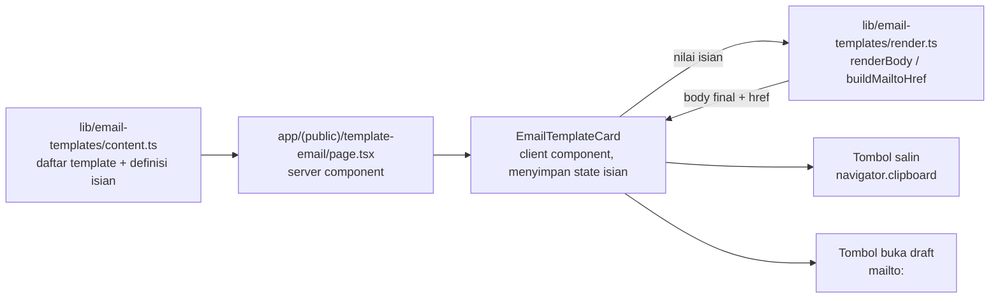
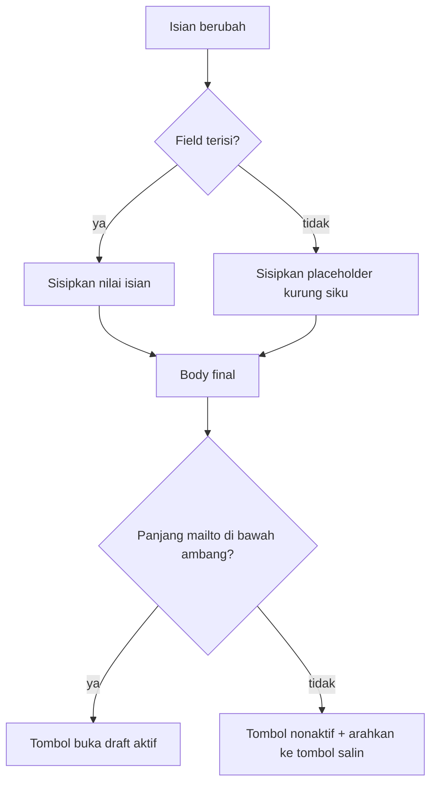

# Template Email Instansi Umroh - Plan

**Goal Capsule.** Halaman publik `/template-email` berisi kumpulan template email siap pakai untuk menghubungi support instansi umroh, dimulai dari template Reset ID NUSUK ke `care@haj.gov.sa`. Tiap template menampilkan alamat tujuan, subject, body, dan checklist lampiran; jamaah mengisi namanya, body langsung terisi, lalu disalin atau dibuka sebagai draft `mailto:` di aplikasi email pribadinya. Konten template hidup di modul statis dalam repo — tidak ada tabel database, endpoint, atau layar admin baru, dan aplikasi tidak pernah mengirim email atas nama user.

Urutan kerja: U1 → U5 sesuai dependensi. Kalau ada keputusan produk yang berubah (mis. isi body Nusuk harus berbeda dari yang tertulis di sini), berhenti dan konfirmasi — jangan tebak.

---

## Product Contract

### Summary

Menambah satu halaman publik berisi template email untuk menghubungi support instansi umroh, dengan isian personalisasi, tombol salin per bagian, dan tombol buka draft email. Rilis pertama memuat satu template (Reset ID NUSUK); struktur datanya sudah menampung banyak instansi.

### Problem Frame

Jamaah umroh mandiri sesekali harus berurusan langsung dengan instansi Saudi lewat email — dan hampir tidak ada yang tahu harus menulis apa. Kasus yang memicu ini: ID NUSUK jamaah dipakai pihak lain, dan satu-satunya jalur pemulihan adalah mengirim email ke `care@haj.gov.sa` dengan subject dan isi tertentu, plus lampiran screenshot dan visa aktif.

Pengetahuan seperti ini sekarang beredar sebagai forward-an WhatsApp. Bentuk itu rapuh: teksnya rusak saat disalin ulang, alamat tujuan salah ketik, orang lupa lampirannya apa saja, dan tidak ada satu tempat pun untuk mencarinya lagi enam bulan kemudian. Jamaah yang panik karena ID-nya dibajak justru paling tidak siap menyusun email bahasa Inggris dari nol.

Situs SSU sudah jadi tempat jamaah mencari panduan operasional (`/panduan`, `/visa`, `/faq`), jadi ini kelanjutan yang wajar dari materi yang sudah ada — bukan produk baru.

### Requirements

**Halaman dan konten**

R1. Ada halaman publik di `/template-email` yang mendaftar template email untuk menghubungi support instansi umroh.
R2. Template Reset ID NUSUK tersedia lengkap: tujuan `care@haj.gov.sa`, subject `Reset ID NUSUK`, body bahasa Inggris, dan checklist lampiran berisi screenshot ID yang dipakai pihak lain serta visa aktif.
R3. Struktur data template menampung banyak instansi dan banyak template per instansi tanpa mengubah komponen.
R4. Konten template hidup di modul statis dalam repo — tidak ada tabel database, endpoint, atau layar admin baru.
R5. Halaman menyatakan bahwa lampiran harus ditambahkan sendiri oleh user karena draft email tidak bisa membawa file.

**Personalisasi dan aksi**

R6. Tiap template punya isian yang langsung mengganti placeholder di preview body saat diketik.
R7. Isian yang masih kosong dirender sebagai placeholder bertanda kurung siku, sehingga hasil salinan tetap terbaca dan jelas bagian mana yang perlu diedit.
R8. Alamat tujuan, subject, dan body masing-masing punya tombol salin dengan status berhasil dan gagal yang terlihat.
R9. Ada tombol yang membuka draft email berisi tujuan, subject, dan body hasil isian.
R10. Kalau draft email melewati batas panjang yang aman, tombol buka draft dinonaktifkan disertai penjelasan, dan tombol salin tetap berfungsi.

**Integrasi situs**

R11. `/template-email` lolos `isPublicPath` sehingga bisa dibuka tanpa login.
R12. Rute masuk `STATIC_ROUTES` untuk sitemap dan punya metadata kanonik lewat `pageMetadata`.
R13. Halaman terjangkau dari navigasi situs pada tampilan desktop maupun mobile.

### Acceptance Examples

AE1. Isian nama masih kosong → body yang tersalin memuat `[Nama Lengkap]` di baris tanda tangan, bukan baris kosong. (memenuhi R7)
AE2. Isian nama diisi `Bayu Aslama` → preview dan hasil salin memuat `Bayu Aslama`, tanpa sisa kurung siku. (memenuhi R6)
AE3. Body panjang sehingga URL draft melewati ambang → tombol buka draft nonaktif dengan penjelasan, tombol salin body tetap aktif. (memenuhi R10)
AE4. `navigator.clipboard` tidak tersedia karena halaman dibuka di konteks non-secure → tombol salin menampilkan status gagal, bukan diam saja. (memenuhi R8)

### Scope Boundaries

**Bukan tujuan**

- Mengirim email dari server SSU. Balasan instansi harus masuk ke inbox jamaah, jadi email wajib berangkat dari alamat pribadi mereka.
- Unggah atau lampiran file di halaman ini.
- Melacak apakah user jadi mengirim, atau apakah instansi membalas.
- Layar admin untuk mengelola template.

**Deferred to Follow-Up Work**

- Template untuk instansi lain (visa, maskapai, hotel, muassasah). Strukturnya sudah siap; isinya menunggu draft yang tervalidasi.
- Pencarian atau filter per instansi — baru dibutuhkan kalau template sudah belasan.
- JSON-LD terstruktur untuk halaman ini.
- Toggle bahasa body email.

### Outstanding Questions

Keduanya deferred — tidak memblokir implementasi. Jalankan dengan keputusan yang tertulis di plan, lalu konfirmasi belakangan.

- Body Nusuk asli punya beberapa salah ketik (`attahched`, `Has been`, `would be highly appreciate`). Plan ini merapikannya jadi bahasa Inggris yang benar tanpa mengubah maksud. Kalau ternyata teksnya harus persis seperti yang beredar, ganti di `lib/email-templates/content.ts` saja.
- Body asli hanya punya satu placeholder (nama). Belum jelas apakah menambah nomor visa atau ID NUSUK ke body akan mempercepat respons Nusuk Care, jadi rilis pertama tetap satu isian.

---

## Planning Contract

### Key Technical Decisions

KTD1. **Konten template sebagai modul statis, bukan database.** Mengikuti pola `lib/badalin/content.ts`. Template jarang berubah dan tiap perubahan kalimatnya butuh review manusia — menambah tabel plus CRUD admin adalah biaya besar untuk konten yang berubah beberapa kali setahun. (memenuhi R4)

KTD2. **Substitusi placeholder lewat token `{{key}}` yang diproses fungsi murni di `lib/email-templates/render.ts`.** Memisahkan logika substitusi dari React membuat perilaku placeholder, encoding, dan batas panjang bisa diuji tanpa merender komponen; komponen tinggal menampilkan hasilnya.

KTD3. **Field kosong dirender sebagai `[Label]`, bukan string kosong.** Ini persis perilaku yang dicontohkan pesan aslinya (`[Nama Kalian]`) dan membuat template tetap berguna bagi user yang lebih suka menyalin dulu lalu mengedit di aplikasi emailnya. (memenuhi R7)

KTD4. **Aksi kirim memakai `mailto:`, bukan pengiriman server-side.** Jawaban Nusuk Care harus mendarat di inbox jamaah; email yang berangkat dari server SSU justru memutus alur balasannya. `mailto:` juga menghindari kebutuhan SMTP, antrian, dan penanganan bounce.

KTD5. **Ambang panjang URL draft ~1.900 karakter setelah encoding; di atas itu tombol dinonaktifkan.** Browser dan klien email memotong URL panjang tanpa memberi tahu, yang menghasilkan draft terpotong diam-diam. Menolak secara eksplisit lebih baik. Template Nusuk jauh di bawah ambang — guard ini untuk template berikutnya yang lebih panjang. (memenuhi R10)

KTD6. **Pemisah baris dinormalkan ke CRLF sebelum di-encode.** Sebagian klien email mengabaikan `%0A` tunggal dan menggabungkan paragraf jadi satu blok; `%0D%0A` diterima semua klien yang umum dipakai.

KTD7. **UI berbahasa Indonesia, body email mengikuti bahasa yang diminta instansi.** Data template membawa penanda bahasa body supaya halaman bisa menjelaskan kenapa isinya bahasa Inggris tanpa hardcode asumsi itu di komponen.

### High-Level Technical Design

Alur data dari modul konten sampai aksi user:

Keputusan yang dijalankan tiap kali isian berubah:

Prosa di plan ini yang berlaku kalau diagram dan teks berbeda.

### System-Wide Impact

- **Batas autentikasi.** Rute baru harus ditambahkan ke `isPublicPath` di `middleware.ts`; tanpa itu halaman melempar user ke `/login`. Tes di `lib/seo/__tests__/routes.test.ts` dan `middleware.test.ts` sudah menjaga invarian ini, termasuk satu tes yang memverifikasi setiap href di navigasi lolos `isPublicPath`.
- **Sitemap.** `STATIC_ROUTES` di `lib/seo/routes.ts` adalah satu-satunya sumber sitemap; rute yang tidak terdaftar tidak akan pernah terindeks.
- **Navigasi bersama.** `components/nav/links.ts` dipakai `MoreMenu` (desktop) dan `MobileMenu`. Menambah entri menambah panjang kedua menu itu.

### Risks & Dependencies

- **Perilaku `mailto:` berbeda antar klien.** Gmail di browser hanya menangani `mailto:` kalau user pernah mendaftarkannya sebagai handler protokol. Halaman harus tetap berguna tanpa tombol itu — karena itu tombol salin per bagian, bukan pelengkap.
- **Clipboard butuh secure context.** `navigator.clipboard` undefined di HTTP non-localhost. Ditangani dengan status gagal yang terlihat, mengikuti pola `CopyPhoneButton`.
- **Alamat dan prosedur instansi bisa berubah.** `care@haj.gov.sa` dan langkah reset ID berasal dari edaran komunitas, bukan dokumentasi resmi Nusuk. Kalau prosedurnya berubah, template jadi menyesatkan — ini alasan tambahan konten dijaga di repo lewat review, bukan diedit lepas dari dashboard.

---

## Implementation Units

### U1. Modul konten dan tipe template

**Goal.** Mendefinisikan bentuk data template email dan mengisi satu entri: Reset ID NUSUK.

**Requirements.** R2, R3, R4, R5.

**Dependencies.** Tidak ada.

**Files.**
- `lib/email-templates/content.ts` (baru)
- `lib/email-templates/__tests__/content.test.ts` (baru)

**Approach.** Ekspor `interface EmailTemplate` dengan field: `id`, `institution` (nama instansi yang tampil, mis. "Nusuk Care"), `title`, `purpose` (satu kalimat kapan template ini dipakai), `to`, `subject`, `bodyLanguage`, `body`, `fields`, `attachments`, dan `notes` opsional. `interface TemplateField` membawa `key`, `label`, `placeholder`, dan `required`.

`body` memakai token `{{key}}` yang cocok dengan `fields[].key`. Ekspor `emailTemplates: EmailTemplate[]` berisi satu entri `nusuk-reset-id`: tujuan `care@haj.gov.sa`, subject `Reset ID NUSUK`, `bodyLanguage: "en"`, satu field `nama` dengan label `Nama Lengkap`, dan dua item lampiran (screenshot ID yang dipakai pihak lain, visa aktif).

Body-nya adaptasi dari edaran komunitas dengan tata bahasa dirapikan (`attached`, `has been`, `would be highly appreciated`) dan tanda tangan memakai token `{{nama}}`. Sertakan komentar modul yang menerangkan asal teks dan bahwa mengubahnya berarti mengubah instruksi yang jamaah kirim ke instansi Saudi — bukan sekadar copy.

**Patterns to follow.** `lib/badalin/content.ts` — modul konten statis dengan tipe yang diekspor dan komentar yang menerangkan aturan pengisian data.

**Test scenarios.**
- Setiap token `{{...}}` di `body` punya field dengan `key` yang sama; tidak ada token yatim.
- Setiap `fields[].key` dipakai setidaknya sekali di `body`; tidak ada isian yang tidak berpengaruh apa pun.
- `id` unik di seluruh `emailTemplates`.
- Setiap `to` cocok dengan bentuk alamat email dasar.
- Entri `nusuk-reset-id` menuju `care@haj.gov.sa` dengan subject `Reset ID NUSUK` dan mendaftarkan dua lampiran.

**Verification.** Tes konten hijau; menambah entri template kedua yang cacat (token tanpa field) membuat tes gagal.

---

### U2. Fungsi render dan pembangun draft email

**Goal.** Mengubah template plus nilai isian menjadi body final dan URL draft email, sebagai fungsi murni yang bisa diuji tanpa React.

**Requirements.** R6, R7, R9, R10.

**Dependencies.** U1.

**Files.**
- `lib/email-templates/render.ts` (baru)
- `lib/email-templates/__tests__/render.test.ts` (baru)

**Approach.** Tiga ekspor:

- `renderBody(template, values)` — mengganti tiap `{{key}}`. Nilai kosong atau hanya spasi diganti `[Label]` dari definisi field (KTD3), bukan string kosong.
- `MAILTO_MAX_LENGTH` — konstanta ambang (KTD5).
- `buildMailtoHref(template, values)` — mengembalikan objek berisi `href` dan `withinLimit`. Body dinormalkan ke CRLF sebelum `encodeURIComponent` (KTD6); subject dan body masuk sebagai query param. `withinLimit` bernilai false ketika panjang `href` melewati ambang.

Jangan menaruh state React atau akses `window` di modul ini — komponen yang memanggilnya.

**Execution note.** Mulai dari tes untuk `renderBody` dan `buildMailtoHref`; perilaku placeholder-kosong dan ambang panjang lebih mudah dipastikan lewat tes daripada lewat klik di browser.

**Test scenarios.**
- Semua isian terisi → body tidak menyisakan token maupun kurung siku. (memenuhi AE2)
- Isian kosong → body memuat `[Nama Lengkap]` di posisi token. (memenuhi AE1)
- Isian berisi spasi saja diperlakukan sama dengan kosong.
- Token yang muncul dua kali di body diganti di kedua posisi.
- `href` diawali `mailto:` dengan alamat tujuan template, dan subject ter-encode.
- Baris baru di body muncul sebagai `%0D%0A` di `href`.
- Nilai isian berisi karakter yang perlu di-escape (`&`, `#`, spasi) menghasilkan href yang tetap ter-encode benar.
- Body di bawah ambang → `withinLimit` true; body yang sengaja dibuat sangat panjang → `withinLimit` false. (memenuhi AE3)

**Verification.** `lib/email-templates/__tests__/render.test.ts` hijau, termasuk kasus ambang.

---

### U3. Komponen kartu template

**Goal.** Merender satu template sebagai kartu interaktif: isian, preview body, tombol salin per bagian, tombol buka draft, dan checklist lampiran.

**Requirements.** R5, R6, R7, R8, R9, R10.

**Dependencies.** U2.

**Files.**
- `components/email-templates/CopyButton.tsx` (baru)
- `components/email-templates/EmailTemplateCard.tsx` (baru)
- `components/email-templates/__tests__/CopyButton.test.tsx` (baru)
- `components/email-templates/__tests__/EmailTemplateCard.test.tsx` (baru)

**Approach.** `CopyButton` adalah generalisasi dari `CopyPhoneButton`: menerima `text` dan `label`, menyimpan state `idle | copied | failed`, kembali ke `idle` setelah jeda, dan membawa `aria-label` yang menyebut apa yang disalin (label bare "Salin" muncul tiga kali dalam satu kartu, jadi screen reader butuh pembeda).

`EmailTemplateCard` adalah client component yang menyimpan nilai isian dalam state, memanggil `renderBody` dan `buildMailtoHref` tiap render, lalu menampilkan tiga baris yang bisa disalin (tujuan, subject, body), tombol buka draft, dan checklist lampiran dengan kalimat bahwa file harus dilampirkan sendiri di aplikasi email. Ketika `withinLimit` false, tombol buka draft dirender nonaktif dengan penjelasan singkat yang mengarahkan ke tombol salin.

Body ditampilkan dalam elemen yang mempertahankan baris baru — preview yang menggabungkan paragraf jadi satu blok membuat user tidak bisa memeriksa apa yang akan dia kirim.

**Patterns to follow.** `components/admin/community-requests/CopyPhoneButton.tsx` untuk state salin dan penanganan clipboard yang tidak tersedia. Primitif `components/ui/` (`input`, `label`, `card`, `button`) untuk bentuk visual.

**Test scenarios.**
- Render awal menampilkan alamat tujuan, subject, dan body dengan placeholder kurung siku. (memenuhi AE1)
- Mengetik di isian nama memperbarui preview body dengan nilai itu. (memenuhi AE2)
- Tombol salin body memanggil `navigator.clipboard.writeText` dengan body hasil render, bukan body mentah bertoken.
- Tombol salin alamat dan salin subject masing-masing menyalin nilainya sendiri.
- `navigator.clipboard.writeText` yang menolak → tombol menampilkan status gagal. (memenuhi AE4)
- Setelah salin berhasil, tombol kembali ke label idle begitu jeda lewat.
- Tombol buka draft membawa href yang diawali `mailto:` dengan alamat template.
- Template yang bodynya melewati ambang → tombol buka draft nonaktif dan penjelasannya tampil. (memenuhi AE3)
- Checklist lampiran menampilkan setiap item dari data template.
- Tiap tombol salin punya `aria-label` yang berbeda dalam satu kartu.

**Verification.** Tes komponen hijau; mengetik nama di browser mengubah body yang tersalin.

---

### U4. Halaman /template-email

**Goal.** Menyusun halaman publik yang mendaftar semua template beserta metadata SEO-nya.

**Requirements.** R1, R2, R5, R12.

**Dependencies.** U3.

**Files.**
- `app/(public)/template-email/page.tsx` (baru)
- `app/(public)/template-email/__tests__/page.test.tsx` (baru)

**Approach.** Server component yang mengekspor `metadata` lewat `pageMetadata` dengan `path: "/template-email"`, lalu merender hero singkat (untuk siapa halaman ini dan kapan dipakai), satu kalimat yang menegaskan email berangkat dari alamat pribadi user, dan daftar `emailTemplates` yang dipetakan ke `EmailTemplateCard`.

Template dikelompokkan per `institution` supaya penambahan instansi berikutnya tidak mengubah struktur halaman. Dengan satu template, judul kelompok tetap dirender — bentuknya sudah benar sejak awal dan entri kedua tidak menuntut perubahan tata letak.

**Patterns to follow.** `app/(public)/badalin/page.tsx` untuk bentuk server component yang mengonsumsi modul konten statis dan mengekspor `pageMetadata`.

**Test scenarios.**
- `metadata.alternates.canonical` bernilai `/template-email` dan deskripsinya tidak kosong.
- Halaman merender judul dan alamat tujuan template Nusuk.
- Halaman merender satu kartu per entri di `emailTemplates`.
- Halaman memuat kalimat bahwa lampiran harus ditambahkan sendiri.

**Verification.** `pnpm test` hijau; `/template-email` terbuka di dev server tanpa error hydration.

---

### U5. Rute publik, sitemap, dan navigasi

**Goal.** Membuat halaman bisa diakses tanpa login, terindeks, dan ditemukan dari navigasi.

**Requirements.** R11, R12, R13.

**Dependencies.** U4.

**Files.**
- `middleware.ts`
- `middleware.test.ts`
- `lib/seo/routes.ts`
- `components/nav/links.ts`

**Approach.** Tambahkan `pathname.startsWith("/template-email")` ke `isPublicPath`. Tambahkan entri `STATIC_ROUTES` dengan `changeFrequency: "monthly"` — kontennya berubah saat prosedur instansi berubah, bukan mingguan — dan prioritas sekelas halaman pendukung seperti `/badalin` atau `/faq`.

Tambahkan link ke `exploreLinks` (bagian JELAJAHI di menu mobile) dan `moreLinks` (dropdown "Lainnya" di desktop) memakai ikon `lucide-react` yang sesuai, mis. `Mail`.

**Patterns to follow.** Cara `/badalin` terdaftar di ketiga tempat itu.

**Test scenarios.**
- `isPublicPath("/template-email")` dan `isPublicPath("/template-email/")` bernilai true.
- Tes navigasi yang sudah ada — yang memverifikasi setiap href di nav lolos `isPublicPath` — tetap hijau setelah link ditambahkan.
- `STATIC_ROUTES` memuat `/template-email` tanpa duplikat dan dengan prioritas di antara 0 dan 1.

**Verification.** `pnpm test` hijau; membuka `/template-email` dalam sesi anonim tidak dialihkan ke `/login`; entri muncul di `/sitemap.xml` dan di kedua menu navigasi.

---

## Verification Contract

- `pnpm test` — vitest run. Harus hijau, termasuk suite yang sudah ada di `lib/seo/__tests__/routes.test.ts` dan `middleware.test.ts` yang menjaga invarian rute publik.
- `pnpm lint`
- `pnpm build` — memastikan tidak ada batas server/client component yang dilanggar (`EmailTemplateCard` wajib `"use client"`).
- Pemeriksaan manual di `pnpm dev`: buka `/template-email` tanpa login, ketik nama, salin body, tempel di editor teks dan pastikan namanya masuk dan baris barunya utuh; klik tombol buka draft dan pastikan aplikasi email terbuka dengan tujuan, subject, dan body sudah terisi.

## Definition of Done

- R1–R13 terpenuhi, dan AE1–AE4 punya tes yang mengenainya.
- U1 sampai U5 selesai; tiap unit feature-bearing punya file tesnya sendiri.
- `pnpm test`, `pnpm lint`, dan `pnpm build` hijau.
- `/template-email` bisa dibuka anonim, muncul di sitemap, dan terjangkau dari menu desktop maupun mobile.
- Body template Nusuk di repo cocok kata per kata dengan yang dimaksudkan — kalau implementasi mengubah kalimatnya di luar perbaikan tata bahasa yang tercatat di Outstanding Questions, hentikan dan konfirmasi.
- Tidak ada sisa kode percobaan: tidak ada template contoh, tidak ada isian yang tidak dipakai body mana pun, tidak ada helper clipboard yang tidak terpanggil.

## Sources & Research

- `lib/badalin/content.ts` dan `app/(public)/badalin/page.tsx` — pola halaman publik yang mengonsumsi modul konten statis; jadi acuan bentuk U1 dan U4.
- `components/admin/community-requests/CopyPhoneButton.tsx` — satu-satunya pola clipboard di repo, termasuk penanganan `navigator.clipboard` yang tidak tersedia.
- `lib/seo/metadata.ts` — `pageMetadata` menyusun canonical dan OpenGraph dari satu path.
- `lib/seo/routes.ts` dan `lib/seo/__tests__/routes.test.ts` — `STATIC_ROUTES` sebagai sumber tunggal sitemap, dengan tes yang menuntut tiap rute lolos `isPublicPath`.
- `middleware.ts:7-25` — daftar `isPublicPath`; rute baru harus ditambahkan di sini.
- `components/nav/links.ts` — `exploreLinks` dan `moreLinks` yang dibaca `MobileMenu` dan `MoreMenu`.
- Edaran komunitas tentang reset ID NUSUK — sumber alamat `care@haj.gov.sa`, subject, body, dan daftar lampiran di U1.
