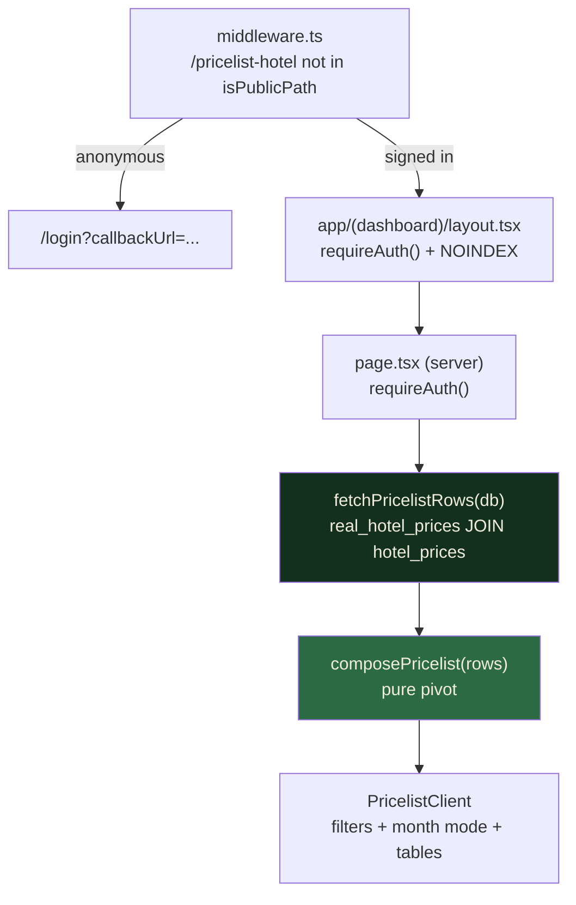

# feat: Add /pricelist-hotel catalogue price page

## Goal Capsule

**Objective:** Give signed-in users a browsable view of the supplier catalogue rates already stored in
`real_hotel_prices`, so the data that currently only reaches an AI tool and a cost breakdown can be
read directly.

**Execution profile:** U0 imports the current CSV — the page's whole value is fidelity to the
catalogue, and the database is behind it. U1 builds the query and a pure compose function. U2 builds
the presentation. U3 wires the page and its gate. U4 handles navigation and crawler directives.

**Stop conditions:** Stop and ask if implementation requires a schema migration, a change to
`resolveHotelSar` or any estimator pricing path, or exposing the page to anonymous visitors.

**Tail ownership:** An admin editing UI for catalogue rates, IDR conversion, and restricting Google
self-registration are separate follow-up work.

---

## Product Contract

### Summary

A new page at `/pricelist-hotel`, reachable by any signed-in user, lists every hotel that has
catalogue pricing and shows its SAR rates per month per room type. It reads `real_hotel_prices`
verbatim — no fallbacks, no estimates, no derived figures — prints each rate's `sourceLabel`, and
states when the data was last imported. Filters narrow the list by city, tier, and name, and a month
selector collapses the list to one row per hotel for cross-hotel comparison.

### Reader

**Primary reader: the operator.** The question this page answers — "what does the catalogue say for
Madinah standard hotels in November" — is the operator's, and `docs/PRD-umroh-planner-v3.md` §15 risk
#6 records the same gap with an admin UI as its recommendation.

**Permitted, not designed-for: the signed-in member.** The operator chose to let every signed-in user
read the page. Members are welcome on it; the layout is optimised for the operator's question, and R6
derives from that. See KTD8 for why the audience is wider than the reader.

### Problem Frame

`real_hotel_prices` holds 804 rows across 67 hotels and is the most carefully-sourced pricing data in
the project, transcribed from supplier catalogues and audited cell by cell. Today it is readable only
through two indirect surfaces: the AI parse tools (`lib/ai/tools/hotel-price.ts`,
`lib/ai/tools/hotel-search.ts`) and a per-line note inside a finished estimate. There is no way to
compare hotels on catalogue rates without querying the database by hand. The import endpoint's own
comment records the gap: *"A dedicated admin UI is deferred — this endpoint is the data path."*

### Requirements

- R1. `/pricelist-hotel` renders for any signed-in user and redirects anonymous visitors to `/login`
  with a callback back to the page.
- R2. The page lists hotels that have at least one row in `real_hotel_prices`, showing city, tier,
  label, sublabel, and distance.
- R3. Every rate shown comes **verbatim** from `real_hotel_prices`. No value is derived, interpolated,
  converted to IDR, or read from `hotel_prices.sarPerNight` or `hotel_monthly_prices`.
- R4. A month with no catalogue row renders as a cell that is perceivably empty — a muted non-numeric
  glyph carrying `sr-only` text — never a zero, a dash that reads like a rate, or a fallback figure.
  All twelve months render for every hotel, so a gap reads as a gap rather than a truncated table.
- R5. Each rate's `sourceLabel` is attributable by the reader, and the page carries a legend
  explaining the distinct labels present in the data.
- R6. The reader can filter by city, tier, and hotel name, and can select a month to collapse the list
  to one row per hotel for cross-hotel comparison.
- R7. The page states when its data was last imported.
- R8. The page is excluded from the sitemap, disallowed in `robots.txt`, and carries noindex.
- R9. No existing pricing module is modified — `lib/budget/calculate.ts`, `lib/estimate/hotel-pricing.ts`,
  and `lib/ai/tools/` are byte-identical after this change.

### Acceptance Examples

- AE1. Given an anonymous visitor opens `/pricelist-hotel`, when middleware runs, then they land on
  `/login?callbackUrl=%2Fpricelist-hotel`.
- AE2. Given a signed-in non-admin opens the page, when it renders, then the hotel list and its rates
  are visible — the same view an admin sees.
- AE3. Given a hotel has catalogue rows for August through January only, when its rates render, then
  twelve month rows appear and February through July carry the empty-cell treatment, not absence.
- AE4. Given a hotel has a QUAD rate labelled `"Katalog 1448H (AZKA + Maysan/MIG)"` and a DOUBLE rate
  for the same month labelled `"Katalog 1448H (forecast per-bed)"`, when both render, then each is
  attributable to its own label. (Different room types, because
  `unique(hotelPriceId, month, roomType)` at `lib/db/schema.ts:166` makes one row per triple.)
- AE5. Given the reader filters to Madinah + ECONOMY, when the list updates, then only Madinah
  ECONOMY hotels remain and a count of shown-versus-total is displayed.
- AE6. Given a hotel has a QUAD rate but no DOUBLE rate for a month, when that month renders, then the
  DOUBLE cell carries the empty treatment — the QUAD figure is not reused, and no multiplier applies.
- AE7. Given the reader selects November, when the list collapses, then each hotel occupies one row
  showing only its November rates, sorted so comparison is possible without scrolling per hotel.

### Scope Boundaries

#### Deferred to follow-up work

- An admin UI for editing catalogue rates. This page is read-only.
- IDR conversion. Every figure is SAR, matching how the catalogues quote.
- Restricting Google self-registration (see Risks — the operator accepted this exposure knowingly).
- Resolving the open data questions from the 2026-08-08 CSV audit: Saif Al Yamani's meal basis, the
  Millennium tier, and the onboarded-hotel cluster sitting below catalogue.

#### Outside this change

- Changing `resolveHotelSar`, the estimator, or either AI tool.
- Adding a forecast/catalogue discriminator column to `real_hotel_prices`.
- Making the page public, or un-hiding the price table on `/hotel-nusuk`.

---

## Planning Contract

### Key Technical Decisions

- KTD1. **Place the page in the `(dashboard)` route group and change no middleware.** `middleware.ts`
  already redirects anything outside `isPublicPath` to `/login`, so "signed-in only" is the default
  and needs no new prefix. `app/(dashboard)/layout.tsx` supplies `requireAuth()` and
  `NOINDEX_METADATA`. The page still repeats `requireAuth()` — the layout's own comment records that
  convention.

- KTD2. **Query `real_hotel_prices` directly; do not reuse `fetchPricingConfig`.** That function loads
  the entire pricing universe and hangs real prices off each hotel as a side effect. This page needs
  one join. A narrow query also keeps R3 honest: it can only return catalogue rows.

  *Accepted tradeoff:* filtering is client-side, so one authenticated request returns the whole
  804-row corpus regardless of what the reader filters to. Chosen for responsiveness at this data
  size. Server-side filtering is the lever if bulk extraction is later judged material.

- KTD3. **Split the module into a query half and a pure compose half.** `lib/hotels/pricelist.ts`
  exports `fetchPricelistRows(db)` and a pure `composePricelist(rows)`, mirroring
  `lib/hotels/detail.ts`. Every DB-touching test in this repo mocks `@/lib/db` to `{}` and tests only
  the pure function.

- KTD4. **Two view modes: a per-hotel month table, and a month-collapsed comparison row.** The
  motivating question is cross-hotel ("who is cheapest in November"), and 67 stacked per-hotel tables
  cannot answer it. The month selector is therefore a requirement (R6/AE7), not a deferral.

  Per-hotel sections default to **collapsed** — header only — with an expand toggle, following the
  `expandedHotels: Set<string>` pattern in `components/admin/PricingTable.tsx`. Sixty-seven
  simultaneously-expanded tables is not a readable page.

  Within an expanded hotel, months are rows and room types are columns. **Most hotels will show one
  column** (see U0), so the table degrades to a 12x1 list — which is fine, and is why the column set
  is per-hotel rather than fixed.

- KTD5. **Print `sourceLabel` verbatim, and add a page-level legend.** No forecast column exists.
  Verbatim rendering cannot be wrong about the data — but it does hand the reader a classification
  job, and two labels differing by a parenthetical are not self-explaining. `sourceLabel` is
  **batch-level, not per-row free text** (`app/api/admin/pricing/real-hotel-import/confirm/route.ts`
  passes one label into `parseRealHotelPricingCsv`), so the distinct values are a small curated set
  and a legend is cheap. The legend glosses each label in plain language; the per-rate attribution
  stays verbatim.

- KTD6. **Add a `memberLinks` array to `components/nav/links.ts`.** `middleware.test.ts` asserts every
  href in `moreLinks` and `exploreLinks` is public; adding a gated route to either turns that test red
  for a correct reason. A fourth array keeps the invariant intact.

  **`components/nav/NavBar.tsx` renders no link arrays** — it renders `<DesktopNav>` and
  `<MobileMenu>`. The real render sites are `components/nav/MoreMenu.tsx` (desktop "Lainnya"),
  `components/nav/MobileMenu.tsx` (mobile sections), and `components/nav/AccountMenu.tsx` (where
  `adminLinks` renders). U4 names all of them.

- KTD7. **Add a SAR formatter next to the existing IDR ones.** `lib/hotels/pricing.ts` has
  `formatFullIdr` and `formatCompactIdr`; SAR is inlined as a template literal in at least four
  places, and `sarLabel()` in `lib/estimate/hotel-pricing.ts` bakes in a `/mlm` suffix this page does
  not want.

- KTD8. **The audience is every signed-in user, wider than the primary reader, and this was chosen
  with the exposure known.** The cheaper and safer option was admin-only: `/admin` is already in
  `PROTECTED_PREFIXES`, so robots and sitemap enforcement come free and U4 mostly disappears. The
  operator chose the wider audience after being shown that Google sign-in is unrestricted — so
  "signed-in" is not a membership boundary. Two facts made the tradeoff acceptable: signed-in users
  can already retrieve individual catalogue rates through the `harga_hotel` tool behind
  `POST /api/estimate/parse` (session-gated only), so this changes the *shape* of access rather than
  opening a new boundary; and the data is a supplier price list, not user data. Recorded here so a
  future reader sees a decision, not an oversight.

### High-Level Technical Design



The pivot produces, per hotel, a sparse map keyed by month then room type — sparse because absence is
meaningful (R4). Rendering reads misses as the empty-cell treatment, never as a substituted value.

```
PricelistHotel = {
  hotelPriceId, city, tier, label, sublabel, distance, slug,
  rates: Map<month 1..12, Map<RoomType, { sarPerNight, sourceLabel }>>,
  sourceLabels: string[],   // distinct, for the provenance line and legend
  updatedAt: Date           // max across the hotel's rows
}
```

Note what is deliberately **absent**: no `sarPerNight` from `hotel_prices`, no `hotel_monthly_prices`,
no IDR. Those are the smuggle vectors R3 exists to close, and they arrive through the join rather than
through an import — so an import check cannot catch them. U1 tests for their absence directly.

Directional only — the implementer picks the concrete container types.

---

## Implementation Units

### U0. Import the current catalogue

**Goal:** Bring `real_hotel_prices` up to date with `docs/data/real-hotel-prices-2027.csv` before any
page reads it.

**Requirements:** R3, R7.

**Dependencies:** None. **This runs first.**

**Files:** None in the repo — this is an operational step against the database.

**Approach:** The page's entire value proposition is fidelity to the catalogue, and the database is
behind the CSV by roughly 136 cells and 9 room-type rows as of 2026-08-08. Shipping first and
importing later means the page's headline content is knowingly wrong on day one, and the operator's
do-nothing baseline (opening the CSV) would be strictly more current than the page replacing it.

The tooling exists: `scripts/import-real-prices.ts`, invoked as
`pnpm import:real-prices <csv> --source "<label>" --apply`. Its docblock states re-running is safe
because writes upsert per row.

Import both batches with their established labels, per `docs/ops/neon-branch-dummy-db.md` §7:
`docs/data/real-hotel-prices-2027.csv` and `docs/data/real-hotel-prices-2027-roomtype-forecast.csv`.

**This unit is also what makes KTD4's multi-column case real.** Today the table is QUAD-only — 804
rows across 67 hotels is exactly twelve apiece — so the per-hotel room-type columns have no data until
this runs.

**Execution note:** Dry-run first, then apply. Follow `docs/ops/neon-branch-dummy-db.md`, including its
emphasised warning to verify the target **by hostname, not row count** — `real_hotel_prices` has the
same row count on the branch and in production, so a count check "passes" while pointed at prod.

**Verification:** A post-import query shows more than one distinct `room_type` for at least one hotel,
and `max(updated_at)` is today. Spot-check three hotels against the CSV; they should now match.

### U1. Pricelist data module

**Goal:** Read catalogue rows joined to their hotel, and pivot them into a per-hotel sparse
month-by-room-type structure.

**Requirements:** R2, R3, R4, R5, R7, R9.

**Dependencies:** U0 (for meaningful multi-room-type fixtures; the code does not depend on it).

**Files:**

- `lib/hotels/pricelist.ts` (new)
- `lib/hotels/__tests__/pricelist.test.ts` (new)
- `lib/hotels/pricing.ts` (modify — add `formatSar`)
- `lib/hotels/__tests__/pricing.test.ts` (modify — `formatSar` coverage lives beside the function)
- `lib/db/__tests__/schema.test.ts` (modify — `realHotelPrices` has no column coverage today)

**Approach:** Inner-join `real_hotel_prices` to `hotel_prices` on `hotelPriceId` so hotels without
catalogue rows never appear. Select `city`, `tier`, `label`, `sublabel`, `distance`, `slug`, plus the
rate columns and `updatedAt`. **Do not select `hotel_prices.sarPerNight`** — it is the estimate base,
and it is one property access away from leaking onto a page that promises verbatim catalogue figures.

Keep the query in `fetchPricelistRows(db)` and the pivot in a pure `composePricelist(rows)`.

Sort hotels by city, then tier, then label. **Tier order is the canonical price-ascending sequence
`["ECONOMY", "STANDARD", "PELATARAN", "PREMIUM"]`** used in `components/hotel-nusuk/HotelPriceList.tsx`
— not alphabetical, which would put PELATARAN before PREMIUM before STANDARD and contradict every
other surface.

`roomType` is `text`, not an enum. Drop unrecognised values rather than trusting the column, the way
`lib/budget/calculate.ts` already does.

`real_hotel_prices` holds at most one row per `(hotelPriceId, month, roomType)`
(`lib/db/schema.ts:166`), so a hotel-month cannot carry two labels on the same room type.

**Patterns to follow:** `lib/hotels/detail.ts` for the query/compose split; `lib/budget/calculate.ts`
for the pivot shape and its unknown-room-type guard; `lib/hotels/pricing.ts` for formatter placement
and `MONTH_NAMES`.

**Test scenarios:**

- Covers R3. A row set for one hotel with three months pivots into exactly those three months
  populated, each carrying its own `sarPerNight`.
- Covers R4/AE3. A hotel with rows for only August pivots to a structure where a lookup for February
  returns nothing — assert absence, not a zero or an empty string.
- Covers AE6. A hotel with a QUAD row but no DOUBLE row for the same month yields a QUAD entry and no
  DOUBLE entry; assert the QUAD figure was not copied.
- Covers R3. The composed hotel object exposes **no** field sourced from `hotel_prices.sarPerNight`
  or `hotel_monthly_prices` — assert on the object's keys, so a future widening of the select fails.
- Covers R5. A row with `sourceLabel: ""` surfaces as the "not recorded" sentinel; a real label
  surfaces unchanged.
- Covers AE4. A hotel with a QUAD row and a DOUBLE row for the same month, carrying different labels,
  keeps both labels attributable, and the distinct-label list contains both.
- Covers R7. `updatedAt` per hotel is the maximum across that hotel's rows.
- An unknown `roomType` value is dropped and does not appear as a column key.
- Hotels sort city → tier → label with tier following `["ECONOMY","STANDARD","PELATARAN","PREMIUM"]`;
  assert the full order of a mixed fixture including a case alphabetical sorting would get wrong.
- `formatSar` renders thousands with the `id-ID` separator and no `/mlm` suffix.
- Covers R2. `composePricelist([])` returns an empty list, not a throw.
- `realHotelPrices` exposes `hotelPriceId`, `month`, `roomType`, `sarPerNight`, `sourceLabel`, and
  `updatedAt`, matching the sibling table assertions in `lib/db/__tests__/schema.test.ts`.

**Verification:** The pure tests pass with `@/lib/db` mocked to `{}`. The only imports outside
`lib/hotels/` are `ROOM_TYPES` from `@/lib/estimate/room-types` and types from `@/types`;
`fetchPricingConfig`, `resolveHotelSar`, and both AI tools are not imported.

### U2. Pricelist presentation component

**Goal:** Render the composed data as a filterable list with two view modes.

**Requirements:** R2, R3, R4, R5, R6.

**Dependencies:** U1.

**Files:**

- `components/pricelist-hotel/PricelistClient.tsx` (new)
- `components/pricelist-hotel/__tests__/PricelistClient.test.tsx` (new)

**Approach:** A `"use client"` component taking the composed list as a prop. Filter bar with two
`<Select>`s (city, tier), one `<Input>` (name), and a month `<Select>`, plus a shown-of-total counter
and an empty state — the shape `components/hotel-nusuk/HotelPriceList.tsx` uses.

**Two view modes.** With no month selected, each hotel is a collapsed header (label, sublabel,
city/tier, distance) that expands to its month table. With a month selected, the list collapses to one
row per hotel showing that month's rates across room types — this is the view that answers the
Problem Frame's question.

**The month table renders all twelve rows**, always, with the empty-cell treatment where no rate
exists. Constant table shape across hotels is what lets a gap read as a gap. Columns are per-hotel:
only room types that hotel actually has.

**Empty cell:** a muted non-numeric glyph with `sr-only` text (e.g. "tarif tidak tersedia"). A bare
`<td>` announces as nothing to a screen reader and reads as a render fault to a sighted reader.

Wrap each table in `overflow-x-auto` with a `min-w`, with an `sr-only` `<caption>` and
`scope="col"`/`scope="row"`, mirroring `components/hotel-nusuk/HotelDetail.tsx`.

Under each hotel's table: its distinct `sourceLabel` values and its `updatedAt`. At page level: the
legend glossing each distinct label (KTD5).

Link each hotel label to `/hotel-nusuk/<slug>` when the row has a slug, as
`components/hotel-nusuk/HotelPriceList.tsx` does; leave unslugged hotels as plain text.

**Patterns to follow:** `components/hotel-nusuk/HotelPriceList.tsx` for the filter bar, counter, empty
state, and slug linking; `components/admin/PricingTable.tsx` for `expandedHotels` and the
`TABLE_STYLE`/`TH`/`TD` constants; `components/hotel-nusuk/HotelDetail.tsx` for the accessible table
structure.

**Both named precedents render estimate-derived prices** — `HotelDetail` renders `formatFullIdr` over
`buildMonthlyPrices`, and `HotelPriceList` prints a baseline from `hotel_prices.sarPerNight`. Borrow
their **layout and markup only**. Never their price fields.

**Test scenarios:**

- Covers AE3. A hotel with only August and September rates renders twelve month rows, of which ten
  carry no rate text in any cell.
- Covers AE6. A hotel with QUAD and DOUBLE columns where one month has only a QUAD rate renders that
  month's DOUBLE cell with the empty treatment and the QUAD figure unrepeated.
- Covers R4. Empty cells carry `sr-only` text and contain no `0`, `-`, or `NaN`. Assert on rendered
  text and accessible name, not on props.
- Covers R3. The rendered output contains no IDR string — no `Rp`, no `formatFullIdr` output.
- Covers AE4. A QUAD rate and a DOUBLE rate with different labels are each attributable to their own
  label, not merged into one footer line.
- Covers R5. The page-level legend lists every distinct label present in the fixture.
- Covers R5. A hotel whose rows all carry `sourceLabel: ""` shows the "not recorded" wording.
- Covers AE5. Selecting a city narrows the list, and the counter reflects shown-of-total.
- Covers AE7. Selecting a month collapses the list to one row per hotel carrying only that month.
- Hotel sections are collapsed by default and expand on toggle.
- Filtering by name substring is case-insensitive; filters compose to the intersection.
- A filter combination matching nothing renders the empty state and no table.
- A hotel with a slug renders its label as a link to `/hotel-nusuk/<slug>`; one without renders text.

**Verification:** Component tests pass under happy-dom. A manual check at 375px shows tables scrolling
inside their own container with no horizontal page scroll.

### U3. Page, gate, and metadata

**Goal:** Serve the composed data at `/pricelist-hotel`, gated to signed-in users.

**Requirements:** R1, R7, R8, R9.

**Dependencies:** U1, U2.

**Files:**

- `app/(dashboard)/pricelist-hotel/page.tsx` (new)
- `app/(dashboard)/pricelist-hotel/__tests__/page.test.tsx` (new)

**Approach:** An async server component: `await requireAuth()`, then `fetchPricelistRows(db)`, then
`composePricelist`, then render `PricelistClient`. The `(dashboard)` layout already guards and applies
noindex; the page repeats `requireAuth()` per convention.

No `canX` capability prop. Admin and non-admin see the same page; a prop that is always `true` would
imply a distinction that does not exist.

Set an `<h1>` and a lede stating what the figures are: SAR, per room, per night, straight from the
supplier catalogue, **and not necessarily the figure an estimate uses for the same hotel and month**
(`resolveHotelSar` may substitute a QUAD rate or fall through to an estimate). Include the page-level
"data per `<max updatedAt>`" line. That sentence is the main defence against a member reading a
catalogue rate as their quoted price, and against "your estimate is wrong" support messages.

**Patterns to follow:** `app/(dashboard)/estimate/new/page.tsx` for the guard-then-query-then-render
order; `app/(public)/hotel-nusuk/page.tsx` for the server-page-into-client-list shape.

**Test scenarios:**

- Covers R1. `requireAuth` is called before any database read — assert call order, not just presence.
- Covers R1. With `requireAuth` mocked to throw Next's redirect error, the page performs **no**
  database read and renders nothing. (The success-path call-order test cannot catch a page that
  queries first and swallows the redirect.)
- Covers AE2. With a non-admin session, the page renders and passes the composed list to the client
  component. Record the client component's props with a `vi.fn()` rather than rendering it.
- Covers R7. The rendered lede contains the maximum `updatedAt` from the fixture.
- An empty result set renders the page shell and an empty state rather than throwing.
- Covers R9. Neither `app/(dashboard)/pricelist-hotel/page.tsx` nor `lib/hotels/pricelist.ts` imports
  `fetchPricingConfig`, `resolveHotelSar`, or either AI tool — read both files' source with `fs`, the
  way `middleware.test.ts` already reads the build manifest.

**Verification:** Page tests pass. `npx tsc --noEmit` reports no new errors.

### U4. Navigation and crawler directives

**Goal:** Make the page reachable, and keep crawlers out of it by the same mechanism every other gated
route uses.

**Requirements:** R1, R8.

**Dependencies:** U3.

**Files:**

- `components/nav/links.ts` (modify — new `memberLinks` array)
- `components/nav/MoreMenu.tsx` (modify — render `memberLinks` behind a new `isLoggedIn` prop)
- `components/nav/DesktopNav.tsx` (modify — thread `isLoggedIn` through to `MoreMenu`)
- `components/nav/MobileMenu.tsx` (modify — render `memberLinks` in the account section)
- `components/nav/__tests__/MobileMenu.test.tsx` (modify) and a new `MoreMenu` test
- `lib/seo/config.ts` (modify — add `/pricelist-hotel` to `PROTECTED_PREFIXES`)
- `lib/seo/routes.ts` (modify — docblock note)
- `middleware.test.ts` (modify — mirror assertion for the new array)

**Approach:** Add `memberLinks` and render it only for a signed-in user. Do **not** touch `moreLinks`
or `exploreLinks`: `middleware.test.ts` asserts every href in those is public, and that assertion is
correct.

`NavBar.tsx` renders no link arrays — it renders `<DesktopNav>` and `<MobileMenu>`, and already passes
`isLoggedIn` to both. `MoreMenu` does not currently take that prop, so the desktop path needs it
threaded through `DesktopNav`.

Extend `middleware.test.ts` with the mirror invariant: every href in `memberLinks` is **not**
`isPublicPath`. That is what keeps a future gated link from becoming a login-wall dead end in the
public nav.

**Add `/pricelist-hotel` to `PROTECTED_PREFIXES`.** It feeds `app/robots.ts`, so without it this would
be the first gated route in the app with no crawler Disallow — the `(dashboard)` route group adds no
URL segment, so the existing `/dashboard` prefix does not match. Adding it converts a comment-enforced
invariant into a test-enforced one and breaks nothing: no `STATIC_ROUTES` entry starts with the path.

Add nothing to `STATIC_ROUTES`. **The sitemap invariant already has a mechanical guard** —
`lib/seo/__tests__/routes.test.ts` iterates `STATIC_ROUTES` and asserts every path passes
`isPublicPath`, so adding this route would fail that test today. The docblock note is documentation on
top of that guard, not the guard itself.

**Patterns to follow:** the `adminLinks` declaration and its render path in
`components/nav/AccountMenu.tsx` and `components/nav/MobileMenu.tsx`; the `lib/seo/routes.ts`
"Deliberately absent" convention; commit `d09e7d6` for the shape of a route-registration change.

**Test scenarios:**

- Every href in `memberLinks` is rejected by `isPublicPath` — the mirror of the existing assertion.
- The existing assertion that every `moreLinks` and `exploreLinks` href is public still passes.
- `MoreMenu` renders the pricelist link when `isLoggedIn` and omits it otherwise.
- `MobileMenu` renders the pricelist link for a signed-in user and omits it for an anonymous one.
- `robots.txt` disallows `/pricelist-hotel`.
- The sitemap contains no `/pricelist-hotel` entry.

**Verification:** Full suite green. Visiting `/pricelist-hotel` while signed out lands on `/login`
with the callback preserved; signing in returns to the page.

---

## Verification Contract

| Gate | Command | Applies to |
|---|---|---|
| Import applied | post-import SQL check (see U0) | U0 |
| Data module | `pnpm test lib/hotels lib/db/__tests__/schema.test.ts` | U1 |
| Component | `pnpm test components/pricelist-hotel` | U2 |
| Page and gate | `pnpm test "app/(dashboard)/pricelist-hotel"` | U3 |
| Route invariants | `pnpm test middleware.test.ts app/__tests__ lib/seo/__tests__ components/nav` | U4 |
| Pricing untouched | `pnpm test lib/budget lib/estimate lib/ai` **and** `git diff --exit-code lib/budget/calculate.ts lib/estimate/hotel-pricing.ts lib/ai/tools` | R9 |
| Types | `npx tsc --noEmit` | U1-U4 |
| Bundle boundary | `npx next build` | U2-U3 |

The R9 gate is a git-diff plus the existing suites, not an import check. An import assertion on a new
file cannot fail for the reason R9 exists — a regression in `resolveHotelSar` would ship green.

The bundle-boundary row is not redundant with the two above it. `pnpm test` mocks `@/lib/db`, and
`npx tsc --noEmit` only checks types — neither can see a `"use client"` module value-importing a
server module and dragging `pg` into the browser graph. Only the bundler follows that edge, and it
fails on `fs`/`net`/`dns` rather than on anything a type or a mock would catch.
`serverComponentsExternalPackages: ["pg"]` does not cover it: that setting governs the server
compilation only. The fast local mirror of this gate lives in
`app/(dashboard)/pricelist-hotel/__tests__/page.test.tsx`.

Manual checks:

- Signed out, `/pricelist-hotel` redirects to `/login` and returns after signing in.
- A non-admin account sees the same page an admin sees.
- At 375px, each hotel table scrolls inside its own container; the page body does not scroll sideways.
- After U0, spot-check three hotels against `docs/data/real-hotel-prices-2027.csv`. Note the CSV has
  no `source_label` column — labels come from the importer's `--source` flag — and per
  `docs/prompts/real-hotel-price-verification.md` the QUAD row is forecast-filled across all twelve
  months, so the CSV cannot be used to verify R4's empty-month behaviour. Use a hotel with sparse
  DOUBLE/TRIPLE coverage for that.
- Selecting a month collapses the list and makes cross-hotel comparison possible in one screen.

---

## Risks & Dependencies

- **"Signed in" is not a membership boundary.** `auth.ts` registers Google OAuth with `DrizzleAdapter`
  and has no `signIn` callback, allowlist, domain restriction, or approval step. Any Google account
  self-provisions a `USER` row on first sign-in and clears middleware immediately. The audience is
  therefore unbounded, not the current account count. **The operator was shown this and accepted the
  exposure.** Recorded as accepted, not mitigated. Trigger for revisiting: restricting sign-in, or
  evidence that rates are circulating.

- **Members may read a net rate as a quoted price.** Mitigation: the U3 lede. This is the harm copy
  can actually address.

- **The cost base becomes bulk-readable by any signed-in account.** Mitigation: **none.** KTD2's
  client-side filtering means one authenticated request returns all 804 rows in a scriptable
  response. Partially pre-existing — `harga_hotel` already serves catalogue rates one hotel at a time
  to any session — but this page changes retrieval from one-at-a-time to wholesale. Accepted per KTD8.

- **No access record.** The page renders the full corpus with no log entry, so if rates surface
  externally there is no way to narrow the set of readers. `lib/logging/activity-log.ts` and
  `logActivity` already exist and are called from the estimate routes for less sensitive reads.
  Deferred, not rejected — see Open Questions.

- **This resolves an open product decision.** `docs/PRD-umroh-planner-v3.md` §15 risk #2 records
  member access to internal pricing as unresolved. This plan takes the "official user feature" branch
  and adds a reusable `memberLinks` nav category. A later decision to restrict internal pricing to
  admins would have to unwind both.

- **`sourceLabel` is only as good as what was typed at import.** Provenance is the operator's own
  batch label. A vague label produces a vague legend entry, and nothing on this page improves on it.

---

## Open Questions

- **Should a forecast badge exist?** KTD5 prints labels verbatim plus a legend because no
  discriminator column exists. If forecast-versus-catalogue becomes a routine reading task, the honest
  fix is a column on `real_hotel_prices` plus a one-time classification of the existing rows — not a
  substring match. Deferred, not rejected.

- **Should catalogue reads be logged?** One `logActivity` entry per render would make an incident
  investigable. Left out to keep the page a pure read path; the decision is the operator's, and the
  answer probably follows whether sign-in gets restricted.

- **Where does the `memberLinks` entry surface?** U4 commits to the same surfaces `adminLinks` uses —
  the account menu and the mobile account section — so the unit is implementable. What remains open is
  the section label and whether the entry is later promoted to top-level nav.

---

## Definition of Done

- U0 has run: `real_hotel_prices` matches the 2026-08-08 CSV, and at least one hotel carries more than
  one room type.
- Signed-in users can read `/pricelist-hotel`; anonymous visitors redirect to `/login` with the
  callback preserved, and a test proves no query runs on the redirect path.
- Every rate shown comes from `real_hotel_prices` verbatim. No IDR appears anywhere on the page, and a
  test asserts the composed object carries no field from `hotel_prices.sarPerNight`.
- All twelve months render per hotel; empty months carry a perceivable, screen-reader-announced empty
  treatment.
- Each rate is attributable to its `sourceLabel`, and a page-level legend glosses the distinct labels.
- The page states when its data was last imported.
- City, tier, and name filters compose, and a month selector collapses the list for cross-hotel
  comparison.
- The page is absent from the sitemap, disallowed in `robots.txt` via `PROTECTED_PREFIXES`, and
  carries noindex.
- `middleware.test.ts` asserts both invariants: public-nav hrefs are public, member-nav hrefs are not.
- `lib/budget/calculate.ts`, `lib/estimate/hotel-pricing.ts`, and `lib/ai/tools/` are byte-identical,
  proven by `git diff --exit-code`, and their existing suites pass.
- Scoped tests and `npx tsc --noEmit` pass.
